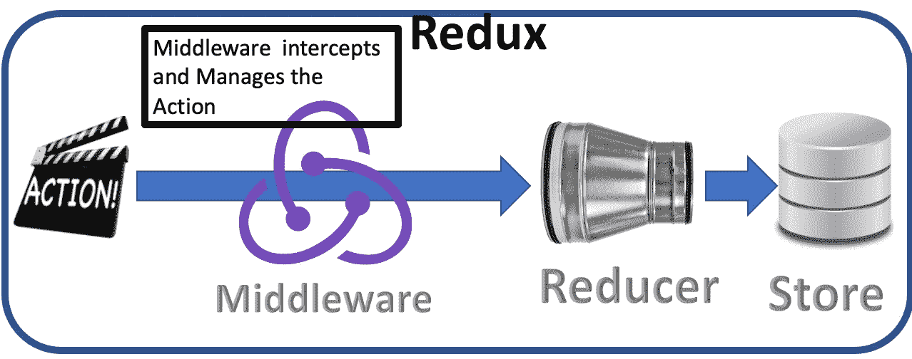
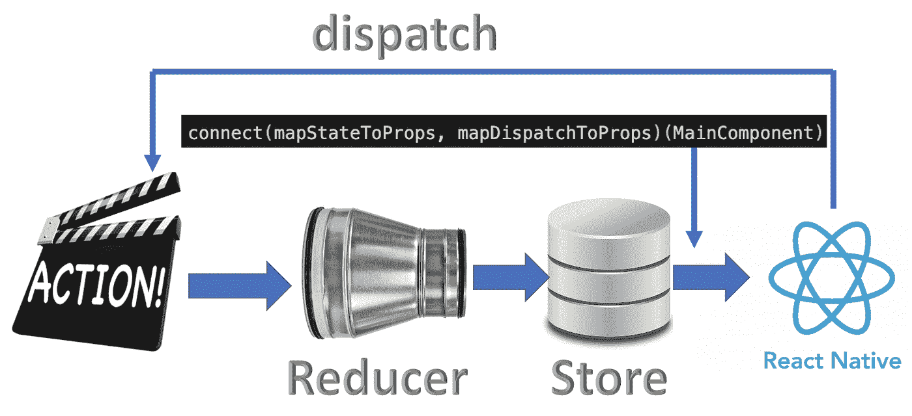
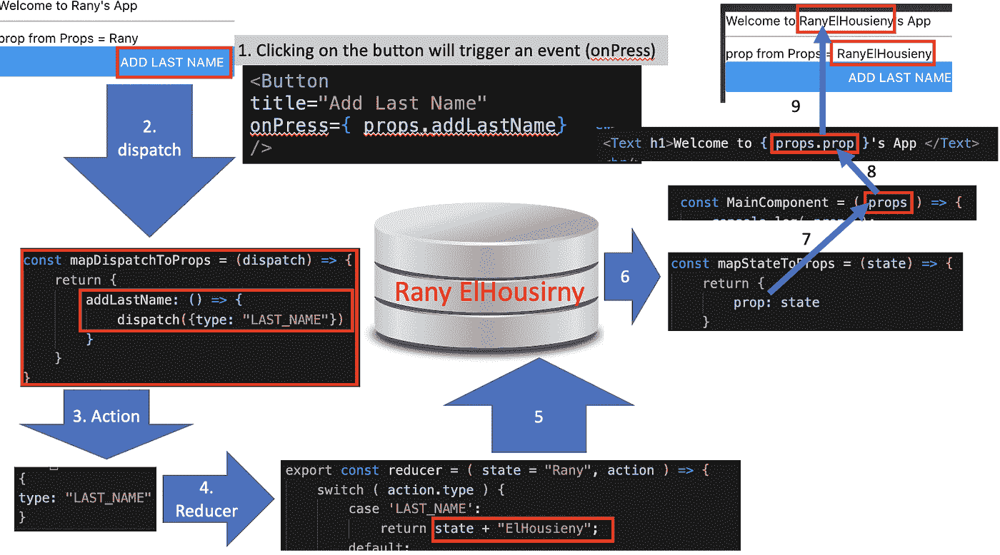
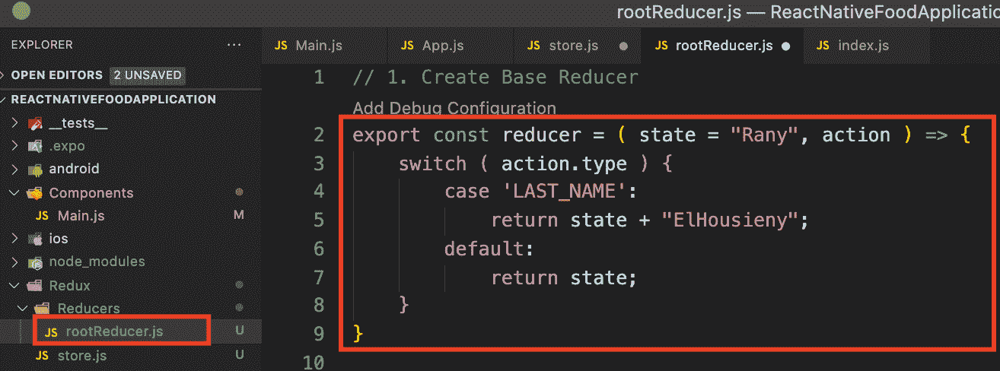
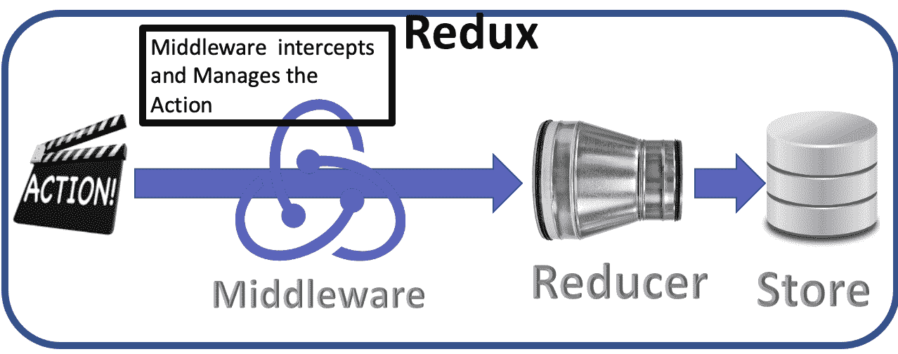
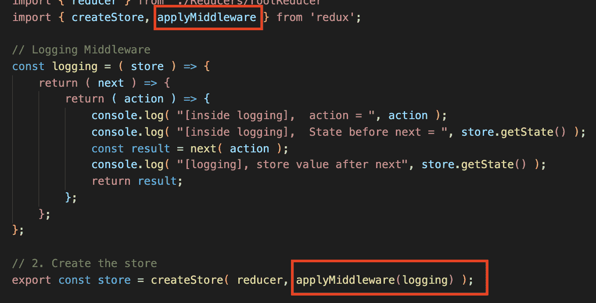
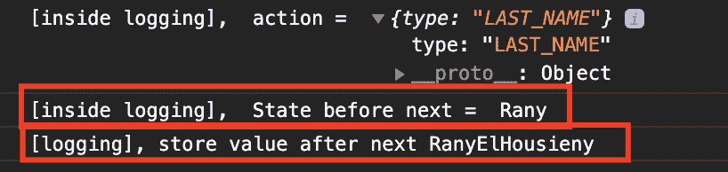
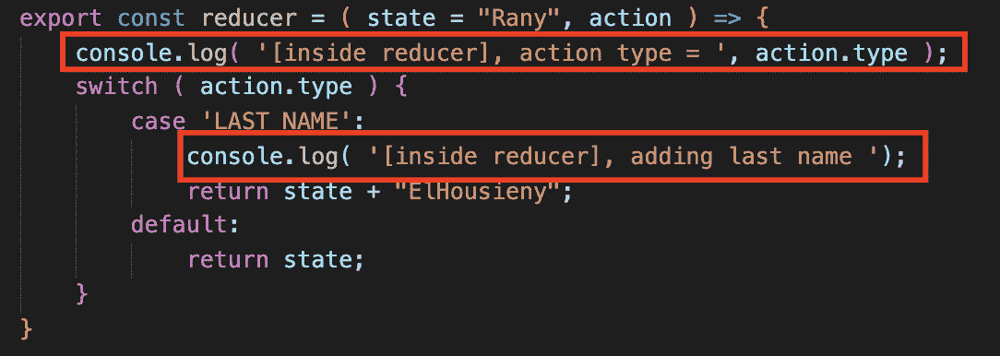
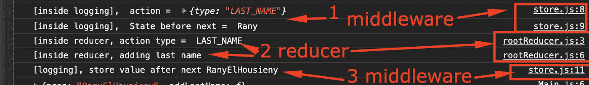

# 了解 Redux 中的中间件

> 原文：<https://medium.com/nerd-for-tech/understanding-middleware-in-redux-9d664cc6f5a5?source=collection_archive---------1----------------------->



在本文中，我将解释 Redux 中“中间件”的概念

本文是系列文章的一部分

1.  [https://lnkd.in/guBuBVP](https://www.linkedin.com/pulse/create-redux-hello-world-rany-elhousieny-phd%E1%B4%AC%E1%B4%AE%E1%B4%B0/):[𝑪𝒓𝒆𝒂𝒕𝒆𝒂𝑹𝒆𝒅𝒖𝒙](https://lnkd.in/guBuBVP)

2.【https://lnkd.in/gDWG7AC】创建 React 原生 App [此处](https://www.linkedin.com/pulse/create-react-native-base-project-run-rany-elhousieny-phd%25E1%25B4%25AC%25E1%25B4%25AE%25E1%25B4%25B0/?trackingId=fVq%2FbGEzug0okFdN6aGbPQ%3D%3D)

3.redux with React Native:1-读取状态:[https://lnkd.in/gUbBRs8](https://lnkd.in/gUbBRs8)

4.[Redux with React Native:2-更新状态 https://lnkd.in/gPcUcMx](https://www.linkedin.com/pulse/redux-react-native-2-updating-state-rany-elhousieny-phd%E1%B4%AC%E1%B4%AE%E1%B4%B0/?published=t)

5.[本文:了解 Redux 中的中间件](https://www.linkedin.com/pulse/understanding-middleware-redux-rany-elhousieny-phd%25E1%25B4%25AC%25E1%25B4%25AE%25E1%25B4%25B0/?trackingId=GsQ4UhEkEn%2BEfwplsSNWxA%3D%3D):[https://lnkd.in/g5tVFn8](https://lnkd.in/g5tVFn8)

该应用的最终代码可以在[Github https://Github . com/ranyelhousieny/ReactNativeFoodApplication](https://github.com/ranyelhousieny/ReactNativeFoodApplication)中找到

您可以克隆并使用

```
git clone [https://github.com/ranyelhousieny/ReactNativeFoodApplication.git](https://github.com/ranyelhousieny/ReactNativeFoodApplication.git)
```

================================================================

我将继续上一篇文章中留下的内容。我们现在有了下图:



下面是分派操作的步骤:



1.  当点击按钮时，一个事件将通过 mapDispatchToProps 设置的 props 分派一个动作
2.  在这种情况下，仅使用类型构建操作

```
action =
{
  type: "LAST_NAME"
}
```

3.此操作将被发送到 reducer，reducer 将通过 switch 语句来决定与此操作相关的状态。请键入。在这种情况下，请添加姓氏(Rany ElHouieny)



这是中间件在第 3 步之前截取动作并在将动作发送给缩减器之前对其进行管理的地方。如下图所示:



你可能会问“我们为什么要这么做？”这是一个合理的问题。

在这种情况下，这可能很有意义。然而，在现实生活中，该操作将主要尝试从服务器获取数据。在异步调用中从服务器获取数据，我们不想等待响应。等待响应将导致显示器上的大延迟。相反，我们触发动作并释放调用者，直到收到响应。

为了能够清楚地解释这个概念，我将尝试构建一个小的中间件，它带有一些控制台日志记录，以显示中间件何时被注入。当我们调用 applyMiddleware 时，所有这些魔法都是由 Redux 完成的。

# 1.从 redux 导入 applyMiddleware

在 Redux/store.js 中，从 Redux 导入 applyMiddleware

```
import { createStore, applyMiddleware } from 'redux';
```

# 创建一个日志中间件

在 Redux/store.js 文件中，在创建商店之前，让我们创建一个简单的日志记录中间件，它将打印沿途的状态。一个有效的中间件由如下 3 个嵌套函数组成

第一个函数将商店作为参数，因为它将与商店一起工作。

```
// Logging Middleware
const logging = ( store ) => {};
```

第一个函数将返回第二个函数，该函数采用“next”参数，因为它将是 reducer 的下一步。

```
// Logging Middleware
const logging = ( store ) => {
    return ( next ) => {

    };
};
```

只是为了让它更混乱:)，第二个函数将返回第三个函数，该函数将接收一个动作作为参数。

```
// Logging Middleware
const logging = ( store ) => {
    return ( next ) => {
        return ( action ) => {

        };
    };
};
```

这是一个有效的中间件，但非常简单的中间件。让我们给它添加一些代码。所有代码都在内部函数中，因为它可以访问 store、next 和 action。

让我们首先记录该操作的值

```
// Logging Middleware
const logging = ( store ) => {
    return ( next ) => {
        return ( action ) => {
            console.log( "[inside logging],  action = ", action );
            console.log( "[inside logging],  State before next = ", store.getState() );
        };
    };
};
```

现在，接下来让我们使用中间函数将动作发送到 reducer，并在它返回后记录存储值，如下所示:

```
// Logging Middleware
const logging = ( store ) => {
    return ( next ) => {
        return ( action ) => {
            console.log( "[inside logging],  action = ", action );
            console.log( "[inside logging],  State before next = ", store.getState() );
            const result = next( action );
            console.log( "[logging], store value after next", store.getState() );
            return result;
        };
    };
};
```

现在，让我们将这个中间件应用到商店，以允许它拦截分派的动作，如下所示

```
export const store = createStore( reducer, applyMiddleware(logging) );
```



让我们运行应用程序并观看日志记录(npm run web)



如您所见，next 之前的状态是 Rany，next 之后的状态是 Rany ElHousieny，这将它发送到 reducer 以添加姓氏。让我们在 Redux/reducers/rootReducer.js 的 reducer 中添加一些日志来验证这一点。



这是记录



1.  中间件
2.  中间件调用 next 来调用 reducer，并在发送前传递可以修改的动作
3.  Reducer 根据动作类型修改存储，并将其返回给中间件

这就是中间件的工作原理。在下一篇文章中，我将添加另一个已知的中间件(Thunk)