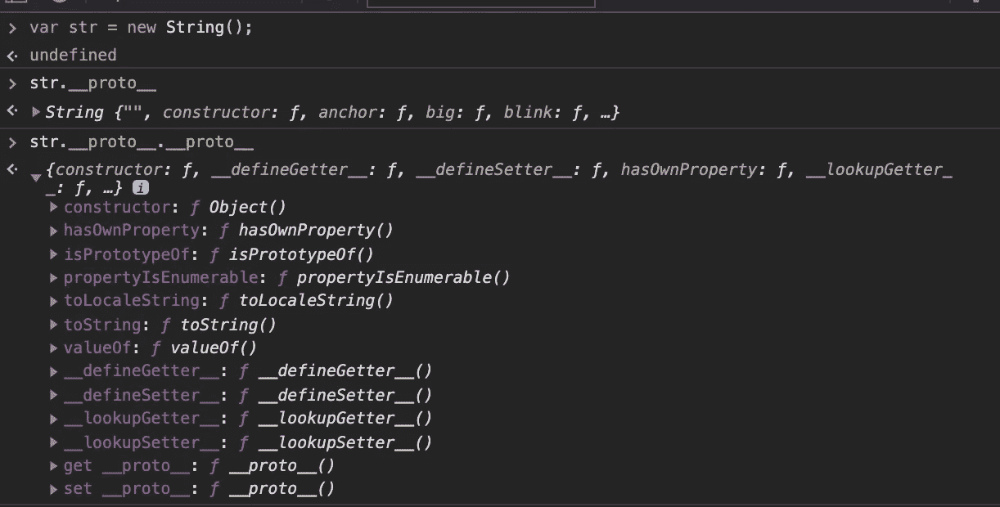
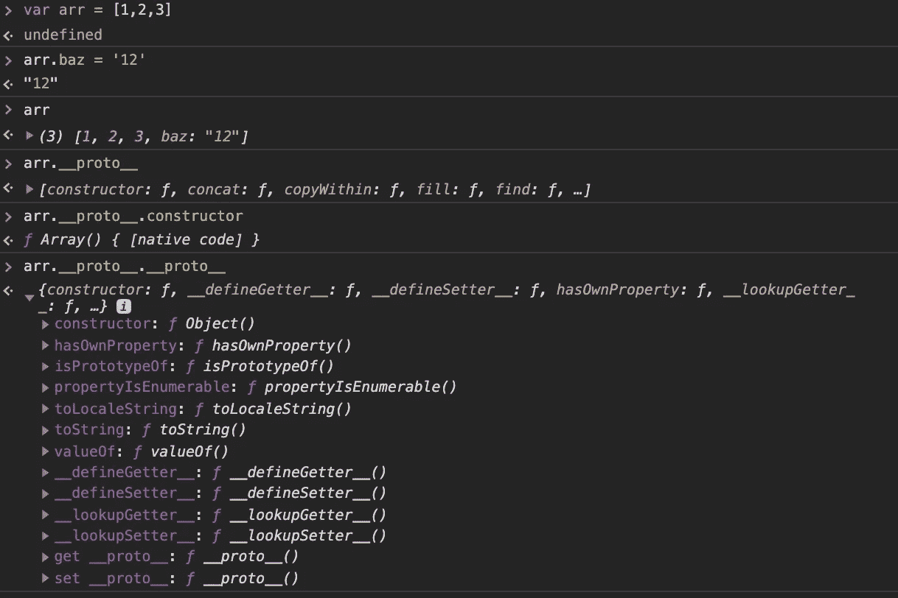
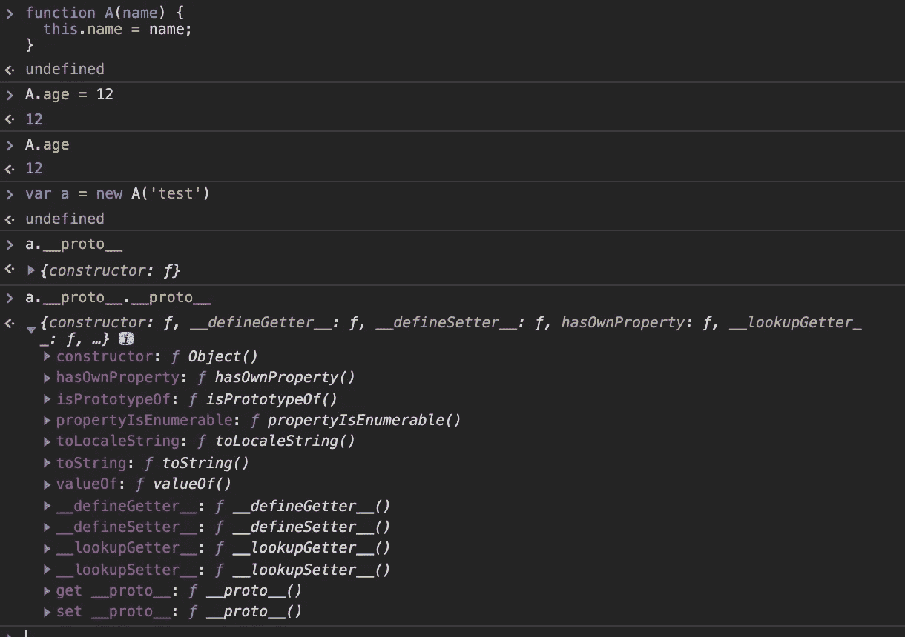
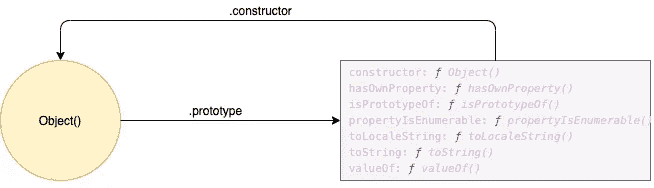
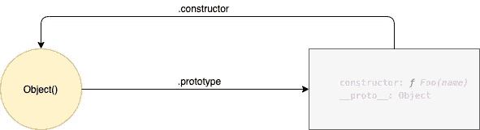
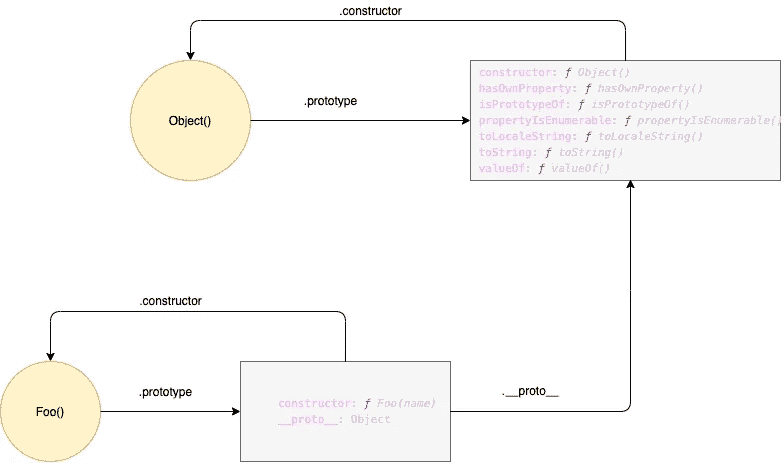
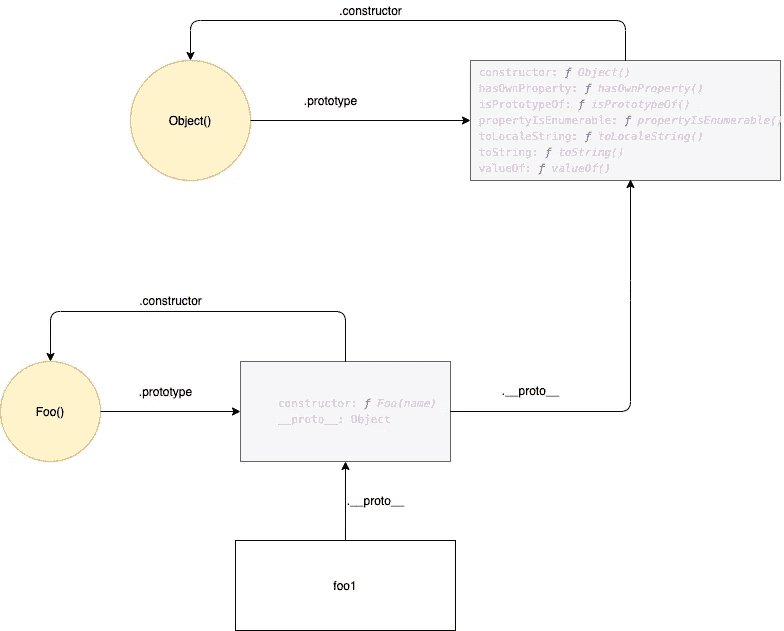
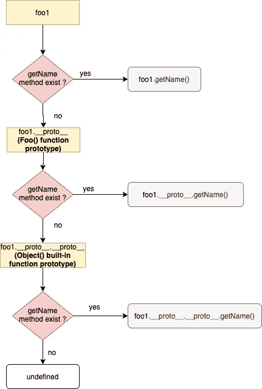
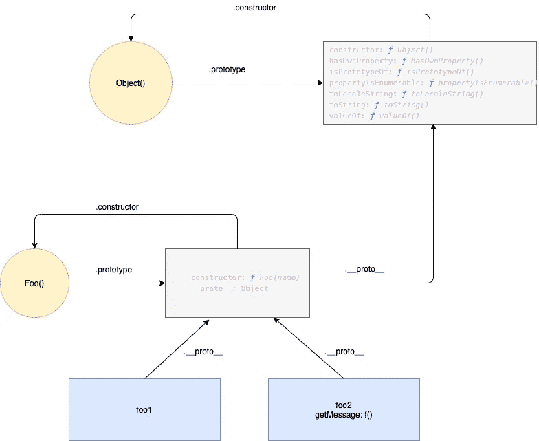
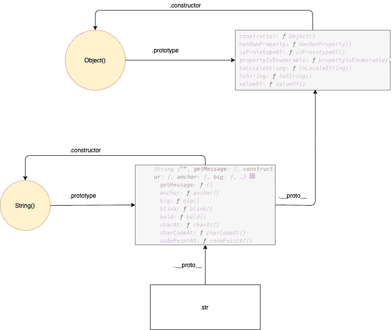

# 理解 Javascript 中的对象和原型

> 原文：<https://medium.com/nerd-for-tech/understanding-objects-and-prototypes-in-javascript-d847baa50f9a?source=collection_archive---------6----------------------->

JavaScript 是一种基于原型的基于对象的语言，而不是基于类的。对象本质上不是基于类的，但是基于构造函数、原型对象和方法的公共模式来定义类抽象通常是很方便的。**内置对象**本身通过使用**原型**属性遵循这样一种类模式。在这篇文章中，我们将研究内置对象和原型。

**内置对象:**

javascript 中有几个内置对象扩展了语言的灵活性。许多内置对象是函数:它们可以通过参数调用。此外，其中一些是构造函数:它们是打算与`**new**`操作符一起使用的函数。

*   `String`
*   `Number`
*   `Boolean`
*   `Object`
*   `Function`
*   `Array`
*   `Date`
*   `RegExp`
*   `Error`

**内置对象是“功能”？**

*   如果内置对象有一个[[Call]]内部属性，那么内置对象就是一个`**"Function"**` **。**
*   如果内置对象有一个[[Constructor]]内部属性，那么内置对象就是一个`**"Constructor Function"**` **。**
*   如果内置对象没有[[Call]]内部属性，则内置对象是一个`**"Object"**` **。**

上面列出的所有内置对象都是函数和构造函数。它们可以通过参数调用，也可以通过使用 **new** 关键字调用。

**内置对象长什么样？**

让我们考虑字符串对象。

1.  String():
    它执行类型转换。
2.  String.constructor:
    当`**String**`作为`**new**`表达式的一部分被调用时，它就是一个构造函数:它初始化新创建的对象。
3.  String . prototype:
    `**String.prototype**`的初始值是标准的内置字符串原型对象。
4.  新创建的 String 对象:
    新创建的 String 对象本身就是一个值为空字符串的 String 对象。String prototype 对象的[[Prototype]]内部属性的值是标准内置对象 Prototype 对象。

*字符串对象:*



*数组对象:*



*功能对象:*



如上例，所有内置对象都通过原型对象相互连接。

**原型**:

每个内置函数(*对象、函数、数组等等*)都提供了一个匿名对象，可以通过内置函数的`prototype`属性引用。`Object.prototype`对象有很多方法和[属性](https://www.javascripttutorial.net/javascript-object-properties/)如`toString()`和`valueOf()`。除此之外，它还包含引用了`Object built-in function`的`constructor`。
*我们假设圆代表一个函数，正方形代表一个物体。下图说明了* `*Object()*` *函数和* `*Object.prototype*` *对象之间的关系:*



```
Object.prototype.constructor = Object
```

**定义名为 Foo 的新函数:**

让我们定义一个名为 Foo 的构造函数。它看起来和物体一样。因为**函数**和**对象**都是内置函数，它们都有**原型**对象。

```
function Foo(name) {
   this.name = name;
}
```



此外，JavaScript 通过`[[Prototype]]`将`Foo.prototype`对象链接到`Object.prototype`对象，这被称为*原型链*。

```
Foo.prototype.__proto__ === Object.prototype // true
```



**在 prototype 对象中定义一个方法，并从 Foo()创建一个新实例:**

```
Foo.prototype.getName = function() {
 return this.name; 
}
// create an instance of Foo constructor function
let foo1 = new Foo(‘John’);
```

新实例通过`__proto__`连接到 Foo 构造函数的原型对象，读作 *dunder proto。*

```
*foo1.__proto__ === Foo.prototype // true*
```



如果我们想通过新创建的对象 **foo1** 访问 **getName** 方法。它将遵循以下步骤。
1。foo1 检查自身的 **getName** 方法。
2。如果它不存在于 **foo1** 对象中，它将要求 **Foo.prototype.
3。**如果在 **Foo.prototype** 对象中不存在，它会要求**foo . prototype . _ _ proto _ _(object . prototype)**



让我们创建另一个对象并为这个对象定义一个方法。

```
var foo2= new Foo('');
foo2.getMessage = function () { 
  return “Hello!”; 
};
```



```
foo2.getMessage(); // “Hello!”
foo1.getMessage(); // getMessage is not defined
```

**foo1** 和 **foo2** 将遵循上述模式中描述的相同原型链。`getMessage`方法仅针对 **foo2** 指定。因为`foo2.getMessage`将返回一个结果。当`foo1.getMessage`方法运行时，会抛出错误，因为 **foo1** 会遍历所有的原型链，找不到任何 **getMessage** 方法。

**说明字符串内置对象:**

我们已经提到，许多内置对象是函数，如函数、对象、字符串、数组等。我们已经通过创建 **Foo** 函数看到了**内置的函数对象**。其余的内置对象以同样的方式工作。为了深入理解，我们可以举一个例子说明字符串内置对象是如何工作的。

```
String.prototype.getMessage = function() {
 return "Hello"; 
}
let str = new String();
str.getMessage() // 'Hello';
```



我们已经讨论了对象、函数和字符串内置对象。我们还没有涉及的其他内置对象(数字、日期、正则表达式、错误、布尔值)也以同样的方式工作。

希望这些例子能帮助你理解原型如何与内置对象一起在 js 中工作。每个内置对象本身都遵循这样一种类模式。这种类模式是通过原型对象呈现的。