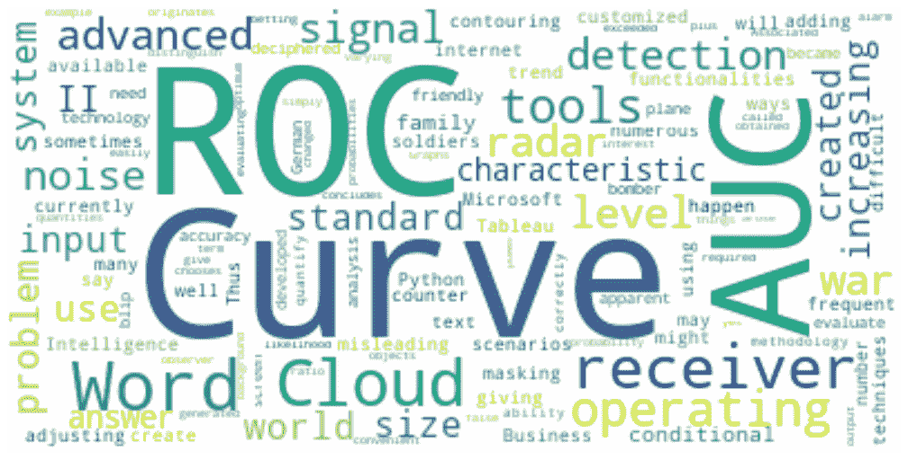
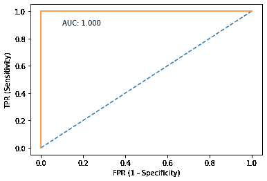
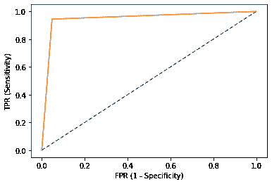
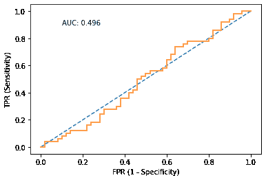
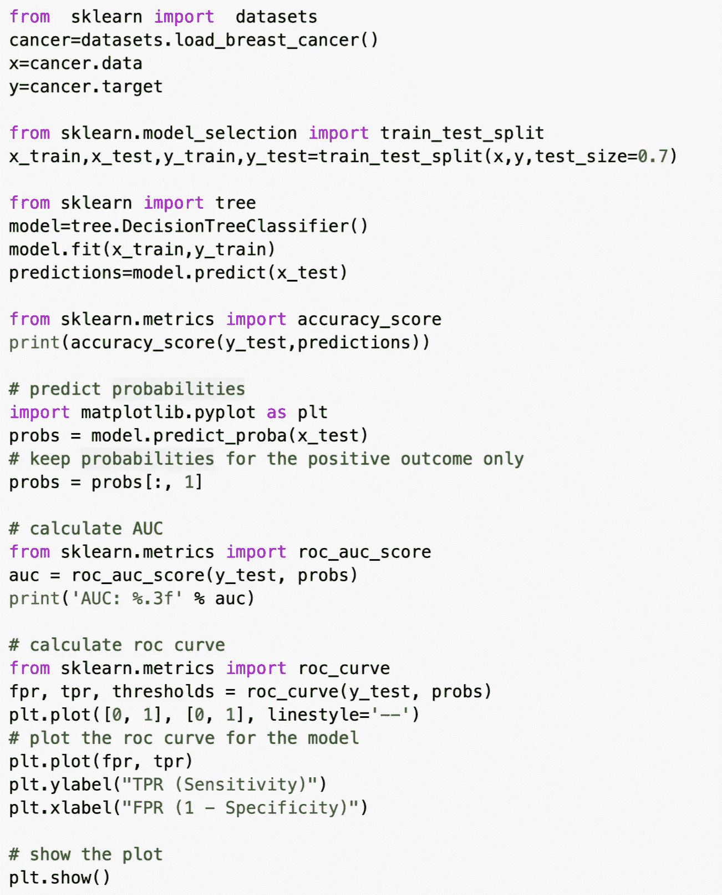
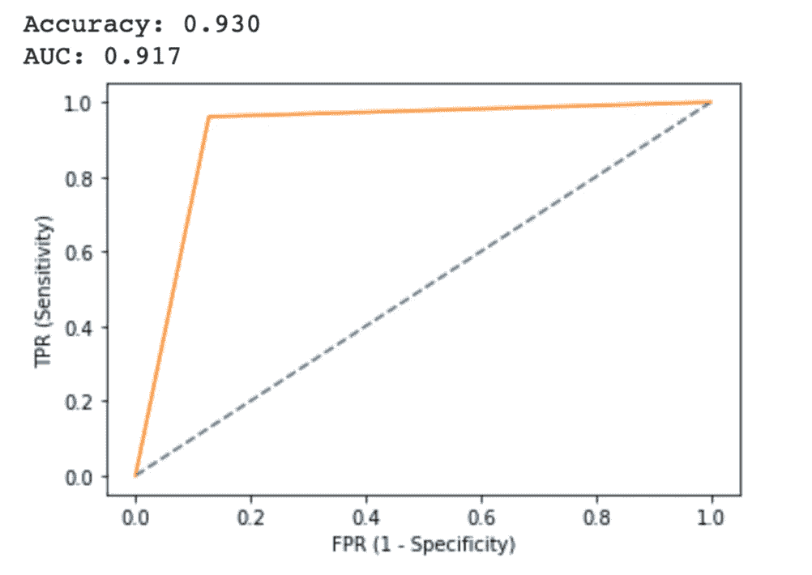

# 理解受试者工作特性(ROC)曲线

> 原文：<https://medium.com/nerd-for-tech/understanding-receiver-operating-characteristic-roc-curve-f5eed11bc565?source=collection_archive---------10----------------------->

# 介绍

受试者操作特征曲线，或 ROC 曲线，是一种图示，说明了二元分类器系统在其辨别阈值变化时的诊断能力。ROC 分析提供了一个系统的工具，用于量化个体决策阈值之间的可变性的影响。这种方法最初是从 1941 年开始为军用雷达接收机的操作员开发的，因此得名。

# 中华民国历史

第二次世界大战期间，士兵们将雷达屏幕上的一个信号解读为德国轰炸机、友军飞机，或者仅仅是噪音。随着战争期间雷达技术的进步，对评估探测精度的标准系统的需求变得显而易见。ROC 分析是作为一种标准方法开发的，用于量化信号接收器从系统背景噪声中正确区分目标对象的能力。术语接收机工作特性(ROC)源于第二次世界大战期间雷达的使用。

需要给出是或否答案的最佳观测者简单地选择一个工作电平，并且仅当其似然比接收机的输出超过该电平时，才得出接收机输入来自信号加噪声的结论。与每个这样的操作级别相关联的是答案是虚警的条件概率和检测的条件概率。这些量的图形称为接收机工作特性或 ROC 曲线，便于评估接收机。如果通过改变例如信号功率来改变检测问题，则产生一族 ROC 曲线。投注曲线之类的东西，很容易从这样的家庭中获得。

> 最早提到的 ROC 曲线——摘自 Peterson，w .，Birdsall，t .，Fox，W. (1954)。信号可探测性理论，信息理论 IRE 专业组汇刊，4，4，第 171-212 页。

# 为什么要用 ROC？

## 在不同领域使用:

第二次世界大战后，ROC 很快被引入心理学，以解释对刺激的知觉检测。几十年来，ROC 分析一直用于医学、放射学、生物统计学、自然灾害预测、气象学、模型性能评估和其他领域，并且越来越多地用于机器学习和数据挖掘研究。

放射科医生面临的任务是在复杂的背景下识别异常组织。例如，每个放射科医师都有他或她自己的视觉线索，指导他们做出关于乳房 x 光照片的图案变化是指示组织异常还是仅仅正常变化的临床决定。不同的决策构成了决策阈值的范围。

## 机器学习视角:

ROC 曲线是二元分类问题的评估标准。它是一条概率曲线，绘制了不同阈值下的真阳性率(TPR)与假阳性率(FPR ),并从本质上将“信号”与“噪声”分开。

# ROC 是什么？

如上所述，TPR 和 FPR 之间的曲线是 ROC 曲线。换句话说，这是一个在[灵敏度](/analytics-vidhya/removing-confusion-from-confusion-matrix-bec7d3da8cd9)和(1-特异性)之间的图表。在 ROC 曲线中，较高的 X 轴值表示假阳性的数量高于真阴性。而较高的 Y 轴值表示较高数量的真阳性而非假阴性。

# ROC 的 AUC 和解读是什么？

ROC 的解释取决于 AUC 的值。我们来了解一下什么是 AUC。

曲线下面积(AUC)是分类器区分类别的能力的量度，并用作 ROC 曲线的总结。AUC 越高，模型区分阳性和阴性类别的性能越好。

AUC = 1(最佳可能模型)

*   当 AUC = 1 时，分类器能够完全正确地区分所有阳性和阴性类点。
*   然而，如果 AUC 为 0，那么分类器将预测所有阴性为阳性，所有阳性为阴性。

0.5 < AUC < 1 (General Case Scenario)

*   When 0.5
*   This is so because the classifier is able to detect more numbers of True positives and True negatives than False negatives and False positives.

AUC = 0.5 (Worst Model)

*   When AUC=0.5, then the classifier is not able to distinguish between Positive and Negative class points.
*   Meaning either the classifier is predicting random class or constant class for all the data points.

# Code

# **结论**

ROC 曲线作为机器学习分类任务的决策器。在 AUC_ROC 值的帮助下，人们可以容易地理解分类器执行得有多好，并且理解模型的预测能力。