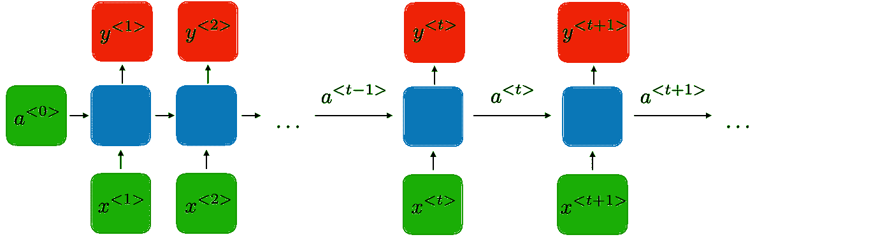
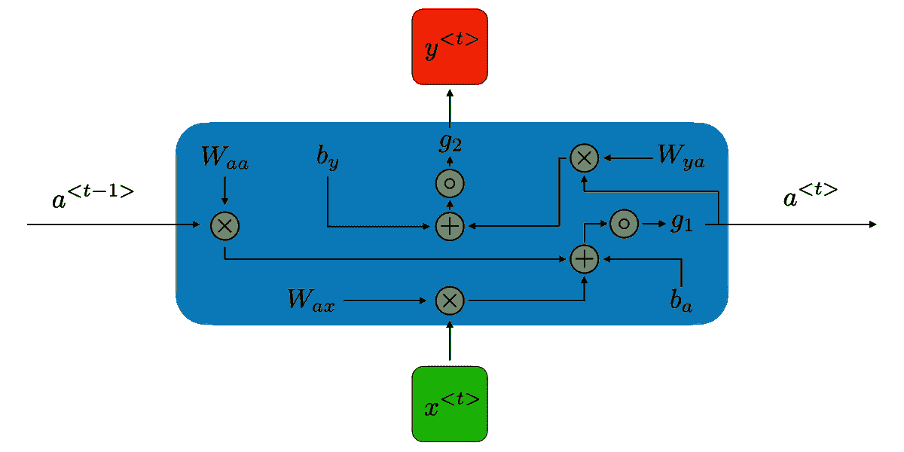
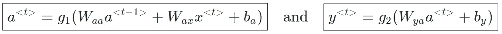
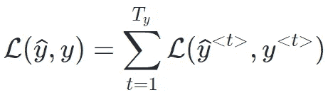
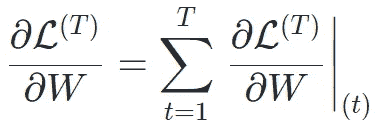

# 了解 RNN

> 原文：<https://medium.com/nerd-for-tech/understanding-rnn-91d548c86ac9?source=collection_archive---------6----------------------->

人类可以开始思考任何话题，但它总是建立在对话题的理解上。例如，如果你正在看一部电影，如果你想关联电影的每一个场景，你应该知道前一个场景中显示的上下文，这是你可以关联或理解整部电影的方法。

由于传统的神经网络可以理解任何时候的数据和数据的相关性，但它不能记住过去数据的上下文。这是传统神经网络的主要缺点。同样，当我们处理数据序列时，传统的神经网络无法解决这个问题。求解 RNN 是在 1986 年 David Rumelhart 工作的基础上引入的。霍普菲尔德网络——一种特殊的**RNN**——是约翰·霍普菲尔德在 1982 年发现的。1993 年，一个神经历史压缩器系统解决了一个“非常深度学习”的任务，该任务需要在一个及时展开的 **RNN** 中超过 1000 个后续层。

**什么是递归神经网络？**

RNN 是一种使用具有内部存储器的时间前馈神经网络的架构。内存意味着每个节点的输出依赖于过去的计算。最后，在产生输出时，它使用当前输入处的输入以及从先前输入产生的输出。

这张图片取自[https://stanford.edu](https://stanford.edu/)

在该图中，我们可以看到输入 X1 被采用，它产生输出 y1。在下一阶段，输出 y1 被作为具有 X2 的输入，以产生输出 y2。类似地，遵循这个过程，并且通过这种方式记住数据的上下文。现在，进入上面提到的网络中的网络部分。

这张图片取自[https://stanford.edu](https://stanford.edu/)

其中 *Wax* 、*魏如萱*、 *Wya* 、 *ba* 、 *by* 为暂时共享的权重和偏差，g1、g2 为激活函数。

对于每个时间步长 *t* ，激活 *a* < *t* >和输出 *y* < *t* >表示如下:

这里，<t-1>最初将为 0。</t-1>

现在，一旦数据通过正向传播，我们就得到输出 y <t>。在前向路径中不更新权重，因此为了在梯度下降中达到全局最小值，我们必须更新权重。一旦计算出 y 和 y < t >之间的损耗，这可以在**反向传播**中完成。遵循相同的过程，并且通过这种方式学习数据序列。</t>

在递归神经网络的情况下，损失函数 L 按照下面的公式计算。

在**反向传播**中，损失 L 相对于权重矩阵 *W* 的导数计算如下

**RNN 的应用**

在过去的几年中，将 RNNs 应用于各种问题取得了令人难以置信的成功。例如:语音识别、语言建模、翻译、图像字幕。

与 RNN 的问题

正如我们所见，RNN 研究的是随时间推移的序列信息。例如，如果我们正在处理像“球在篮子里”这样的陈述。在这个语句中，我们可以看到，下一个词篮可以根据之前的内容进行预测。但如果我们处理类似“我擅长板球，这就是我入选球队的原因”这样的上下文。这里所选的词与好相关，两个词之间的距离很大。在这种情况下，RNN 会因为**消失梯度**或**爆炸梯度**而失败。

正如在反向传播中，当数据从不同的隐藏层传递时，我们在神经元中使用了类似 sigmoid 或 relu 的激活函数。现在，在反向传播中计算的导数，对于 sigmoid 激活函数，在 0–1 之间。当它向第一层发展时，由于导数计算，它将首先接近于 0(可以忽略不计)。这就是所谓的**消失梯度**问题。同样，如果我们使用 relu 激活函数，将会产生**爆炸梯度**问题。

RNN 的第二个问题是它不能为当前状态考虑未来的输入。此外，它的计算速度非常慢。

我们可以在 LSTM，双向 LSTM，GRU 的建筑中解决这些问题，这将在另一篇文章中解释。