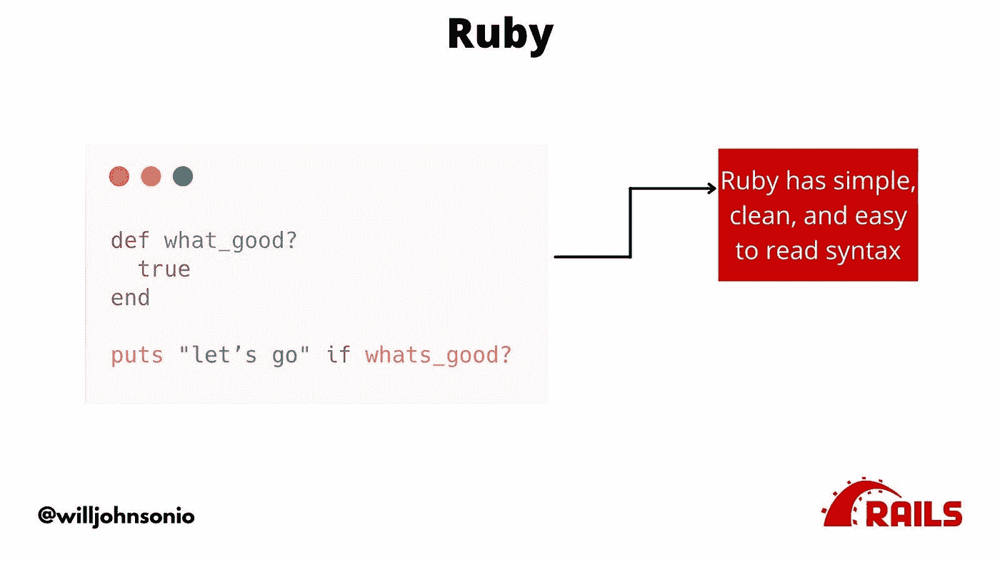
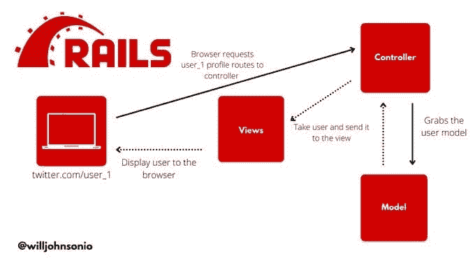
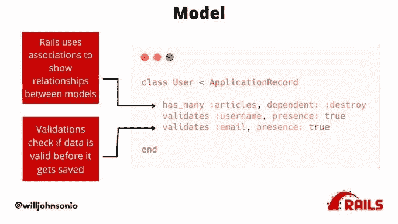
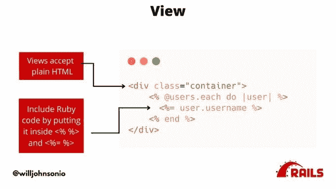
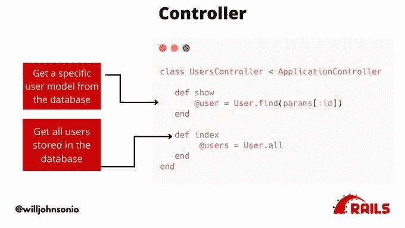
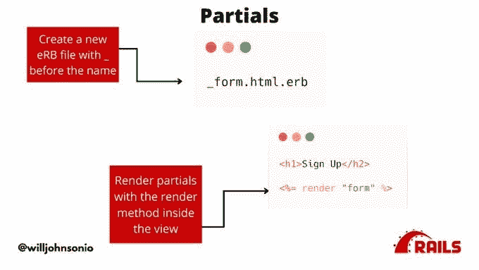
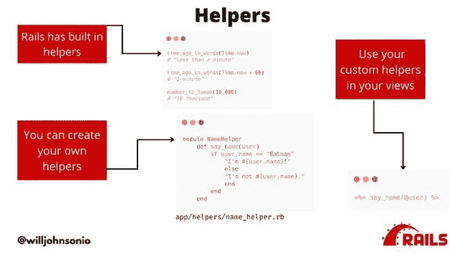
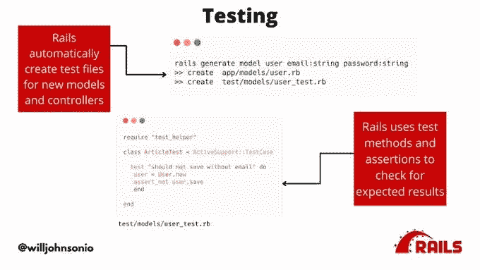
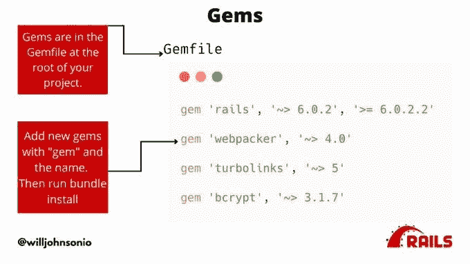
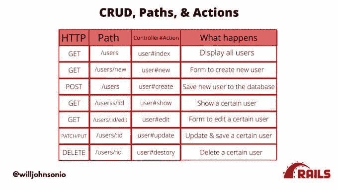

# 用 10 个步骤理解 Ruby On Rails

> 原文：<https://medium.com/nerd-for-tech/understanding-ruby-on-rails-in-10-steps-7c242bd30e0a?source=collection_archive---------7----------------------->

Ruby on Rails 是一个用 Ruby 编程语言构建的全栈 web 应用程序构建框架。

Ruby 的语法简洁明了，没有大量的圆括号、方括号或分号

Github、Shopify、Calendly、ThePracticalDev、eggheadio & ConvertKit 都是用 Rails 搭建的。

最后，您将对 Ruby On Rails 有一个简单的了解。

1.  Ruby on Rails 是一个用 Ruby 编程语言构建的全栈 web 应用程序构建框架。Ruby 有干净、简单的语法，没有大量的圆括号、方括号或分号**、Github** 、 **Shopify** 、 **Calendly** 、 [**Dev.to**](http://Dev.to) 都是使用 Rails 构建的。

2.Rails 使用 MVC(模型。查看。控制器)编程模式来组织和分离您的代码。这使得了解事物的位置以及它们之间的联系变得更加容易，从而让您有更多的时间专注于构建用户需要的功能

3.模型代表应用程序中的数据。您定义模型以确保任何新模型在保存前都匹配。您还可以将不同的模型相互关联。例如用户和他们的评论和/或文章。

4.视图是向用户显示的内容。它就像普通的 HTML 一样。您可以嵌入 Ruby(eRB ),将 Ruby 代码放入视图中，以显示数据库中的数据。你可以只写一行代码就显示多个用户的用户名！

5.控制器是你告诉你的应用程序如何处理你的数据，以及向你的视图显示什么的地方。您可以从数据库中获取所有用户，并告诉 Rails 在用户登录或单击用户索引页面的链接后显示这些用户。

6.部分视图是可以共享的视图，可以避免多次重复编写相同的代码。用户注册和用户编辑都是带有电子邮件、密码等的表单。您可以编写一次表单，并使用 render 关键字和 eRB 语法在任何视图中使用它。

7.帮助器是 Rails 防止您重写相同代码的另一种方式。Rails 为格式化数字等常见事情提供了内置的助手。您可以在 app/helpers 文件夹中创建自己的助手，并在 eRB 视图中使用它们。

8.在 Rails 中测试变得很容易。每个新的 Rails 应用程序都有一个测试文件夹。每次你创建一个新的模型或者控制器，它也会创建一个测试文件。内置测试库 minitest。使用带有断言的测试方法来检查预期的结果。

9.gem 就像是你添加到 Rails 中以获得新功能的插件。一些 gem 处理复杂的事情，比如认证和支付。gem 位于 Rails 应用程序根目录下的 Gemfile 中。

10.路由告诉你的应用程序事情的走向。
每条路径都链接到控制器内部的一个动作。用户路径显示了链接到控制器内部的索引操作的所有用户。这与用户索引视图相匹配。

在我看来，Ruby on Rails 与 Django 非常相似，也非常有趣。我在[的 Twitter 上看到了](https://blog.amangoyal.ml/understanding-ruby-on-rails-in-10-steps?guid=none&deviceId=27b4416b-45ba-43d6-b3c9-902e76cb2d5c) [willjohnsonio](https://twitter.com/willjohnsonio) 的这些推文，我忍不住在这里分享它们。

PS:你可以在 twitter 这里叫我[，在 tw ITER](https://twitter.com/_goyalaman)这里叫他[，在 dev](https://twitter.com/willjohnsonio) 这里叫他[。请在下面分享你的想法，也许是一个 Hii，它让我的一天。](https://dev.to/willjohnsonio)

*最初发布于*[*https://blog . amango yal . ml*](https://blog.amangoyal.ml/understanding-ruby-on-rails-in-10-steps)*。*