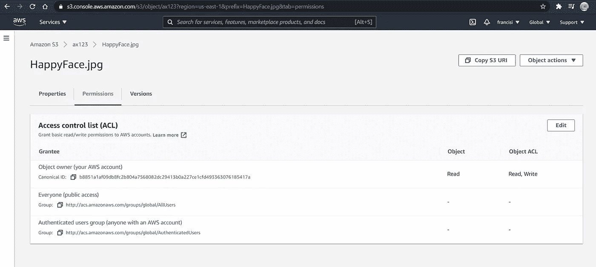
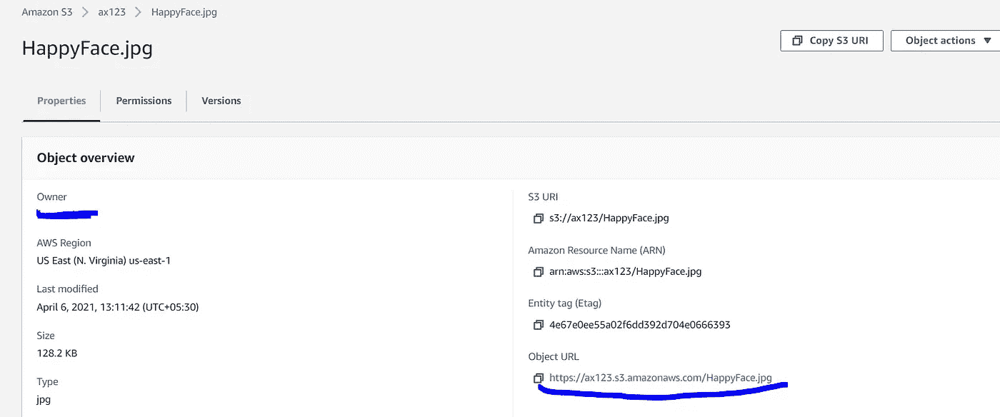
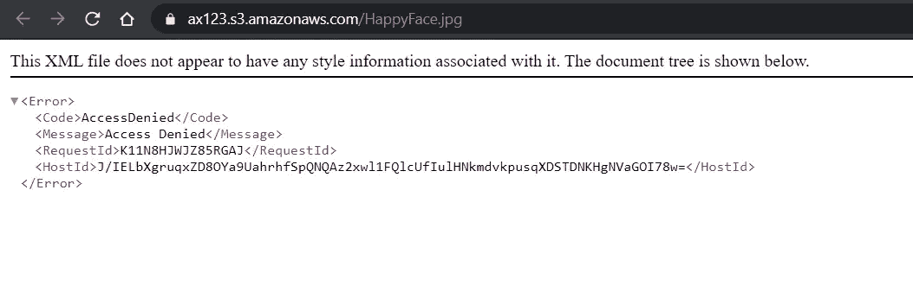
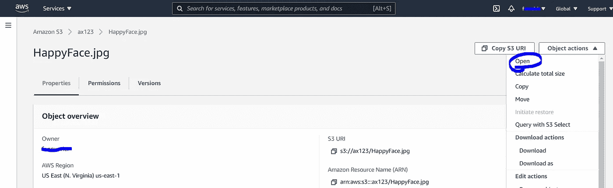
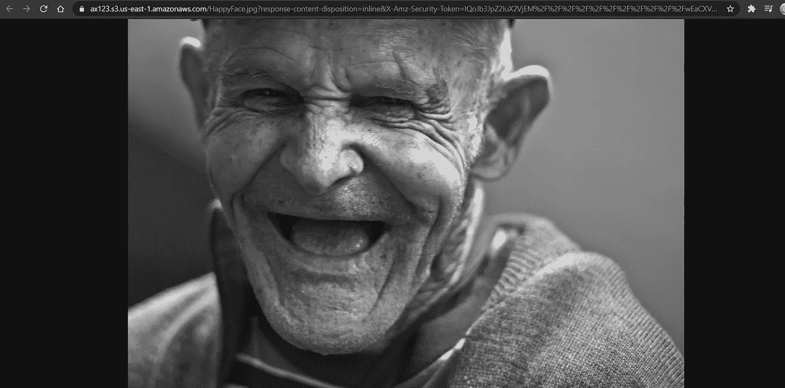

# 了解 S3 预先指定的 URL

> 原文：<https://medium.com/nerd-for-tech/understanding-s3-presigned-url-782a8dccbba6?source=collection_archive---------6----------------------->

[斯科特·格雷厄姆](https://unsplash.com/@homajob?utm_source=medium&utm_medium=referral)在 [Unsplash](https://unsplash.com?utm_source=medium&utm_medium=referral) 上拍照

**什么是 S3 预先指定的网址？**

S3 预签名 URL 是预认证的 URL，允许用户访问存储在 S3 的对象。

用户将继承生成预签名 URL 的人的权限

**为什么需要它？**

暂时允许用户从 S3 上传/下载对象。在规定的时间内可以观看的优质视频

**从 AWS 控制台了解 S3 预先指定的 URLs】**

我刚刚上传了一张图片到我的 S3 桶，默认情况下这不是公开的:

让我们试着通过对象 URL 打开对象-

我们得到一个拒绝访问的错误。这是因为该对象不是公共的。

现在，让我们尝试通过对象操作打开它。

我们能够打开它，因为此 URL 是用我们的凭据签名的:

**如何生成一个？**

先决条件-

1.  AWS CLI 已安装并使用您的帐户凭据进行了配置
2.  我们有一个不公开的 S3 桶

以下命令用于配置签名版本:

> #设置正确的签名版本，以便在为加密文件生成 URL 时不会出现问题
> 
> aws 配置集 default . S3 . signature _ version S3 v4

这个命令生成一个预先指定的 URL，我们可以用它来分发选择的内容

> #添加自定义到期时间
> 
> aws s3 预设计 S3://my bucket/my object-expires-in 300-区域 my-region