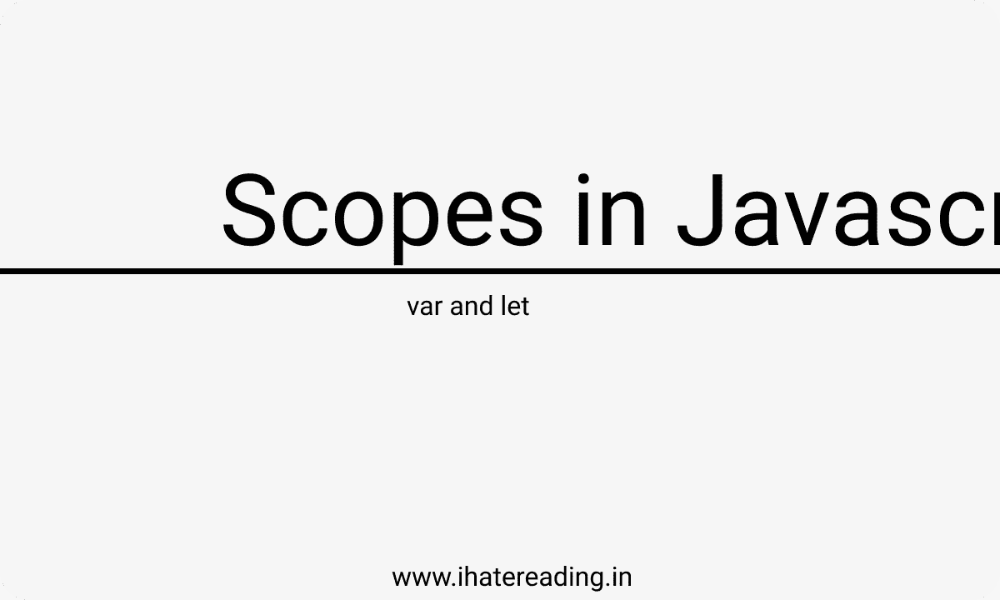

# 理解 Javascript 中的作用域

> 原文：<https://medium.com/nerd-for-tech/understanding-scopes-in-the-javascript-e37cbaaa1410?source=collection_archive---------9----------------------->

在所有的 javascript 面试中，你可能不得不面对类似的问题

[找到更多这样的故事](http://www.ihatereading.in)

## 在后台

最近，我在一家公司面试一个全栈开发的角色，在那里我被抛出了一个关于 javascript 作用域的问题。自从我读到 javascript 变量构造函数的作用域以来，已经有很多年了。所以，在今天的故事中，我们将…