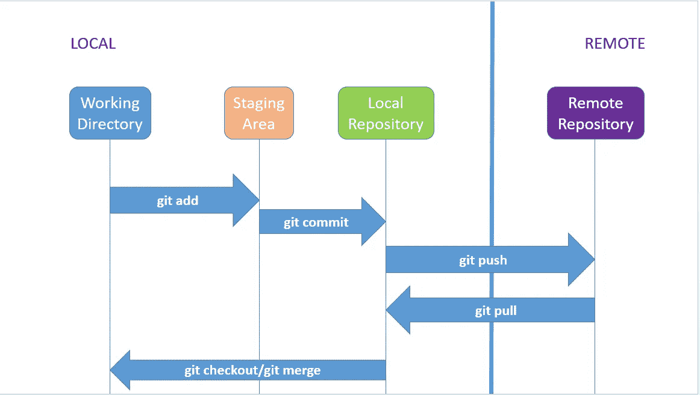
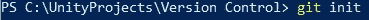
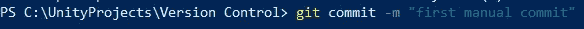
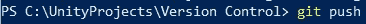
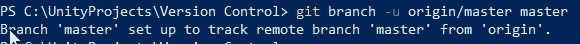
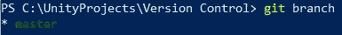
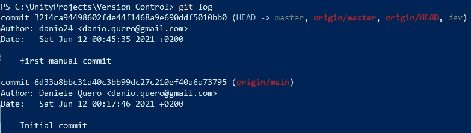
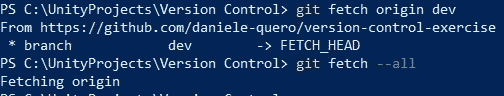

# 理解 Git 版本控制的基础知识

> 原文：<https://medium.com/nerd-for-tech/understanding-the-basics-of-git-version-control-81a59ff33041?source=collection_archive---------13----------------------->

**目标**:获得对 Git 及其主要命令的实际理解

在工作中学习 Git 为我提供了很强的实践知识，让我知道作为一名软件工程师应该做什么以及什么时候做。

我不会试图解释 Git 是什么(除了说它是一个**版本控制系统**，相反，我将给出一些简单的信息，这将使**更容易理解**的主要特性。

所以，让我们假设你和其他一些开发人员正在进行同一个项目，并且想要**分享你对代码的贡献**；或者让我们说，你的一些同事将**开发一个新功能**，他们很可能会有点混乱；或者说他们已经搞砸了…

> 有没有办法**让一切尽在掌握**？没错。有版本控制。

Git(像其他版本控制系统一样)允许跟踪每一个变化，加上其他一些很酷的特性。但是让我们按顺序进行。

你在本地机器上有你的代码，你有一个远程存储库(在 GitHub，BitBucket 等上)。)通过 git 命令，您可以“更新”远程存储库，方法是通过**将新的本地更改从本地推送到远程，或者反过来，通过**将更改从远程拉送到本地。****

Git 区域

> 为了使用这些命令， *git push* 和 *git pull* ，需要遵循一定的工作流程。我发现非常有用的一件事是可视化 Git 通过它的**区域**。

您正在编写的代码位于**工作目录**中，您已经使用 *git init* 命令在其中启动了存储库。

在任何更改之后， **git status** 命令将显示哪些文件已被修改，哪些是新的和未被跟踪的。通过调用命令 **git 添加** *，*后跟一个文件名或"."(所有文件)您将把选择的文件“移动”(或添加)到**暂存区。**

此时，您可以继续您的工作，添加其他文件，从暂存区删除文件( *git restore "fileName"* )或 **commit** 您的更改。通过调用 **git commit -m "message"** ，您将确认您的更改并将它们移动到本地存储库。必须用或多或少的简短消息来标记每个提交，解释更改本身。

> 虽然临时区域只是临时的，但是本地存储库存储在**中。git** 文件夹，您可以在您的工作目录中找到

此时，**git push origin“branch name”**命令将把改变发送到远程 repo，如果本地和远程 repo 是一致的。

如果当前分支被设置为跟踪远程分支，可以使用一个更短的命令 **git push** 。但我稍后会谈到分支。

> 在进行任何更改之前，通过调用 **git pull** ，始终确保本地和远程存储库是一致的

现在让我们继续几个其他有用的命令。

有时候需要一个**并行开发**，可能是一个新的特性或者一个现有特性的复杂变化，你需要安全地完成它。在这种情况下，**分支**功能非常有用。如果还没有创建分支，那么您可能正在使用一个名为**“master”**的默认分支。通过调用命令**git check out-b " branch name "**，您将创建一个新分支，使用您选择的名称，*从主分支开始*(这意味着新分支是主分支的副本)。现在，您可以进行所有您想要的更改，这些更改将只提交到新的分支上，而不会影响 master(和其他人)。

> 主分支通常包含代码的最终版本，而您使用其他分支进行开发

> **git checkout** 命令也用于从一个分支切换到另一个分支，只需省略选项-b:**git commit*“branch name”。*** *以这种方式使用时，如果有未提交的更改，您将收到通知*

您还可以使用命令 **git branch 获得所有分支的列表。**

**git log** 命令显示了当前分支中提交的历史，从最后一个到第一个。每个提交都有一个唯一的散列码(十六进制)来标识它，最后一个提交总是被标记为**头**。

> 如果列表很长，会有分页:按**回车**滚动列表，按 **q** 退出。

好了，现在危险的东西: **git 重置“提交哈希”。**这个命令基本上可以让你及时回到一个特定的提交。使用*软*选项，您将返回到特定的提交，但会发现任何连续的更改都可用，并准备好进行暂存和提交。*硬*选项，另一方面会让你失去所有那些改变……所以要小心！

> 由于 HEAD 指向最后一次提交，因此可以将其用作参考:
> 
> git 重置 HEAD^ —重置为 HEAD 之前的提交
> 
> git 重置 HEAD^n —重置到 HEAD 之前的第 n 次提交

既然你的树有你需要的那么多分支，是时候学习如何**合并**了。假设你从 *master 开始创建了一个名为 *newFeature* 的新分支。*既然新功能已经完全开发、测试并准备就绪，您需要将其合并到 master branch 上的代码中。这是 *git merge* 命令的工作。通过调用**git merge " branch name "***，您要求(尝试并)将该分支上的代码合并到当前分支上的代码中。所以，在这个例子中，你首先要检查*主*，然后合并*新特征*。*

**

> *如果您为一个并行开发创建了一个新的分支，并且您想要最终合并回去，那么总是在新的分支中合并旧的分支，然后在旧的分支中再次合并新的分支，以便保持新的分支总是与任何变更保持一致。*

*最后，但同样重要的是，我们的朋友**去取**。可以调用 Good-guy fetch，指示要获取的分支或一个强大的 all 选项，它只是从远程 repo 下载任何更改，而不会影响您的本地文件(**与 git pull** 一样)。这是一个有用的、非破坏性的命令，允许您检查远程存储库上是否存在任何更改(例如其他人所做的更改)。你可以把 **git fetch** 看作是 **git pull** 的安全版。*

**

*在学习高级命令之前，例如*恢复*或*樱桃采摘*，我设法通过使用上面解释的命令来工作。这就是我选择把它们放在本指南中的原因:它们是任何人为了使用 git 都应该知道的非常基本的命令。如果您想了解更多信息，请经常查看[文档](https://git-scm.com/docs)！*

*希望这是有帮助的！！您可以在以后的文章中找到一个真实的例子。*