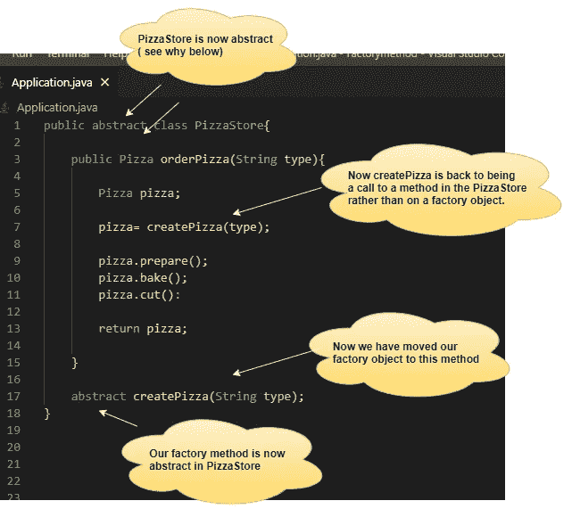
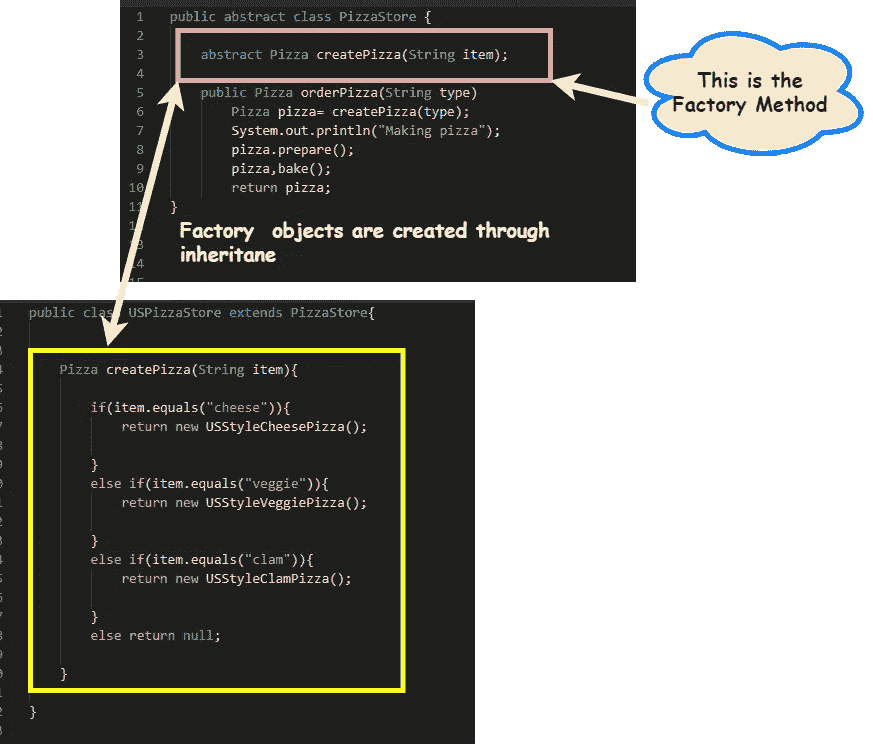
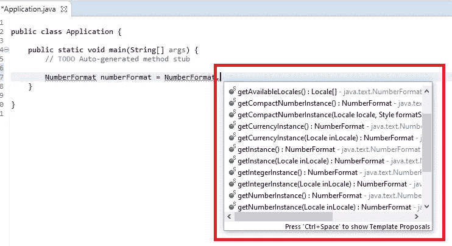
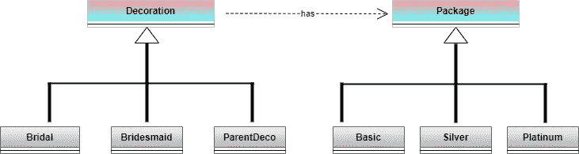
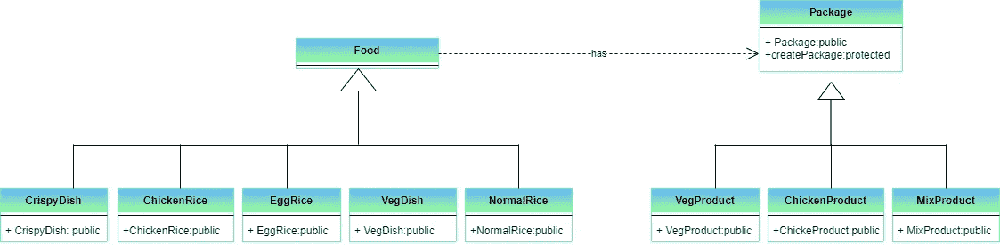
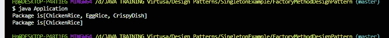

# 理解工厂方法设计模式✨😎

> 原文：<https://medium.com/nerd-for-tech/understanding-the-factory-method-design-pattern-b5cac235cc37?source=collection_archive---------18----------------------->


✷工厂法设计模式属于创造性设计模式。

> 工厂方法设计模式通过让子类决定创建什么对象来封装对象的创建。



# ♨️ **让我们比较一下工厂方法设计模式和单体设计模式。**

✵在单例设计模式中，我们不使用参数来创建实例。但是当涉及到工厂方法模式时，我们总是使用参数来决定您需要获得哪个实例。(有时也可以有不带参数的默认构造函数)

✵在单例设计模式中，你总是知道你想要得到的实例的类型。但是当谈到工厂方法设计模式时，可能你不知道或者你不知道你将得到什么样的实例。(因为这是由你的输入决定的)有时你会得到一些子实例而不是父实例。

✵不像在 Singleton 的设计模式中，我们在工厂方法设计模式中看不到实例化的逻辑，你总是只能看到你得到的。

✵在工厂方法设计模式中，更高的类可以指接口和其他具体的类。但是作为用户，你不会知道它还被其他什么父类继承或实现。

✵其实，工厂方法设计模式用在一个更高层次的框架中。然后是较低的级别，最终用户或开发人员是调用它的人。

✵在单例设计模式中，通常我们不创建接口。但是与工厂方法设计模式相比，您可以使用接口。

## 请看下面🕵的例子🏼



在上图中突出显示的部分，您可以看到 getInstance、getNumberInstance、getCurrencyInstance 等等。您可以向构造函数传递一些参数来确定您需要返回哪个实例。

让我们通过下面的场景来理解工厂方法设计模式。

# 💥场景 1:

> 假设您需要为花店实现一个系统或用例。这家花店应该有包装。根据您传递的参数，您需要创建一个工厂方法模式来返回所需的包。

下面是上述场景的 UML 图。



你有一个装饰类，它是一个抽象类，如下图所示。

从装饰来看，你有不同种类的装饰。例如，BridalDeco 是一种装饰，BridalDeco 类扩展了装饰类。(如下图所示)

像这样，你会有 ParentDeco 类和伴娘 Deco 类，它们扩展了 Decoration 类。

所以现在你需要一个名为 package 的类来添加这些装饰。这里的包装是装饰品的集合。

所以下面是“PackageFactory”类的代码片段。工厂是我们创建真正的包的地方。

所以在这里，Factory 所做的是，根据传入的参数，切换它返回的实例。

主要类别:

输出:

```
**Package{decorations=[BridalDeco, BridesmaidDeco]}****Package{decorations=[BridalDeco, BridesmaidDeco, FlowergirlDeco, ParentDeco]}**
```

因此，我们可以看到，工厂方法设计模式总是根据它得到的参数返回多个实例。

# 何时使用这种工厂方法模式？

✹当我们有许多实现一个公共协议的类时，我们可以使用这个工厂方法设计模式。(比如，从同一个基类派生的。)

✹还有，当你事先真的不知道你的代码应该处理的对象的类型和依赖关系时，可以使用工厂方法设计模式。

# 💥场景 2:

> 有一种叫做“微笑食品”的在线食品订购系统。该系统包含一些产品，如**、【蔬菜产品】、**、**、【混合产品】。**这些产品下面都有米饭和一些菜肴(点餐时)。所以当顾客输入他想要的产品时，系统应该在每个产品里面生成想要的东西。
> 
> 这里，
> 
> ***VegProduct 包含:NormalRice***
> 
> ***鸡肉产品包含:鸡肉***
> 
> ***MixProduct 包含:鸡饭、蛋饭、脆皮菜***

*让我们看看为上面的场景* ☛绘制的 UML 图

(这里的“食物”是一个抽象类。“CrispyDish”类、“ChickenRice”类、“EggRice”类、“VegDish”类和“NormalRice”类扩展了“Food”类。此外，“VegProduct”类、“ChickenProduct”类和“MixPrdoduct”类扩展了“Package”类。)



所以首先我们必须创建一个抽象类叫做 Food，如下图所示，然后子类可以扩展 Food 类。

如下所示，您可以扩展“CrispyChicken”类、“ChickenRice”类、“EggRice”类、“VegDish”类和“NormalRice”类。

然后，我们应该创建如下所示的包类，这样我们就可以通过其他产品类来扩展这个类。

下面是通过子类扩展产品类的方法。(在下面的代码示例中，我只提到了一个类。)

因此，我们必须创建工厂类(如下所示)。所以工厂所做的依赖于进来的参数，它切换它返回的实例。

最后，下面是该应用的主要方法:

上述场景的输出:



请点击下面的 Github 链接查看上述 scenario➜的完整源代码(java)

[](https://github.com/Irushinie/Krish-LP-Training/tree/main/FactoryMethodDesignPattern) [## irushinie/Krish-LP-培训

### 在 GitHub 上创建一个帐户，为 Irushinie/Krish-LP-Training 的发展做出贡献。

github.com](https://github.com/Irushinie/Krish-LP-Training/tree/main/FactoryMethodDesignPattern) 

# ➖工厂法的优缺点 Pattern➖

> ***工厂法的优点:***

✹当使用工厂方法模式时，我们可以创建对象而不向用户显示实例化的逻辑。

✹工厂方法模式允许子类选择要创建的对象种类。

✹松耦合，易于扩展。

✹工厂方法设计模式易于使用。

> ***工厂法的缺点:***

✹它使得代码更难阅读。

# 参考

工厂方法设计模式—Java point”、[T5、、](http://www.javatpoint.com,) 2021。【在线】。可用:[https://www.javatpoint.com/factory-method-design-pattern.](https://www.javatpoint.com/factory-method-design-pattern.)

设计模式与重构”，*Sourcemaking.com*，2021。【在线】。可用:[https://sourcemaking.com/design_patterns/factory_method.](https://sourcemaking.com/design_patterns/factory_method.)

设计模式—工厂模式—教程要点”，*Tutorialspoint.com*，2021。【在线】。可用:[https://www . tutorialspoint . com/design _ pattern/factory _ pattern . htm](https://www.tutorialspoint.com/design_pattern/factory_pattern.htm.)

D.模式，《设计模式——工厂设计模式的优缺点》，*Buggybread.com*，2021。【在线】。可用:[https://www . buggy bread . com/2016/12/design-pattern-advantages-and . html .](https://www.buggybread.com/2016/12/design-pattern-advantages-and.html.)