# 用实例理解决策树中的基尼指数

> 原文：<https://medium.com/nerd-for-tech/understanding-the-gini-index-in-decision-tree-with-an-example-5622419df25?source=collection_archive---------3----------------------->

**决策树**是一种特定类型的流程图，用于通过绘制不同的行动过程及其潜在结果来可视化决策**过程**。决策树在 ***机器学习*** 领域至关重要，因为它们被用于预测建模的过程中。

在机器学习中，预测方法通常被称为 ***监督*学习** *。*监督方法试图发现输入属性(或自变量)和目标属性(或因变量)之间的关系。所发现的关系以被称为 ***模型*** 的结构来表示。

***模式*** l 描述并解释隐藏在数据集中的现象，当输入属性的值已知时，这些现象可用于预测目标属性的值。

监督模型有两种类型:

1.**分类模型**(分类器)

**分类器:**它们处理离散或分类形式的数据。例如，分类器可用于对一个对象或一个实例进行分类，例如产品质量是好是坏(损坏)。另一个例子是热天或冷天。

回归模型:它们处理连续的数据。例如，一个回归变量(独立变量)可以根据某种产品的特性来预测其需求。一家公司的产品销售可以基于在该产品上做的广告来预测。另一个例子是什么是今天的温度意味着准确的值。

决策树是不言自明的，因为它们遵循易于理解的层次结构。决策树的整个目标是建立一个模型，该模型可以根据从特征中推断出的决策规则来预测目标变量的值。需要注意的一点是，树越深，规则越复杂。

**如何识别属性？**

在决策树中，主要的挑战是识别每一层中根节点的属性。这个过程被称为属性选择。我们有两种流行的属性选择方法:

**Gini 杂质**度量是决策树算法中使用的方法之一，用于从根节点和后续分裂中决定最佳分裂。

**基尼指数**又称基尼杂质。

基尼系数计算的是随机选择时某一特定特征被错误分类的概率。

如果所有的元素都与一个类联系在一起，那么这个类就叫做纯类。

它的范围从 0 到 1

0 =所有元素

1 =随机分布

0.5 =平均分布

这意味着基尼系数较低的属性应该是首选属性。

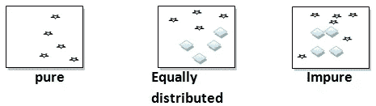

基尼杂质

**基尼指数方程:**

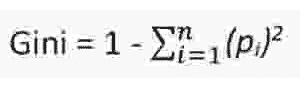

基尼指数方程

其中*π是*物体被分类到特定类别的概率。

现在我们将使用下表来理解基尼指数:

该表由 14 行和 4 列组成。该表描述了心脏病发生的个人因素(目标)因变量，取决于高 BP、高胆固醇、FBS(空腹血糖)。

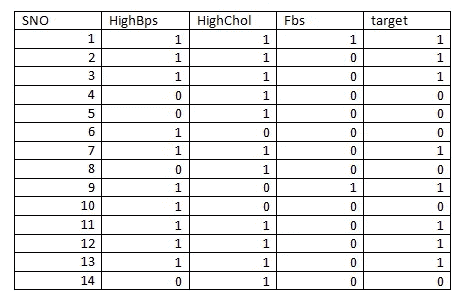

注意:原始值被转换成 1 和 0，这表示数字分类

**上表决策树:**

当为上表绘制决策树时，它将如下所示

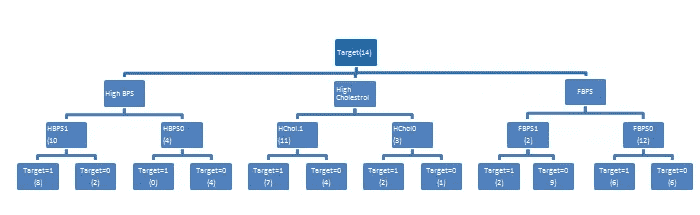

决策图表

1.目标是决策节点。

2.它被细分为父节点(高 bps、高胆固醇、FBS)

3.根据父节点中有多少个 1 或 0 的值，将父节点划分为子节点，例如:HBPS1 &HBPS0

4.基于 target=1 和 target=0，这些节点又被划分为叶节点

(叶节点是端节点，不能再分)

现在让我们计算高 bps、高胆固醇、FBS 的基尼系数，并找出决定因素。

基尼系数最小的因素是赢家，即。在此基础上建立决策树。

现在查找各个列的基尼指数

1.  **高基准点的基尼系数:**

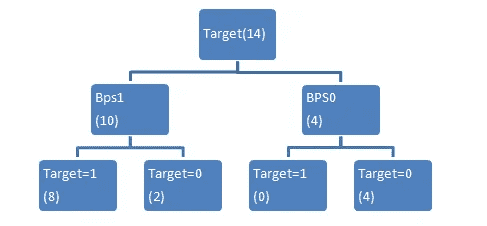

高 BPS 的决策树

父节点的概率:

P0= 10/14

P1=4/14

现在我们计算子节点:

1.  对于 bps =1，这是表格

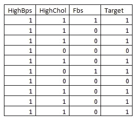

如果(Bps=1 且 target =1)=8/10

如果(Bps=1 且 target=0)=2/10

基尼指数 PBPS1=1-{(PBPS1)2+(PBPS0)2

= 1-{{8/10)2+(2/10)2}

=0.32

2)如果 BPS=0，

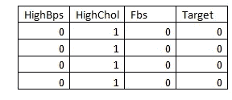

如果(BPS=0 且 target=0)=4/4=1

如果(BPS=0 且 target=1)=0

基尼指数 PBPS0=1-{(1)-(0)}

=1–1

=0

加权基尼指数

w.g =P0*GBPS0+ P1*GBPS1

= 4/14*0 + 10/14*0.32

=0.229

2.**高胆固醇的基尼指数:**

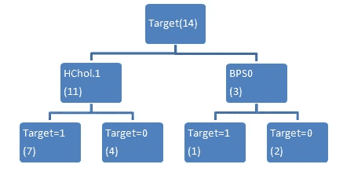

**高胆固醇的决策树**

父节点概率

P1 = 1914 年 11 月

P0=3/13

I)对于乙醇。=1

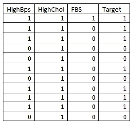

If (Hchol。=1 且目标=1)=7/11

If (HChol。=1 且目标=0)=4/11

基尼指数= 1-[(7/11)2+(4/11)2]== 0.46

ii)如果乙醇。=0

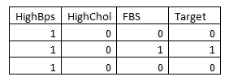

If (Hchol。=0 且目标=1)=1/3

If (HChol。=0 且目标=0)=2/3

基尼指数= 1-[(1/3)2+(2/3)2]=0.55

加权基尼系数= P0*GHChol.0+P1*GHChol.1

= 3/14*055+11/14*0.46= = 0.47

3.**FBPS 基尼指数:**

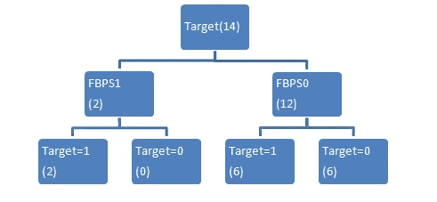

FBPS 的决策树

父节点概率

P1=2/14

P0=12/14

I)对于 FBPS=1

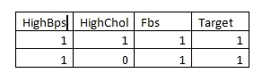

如果(FBps=1 且目标=1)=2/2

如果(FBps=1 且目标=0)=0

基尼指数 PFBPS1=1-{(PFBPS1)2+(PFBPS0)2

= 1- [(1)2+0]

=1–1=0

ii)对于 FBPS=0，

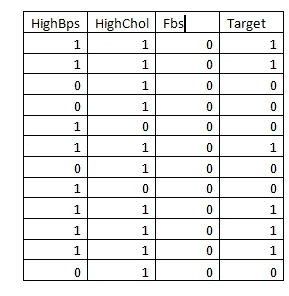

如果(FBps=0 且目标=1)=6/12=0.5

如果(FBps=0 且目标=0)=6/12=0.5

基尼指数 PFBPS0=1-{(PFBPS1)2+(PFBPS0)2]

= 1-[(0.5)2+(0.5)2]

= 0.5

加权基尼系数= P0*GFBPS0+ P1*GFBPS1

= 6/7*0.5+1/7*0

=0.42

**比较基尼指数:**

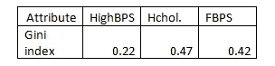

因为高 BPS 较少，所以它是赢家。

**结论** : **HighBPS** 作为构建决策树的根节点，并构建进一步的树。

*原载于 2021 年 1 月 18 日 https://www.numpyninja.com***。**