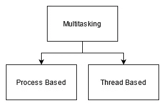
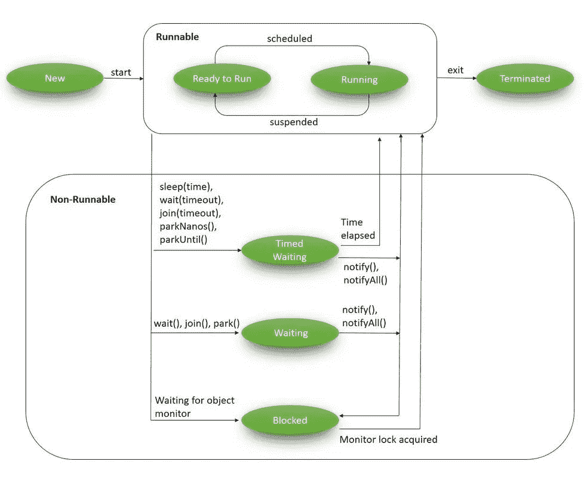
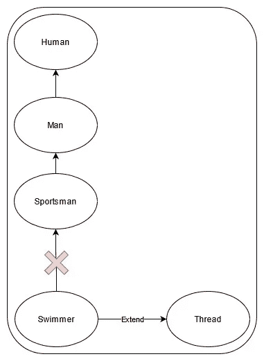

# 理解 Java 中的线程

> 原文：<https://medium.com/nerd-for-tech/understanding-threads-in-java-1f5a074d5753?source=collection_archive---------2----------------------->


由 [Maria Ionova](https://unsplash.com/@marusyaionova?utm_source=medium&utm_medium=referral) 在 [Unsplash](https://unsplash.com?utm_source=medium&utm_medium=referral) B 上拍摄的照片

## 什么是**螺纹？？**

这是通过进程代码执行**的流程，进程可以包含多个线程，称为**多线程。**基本上它是一个多重执行流程。所以在某个时间运行多个任务。这是大多数人误解的地方，假设有一个运行 10 分钟的进程，并不能保证为这个进程创建 10 个线程会将时间减少到 1 分钟，因为在一个程序中可能会运行相关的任务。但是时间可以减少到 7 或 8 秒，这取决于过程。线程用于在后台执行复杂的任务，而不会干扰主进程。**



多任务处理

如上图所示，有两种类型的多线程。在基于过程的环境中，比方说，程序员通常边编码边听音乐，有时他们可能会从互联网上下载任何文档。也就是说，他们同时在做多件事。这些任务是独立的，如果上述进程中的一个被终止(关闭程序)，不会影响其中任何一个。在基于线程的多任务处理中，每个线程都属于同一个主进程。通常一个主线程会被分成多个任务。假设 100 分钟内要处理 100 个文件。通过使用两个线程，这些过程可能在不到 100 分钟内完成。但是没有办法通过增加线程的数量来帮助在 1 秒钟内或在任何时间内完成任务。因为拿同一个文件反复处理是没有意义的。这个解释只是为了澄清，而不是真实的生活场景，它只是线程及其局限性的一个基本概念。

# 线程生命周期



(图片:baeldung.com)

在生命周期中，有 7 种状态。让我们讨论一下，

## 新的

这是创建线程的状态。

## 就绪/可运行

当`start()`方法被调用到特定线程时，它将从**新**状态切换到**就绪或可运行**状态

## 运转

当调用`run()`方法时，线程将切换到运行状态。这意味着当进程执行时。但是它可能会回到就绪/可运行状态，然后回到运行状态，这种情况也可能会一次又一次地发生。

## 堵塞的

这是一个线程阻塞锁的状态，因为另一个线程已经获得了这个锁。

## 等待

在这种状态下，线程将永远等待，直到出现任何中断。通常调用`join()`或`wait()`方法会将线程置于等待状态。

## 定时等待

当调用`sleep()`方法或`join()`或`wait()`方法时，这种状态称为**定时等待。**名字本身说明了线程将等待某个给定的时间。

## 死亡的

这种状态代表过程的完成。

# 如何用 Java 创建一个线程？

在 Java 中，有两种创建线程的方法，

*   通过扩展线程类
*   通过实现可运行接口

让我们一个一个检查一下，

## 扩展线程类

在这里，我将使用两个类。因此，要创建一个线程，我们需要用 Thread 类扩展 Printer 类，如下面的代码所示。

现在要运行线程，我们必须在 Application 类的 main 方法中创建一个 thread 类的实例，并调用该实例的`start()`,正如我在下面的代码中提到的。

所以如果我运行这个应用程序，我会得到这样的输出，

```
Main thread is running....
Child thread is running....
```

## 关于通过扩展线程类创建线程的事实，

*   不一定要在线程类中重写 run 方法。让我们看看为什么，当我调用`start()`时，它会检查打印机线程。由于我这里没有`start()`方法，它将检查父类 Thread class。在线程类中会有一个`start()`并调用`run()`方法。因此，当调用 run 方法时，它将调用打印机线程类，因为它没有`run()`方法，它将检查线程类，但它不做任何事情。在 run 方法中，如果目标被设置，那么它将执行`target.run()`方法。在我们的例子中，我们没有任何目标，所以什么都不要做。这就是它成功的原因。
    所以如果我们没有覆盖 run 方法，这意味着我们没有做任何任务，因为所有线程的进程都必须转到`run()`方法。这只有在我们扩展线程类时才有效。但是当我们实现 runnable 接口时，java 程序会强迫你覆盖`run()`方法。因为这就是我们接下来要看的 runnable 接口的行为。
*   从上面的代码片段中可以看出，尽管在主线程中打印句子之前调用了`start()`方法(在 Application 类的第 7 行),但它是在主线程打印之后打印的。这意味着，不能保证调用`start()`方法会立即运行线程，这完全取决于 JRE(基于操作系统)。在前一点中，我提到了`target`，它是一个可运行的对象。在我们的例子中，打印机对象，所以如果它有`run()`方法，那么它将执行它，如果没有，它将得到超类并执行`run()`方法，如我之前所说。让我们看一些例子，

所以在这个子线程中，应该打印从 1 到 10 的内容。

在主线程中，应该打印从 1 到 100 的内容

所以我运行这个程序几次来测试结果。(我只取了输出的前几行，以避免文章中有太多多余的空格)

> 第一次输出

```
Main thread is running....
Child thread is running....
main 0
child 0
child 1
main 1
main 2
main 3
child 2
main 4
child 3
main 5
child 4
main 6
.
.
```

> 第二次输出

```
Main thread is running....
Child thread is running....
child 0
main 0
main 1
main 2
child 1
main 3
child 2
main 4
child 3
main 5
child 4
main 6
.
.
```

> 第三次输出

```
Main thread is running....
Child thread is running....
child 0
main 0
child 1
main 1
child 2
main 2
child 3
main 3
child 4
main 4
child 5
main 5
child 6
main 6
.
.
```

所以从上面的结果来看，每次执行都有不同的顺序，所以这给出了一个结论，即无论何时调用`start()`方法，都不能保证线程会立即启动。这是因为**线程调度器**决定了哪个线程应该运行(排序),这完全取决于我上面提到的 JRE(基于操作系统)。

*   如果我们在没有`start()`方法的情况下调用`run()`方法会发生什么？让我们找出答案，

所以当我运行上面的程序时，我得到了如下输出:

```
Main thread is running....
Child thread is running....
main main 0
child Thread-0 0
main main 1
child Thread-0 1
main main 2
child Thread-0 2
main main 3
child Thread-0 3
main main 4
child Thread-0 4
main main 5
child Thread-0 5
main main 6
main main 7
main main 8
main main 9
main main 10
child Thread-0 6
child Thread-0 7
child Thread-0 8
child Thread-0 9
main main 11
main main 12
main main 13
main main 14
main main 15
main main 16
main main 17
main main 18
main main 19
main main 20
.
.
.
main main 99
```

从上面的输出可以看出，我得到了线程名，因为在代码中，我为当前线程调用了`getName()`。让我们看看，

如你所见，我去掉了 start 方法，只使用了 run 方法，得到了如下输出:

```
Child thread is running....
child main 0
child main 1
child main 2
child main 3
child main 4
child main 5
child main 6
child main 7
child main 8
child main 9
Main thread is running....
main main 0
main main 1
main main 2
main main 3
main main 4
main main 5
.
.
.
main main 99
```

因此，从输出中可以看出，它在执行 main 之前先执行 child，因为`run()`方法不会产生威胁，这意味着在这个场景中我们只有一个线程。因此它作为普通方法调用执行。所以`start()`方法是必要的，因为每当这个方法被调用时，JVM 将处理许多事情，例如，检查线程是否已经存在，线程是否准备好运行，然后它将在寄存器中注册并将其添加到线程池中，最后它将调用`run()`方法。因此，如果我们在没有`start()` 方法的情况下调用`run()`方法，那么这就不是一个多线程场景。

*   如果我们在 Thread 类中重写`start()`方法会发生什么？
    是的，但是让我们假设我们在`Printer class`中调用`start()`方法，它所做的是，它将寻找直接类并且它有方法，所以它将运行并且它不会去超类创建线程。那么有什么方法可以创建线程，甚至覆盖`start()`方法呢？答案是肯定的，我们可以，只要把`super.start()`放在 Printer 类的`start()`方法中。
*   如果我们重载了`run()`方法会发生什么？
    是的，但是线程类的 start 方法总是不带参数调用。
*   大多数程序员认为，一旦主线程终止，java 程序就会终止。但实际上它不是一个守护线程，所以子线程实际上可以继续。我们能做的是，通过在主类中给出`printer.setDaemon(true);`，我们可以将打印机线程对象更改为守护线程。此时，当您运行程序时，当主线程结束时，子线程也应该结束，但您可能会注意到，即使在主线程结束后，子线程仍会运行一段时间，因为当主线程打印最后一行时，子线程已经处理了特定的值，并且由于打印所花费的时间而发生了延迟。
*   这种方法的主要缺点是，当我们将 Thread 类扩展到那个特定的类时，我们将会失去类的层次结构，因为 Java 不支持多重继承。



## 实现可运行接口

在上面的代码中，我们使用了实现 Runnable，而不是从 Thread 类扩展。

Runnable 接口是一个 **SAM(单一抽象方法)**它只有一个名为 run 的方法，仅此而已。在这种情况下，我们没有中间线程类，所以我们没有人来实现`run()`方法。所以我们在这里做的是，我们从一个名为`thread`的线程类中创建一个实例(这意味着我们可以将 Runnable instance 传递给它，正如我在前面的线程创建方法中提到的，也可以给出线程行为)，我将对象`printer`作为参数传递给线程实例。现在`printer`是一个**可运行类**。这就是我从线程实例调用 start 方法的原因。我得到的输出如下，

```
Main thread is running....
Child thread is running....
main main 0
child  0
main main 1
child  1
main main 2
child  2
main main 3
child  3
child  4
child  5
main main 4
child  6
main main 5
child  7
main main 6
child  8
main main 7
child  9
main main 8
child  10
main main 9
child  11
Main thread Ends here
child  12
child  13
child  14
child  15
child  16
child  17
child  18
child  19
===========================
```

这是第二种方法中创建线程的方法。

Thread 类中有八个构造函数，

*   线程()

```
Thread T1 = new Thread();
```

*   线程(可运行目标)

```
Thread T2 = new Thread(printer);
```

*   线程(字符串名称)

```
Thread T3 = new Thread(name:"printerThread");
```

*   威胁(可运行目标，字符串名称)

```
Thread T4 = new Thread(printer, name:"printerThread");
```

*   线程(线程组组，字符串名称)

```
Thread T5 = new Thread(new ThreadGroup(),name:"printerThread");
```

*   线程(线程组组，可运行目标)

```
Thread T6 = new Thread(new ThreadGroup(),printer);
```

*   线程(线程组组，可运行目标，字符串名称)

```
Thread T7 = new Thread(new ThreadGroup(),printer,name:"printerThread");
```

*   线程(线程组组、可运行目标、字符串名称、长堆栈大小)

# 线程优先级

每个线程都有一个线程优先级，它将根据优先级运行。而 I 到 10 是 Java 中线程优先级的范围。基本上 10 是最高优先级，1 是最低优先级，5 是正常优先级。

让我们看看如何设置线程优先级，

因此，要设置优先级，我们必须对线程调用 setPriority 方法。在我们的例子中，线程的名字是`thread`。所以我调用了上面代码中的方法(第 9 行),并将其设置为最低优先级线程。

## 关于线程优先级的事实

*   大多数程序员认为 5 是每个线程的默认优先级，但事实并非如此。假设有两个线程 T1(主线程)和 T2(子线程)，这两个线程的线程优先级都设置为 5。实际上不会有任何变化。实际上在线程优先级中有一个规则，它是主线程的默认优先级值 s 5，因为它是由系统创建的。此后，创建的任何线程都将继承父线程优先级值。因此，在创建 T1 时，优先级将为 5，一旦我们从 T1 创建 T2，它也将采用相同的值，即使我们没有设置任何值。但是稍后我们可以通过调用特定线程的`setPriority()`方法来设置优先级。
*   当我们给不在 11 范围内的优先级值时，会发生什么呢？我试着通过将线程优先级设为 11 来运行一个程序，得到的输出如下:

```
Exception in thread "main" java.lang.IllegalArgumentException
    at java.base/java.lang.Thread.setPriority(Thread.java:1137)
    at threadSample.Application.main(Application.java:9)
```

如你所见，我在说`IllegalArgumentException`时出错了。所以它不可能自动设置为 10。

*   当我们分别为线程 T1 和 T2 赋予优先级值 1 和 10 时会发生什么？
    大多数时候执行的顺序不会有什么大的区别。是的，JVM 会监听优先级，但是我们不能确定 JVM 会相应地这么做。因此，如果你想知道它是如何工作的，我们必须在实际项目中实现它，我们有办法使用**线程转储**来查看。在那里所有线程的状态将被记录。

# 线程中的其他方法

## 连接方法

假设有两个线程 T1 和 T2。T1 希望等待 T2 完成任务，那么 T1 应该在 T2 线程上调用 join 方法。我们还可以设置 T1 等待的时间。让我们看看调用 join 方法的方法有哪些。

`T2.join()`——这将永远等待，或者直到 T2 死去

`T2.join(long millis)`—这将等待`millis`毫秒，等待该线程终止。

`T2.join(long millis,int nanos)` —这将等待`millis`毫秒加`nanos`纳秒，等待线程死亡。

因此，无论何时调用 join 方法，线程都将从运行状态进入等待状态。在本例中，T1 线程将进入等待状态。让我们看看在什么情况下 T1 会回到运行状态，

1.  T2 完成了它进程
2.  超时(仅当设置了时间时)
3.  当它被中断时

## 产量法

当调用`yield()`方法时，它将向调度程序发送一个提示，表明当前线程愿意放弃对处理器的当前使用。它是一个本机方法，因为它不是用 Java 实现的。假设有三个线程 T1、T2 和 T3。所以一旦 T1 调用了`yield()`方法，调度程序会把机会给其他线程，但不确定 T2 或 T3 是否立即得到了机会。假设 T2 获得了机会，一旦它在那一刻完成，我们也不能说调度程序会将机会给 T1。它完全依赖于称为**原语调度**的过程，如果平台不支持这个过程，那么你将无法看到这些类型的执行。

## 睡眠方法

当调用此方法时，它可以等待一段时间。这里有两种不同方法来调用这个方法，

1.  `sleep(long millis)`方法，这是一个本地方法，我们可以简单地在参数中给出睡眠时间。
2.  `sleep(long millis,int nanos)`不是本地方法的方法(用 Java 实现)。

因此，如果睡眠时间结束或有任何中断，那么线程将回到运行状态。

## 中断方法

当调用此方法时，特定线程将从等待状态返回到就绪状态。这就是为什么在调用 sleep 方法时，我们应该包含 try catch 方法，如下所示:

```
try {
     Thread.sleep(1000);
} catch (InterruptedException e) {
    // TODO Auto-generated catch block
    e.printStackTrace();
}
```

因此，要中断线程，我们必须调用如下方法:

```
thread.interrupt();
```

在我们的例子中，假设`thread`休眠了 5000 毫秒，一旦我们调用上面的方法，它就会回到就绪状态。这里需要注意的是，一个中断只适用于一种睡眠方法。如果我们在不睡觉的`thread`上调用这个方法呢。一旦调用了`sleep()`方法，它将等待并执行`interrupt()`方法，直到它不再做任何事情。

**同步**部分将在另一篇文章中讨论。

# 参考

我参考了下面的 YouTube 播放列表来写这篇文章，它是由 [Krishantha Dinesh](https://medium.com/u/26403c4bd160?source=post_page-----1f5a074d5753--------------------------------) 制作的。

我还引用了以下内容来完成这篇文章，

 [## 线程(Java 平台 SE 7)

### 每个线程都有一个优先级。优先级较高的线程优先于优先级较低的线程执行…

docs.oracle.com](https://docs.oracle.com/javase/7/docs/api/java/lang/Thread.html) [](https://www.baeldung.com/java-thread-lifecycle) [## Java 中线程的生命周期| Baeldung

### 在本文中，我们将详细讨论 Java 中的一个核心概念——线程的生命周期。我们将使用快速…

www.baeldung.com](https://www.baeldung.com/java-thread-lifecycle)