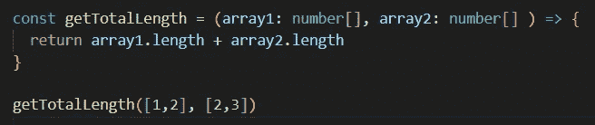
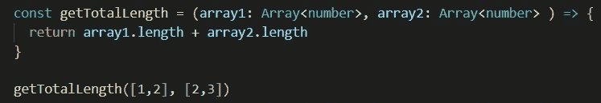
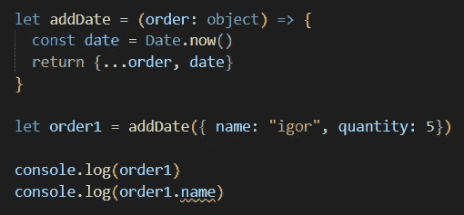
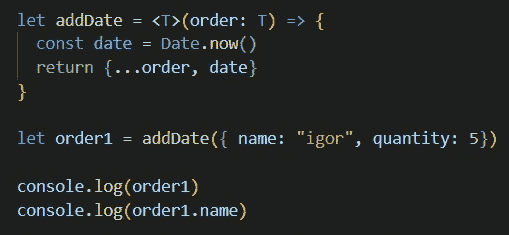
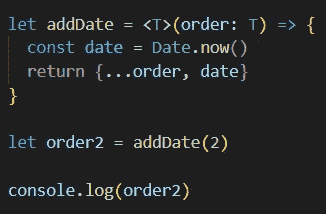
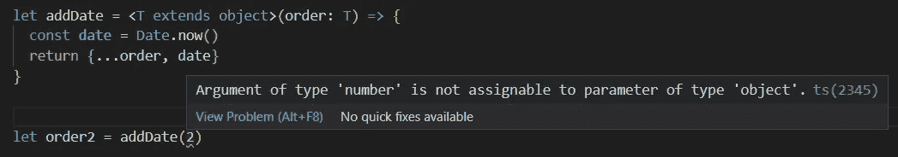
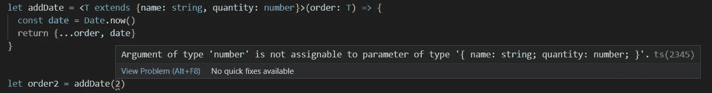
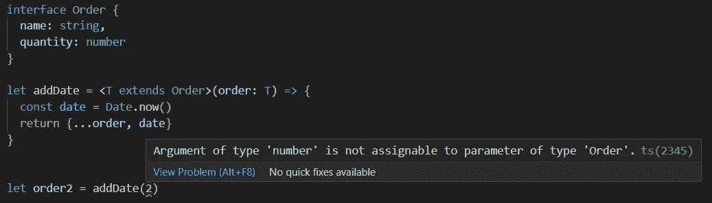
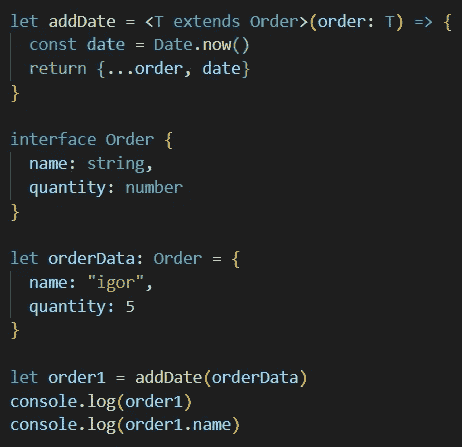

# 了解类型脚本泛型

> 原文：<https://medium.com/nerd-for-tech/understanding-typescript-generics-f71495588d91?source=collection_archive---------4----------------------->

在之前的一篇文章中，我谈到了如何在函数上创建显式类型来更好地控制输入。简单回顾一下，您可以通过在参数后添加一个冒号并指定类型来做到这一点。

实际上你可以用另一种方法，用泛型。在上面的例子中，我将用数组<number>替换数字[]。我在小于()符号中指定的任何类型都将是 TypeScript 编译器为该参数设置的类型。</number>

你可能想知道“这有什么用？”我要说的是，在这种特殊情况下，它不是。关于如何使用泛型的更多上下文，让我们看另一个例子。

我创建了一个名为 addDate 的函数，它接受一个对象并返回一个添加了日期属性的新对象。

TypeScript 允许我们在倒数第二行控制台记录对象，它将准确地显示我们所期望的内容，一个具有属性名称、数量和日期的对象。然而，当我们试图访问最后一行对象的 name 属性时，编译器会抛出一个错误。这是为什么呢？

我们只告诉编译器我们传入了一个对象。它不知道该对象的属性。为了让它访问这些属性，我们需要使用一个泛型。

通过在参数列表前添加<t>,并指定 T 将是为变量 order 传递的类型，我们消除了这个错误。TypeScript 编译器现在知道我们传递给函数的对象有一个 name 属性。</t>

重要的是要注意，没有选择<t>的任何具体原因，如果你想，你可以使用<generic>。你通常会发现人们使用<t>，所以我继续使用这个标准。</t></generic></t>

所以回到手边的函数，我们目前的实现到目前为止工作得很好，但是我们只传递对象。假设我们忘记了这段代码，想在 6 个月后使用它，但不小心传入了一个数字而不是一个对象。如果我们编写这个函数的意图是它只能处理具有特定属性的对象，那么 TypeScript 会给我们发送一个错误吗？

没有。我将返回一个只有日期属性的新对象。

如果我们想避免这种行为，我们必须比仅仅<t>更具体。我们可以通过几种方式做到这一点:</t>

## 扩展对象

我们可以告诉 TypeScript 编译器<t>将是一个带有*扩展对象*的对象。</t>

这使得任何旧的对象进入函数，在这种情况下，我们会说这不是预期的功能。让我们说得更具体些。

## 扩展特定对象

我们也可以通过写内联来直接指定对象。

然而，如果我们在多个地方使用同一个对象，那么一旦该对象发生变化，管理起来将会非常繁琐和困难。所以让我们用一个接口来代替。

## 扩展接口

现在，我们的 addDate 函数只能接受订单类型，这是我们从一开始就想要的行为。

# 了解更多信息

这篇博文旨在介绍泛型，老实说还有很多。查看这些免费资源，继续学习:

[官方仿制药文档](https://www.typescriptlang.org/docs/handbook/2/generics.html)