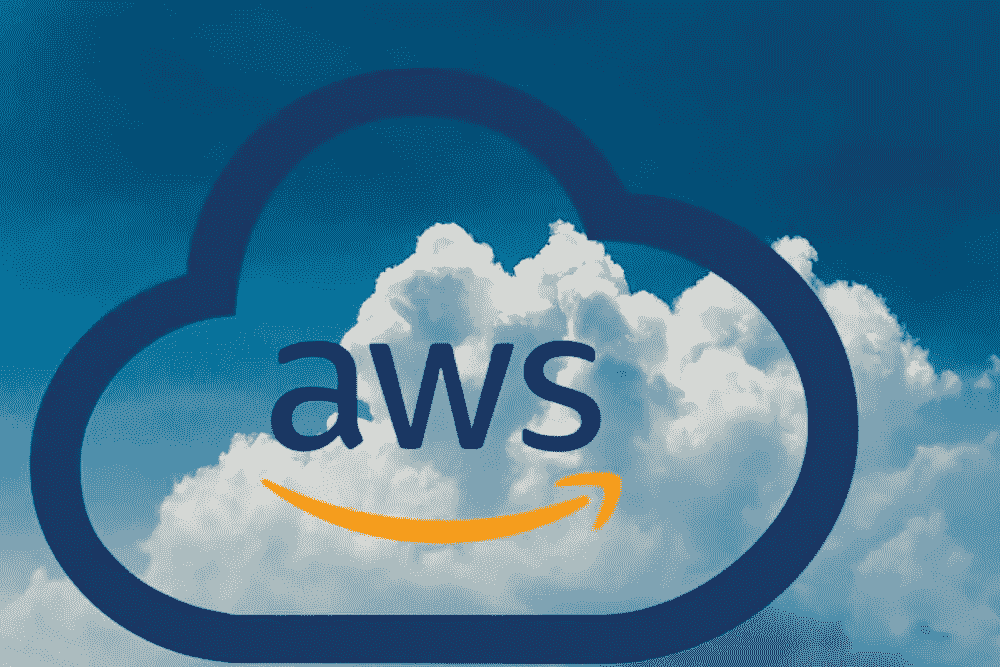
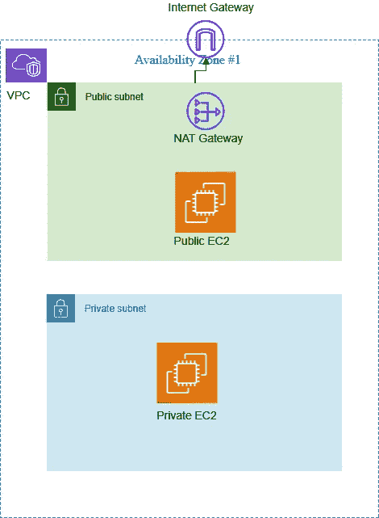
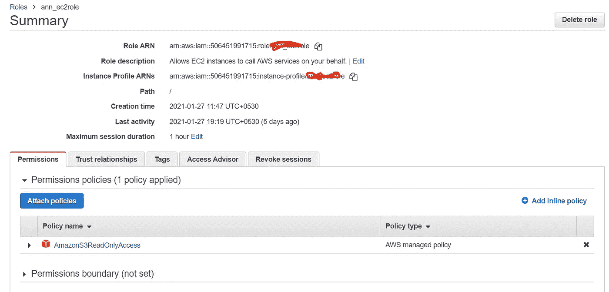
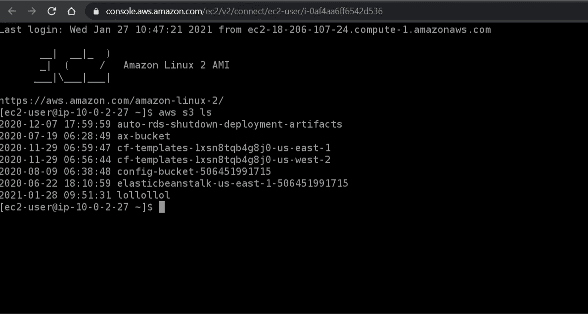
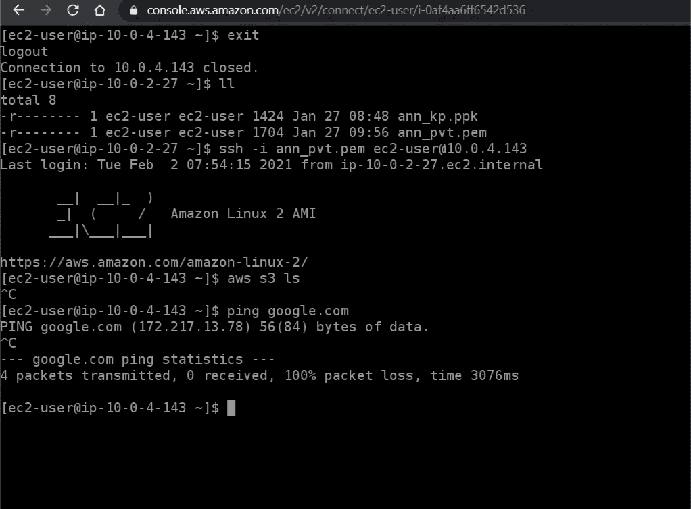
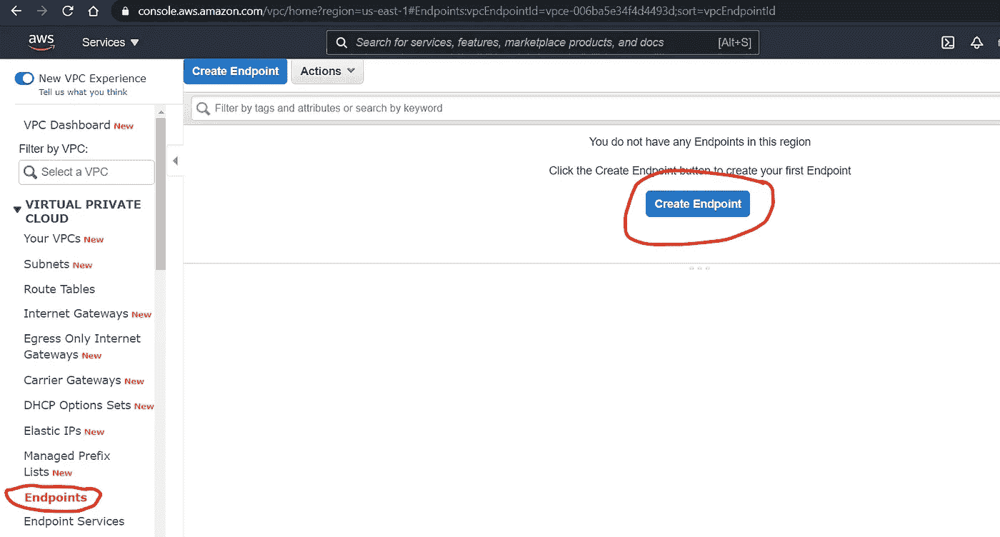
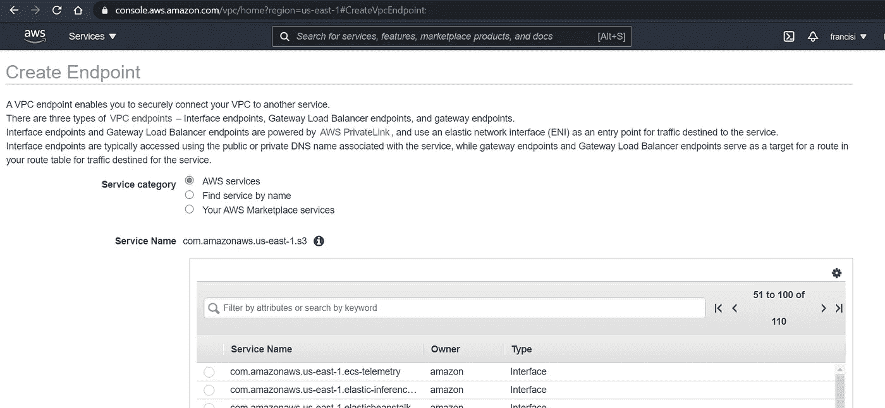
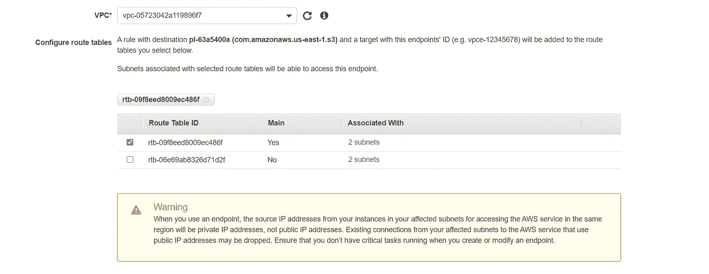
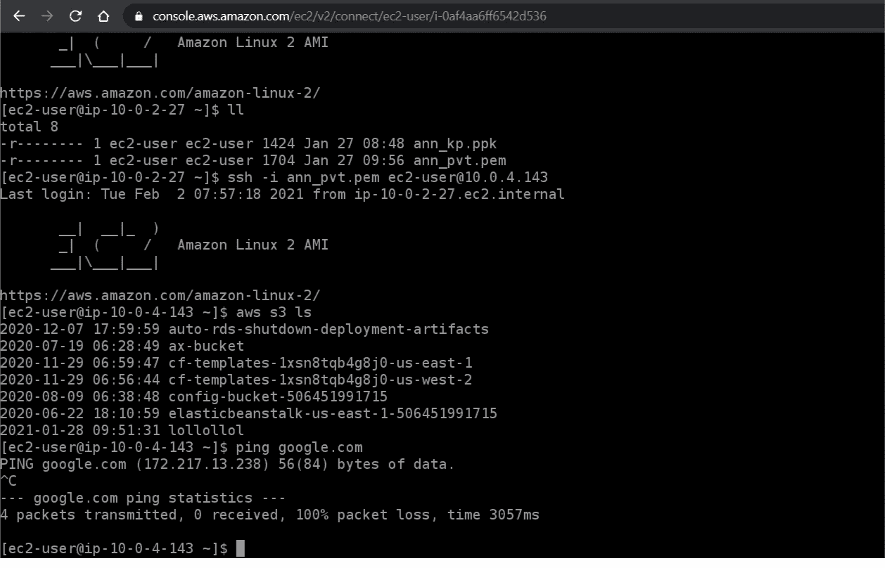

# 了解 VPC 端点(AWS)

> 原文：<https://medium.com/nerd-for-tech/understanding-vpc-endpoint-in-aws-b182ff71a46a?source=collection_archive---------5----------------------->

大家好，

这是一个了解 VPC 端点的简单动手任务。

因此，让我们从 VPC 终点的必要性以及它到底是什么开始。

VPC 端点是一个 AWS 资源，帮助我们访问公共资源，如 S3，dynamoDB 等。安全地通过 AWS 网络，而不是通过互联网。说到为什么我们会需要它，AWS 中可能有一些资源没有暴露在互联网上；就像私有子网中的 EC2 实例，而无需访问互联网。在这种情况下，获取公共资源是不可能的。就这样诞生了‘VPC 端点’！！！=)

现在我们知道了什么是 VPC 终点，让我们快速开始动手实践活动。

请设置带有公共和私有子网的 VPC，并在两者中启动 EC2 实例。您可以参考本实验来了解创建 https://amazon.qwiklabs.com/focuses/15788? VPC、子网、互联网网关和路由表的步骤 catalog _ rank = % 7B % 22 rank % 22% 3a 2% 2C % 22 num _ filters % 22% 3a 0% 2C % 22 has _ search % 22% 3a true % 7D&parent = catalog&search _ id = 8612122

我们的设置应该是这样的

现在，将一个 IAM 角色附加到两个 EC2 实例，该角色授予对 S3 的只读访问权限

SSH 到公共 EC2，观察我们能够访问 s3:

它为公众 EC2 工作。现在，让我们从公共 EC2 ssh 到私有 EC2，并再次尝试访问 S3。

如上所述，google.com 和 S3(互联网)都无法访问

让我们创建一个 VPC 端点

选择您的 VPC 和专用子网

现在，让我们尝试从私有子网中的 EC2 实例访问 s3

注意，我们能够列出 s3 存储桶，但不能 ping 通 google.com

这是因为现在我们可以通过 VPC 端点到达 S3 端点。

然而我们还没有定义任何到互联网的路由。

就这样伙计们！VPC 端点上的简单练习！:)

希望你喜欢。