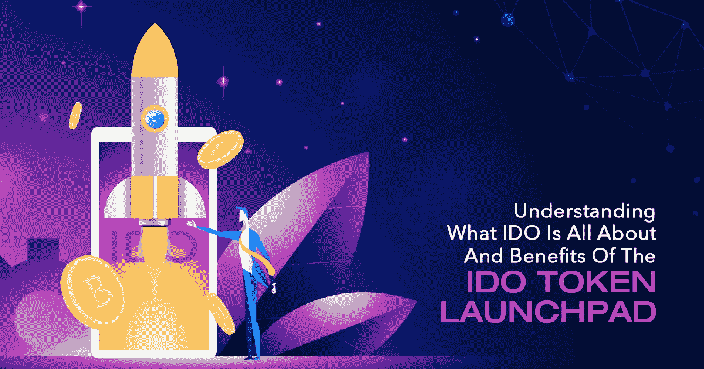

# 了解 IDO 是什么以及 IDO 令牌启动板的好处

> 原文：<https://medium.com/nerd-for-tech/understanding-what-ido-is-all-about-and-benefits-of-ido-token-launchpad-da58bb47b1a7?source=collection_archive---------3----------------------->

不出所料，IDO token launchpad 正受到更多人的关注。通过这种方式，个人将能够在吸引大量投资者的注意力后，为他们基于密码的项目筹集资金。随着一个新项目的出现，对这种基于去中心化的筹款平台产生了如此巨大的热潮和需求。你是那个打算利用当前的狂热的人吗？在此之前，先了解一下初始 Dex 产品(IDO)是什么，以及它与初始 Coin 产品(ICO)、初始 Exchange 产品(IEO)、安全令牌产品(STO)的比较，以及如何开始开发 IDO launchpad。

IDO 发射台

# **首次公开发行股票(I do)——简介**

首次公开募股(简称 IDO)似乎是最新的筹资活动，克服了 IEO、ICO 和 STO 等后继筹资方法的缺点。融资可以在平台上进行 IDO launchpad。它是一个连接项目持有人和投资人的去中心化阶段，为众筹做铺垫。它也被称为项目持有人或初创公司，或者企业家将能够从感兴趣的投资者那里为他们的加密相关项目筹集资金。

# **I do 令牌发射台工作流程**

在简单介绍了什么是初始 Dex 产品(IDO)之后，现在让我们看看 [**IDO 令牌发射台**](https://www.inoru.com/dao-maker-clone) 将如何工作。

开始阶段是项目持有人必须让他们的项目在 IDO launchpad 上列出。为此，他们必须提交有关项目的必要细节，然后由指定的团队审查和验证真实性。

获得批准后，将列出代表该项目的 IDO 令牌。另一方面，投资者将能够找到过多的项目，并了解项目的内容。通过这种方式，他们可以决定是否通过购买项目上列出的代币来投资。

列入白名单的投资者有机会参与融资并获得代币。此后，投资者可以在分散的交易所交易代币，这提供了无缝的交易体验。此外，通过点对点系统，交易将以分散的方式进行，即没有第三方或中介的参与。

项目的保证和真实性使 IDO launchpad 更值得选择。通过这种方式，投资者会期望获得更好的投资回报。

# **ICO vs IEO vs STO vs IDO**

## **初始硬币发行(ICO)**

ICO 是首次发行硬币的简称，是一种集资类型。在这个过程中，个人或公司/创业公司将能够提出他们的区块链或密码相关的项目。此外，投资者可以购买代币来换取比特币、以太坊等加密货币。作为先驱，它为 IEO、STO 和 IDO 等其他筹款活动打开了大门。它的性质是分散的，因为没有中介。

## **首次公开募股(IEO)**

IEO 是首次公开募股(Initial Exchange Offering)的首字母缩写，这是一个集中的平台，新项目可以在其中有机会筹集资金。这个发射台包括交换费和相当昂贵的上市。IEO 代币有即时交易等额外好处，更有可能的是，不会有欺诈项目在平台上上市，从而确保投资者的信任。

## **证券代币发售(STO)**

安全代币发行是一种通过交换加密货币来筹集资金的方法。这种筹资方式比首次发行硬币(ICO)安全得多。它是专为消除欺诈活动而设计的，因为筹款平台上不会列出垃圾项目。

## **首次直接投资股票发行(IDO)**

如前所述，初始 Dex 发行(IDOs)是一个分散的筹资平台，没有交易费用。这个平台可以授权项目所有者列出高质量的项目，从而投资者将购买代币。这个平台非常适合 DeFi 项目。

 [## DAO Maker 克隆| DAO Maker Like Launchpad 开发

### 重新创建道制造商克隆和吸引更多的增值投资者的加密项目与许多项目制作…

www.inoru.com](https://www.inoru.com/dao-maker-clone) 

# **I do 令牌发射台的优势**

## **Swift 交易**

一旦 IDO 令牌启用，投资者将能够立即进行交易。除此之外，投资者将能够以更低的价格购买大量代币。此后，他们可以以更高的价格出售这些代币。

## **即时流动性**

IDO token launchpad 需要通过流动性池获得即时流动性。新项目的 IDO 令牌能够与分散式交易所(DEX)认可的任何类型的替代硬币配对。这最终会在相当大的程度上飙升代币价值。

## **可信度**

为了在分散筹资平台上启动项目，应提交项目供批准。从今以后，只有可行和合法的项目将被列在启动台上。

## **公平筹款方式**

IDO launchpad 上的融资方式似乎很公平。在这种情况下，投资者将能够以更低的价格购买 IDO 代币，然后随着代币价值的提高，他们可以以更高的价格出售这些代币。这将在代币公开销售时执行，让任何人都有机会购买代币。这很可能依赖于他们购买代币的时间，他们有机会以可能更高的价格出售这些代币。

# **点睛之笔**

在这篇博客中，我们简要介绍了首次公开募股(Dex)和筹款平台的功能，以及开发 IDO token launchpad 的好处。

您打算部署 IDO launchpad 吗？迈出你的第一步！找到一个合适的，从市场上最好的 [**IDO 平台开发公司**](https://www.inoru.com/) 或代理处获得开发的发射台。奋进！