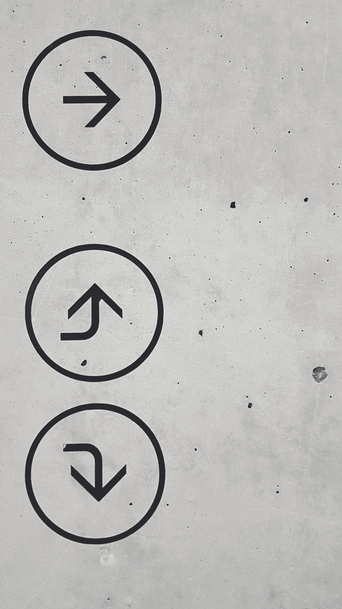
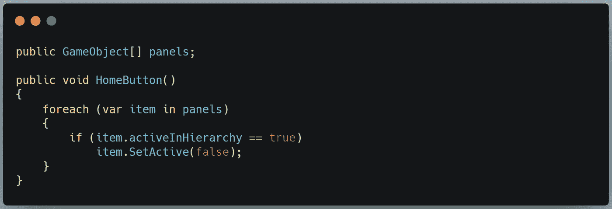
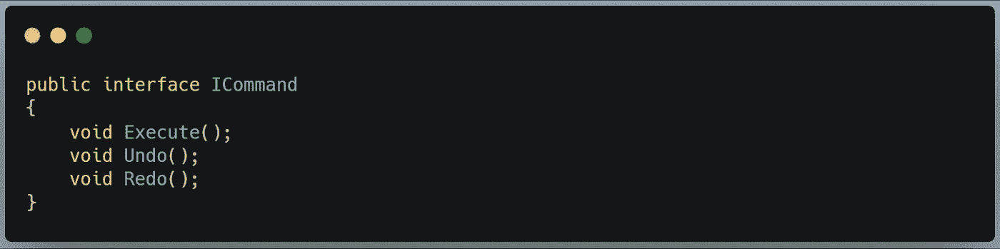
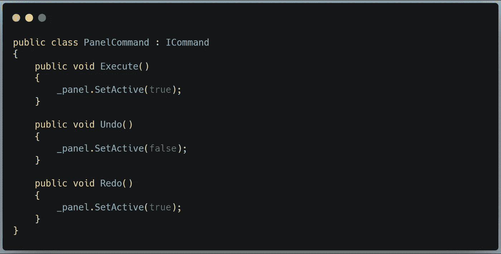
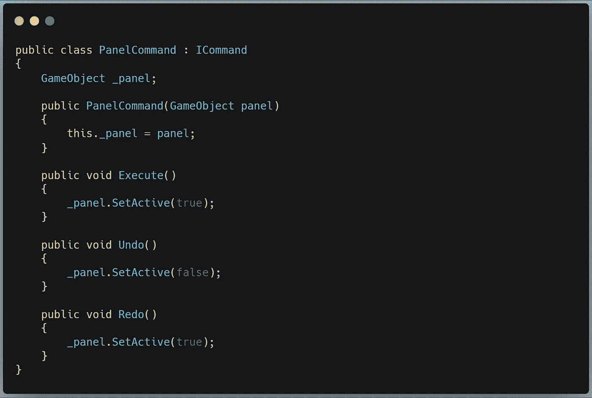
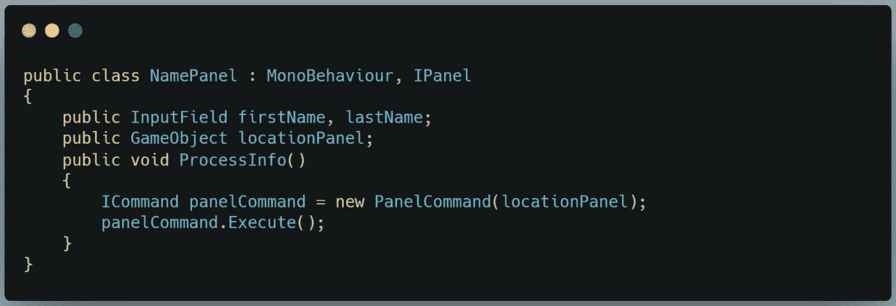
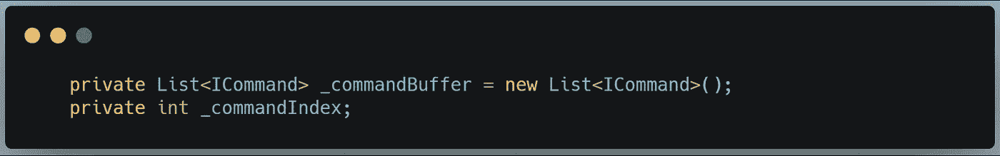
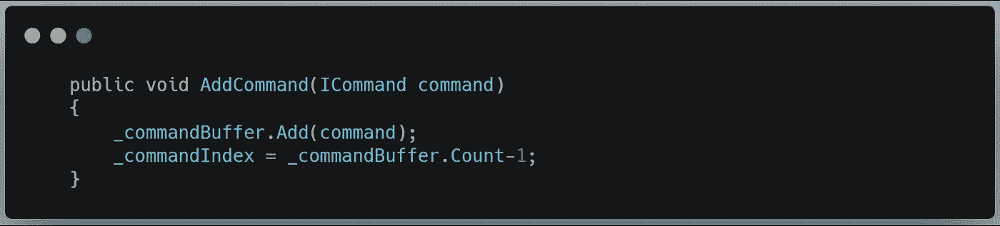
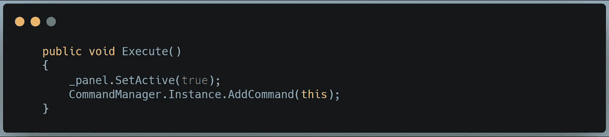
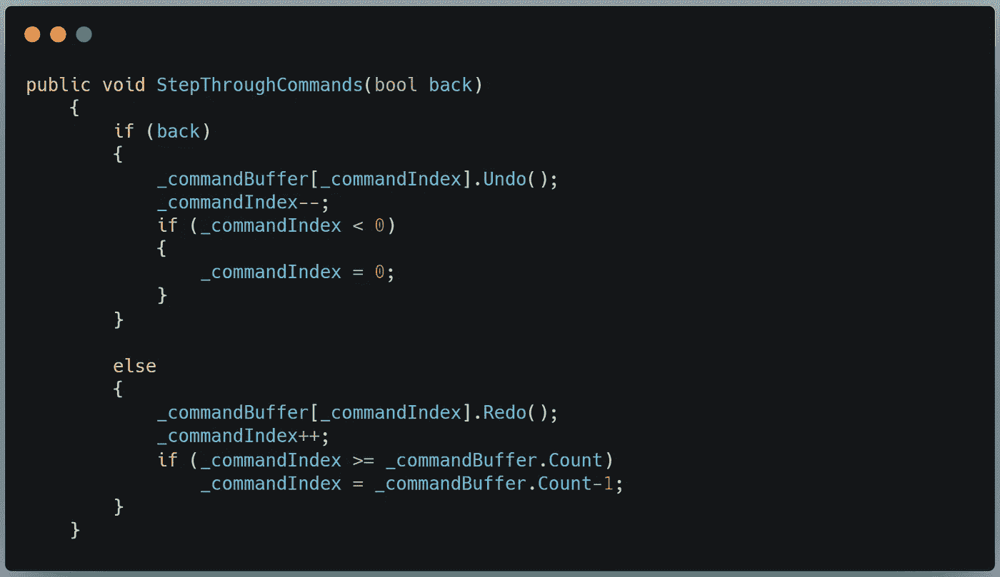

# 使用 Unity & C#中的命令模式撤消和重做

> 原文：<https://medium.com/nerd-for-tech/undo-redo-with-the-command-pattern-in-unity-c-d3b63beab7a4?source=collection_archive---------1----------------------->

## 掌控你的应用流程

执行、撤消、重做

我的移动保险索赔应用程序原型的最后一部分是让这个东西工作:

家很简单。我只需要关闭所有打开的 UI 面板。在它下面，所有的主菜单都在那里，等着被看到。我可以创建一个 UI 面板游戏对象的数组，并为每个循环使用一个*遍历可见面板，关闭每个面板。*

完成了。

更棘手的部分是这两个前进和后退按钮。这些按钮在它们自己的面板上，所以我不必把它们复制到每个面板上。如果我想在命令之间来回切换，我需要为上一个、当前和下一个面板保存一个变量。我还需要每个按钮以某种方式访问这三个变量。这开始看起来像一个庞大、混乱、易变的全球国家，我们绝对不希望这样。如果我以后需要添加功能，包括可能需要撤销的其他类型的命令，那么我就不容易为两者使用同一个系统。

我们需要的是一种方法来一般性地识别命令何时发出，一种方法来跟踪所有命令而不管它们的来源，以及一种方法来保存命令的内容并随意重放或反转它。

为此，我们转向命令模式。

注意-顺！

> 将请求封装为对象，从而使用户可以用不同的请求参数化客户端，对请求进行排队或记录，并支持可撤销的操作
> 
> - ***设计模式:可复用的面向对象软件元素***

这个相当密集的引用的要点是，我们增加了一个抽象层次，允许我们将命令的执行视为对象。所以我们可以把它们放在列表中，延迟它们的执行，通过函数传递它们，等等……如果你还不清楚这有多有用，请耐心听我说:在下面的例子中，一切都会变得有意义。

## 定义命令

第一步是定义一个命令。我们通过一个接口来实现。该接口有三种方法:执行、撤消和重做。

现在，任何实现这个接口的类都可以发出命令。让我们把一个用于隐藏和显示面板的组件放在一起，叫做 PanelCommand。

所以，这里我们遇到了一个小问题。我需要我的命令来知道关闭哪个面板。我不能把它作为 Execute()方法的一个参数包含进来——Execute()接口不接受参数。将它添加到界面上会破坏我们试图完成的抽象。我们需要所有的命令来执行相同的方法，不管我们需要什么参数。

我们可以通过向 PanelCommand 类添加一个**构造函数**来解决这个问题:

现在，当一个面板创建 PanelCommand 的实例时，他们必须传入一个面板游戏对象。我们将它存储在一个全局变量中，现在我们的方法可以访问它们应该操作的面板。

我们可以看到，在 NamePanel 类中:

我们创建一个 PanelCommand 的新实例，存储在一个数据类型为 ICommand 的变量中。在这个过程中，我们传递了按钮想要影响的面板游戏对象。(我们可以在这里用**动作**添加另一个抽象层，这样下一个面板可以监听一个调用并发送它自己的面板信息——这将是一个很好的封装，但是它超出了命令模式的范围。)一旦创建了实例，我们就执行 execute()方法。

我可以用这种方式创建任意数量的命令，每个命令都有自己的构造函数和执行/撤消/重做方法。

现在，这是令人兴奋的，但我们所做的只是用显示下一个面板的间接调用来替换显示下一个面板的直接调用。我们这样做到底是为了什么？

## 命令管理器

要是所有的管理课程都这么帅气就好了。*叹息*

还记得我们说过，我们把这些方法调用变成了一个对象吗？我们可以对这些对象做的一件事是将它们添加到一个**列表中**。如果我们有一个方法调用的列表，那么我们就可以完全按照第一次执行的方式重复(或者废除)这些调用。

我们首先声明一个 ICommand 类型的新列表。我们还将创建一个索引变量，这样我们就知道在任意时刻我们在列表中的位置。

现在我们将添加一个方法来将命令添加到列表中。我们将请求一个 ICommand 参数随调用一起传递:

如您所见，我们将命令索引设置为每当列表改变时重新计算。

我们还需要更改 PanelCommand 类的 Execute()方法来调用 AddCommand(ICommand 命令)方法:

我的经理是单身。如果这不是你的包，解决它是非常简单的。

最后，我们来到撤销和重做。现在，我们的 Execute()方法正在填充命令列表，我们可以创建一个方法，根据按下的按钮向前或向后遍历命令。

因此，如果“back”bool 为真，那么我们已经按下了 back 按钮。我们对命令的当前索引实例调用 Undo，然后将命令索引向后移动一位。然后我们确保指数没有变成负数(那会引发一个异常)。我们结束了。正确的命令已被撤消，索引被移动到列表上的前一个存储实例。

同样，如果“back”bool 为 false，那么我们已经按下了前进按钮。我们在命令的当前索引实例上调用 Redo，然后将命令索引上移一位。然后我们确保索引没有超过列表的总计数(那会引发一个异常)。我们结束了。已经重做了正确的命令，并将索引移动到列表中的下一个存储实例。

让我们看一个 gif 是怎么做的:

太棒了。

这就是今天的全部内容，也是这个项目的最后一个功能！明天我们开始下一次冒险时再来报到——谁知道我会干些什么？