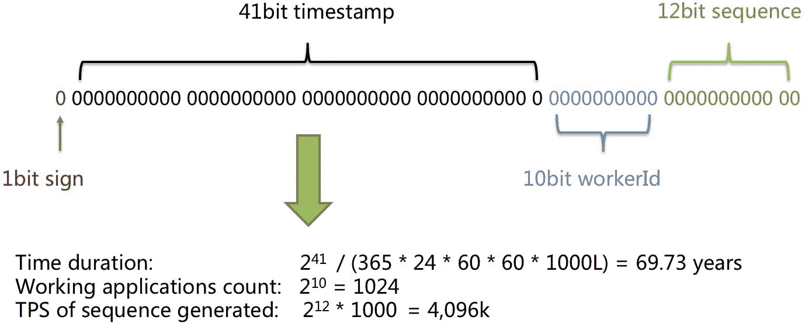

# 分布式系统中唯一 Id 的生成

> 原文：<https://medium.com/nerd-for-tech/unique-id-generation-in-distributed-systems-6f7aaa39c9af?source=collection_archive---------0----------------------->


最近在工作中，我们一直在寻找一种方法来生成跨分布式系统的惟一 id，该 id 还可以用作 MySQL 表中的主键。

我们知道，在单个 MySQL 数据库中，我们可以简单地使用一个自动递增的 ID 作为主键，但这在分片的 MySQL 数据库中不起作用。

因此，我查看了各种现有的解决方案，最终了解到了 [Twitter 雪花](https://blog.twitter.com/engineering/en_us/a/2010/announcing-snowflake.html)——一个简单的 64 位唯一 ID 生成器。

# 你为什么不用 UUID？🤔

UUIDs 是全球唯一的 128 位十六进制数字。同一个 UUID 产生两次的可能性微乎其微。

UUIDs 的问题是它们的尺寸非常大，而且索引不好。当数据集增加时，索引大小也会增加，查询性能会降低。

UUIDs 的另一个问题与用户体验有关。最终，我们的用户将需要唯一的标识符。假设一个客户打电话给客户服务，被要求提供标识符。拼写一个完整的 UUID 不是一件愉快的经历。

# 推特雪花❄

Twitter snowflake 是一个专用服务，用于为 Twitter 中的对象(如 Tweets、直接消息、列表等)生成分布式计算中使用的 64 位唯一标识符。

这些 id 是唯一的 64 位无符号整数，基于时间。完整的 IDs 由以下组件组成:

*   以毫秒为单位的纪元时间戳— 41 位(相对于任何自定义的纪元，我们得到 69 年)
*   已配置的机器/节点/碎片 Id — 10 位(总共最多可提供 1024 个 2^10 id)
*   序列号— 12 位(每台机器的本地计数器，每 4096 个值后设置为零)
*   在开始时额外保留的 1 位被设置为 0，以使总数为正。



由于这些使用时间戳作为第一部分，因此，**它们也是时间可排序的**。另一个好处是其**高可用性**。

默认情况下，64 位无符号整数(long)将生成长度为 19 的 Id，但有时它可能太长，我们的用例需要长度不大于 10 的 Id。

本文将分享惟一 ID 生成器的一个简化版本，它将基于 Twitter 雪花服务中概述的概念，适用于在分布式环境中生成惟一 ID 的任何用例。

# 编码时间⌚

在我们的例子中，完整的 ID 将由 20 位时间戳、5 位工人号和 6 位序列号组成。

剩余的 1 位是带符号位，它总是设置为 0，以使最终值为正。

我们的微服务可以使用这个随机数生成器独立生成 id。这是有效的，并且适合于`int`的大小(4 字节或 32 位)。

下面是完整的 Java 代码( [*受 Twitter 雪花*](https://github.com/twitter/snowflake/tree/snowflake-2010) *，* [*代码演职员表*](https://github.com/callicoder/java-snowflake))—

**步骤 1 —我们初始化每个组件需要的位数**:

```
public class Snowflake {

    // Sign bit, Unused (always set to 0)
    private static final int UNUSED_BITS = 1; 

    private static final int EPOCH_BITS = 20;
    private static final int NODE_ID_BITS = 5;
    private static final int SEQUENCE_BITS = 6;

    private static final int maxNodeId = (int)(Math.pow(2, NODE_ID_BITS) - 1);
    private static final int maxSequence = (int)(Math.pow(2, SEQUENCE_BITS) - 1);

    // Custom Epoch (Fri, 21 May 2021 03:00:20 GMT)
    private static final int DEFAULT_CUSTOM_EPOCH = 1621566020;

    private volatile int lastTimestamp = -1;
    private volatile int sequence = 0;

    // Class Constructor
    public Snowflake() {
        this.nodeId = createNodeId();
        this.customEpoch = DEFAULT_CUSTOM_EPOCH;
    }
```

> *在这里，我们采用的是 Fri 时间，即 2021 年 5 月 21 日 03:00:20 GMT。*

`EPOCH_BITS`将是 20 位，并填充以秒为单位的当前时间戳(如果每秒可能有多个请求，也可以使用毫秒)。

`NODE_ID_BITS`为 5 位，使用 Mac 地址填充。

`SEQUENCE_BITS`为 6 位，将作为本地计数器，从 0 开始，一直到 63，然后重置回 0。

**第二步—创建一个** `**synchronized**` **函数来生成 id**:

```
public synchronized int nextId() {
    int currentTimestamp = (int) (Instant.now().getEpochSecond() -    customEpoch);

    if(currentTimestamp < lastTimestamp) {
      throw new IllegalStateException("Invalid System Clock!");
    }

    lastTimestamp = currentTimestamp;

    return currentTimestamp << (NODE_ID_BITS + SEQUENCE_BITS) | (nodeId << SEQUENCE_BITS) | sequence++;}
```

## 等等，我们为什么要做这些`Left Shifts` & `Logical OR`的操作？

这是因为整数由 32 位表示，并且最初都被设置为 0。为了填充这些位，我们必须分别获取每个分量，因此首先我们获取纪元时间戳，并将其移动到 5 + 6，即向左移动 11 位。这样做已经用第一个分量填充了前 21 位(记住第一位总是被设置为零以使总数为正)。剩余的 11 位仍然是 0，因此我们再次用逻辑或&另外两个部分重复同样的事情，从而填充所有的 32 位并形成完整的数。

**步骤 3 —使用系统的 MAC 地址生成节点 id 的实用函数**:

```
private int createNodeId() {
    int nodeId;
    try {
            StringBuilder sb = new StringBuilder();
            Enumeration<NetworkInterface> networkInterfaces = NetworkInterface.getNetworkInterfaces();

       while (networkInterfaces.hasMoreElements()) {
                NetworkInterface networkInterface = networkInterfaces.nextElement(); byte[] mac = networkInterface.getHardwareAddress();
                if (Objects.nonNull(mac))
                    for(byte macPort: mac)
                        sb.append(String.format("%02X", macPort));
            }
            nodeId = sb.toString().hashCode();
        } catch (Exception ex) {
            nodeId = (new SecureRandom().nextInt());
        }
        nodeId = nodeId & maxNodeId;
        return nodeId;
    }
}
```

# 它是如何工作的？💡

现在让我们通过一个例子来理解它的工作原理

假设现在是 2021 年 5 月 23 日星期日 00:00:00 GMT。这个特定时间的纪元时间戳是 1621728000。

首先，我们根据自定义纪元调整我们的时间戳-

current timestamp = 1621728000-1621566020 = 161980(根据自定义纪元进行调整)

因此，为了开始我们的 ID，ID 的前 20 位(在带符号的位之后)将用纪元时间戳填充。让我们将这个值左移:

`id = currentTimestamp << (NODE_ID_BITS + SEQUENCE_BITS )`

接下来，我们获取已配置的节点 ID/碎片 ID，并用它填充接下来的 10 位

`id = id | nodeId << SEQUENCE_BITS`

最后，我们取自动递增序列的下一个值，并填写剩余的 6 位

`id = id | sequence // 6149376`

这给了我们最后的身份🎉

就是这样！在我们的应用程序中唯一的主键！

# 摘要📊

本文向您展示了如何生成长度> =7 和<=10.

By the way, you can adjust the bit count of the 3 components to adapt to your work.

> *的雪花 id 的简单解决方案。注意:我们应该将生成器保持为单例，这意味着我们应该只为每个节点创建 SequenceGenerator 的单个实例。否则，它可能会生成一些重复的 id。*

不仅推特使用了它， **Discord** 也使用了雪花，它们的纪元设定为 2015 年的第一秒。

**Instagram** 使用了该格式的修改版本，41 位为时间戳，13 位为碎片 ID，10 位为序列号。

希望这对你有帮助！感谢阅读:)

# **从 Web 开发开始？**

查看 [**HTML 反应:终极指南**](https://gumroad.com/a/316675187)

这本电子书是一个全面的学习指南，通过大量易于理解的例子和经过验证的路线图，它将教你**成为一个自信的 web 开发者所需要知道的一切**

有了这个链接，就可以打**六折。**

[](https://gumroad.com/a/316675187)

HTML 反应:完整的网络开发电子书

*(原载于*[*apoorvtyagi . tech*](https://apoorvtyagi.tech/generating-unique-ids-in-a-large-scale-distributed-environment)*)*