# IntelliJ Maven 项目中 JUnit5 的单元测试[测试文章系列第 9 部分中的软件开发工程师]

> 原文：<https://medium.com/nerd-for-tech/unit-testing-with-junit5-in-intellij-maven-project-software-development-engineer-in-test-article-65e044480be?source=collection_archive---------1----------------------->

到目前为止，我已经写了 8 篇关于软件测试结构的文章。第八篇文章是技术文章。你可以从 [**这里**](https://kicchi.medium.com/) 阅读之前的文章。

本文将为初学者处理 JUnit5 (Jupiter)。本文没有讨论 JUnit 的更多特性。所以你可以从这篇文章开始，然后在网上搜索。

我假设读者知道用 java 编码，并且熟悉 IntelliJ IDE。

技术先决条件:

*   必须安装 IntelliJ IDE。
*   必须安装 JDK。(至少 Java 11 必不可少)

> **什么是 JUnit？**

JUnit 是一个流行的 Java 单元测试框架。

> 什么是单元测试？

单元测试是软件测试的一种。在单元测试中，从它的名字就可以理解，测试源代码的单元，如方法、类、组件。

> 谁执行单元测试？

大多是开发商。因为，你必须能够接触到开发人员编写的实际源代码。但是，在某些情况下，SDETs(测试中的软件开发工程师)也可以执行单元测试。

> **为什么选择 Junit？有什么测试工具可以对 Java 代码进行单元测试吗？**

是的，有。我们也有针对 Java 单元测试的 TestNG。实际上，TestNG 比 Junit 拥有更多的选择。我们以后再谈。由于主要逻辑是相同的，我将首先处理 JUnit。多了解一个测试工具也无妨。

> **我们将使用哪个版本的 Junit？**

我们将使用 Junit5，换句话说就是 Junit Jupiter。它拥有超越 Junit4 的新特性。

> **如何使用 JUnit？**

首先，我们将在 IntelliJ 中创建一个 Maven 项目。重要的是你必须在 Junit5 上使用 Java 11。让我们按照步骤进行:

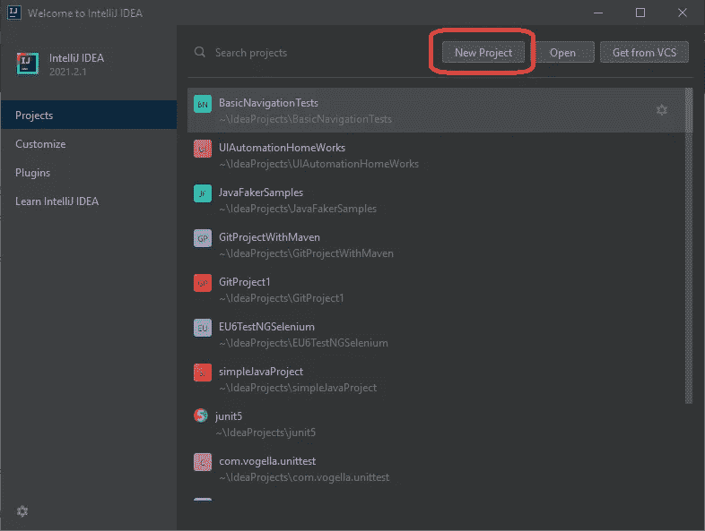

打开 IntelliJ >单击新建项目

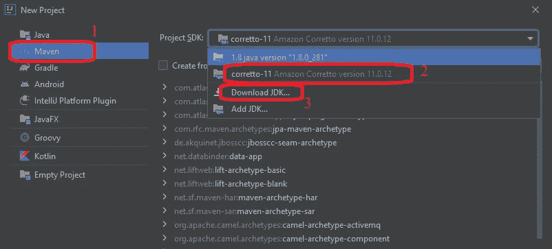

1.  选择 Maven 作为项目类型
2.  你必须有 Java 11
3.  如果您没有 Java 11，请从这里下载并再次执行这一步。

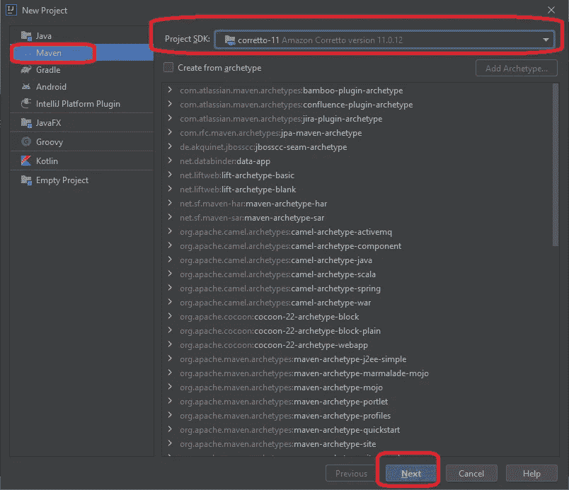

选择 Maven 和 Java 11 作为 SDK >点击下一步

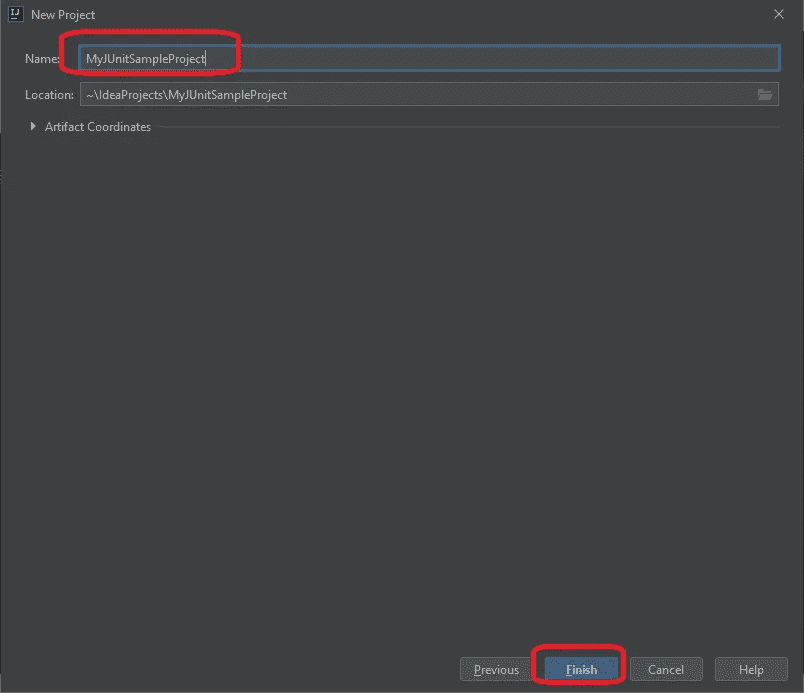

命名您的项目，然后单击 finish

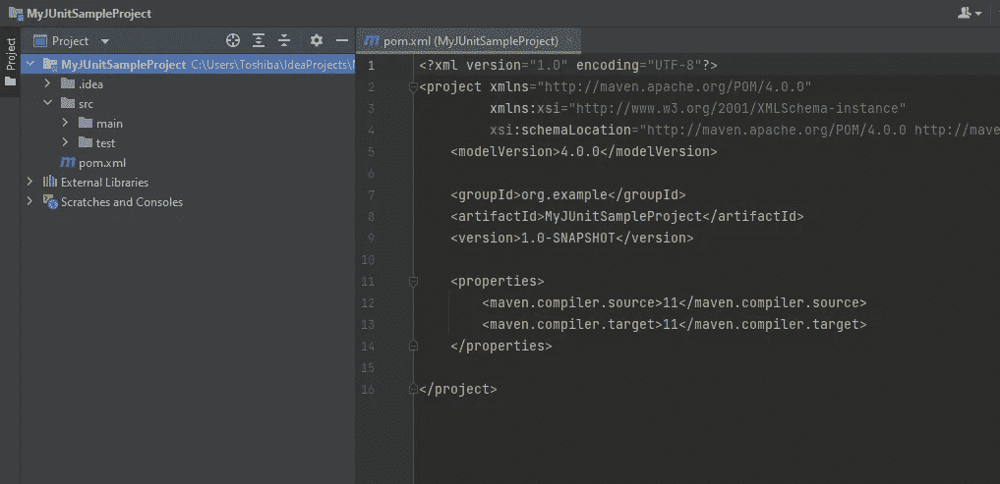

默认项目视图和 pom.xml 文件内容

现在我们将添加我们的 JUnit 依赖项。第一个是 JUnit API，另一个是 JUnit 引擎。所以打开你的网络浏览器，进入[www.mvnrepository.com](http://www.mvnrepository.com)，如下图所示:

mvn 仓库主页

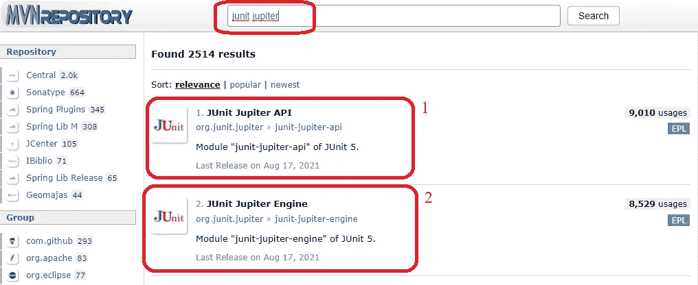

搜索“朱尼特木星”

我们现在将选择第一个。一旦我们添加了它，然后我们将返回到这个页面，并选择第二个。现在点击第一个:

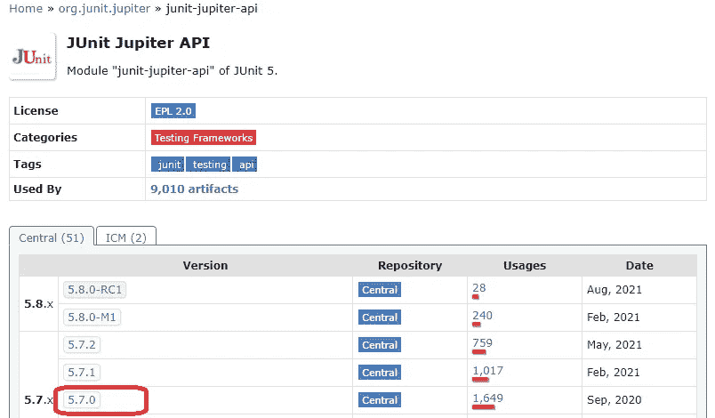

选择 5.7.0

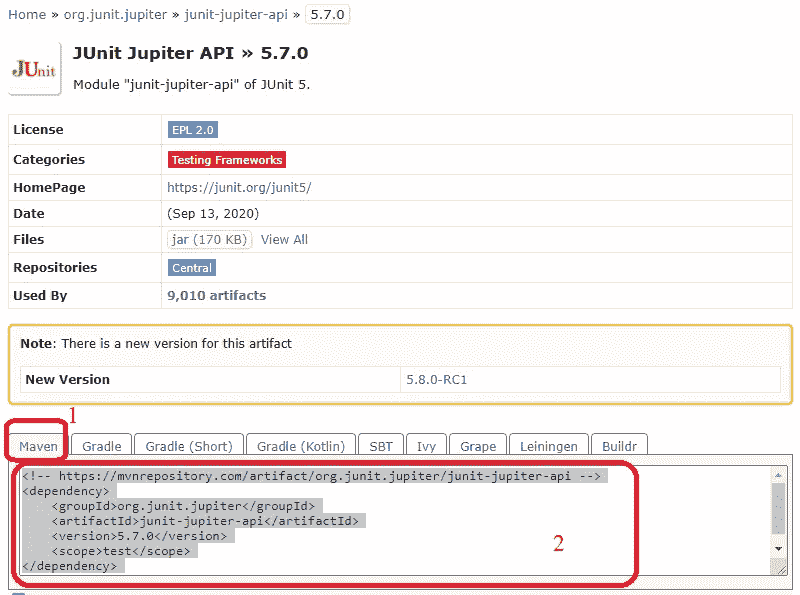

(1)选择 Maven ,( 2)在框内单击，它将复制内容

一旦你点击它会自动复制内容，如果没有，手动复制框内内容。

现在，我们将把复制的内容添加到 pom.xml 文件中。但是首先我们需要添加“dependencies”标签及其结束对，如下所示:

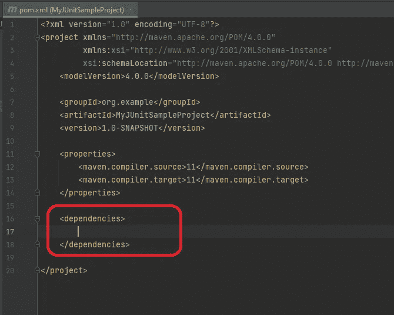

添加依赖标签

然后，我们可以将复制的内容粘贴到这些标签之间，如下所示:

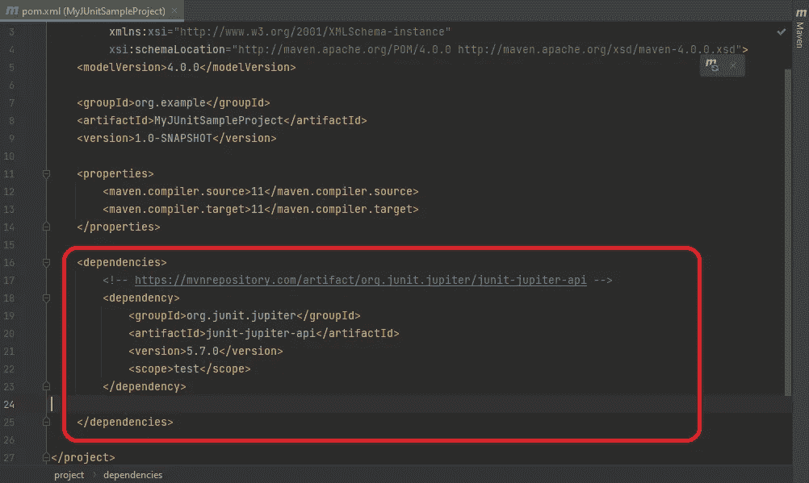

将内容粘贴到 dependencies 标签中

现在，返回两次以访问另一个 JUnit 依赖项(引擎)。到达如下所示的页面:

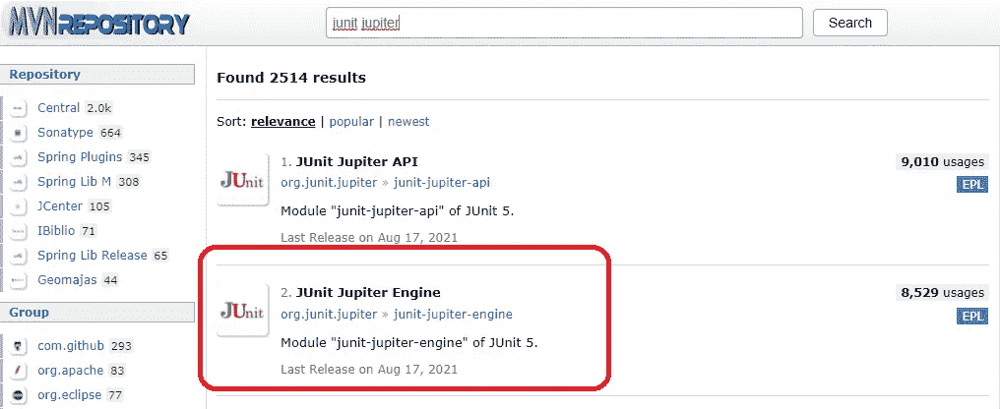

选择 JUnit Jupiter 引擎

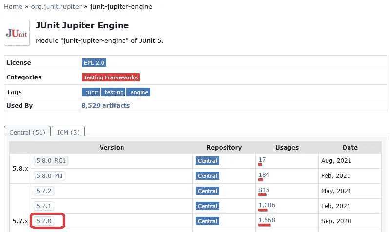

选择 5.7.0

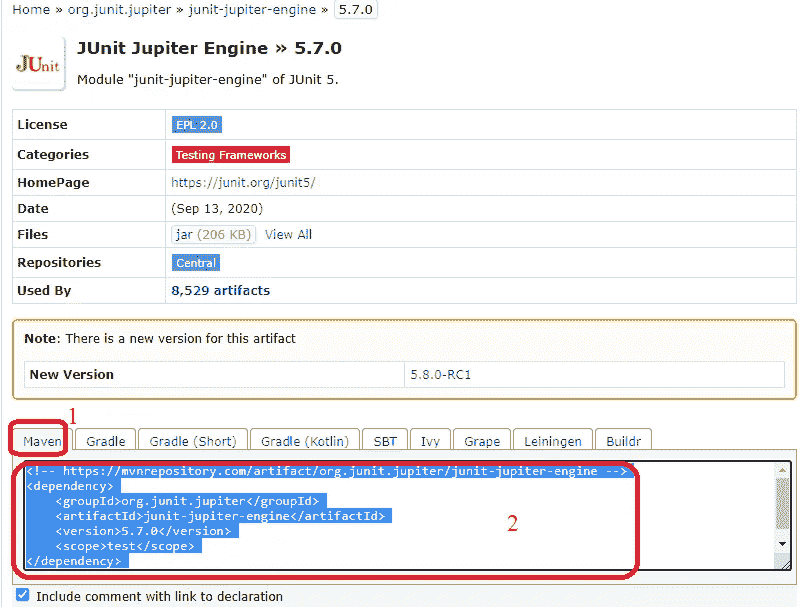

(1)选择 Maven ,( 2)单击框中的内容

一旦你点击它会自动复制内容，如果没有，手动复制框内内容。

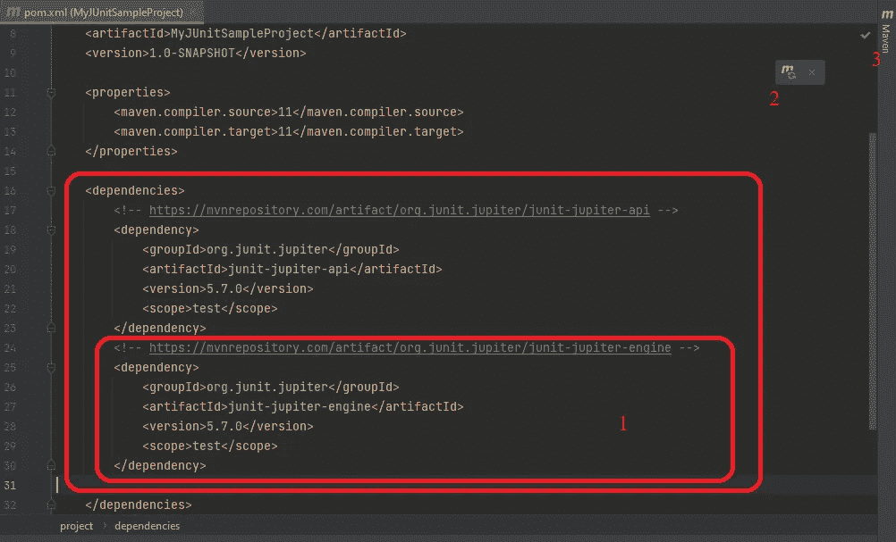

(1)将复制的内容粘贴在前一行的后面一行

现在，我们必须更新依赖项，以便 Maven 可以从 repo 中获取这两个包。我们可以点击刷新图标(2)，或者打开 Maven 侧窗口(3)并点击更新按钮。

刷新后，在最后，这个 pom.xml 文件里一定不能有红线，不能有错误。如果是，关闭它，如果不是，检查前面的步骤。

现在，我们将向 src/main/java 文件夹添加一个类，如下所示:

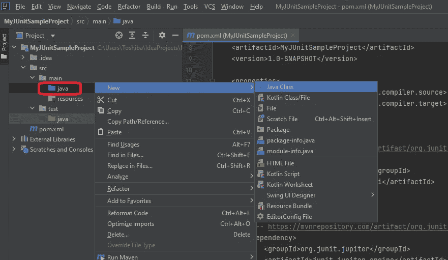

向 src/main/java 文件夹添加新类

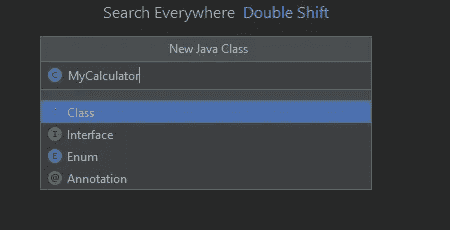

给你的班级命名

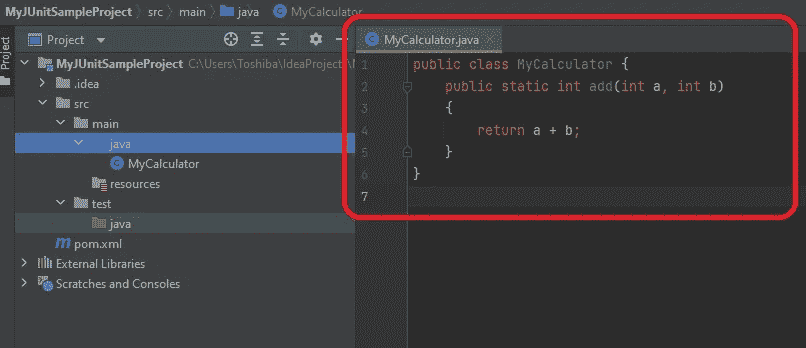

在该类中编写一个简单的 add 方法

现在，我们将添加一个测试类来测试这个方法。记住，单元测试只是单元的源代码测试。这个方法是我们程序的一个小单元。

我们将把测试类添加到 test/java 文件夹中，如下所示:

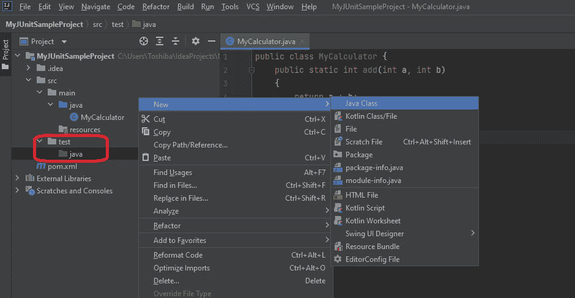

将测试类添加到 test/java 文件夹

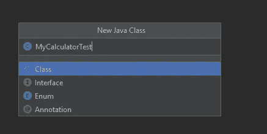

命名您的测试类

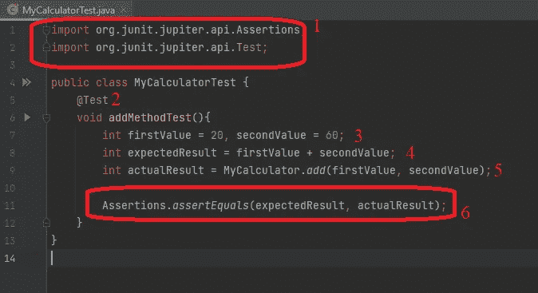

我们的第一个测试方法

1.  导入我们将使用的 Junit 包
2.  创建一个带有“@Test”注释的测试方法
3.  “MyCalculator”类中的“add”方法需要两个 int 参数。所以我们定义了两个 int 变量并初始化它们。
4.  因为我们通过比较预期和实际结果来定义测试结果(失败或通过)，所以我们计算预期结果。
5.  实际结果当然是 add 方法的结果。
6.  最后一步是比较预期结果和实际结果。JUnit“断言”类的“assertEquals”方法将执行这种比较。如果它们相等，测试将通过，否则测试将失败。

让我们通过单击方法名旁边的绿色箭头来运行这个测试，如下所示:

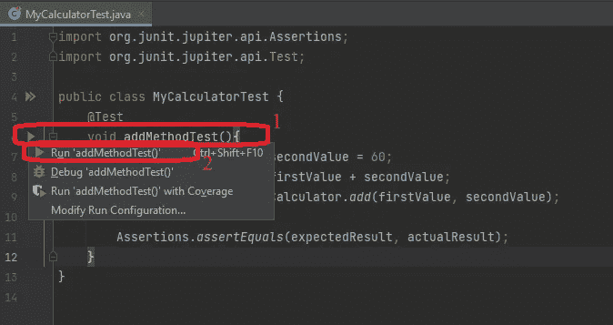

(1)单击绿色箭头，然后(2)单击第二个绿色箭头

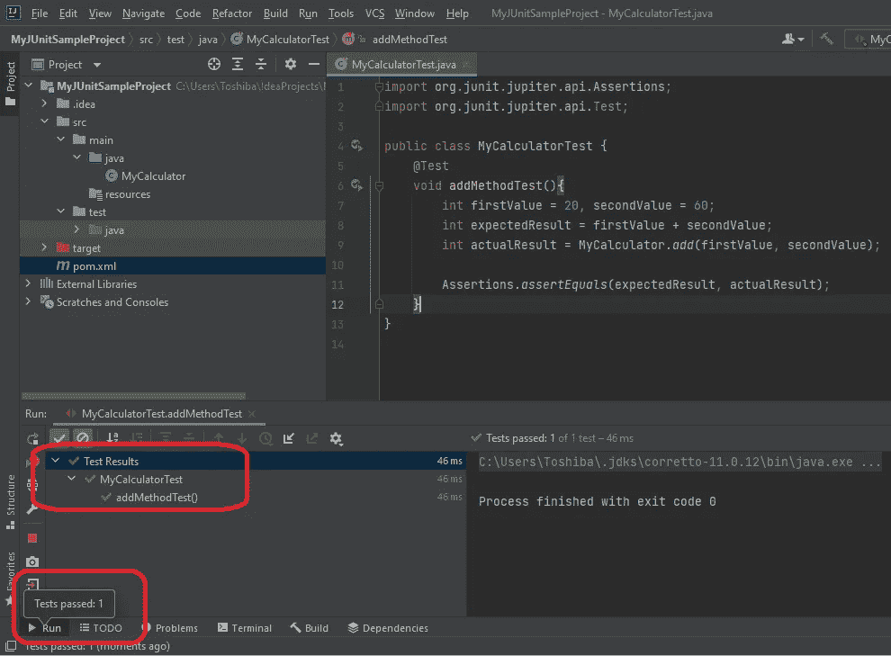

addMethodTest()的测试结果

正如我们所见，测试已经完成并通过。所以我们成功地运行了我们的第一个 JUnit 测试。

让我们做另一个练习:

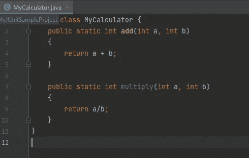

向 MyCalculator 类添加一个新方法

添加乘法测试方法

正如我们在前面的测试方法中所做的，我们定义了调用“multiply”方法时要使用的变量。此外，我们根据这些变量创建了一个预期结果。最后一步是比较预期和实际结果。我们用“断言相等”的方法来做。让我们运行这个测试，如上所示:

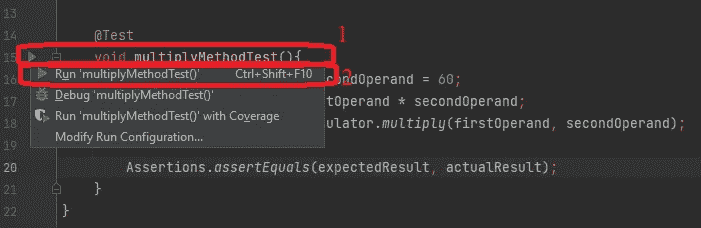

(1)单击绿色箭头，然后(2)单击第二个绿色箭头

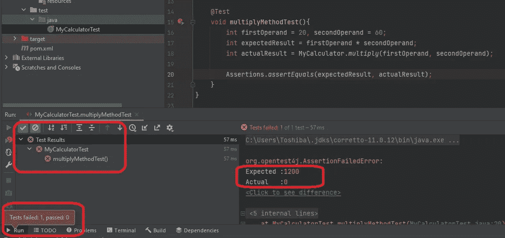

multiplyMethodTest()的测试结果

如我们所见，测试失败了。右侧窗口显示“预期”和“实际”结果。因为它们不相等，所以测试失败。

我们故意这样做是为了显示一次失败的测试。失败的原因是，参数在“乘法”方法中被分割，而不是相乘。

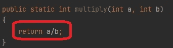

病菌

所以我们发现了这个漏洞。

让我们在不修改代码的情况下一起运行这两个测试。代码修正不是 SDET 的职责。它不能。在班级级别运行测试，如上所示:

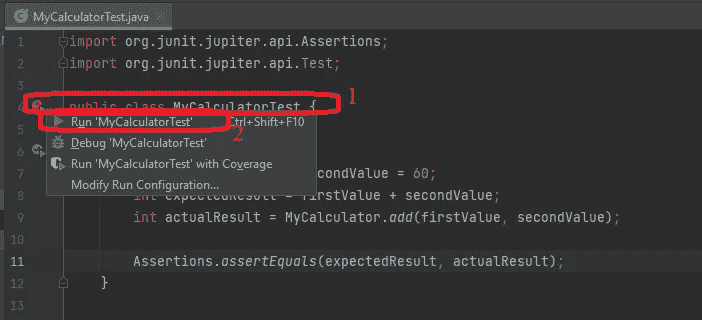

(1)单击绿色箭头，然后(2)单击第二个绿色箭头

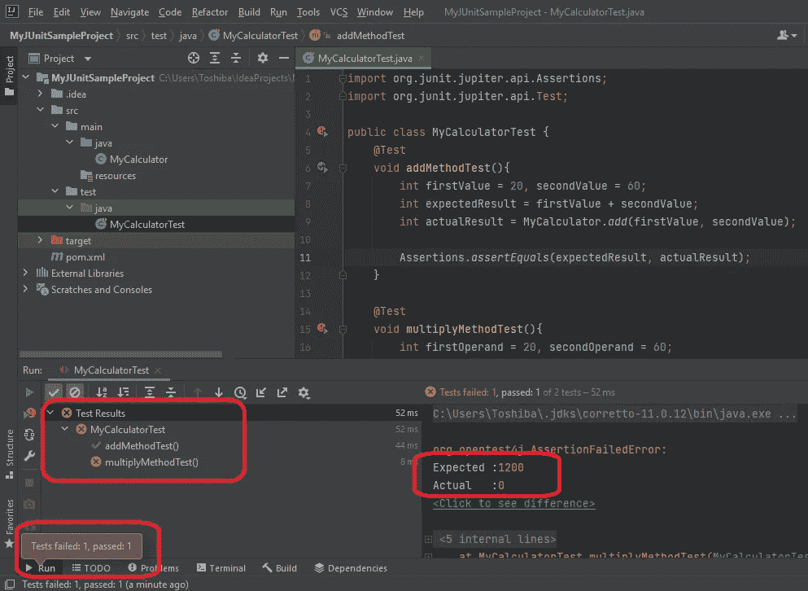

班级水平测试结果

如我们所见，“addMethodTest”通过了，但“multiplyMethodTest”失败了。我们还可以检查预期和实际的结果。

> 我印象深刻。它易于使用和理解。JUnit 还能做什么？

是的，实现 JUnit 非常容易。我将简单谈谈 JUnit 的一些特性。因为解释所有这些需要时间。也许我们可以在新的文章中讨论它们。

*   您可以定义一个在每个测试方法之前运行的方法(它用于准备变量和资源)
*   您可以定义一个在每个测试方法之后运行的方法(它用于释放资源)
*   您可以为您的方法定义一个“显示名称”,以便在控制台或报告中以可理解的方式书写它的名称。
*   您可以多次重复测试。
*   您可以使用不同的断言，如 assertEquals、assertTrue、assertFalse、assertNotNull、assertNull。
*   您可以测试异常是否被抛出。
*   您可以一起测试多个断言，而不需要为失败的断言停止测试。
*   您可以为您的测试定义超时。
*   您可以在不删除或注释测试代码的情况下禁用测试。
*   您可以编写动态和参数化的测试。
*   您可以定义不同的数据源。
*   您可以编写嵌套测试。
*   您可以轻松创建临时文件和路径。
*   您可以创建测试套件。
*   您可以更改测试方法的执行顺序。
*   您可以将 JUnit 用于 Gradle 和 Maven 项目。

我用 IntelliJ 解释了 JUnit 的用法，但是同样的结构也可以在可视代码和 Eclipse 中实现。

这就足够了。让我们在新的文章中相遇。