# IntelliJ Maven 项目中使用 TestNG 的单元测试[测试文章系列第 10 部分中的软件开发工程师]

> 原文：<https://medium.com/nerd-for-tech/unit-testing-with-testng-in-intellij-maven-project-software-development-engineer-in-test-article-7638fe524451?source=collection_archive---------3----------------------->

到目前为止，我已经写了 9 篇关于软件测试结构的文章。第八篇文章是技术文章。你可以从 [**这里**](https://kicchi.medium.com/) 阅读之前的文章。

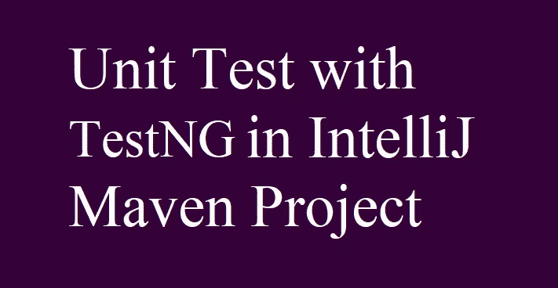

本文将为初学者处理 TestNG (NG 代表新一代)。本文没有讨论 TestNG 的更多特性。所以你可以从这篇文章开始，然后在网上搜索。

我假设读者知道用 java 编码，并且熟悉 IntelliJ IDE。

技术先决条件:

*   必须安装 IntelliJ IDE。
*   必须安装 JDK。

> **什么是 TestNG？**

TestNG 是一个受 JUnit 启发的测试框架(JUnit 在[上一篇文章](https://kicchi.medium.com/unit-testing-with-junit5-in-intellij-maven-project-software-development-engineer-in-test-article-65e044480be)中有解释)。

使用 TestNG，您可以执行单元测试、功能测试、端到端测试、集成测试等等。

您可以访问 [TestNG 网站](https://testng.org/doc/index.html)获取文档。

> **我们要做什么样的测试，为什么？**

我们将执行单元测试。单元可以是源代码的任何部分，如方法、类等。

然而，大多数软件开发人员执行单元测试，有时，SDETs 也可以执行这种测试。

> 在上一篇文章中，我们导入了 JUnit5 包以便能够使用它。我们会做同样的事情吗:导入 TestNG 库？

没错。首先，我们将在 IntelliJ 中创建一个 Maven 项目。让我们按照步骤进行:

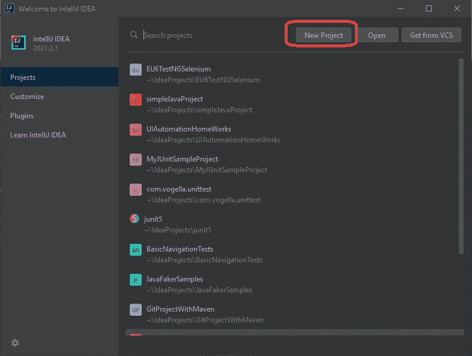

创建新项目

如果您已经有一个 Maven 项目，只需跳过项目创建步骤。您也可以将 TestNG 添加到您现有的项目中。

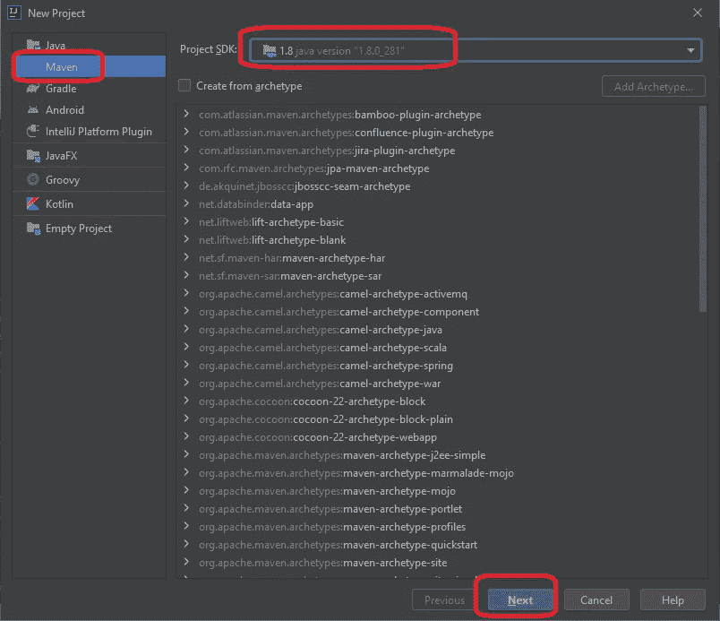

选择 Maven >选择 java 版本>单击下一步

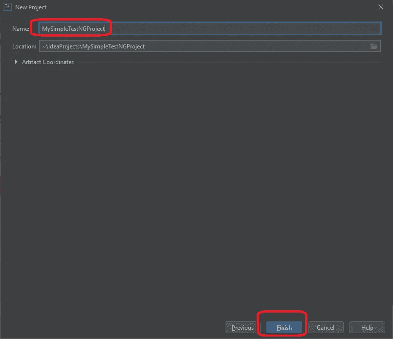

命名您的项目

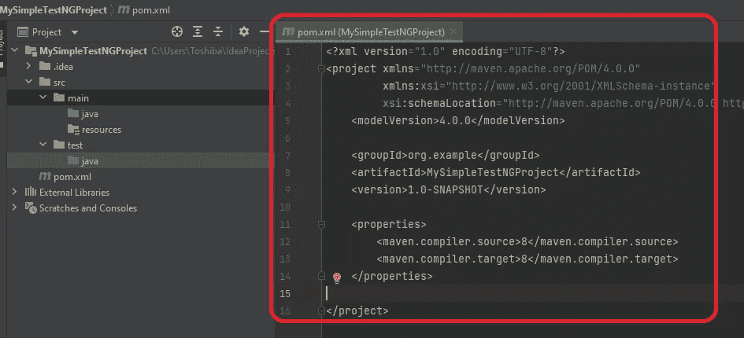

默认项目结构和 pom.xml 文件内容

通过您的互联网浏览器访问该回购网站

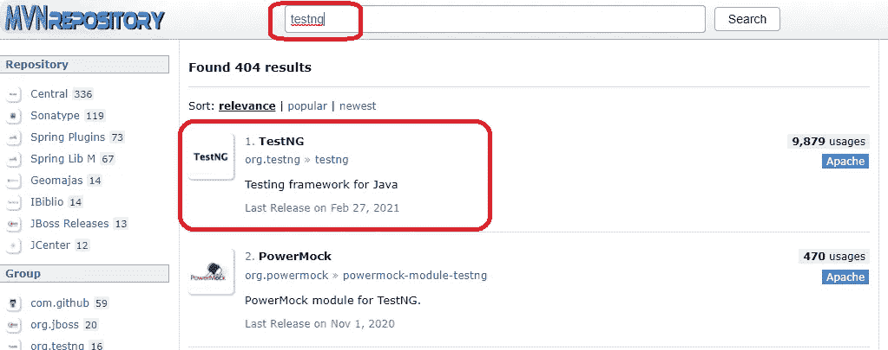

搜索 testng 并选择第一个

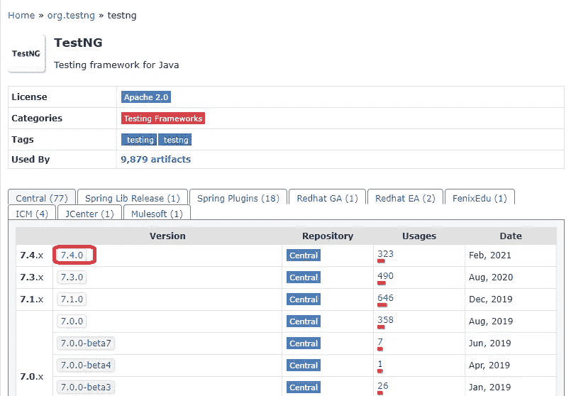

选择版本 7.4.0

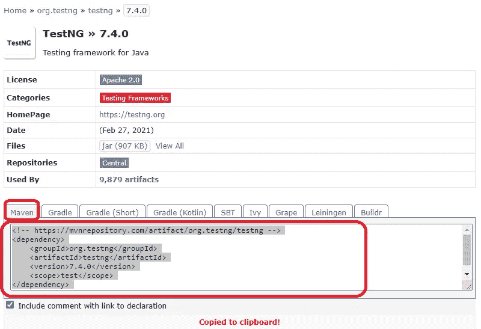

选择 maven，然后在框内点击，用红色尖，它会自动复制框内内容

如果没有复制，请手动复制框中的内容。

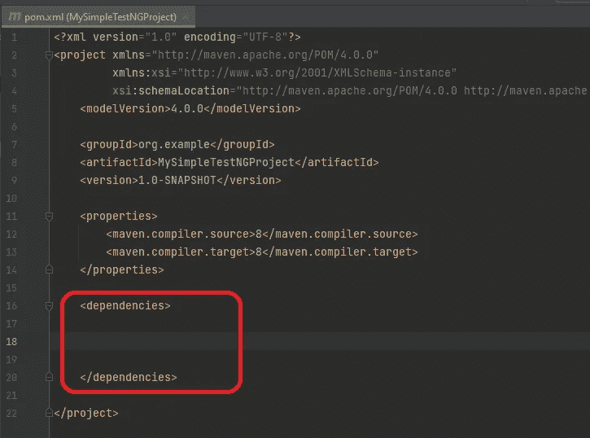

如图所示，创建“依赖关系”标签

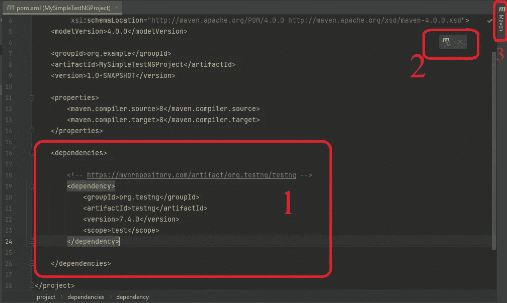

1.将复制的框内容粘贴到依赖标签对中。

现在，我们必须更新依赖项，以便 Maven 可以从 repo 中获取这两个包。我们可以点击刷新图标(2)，或者打开 Maven 侧窗口(3)并点击更新按钮。

刷新后，在最后，这个 pom.xml 文件里一定不能有红线，不能有错误。如果是，关闭它，如果不是，检查前面的步骤。

现在，我们将向 src/main/java 文件夹添加一个类，如下所示:

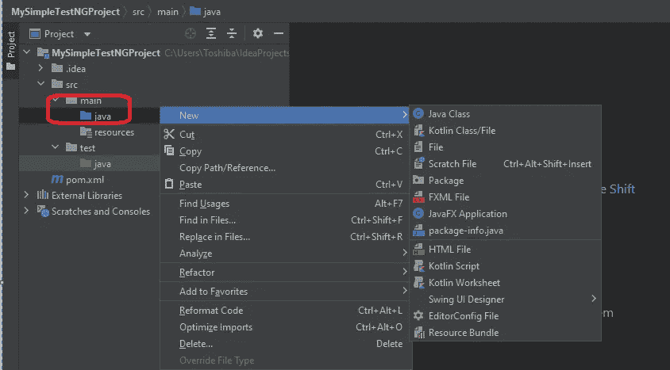

在 src/main/java 文件夹下创建一个名为 MyCalculator 的类

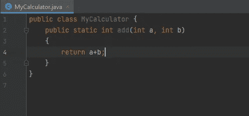

MyCalculator 类

这个方法是我们程序的一个小单元。

然后，我们将创建一个测试类来测试 MyCalculator 类的方法，就在 src/test/java 文件夹下，如下所示:

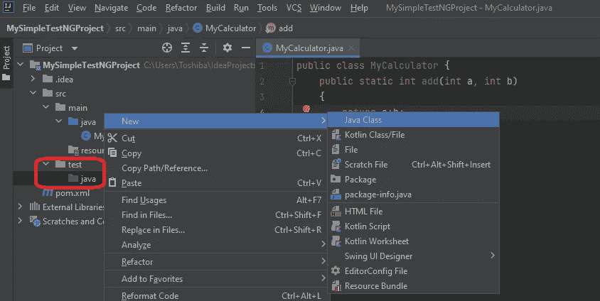

创建测试类

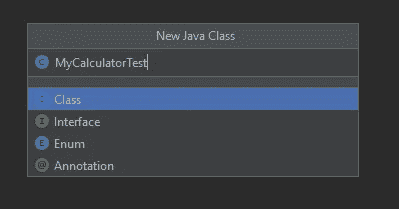

命名您的测试类

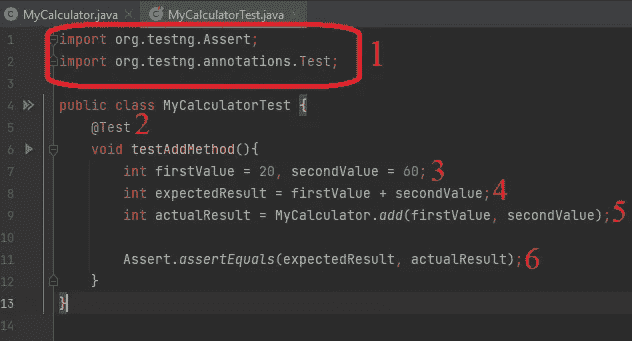

我们的第一个测试方法

1.  导入我们将使用的 TestNG 包。
2.  创建一个带有“@Test”注释的测试方法。
3.  “MyCalculator”类中的“add”方法需要两个 int 参数。所以我们定义了两个 int 变量并初始化它们。
4.  因为我们通过比较预期和实际结果来定义测试结果(失败或通过)，所以我们计算预期结果。
5.  实际结果当然是 add 方法的结果。
6.  最后一步是比较预期结果和实际结果。TestNG“Assert”类的“assertEquals”方法将执行这种比较。如果它们相等，测试将通过，否则测试将失败。

让我们通过单击方法名旁边的绿色箭头来运行这个测试，如下所示:

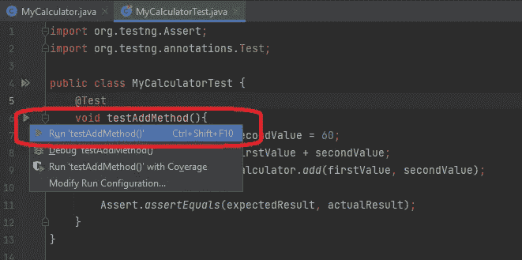

单击方法旁边的绿色箭头，然后单击弹出菜单中的第二个绿色箭头

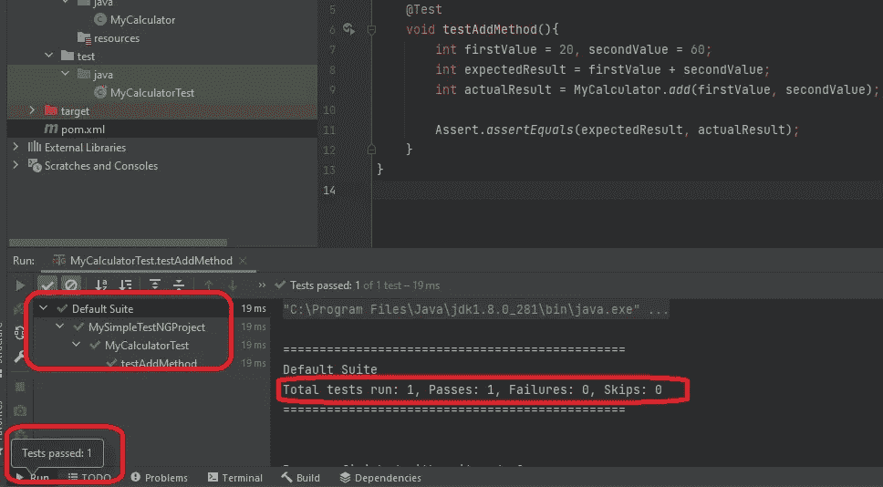

检查测试结果，我们的测试通过了

正如我们所见，测试已经完成并通过。所以我们成功地运行了我们的第一个 TestNG 测试。

让我们做另一个练习:

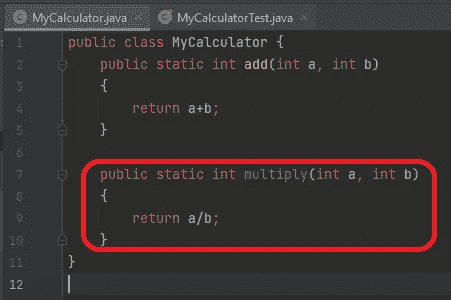

向 MyCalculator 类添加乘法方法

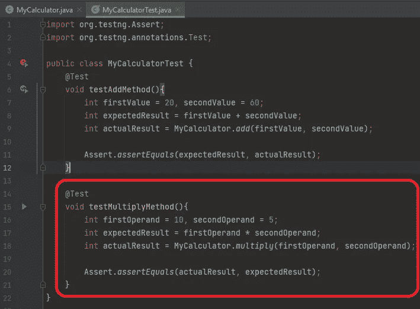

为测试乘法方法添加一个测试方法

正如我们在前面的测试方法中所做的，我们定义了调用“multiply”方法时要使用的变量。此外，我们根据这些变量创建了一个预期结果。最后一步是比较预期和实际结果。我们用“断言相等”的方法来做。让我们运行这个测试，如上所示:

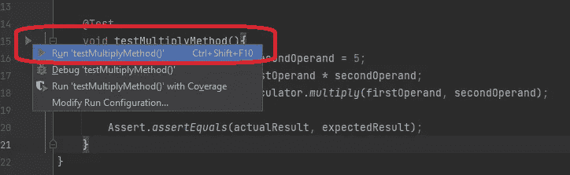

像我们之前做的那样运行“testMultiplyMethod”

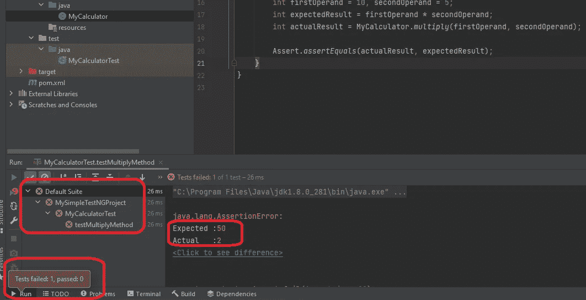

检查结果，我们的测试失败了

如我们所见，测试失败了。右侧窗口显示“预期”和“实际”结果。因为它们不相等，所以测试失败。

我们故意这样做是为了显示一次失败的测试。失败的原因是，参数在“乘法”方法中被分割，而不是相乘。

虫子

让我们在不修改代码的情况下一起运行这两个测试。代码修正不是 SDET 的职责。它不能。在班级级别运行测试，如上所示:

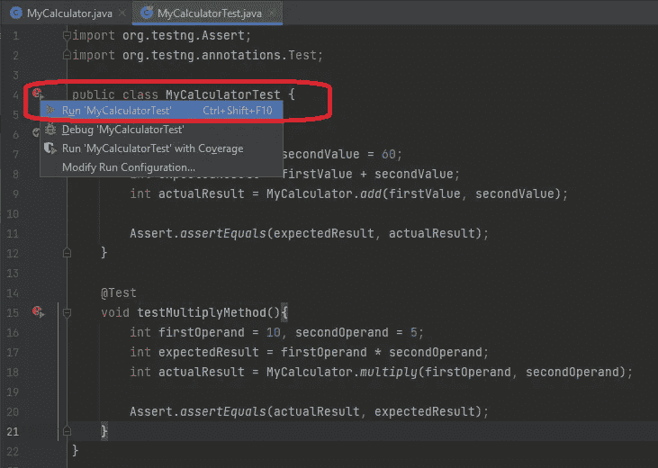

单击类名旁边的绿色箭头图标，然后单击弹出菜单中的第二个绿色箭头

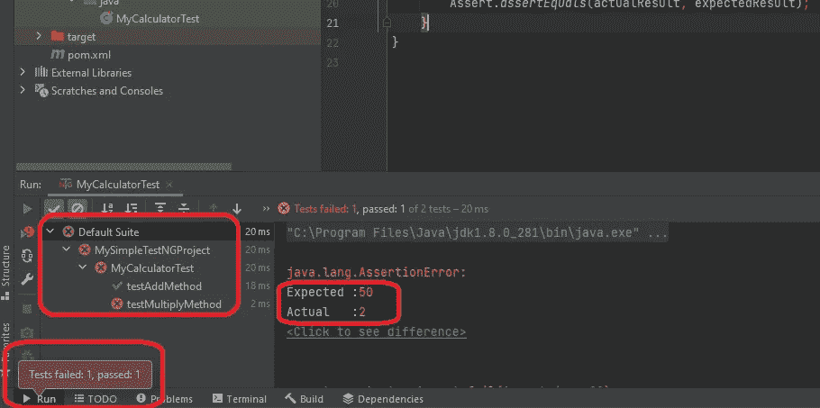

班级水平测试结果

如我们所见，“addMethodTest”通过了，但“multiplyMethodTest”失败了。我们还可以检查预期和实际的结果。

> ***这样容易使用和理解。我们还可以用 TestNG 做什么？***

*   您可以定义一个在每个测试或测试组或类之前运行的方法(它用于准备变量和资源)
*   您可以定义一个在每个测试或测试组或类之后运行的方法(它用于释放资源)
*   您可以使用不同的断言，如 assertEquals、assertTrue、assertFalse、assertNotNull、assertNull 等。
*   您可以执行依赖性测试。
*   您可以测试异常是否被抛出。
*   您可以一起测试多个断言，而不需要为失败的断言停止测试。
*   您可以为您的测试定义超时。
*   您可以在不删除或注释测试代码的情况下禁用测试。
*   您可以编写参数化的测试。
*   您可以定义不同的数据源。
*   您可以创建测试套件。
*   您可以更改测试方法的执行顺序。
*   可以得到 html 测试报告。
*   TestNG 可以同时执行多个测试。

我用 IntelliJ 解释了 TestNG 的用法，但是同样的结构也可以在可视代码和 Eclipse 中实现。用 Gradle(另一个类似 Maven 的构建工具)实现 TestNG 也是一样的，除了依赖项添加风格。

这就足够了。让我们在新的文章中相遇。