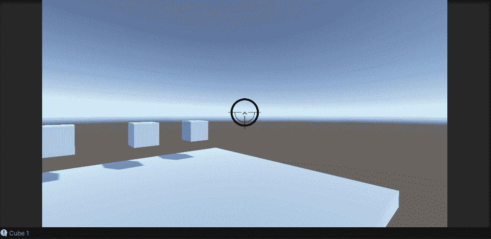

# Unity 3d 光线投射

> 原文：<https://medium.com/nerd-for-tech/unity-3d-raycast-1a2ed49c2e5f?source=collection_archive---------3----------------------->

## 开始 Unity 3D 游戏开发

## //添加光线投射命中的目标系统

原地射击

光线投射是一个很深的话题，我们今天几乎不会触及它的表面。我们将使用一些非常基本的光线投射代码来确定我们开火时是否击中了什么东西(单击鼠标左键)。