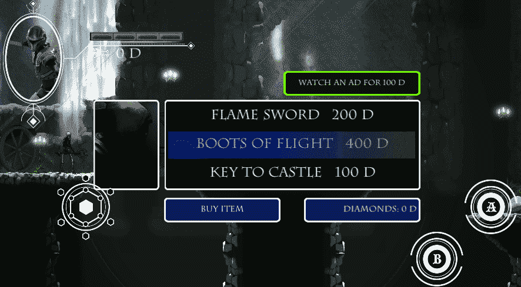
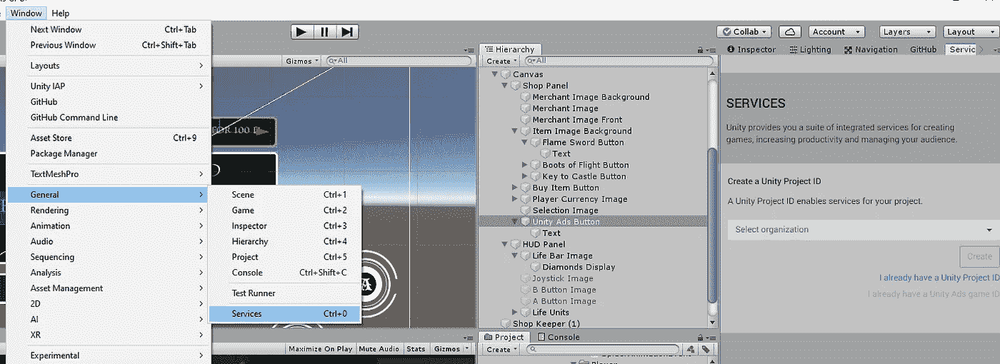
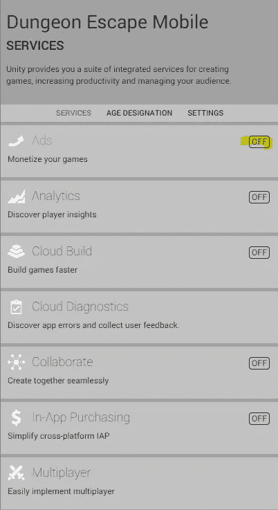
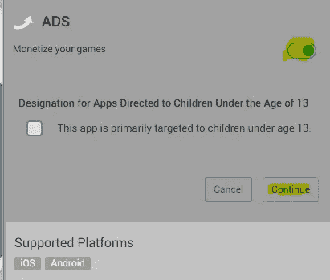
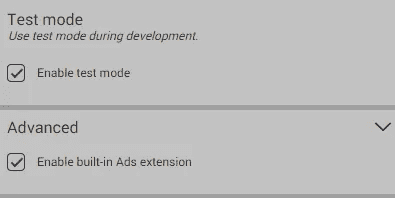
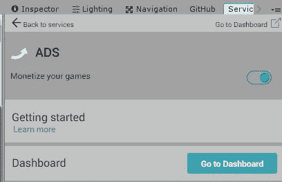
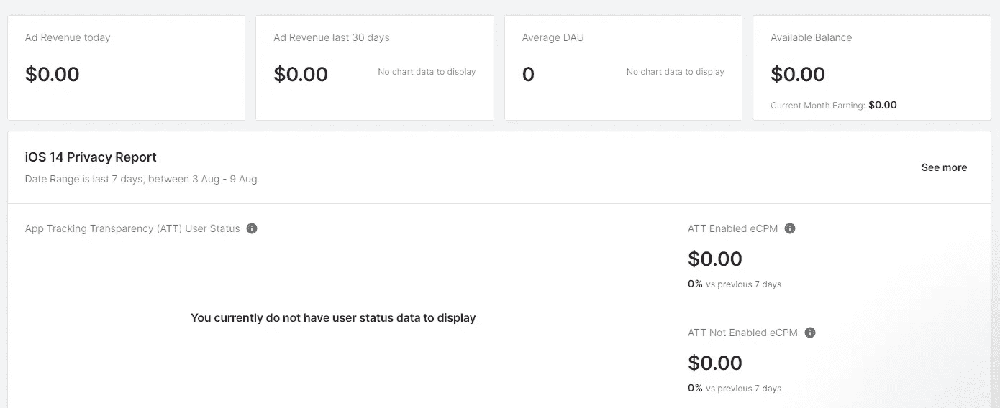
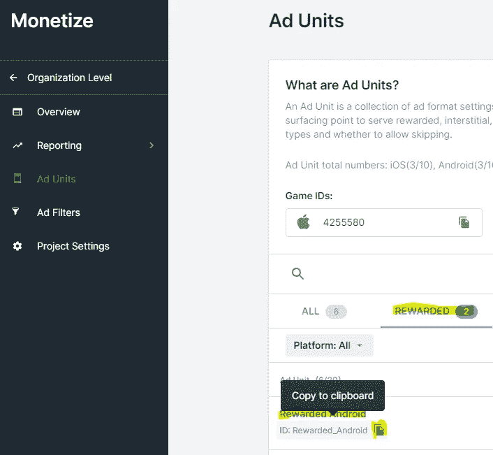
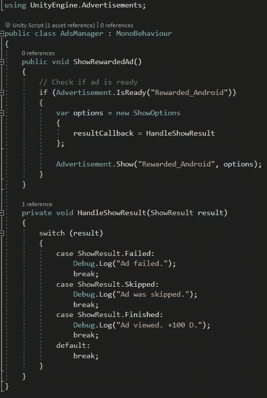

# Android 上的 Unity 广告

> 原文：<https://medium.com/nerd-for-tech/unity-ads-14310436d650?source=collection_archive---------12----------------------->

**目的:**奖励观看广告的玩家游戏内货币。

我们应该为我们在创造愉快的玩耍体验中的辛勤工作和艺术性得到补偿。但是我们需要快乐的玩家继续创造！请让我们尊重我们的玩家，用我们的力量负责任地向他们展示广告。

从 Unity 菜单栏中选择*窗口→常规→服务*。

在*服务*窗口中，我们将选择*广告* …

…将其打开，并点击*继续*。

我们还将确保检查*测试模式*和*启用内置广告扩展*。

接下来选择*转到仪表板*。

*仪表盘*显示使用各种数据，从产生的广告收入到日均用户。

@

从*仪表盘*中，选择汉堡菜单，然后*货币化→项目—概述*。

然后点击 *Ad units →奖励的*，复制*奖励的 Android* ID。

现在我们将创建一个 *AdsManager* 脚本并将其附加到一个空的游戏对象上。我们必须包括联合工程。广告图书馆。我们将创建一个名为 *ShowRewardedAd* 的公共方法，它可以连接到一个按钮或者从游戏中的任何地方调用。当被调用时，这个方法将检查奖励广告是否准备好了(这是我们复制到剪贴板的字符串 ID 被使用的地方)。 *HandleShowResult* 方法将告诉我们我们的广告是否被成功查看，是否播放失败，或者播放器是否跳过它。

如果玩家看完了广告，我们可以给他们任何我们想要的奖励来感谢他们！