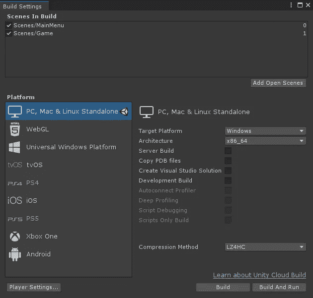
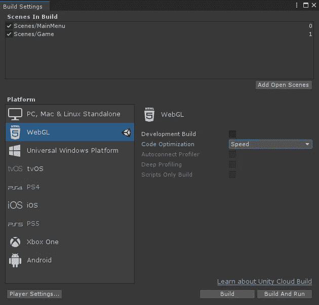
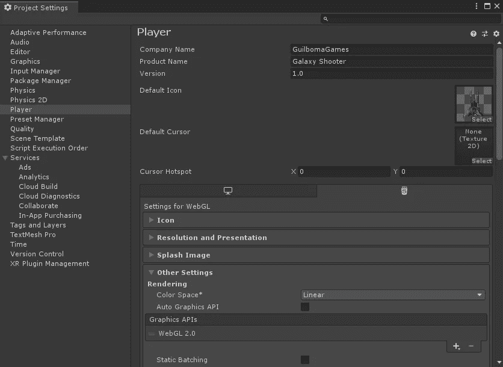
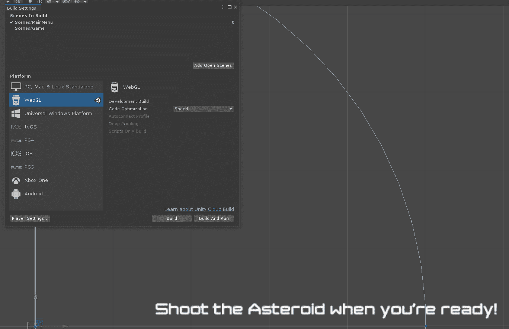
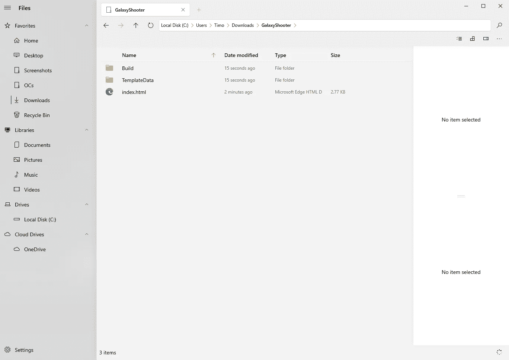

# 团结:打造你的游戏！

> 原文：<https://medium.com/nerd-for-tech/unity-build-your-game-ba71e71fe8b6?source=collection_archive---------22----------------------->

## 准备好分享你的游戏吧！

照片由[肖恩·多](https://unsplash.com/@everywheresean?utm_source=medium&utm_medium=referral)在 [Unsplash](https://unsplash.com?utm_source=medium&utm_medium=referral) 上拍摄

到目前为止，我们已经完成了所有的工作，现在是时候向世界展示我们的成果了！…或者只是你的朋友。有了 Unity，构建你的游戏相当容易。我们开始吧！

**选择目标平台** 开始，我们需要访问*构建菜单*。

*   *文件>构建设置…*

这是您将看到的窗口:

PC 平台被选为默认平台。只需选择目标平台(Windows、macOS 或 Linux)、架构并点击“构建”来构建您的游戏。然而，我们将关注 WebGL 的构建。

*   在左侧，点击 *WebGL*
*   在右下角，点击*开关平台*
*   等待 Unity 完成重新编译。这可能需要一段时间。

**更改构建设置** 更改目标平台后，您会看到一个略有不同的*构建设置*窗口。

这个！

*   *“开发构建”*将启用更多的方法在游戏运行时调试游戏。我们保持它未经检查，因为空间射手运行顺利，如预期到目前为止。
*   *代码优化*要么优化代码运行速度快，要么让提取出来的游戏在文件大小上尽可能小。但是，您可能不得不在某些地方降低性能。

我们保持选项不变！

**高级构建设置** 我们有一个按钮叫做*“玩家设置……”*在左下角。点击它将打开高级设置，您可以在这里更改许多不同的设置。以下是一些您可以更改的内容:

*   更改产品名称、公司和版本
*   更改游戏图标
*   如果有的话，设置一个闪屏
*   选择一个目标*图形 API*

已经改变了我们想要的设置，现在是最终构建游戏的时候了！

*   添加您想要包括的每个场景
*   点击*构建*按钮
*   选择一个目的地存储游戏数据
    *不建议在项目文件夹里面创建文件夹！选一个不一样的！*
*   等待 Unity 完成项目构建。
    *这可要花一段时间了！*

Unity 完成编译和构建项目后，您将在您选择的文件夹中获得这些文件:

打开*index.html*文件将在你默认的浏览器中启动游戏。

与其发送整个文件夹，为什么不把游戏上传到像 *itch.io* 这样的虚拟主机服务上呢？让我们在下一篇文章中来看看吧！