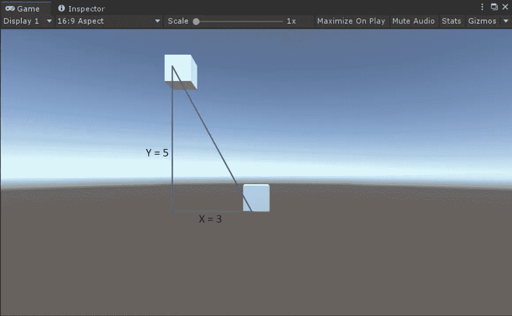
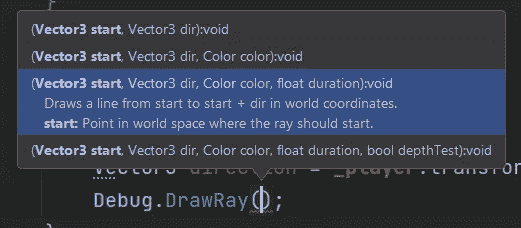
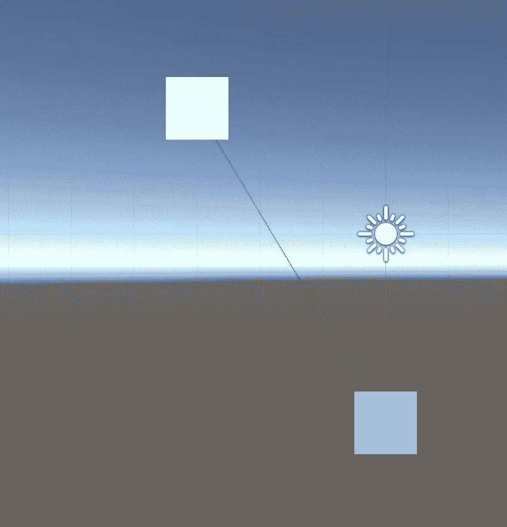
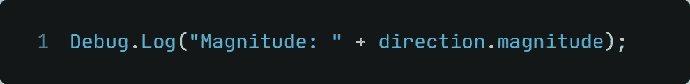
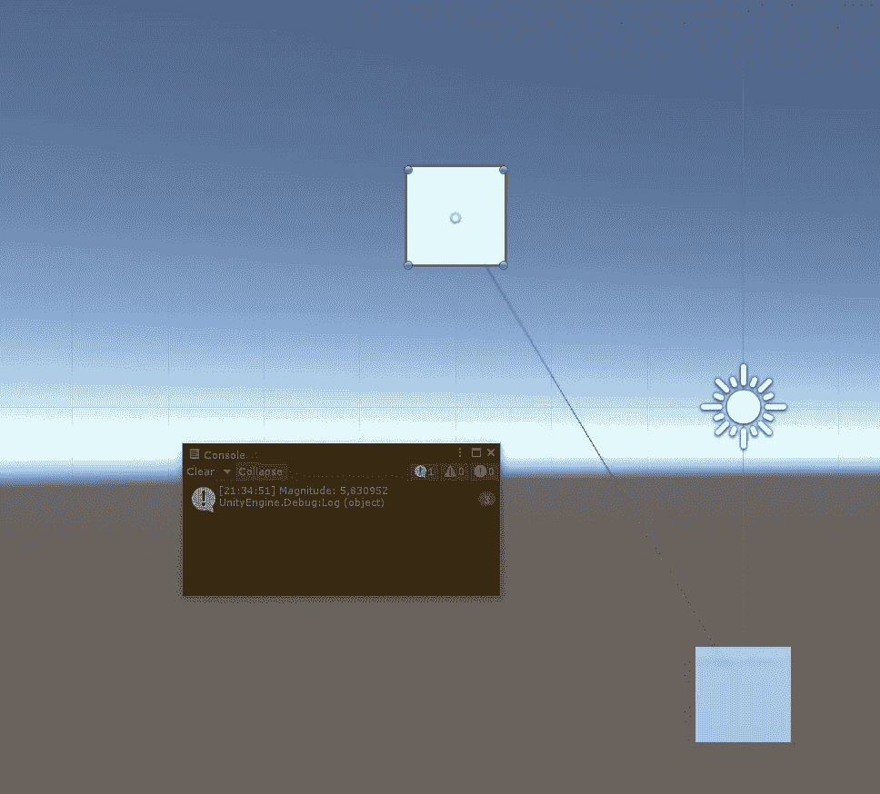
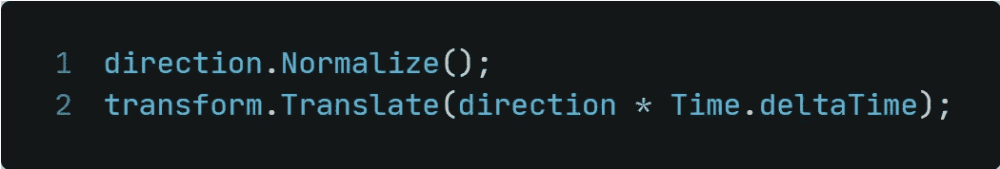
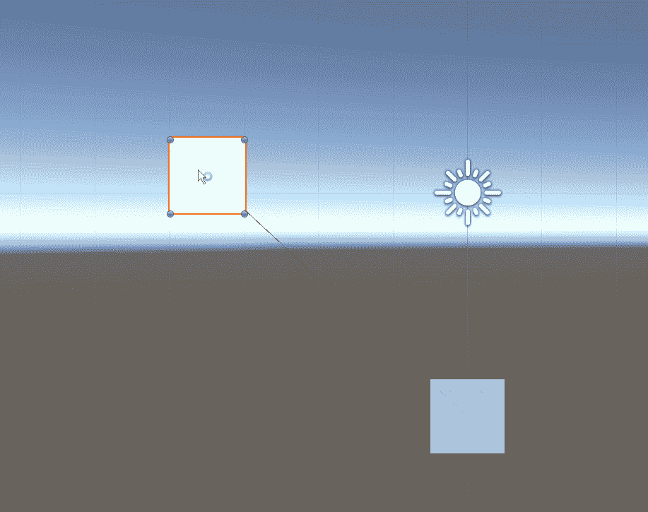
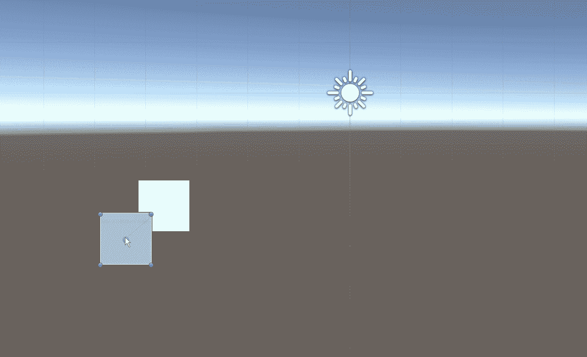
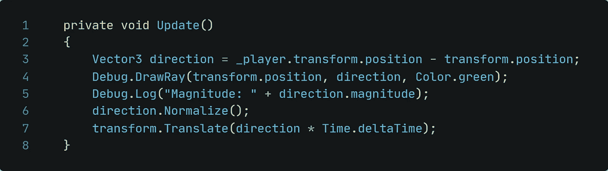

# 统一-计算到另一个游戏对象的方向

> 原文：<https://medium.com/nerd-for-tech/unity-calculating-the-direction-to-another-gameobject-438f1301eaea?source=collection_archive---------2----------------------->

## 玩家。你在哪里？我需要一些新鲜的肉…

好的，别担心。我们之间有一道屏障，所以你不会有事；-)

不管怎样？你可能以前玩过一些游戏，游戏中敌人在追你。以《我的世界》为例。还记得晚上追你的僵尸吗？或者，把纸转过来，游戏允许你用磁铁以一种简单的方式得到硬币。这是怎么回事？

我们先从一个小理论开始。

追逐的敌人总是知道你的位置和到达你的最短路径，到你的距离。

还记得下面这个公式吗？ *a + b = c* 这也正是这里所用的！

我们有了 x 轴和 y 轴的方向长度，a 和 b，现在只需要计算 c 就可以得到距离向量了！

*5 = 25
3 = 9
c = a+b*→*c = 25+9 = 34
c =√34→****5、83***

距离 5.83 个单位！

**编码这种行为** 我们浏览了文章的理论部分。但是代码是如何工作的呢？如何实现这样的数学算法？比你想象的要容易。相信我。相信一个在学校数学很差的人。

我们来看看如何计算方向:

为了让这个向量可见，Unity 有一个名为 *Debug 的函数。DrawRay()。*这将创建一条线来显示计算出的矢量。

将该方法输入到 IDE 中，我们将得到以下工具提示:

我们至少需要两个参数:

*   线条的起始位置
*   线条的结束位置(或方向)

此外，我们可以控制线条的颜色，并设置线条可见的时间。

开始位置是附加了这个脚本的游戏对象。
向量的方向就是玩家。

在 Unity 中进入播放模式，**场景**视图将如下所示:

为了检查计算是否正确，我们可以记录 Unity 计算的幅度值:

而且你可以看到，计算出来的向量是完全一样的！

**向目标移动** 在行为、运动方面还缺少最后一样东西。

我们只需要告诉游戏对象哪个脚本移动到计算的方向向量。为了让移动速度一致，而不是敌人越近越慢，我们先把方向归一化。

这是它在 Unity 中的样子:

如果玩家改变位置也是一样:

超级令人兴奋的工作！好吧，现在玩家..你不再被敌人拯救了…记住这一点…

哦，在我忘记之前，这里是今天文章的完整代码:

感谢您阅读这篇文章和您的时间！下次见！