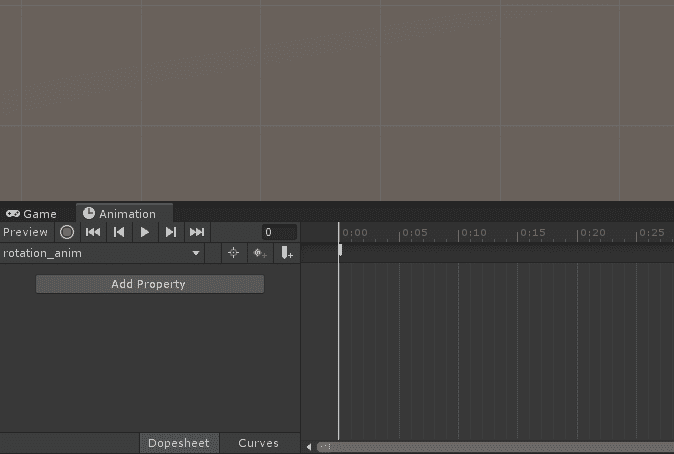
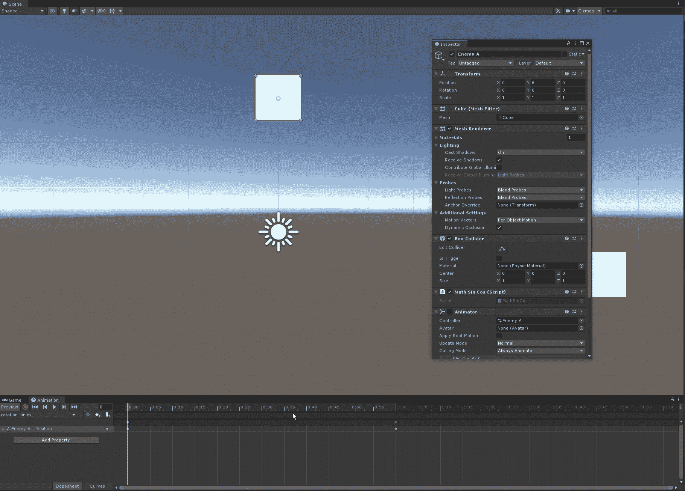
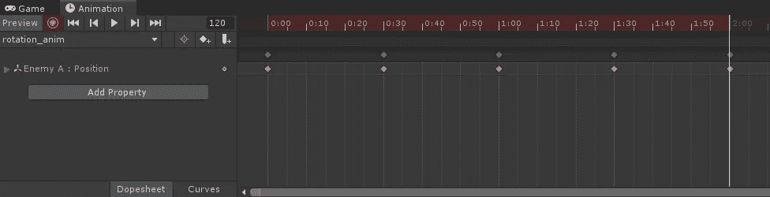
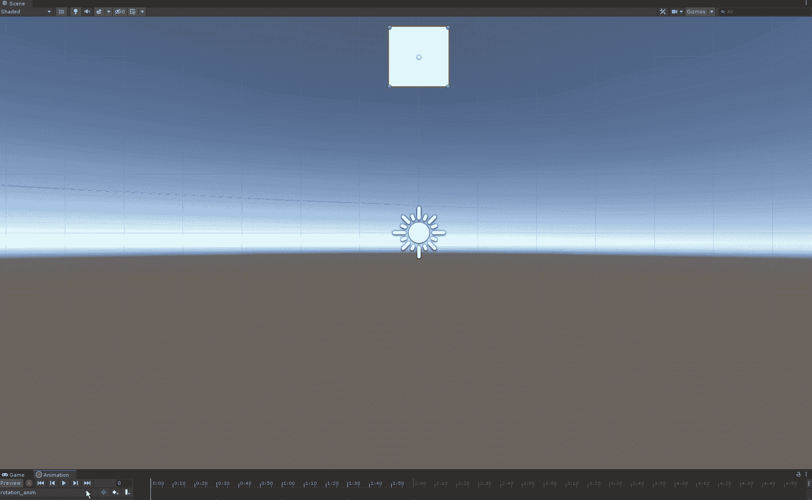

# 统一-圆周运动。但是不需要编写任何代码。

> 原文：<https://medium.com/nerd-for-tech/unity-circular-movement-but-without-coding-anything-16e26813246c?source=collection_archive---------13----------------------->

## 转圈不一定要编码，你知道吗？

我们已经在数学的帮助下创造了一个圆周运动的行为。但是你知道吗？我不喜欢数学…一点也不喜欢。嘿，讨厌它也没什么，即使作为一个游戏开发者，你有时也需要它。无论如何，让我们今天不使用数学或代码来创建一个循环运动！

一、目标
目标很明确。我们将在动画师的帮助下，不使用代码或数学来创建一个圆形运动。

**二。创建实际行为** 我们不需要这个动画的资产。我们可以简单地操纵游戏对象的位置，Unity 会完成剩下的工作。真的。就这么简单！

现在，在录制模式下，我们需要做的就是在动画制作程序中设置我们想要的关键帧位置！

但首先，让我们来分解一下:

*   我们想创造一个循环运动。
    假设我们从位置 0，6，0 开始，为圆创建四个关键帧
*   下一个点是-3，3，0
*   要得到一个半圆，下一个位置是 0，0，0
*   下一个位置是 330
*   为了使动画更加流畅，我们再次在 0，6，0 处创建最后一个关键帧。

要将某个位置设定为关键帧，只需在检查器中输入该位置，它将应用于所选的帧:

创建关键帧

完成了我们需要的所有五个**位置，你的动画师看起来就像这样:**

**三。最终结果** 在 Unity 中播放动画会是这样的:

是的，这就是你需要做的！
相信我，当一位 GameDevHQ 教练向我展示无需任何代码就能创建时，我简直惊呆了！动画师看起来真的非常强大，而且在很多情况下，它真的会节省你的时间，减少你的挫败感。我经历了编码那种行为的痛苦。两小时写了 17 行代码。那可能只是几分钟…我猜是:D 的开发者生活

感谢您的时间和兴趣！
下次再抓你！