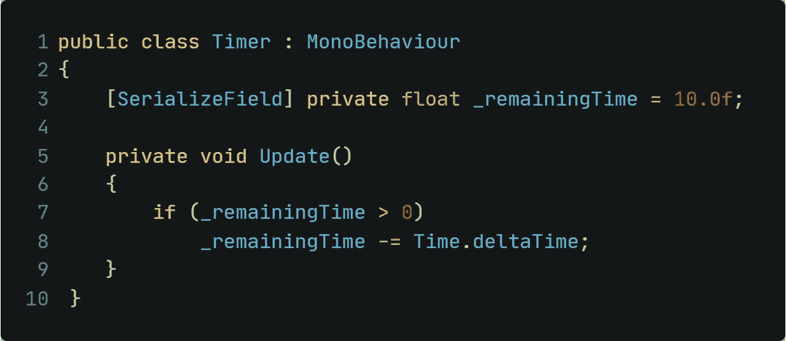
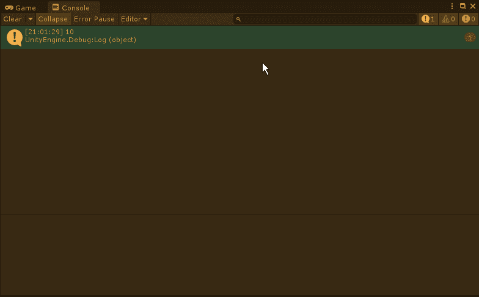
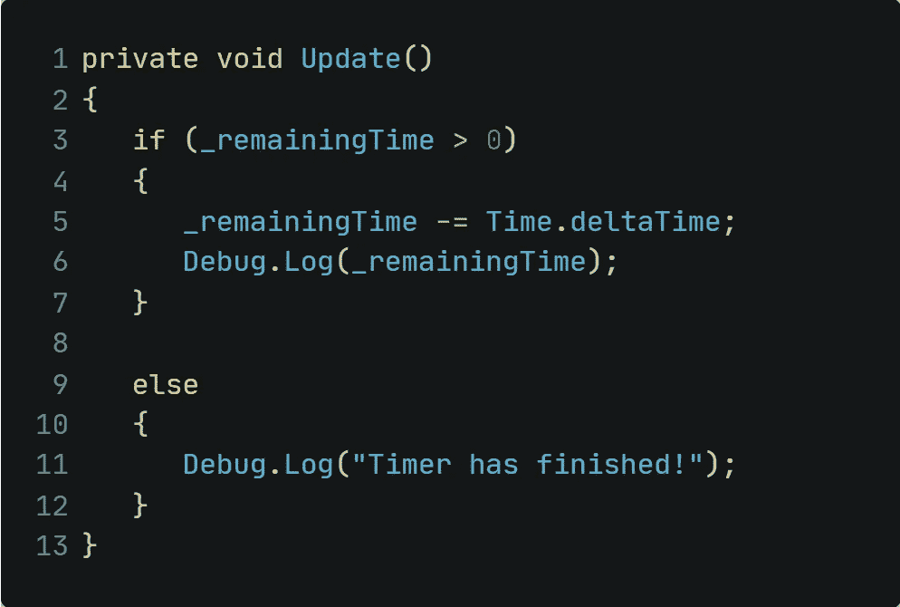
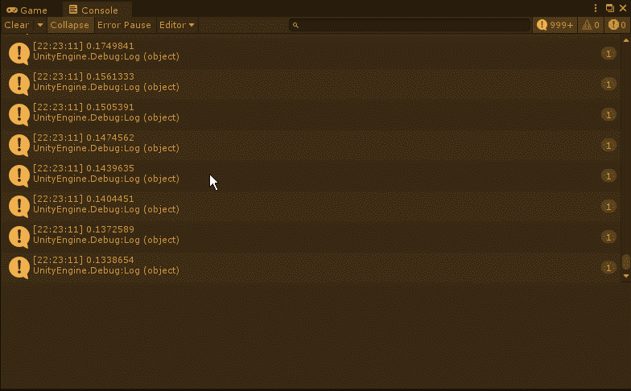
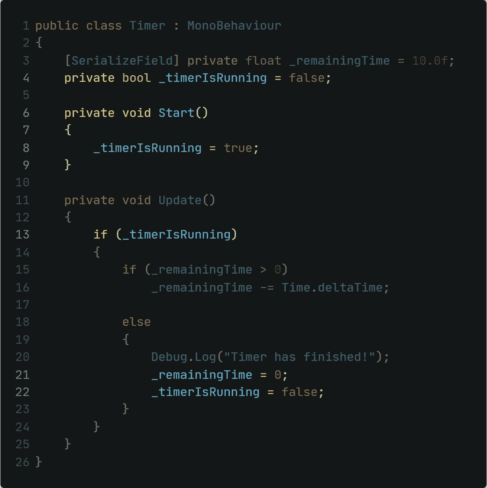
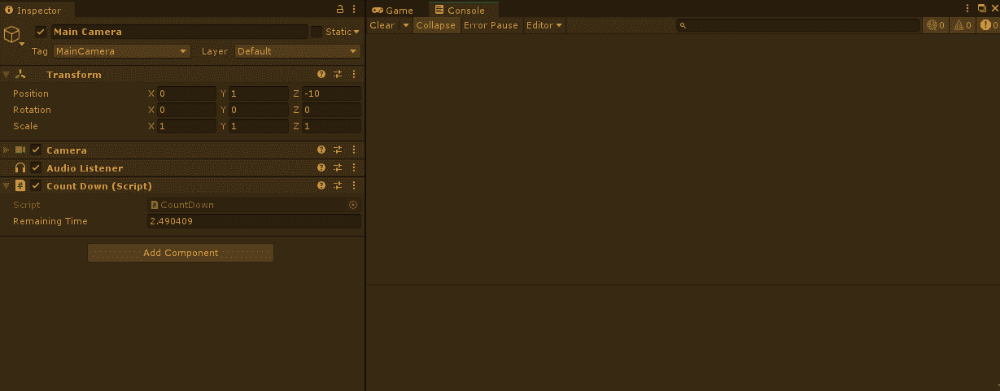
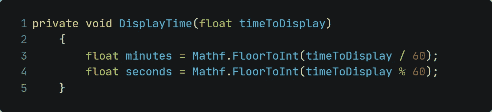
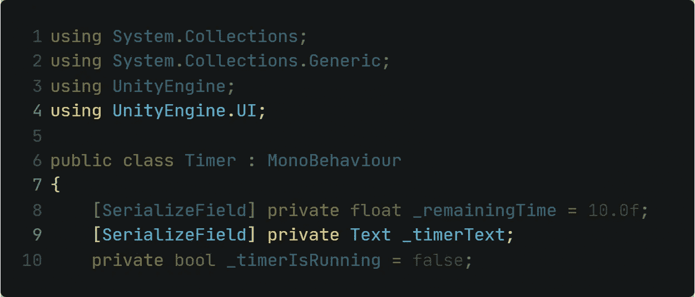
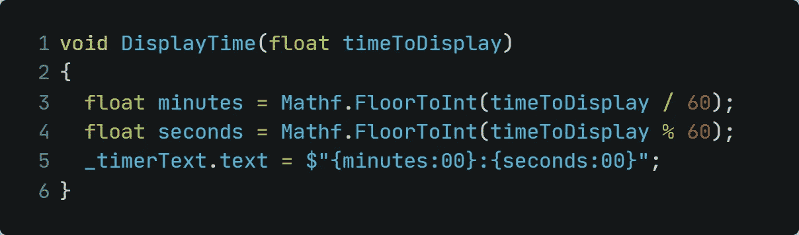
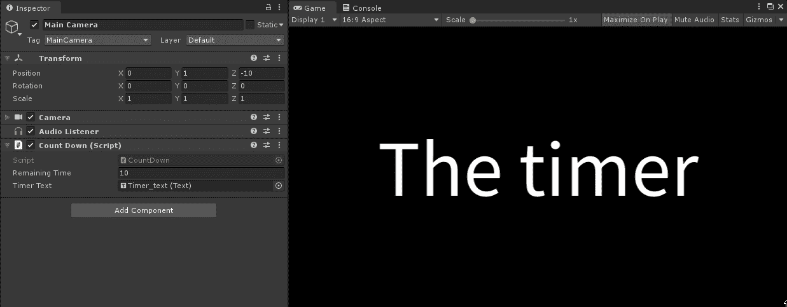

# Unity -创建一个倒计时系统

> 原文：<https://medium.com/nerd-for-tech/unity-create-a-countdown-system-cf679f1f83dc?source=collection_archive---------14----------------------->

## 一个关卡中的时间限制？没问题！

在 [Unsplash](https://unsplash.com?utm_source=medium&utm_medium=referral) 上由 [Aron 视觉](https://unsplash.com/@aronvisuals?utm_source=medium&utm_medium=referral)拍摄的照片

倒计时器在今天的游戏中非常普遍。让它成为有时间限制的任务，有时间限制的迷你游戏，或者给玩家增加压力。假设一个难度很大的 RPG boss，必须在限定时间内被击败，否则玩家已经输了。它们可以用于很多事情。

让我们试着创造一个！

**一、倒计时系统工作的基本思路** 要在 Unity 中创建一个倒计时系统，我们需要创建一个时间变量。
由于时间可以是任何值(比如 0.46 秒)，我们需要的变量类型是一个 *float* 。为了进行倒计时，我们需要用 *Time.deltaTime* 减去最后一帧的时间。

**二。使用 Time.deltaTime** 制作一个 Unity 中的基本倒计时定时器的方法很简单。我们在上一段已经讨论过了！

把它转换成代码，它看起来像这样:

只要剩余时间大于 0，计时器将继续运行:

你可能已经注意到最后一项是负的。我来解释一下。当上面带有 0.0002 的条目大于 0 时，它再次运行。因为帧时间比值长一点，所以它进入了负区域，但之后就停在那里了。

如果你想在倒计时达到 0 后添加一个动作，你可以通过使用 *else-statement* 轻松完成。让我们打印出“计时器已结束！”。我们只需要添加一个*调试。Log()* 行为:

**三。防止垃圾邮件！**
然而，通过现在运行应用程序，我们可以注意到这里的一个小问题。每一帧的信息都会被打印出来；每秒 60 次左右！

注意右边上升的数字

但是不用担心。有一个简单的方法可以解决这个问题。只需创建一个 bool 值，它将被设置为 if 语句中的一个条件。

让我们过一遍:

*   我们添加了一个 bool 值，当应用程序启动时，该值将被设置为 true。这表示计时器正在运行。
*   只有当倒计时器正在运行时，倒计时时间才会减少。
*   如果剩余时间小于零，倒计时不再运行，时间将强制停留在 0。如果你想稍后在 UI 文本框中显示时间，这是一个重要的步骤。如果不添加这一行，负值可能会显示在 UI 元素内部。
*   因为如果计时器正在运行，消息就会被打印出来，所以现在只有一个条目进入控制台

**四。将浮点时间转换成分和秒** 现在，为了得到分和秒的分离值，我们必须转换该值。为此，分钟和秒钟必须以不同的方式计算。

*   要计算分钟数，将时间变量除以 60
*   要计算秒，用**模运算符(%)** 将时间变量除以 60

为了从浮点值中得到完整的数字，使用 *FloorToInt* 向下舍入每个值。

> **信息:“取模”运算符**
> 
> 模运算是一个函数，它返回一个数除法运算后的余数。
> 
> 例 1: 62 % 60 返回 2
> 例 2: 125 % 60 返回 5
> 例 3: 32 % 60 返回 32

**五.在 UI 文本框** 中显示倒计时要开始，只需通过*右键单击层次结构> UI >文本*来创建一个文本框。在脚本中，您需要包含 Unity UI 库，这是通过使用 UnityEngine 添加*来完成的。UI；*在你剧本的最顶端。然后创建一个文本类型的变量，并给它一个可识别的名称。

脚本的第一行应该是这样的:

最后，在 *DisplayTime()* 函数中，修改文本以显示计算出的值。您可以简单地使用字符串插值来调用在字符串前带有$的内容。

六。调用显示时间函数
最后，我们只需要调用 *void Update()中 if 语句内部的方法。*否则，计时器将运行，但不会在 UI 元素中显示和更新。

这是它在游戏中的样子:

**七。完成的脚本** 下面是完成的脚本的样子:

我们做到了！我们成功创建了倒计时功能！