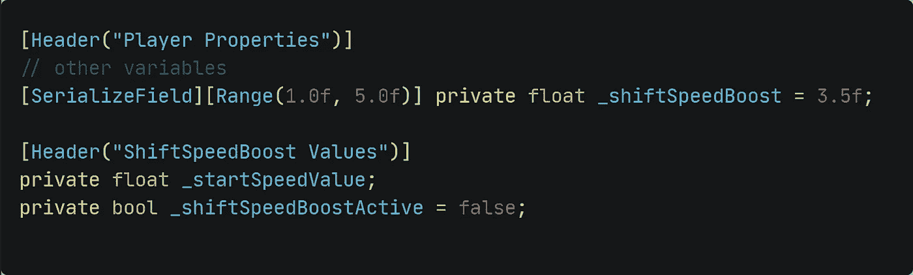
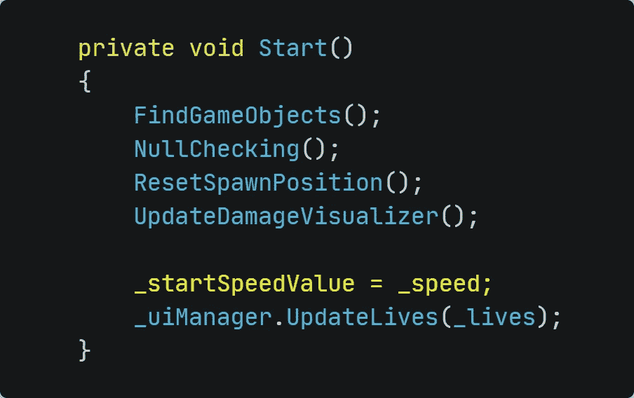
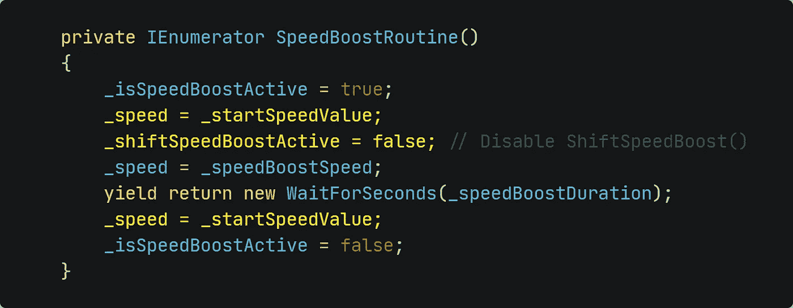

# 统一:创建一个按键速度提升！

> 原文：<https://medium.com/nerd-for-tech/unity-create-a-speed-boost-on-keypress-210bf09445b9?source=collection_archive---------10----------------------->

## 不够快？随心所欲地触发更多速度！

照片由[萨夫](https://unsplash.com/@saffu?utm_source=medium&utm_medium=referral)在 [Unsplash](https://unsplash.com?utm_source=medium&utm_medium=referral) 上拍摄

银河射手来了相当顺利和愉快！我们已经实现了许多东西，所以我们被允许把太空射手称为一个发布就绪的游戏。可能是这样，但是想想你可以尝试实现的所有其他事情。让我们把游戏进行到一个阶段，在这个阶段，我们甚至不会意识到这个阶段在结束时有多远。但是让我们从小处着手。非常小。小步会让我们比大步走得更快。让我们从玩家可以使用的一点速度提升开始。

**设置变量** 一如既往，我们需要变量！这一次，我们需要这些事情的变量:

*   当玩家按下 LSHIFT 键时我们想要增加的速度
*   避免任何问题的初始速度值
*   a .检查当前是否正在使用换档速度提升

因此，我们需要以下三个变量:

**创建逻辑** 我们希望 *ShiftSpeedBoost* 仅在不使用加速时可用。因此，我们需要检查我们在创建加电时设置的*_ isSpeedBoostActive*bool。

如果所有条件都适用，我们希望激活 shiftSpeedBoost 并将 shiftSpeedBoost 速度值添加到当前速度值。

玩家一放开 LSHIFT 键，我们就想禁用 ShiftSpeedBoost，再次恢复正常速度值。

*   调用 *void Update()里面的方法！*玩家可以随时按下按钮。

**微调。** 方法是这样的。但是我们应该对 *Player.cs* 脚本进行微调，这样就不会出现意外的行为。

*   还记得 *_startSpeedValue 吗？*将其分配给*无效启动()*中的*_ 速度*变量

*   在 *SpeedBoostRoutine()* 中，我们应该确保禁用 ShiftSpeedBoost 并将速度重新分配到其初始值，以避免任何干扰。方法中添加了黄线:

**就是这样！我们刚刚创建并实现了另一个小小的速度提升，以防玩家需要！**