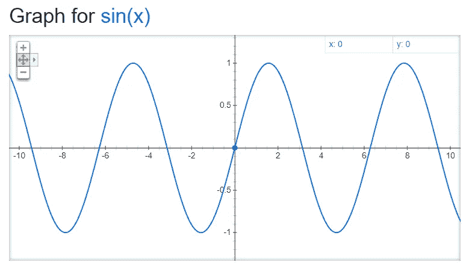
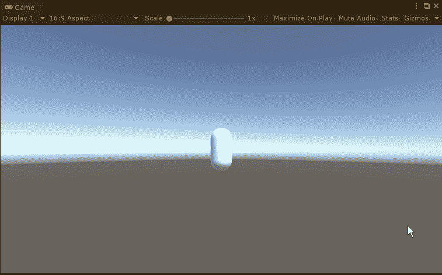
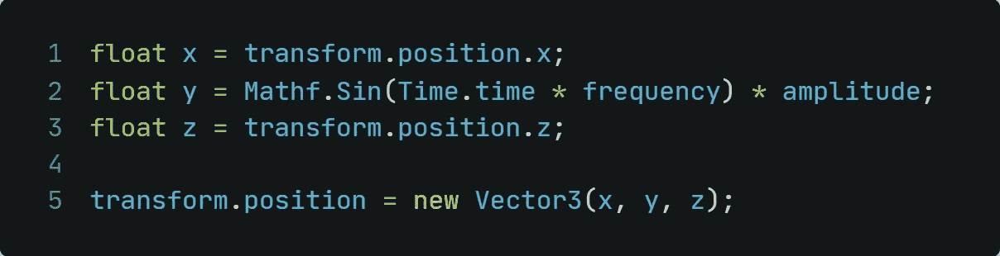
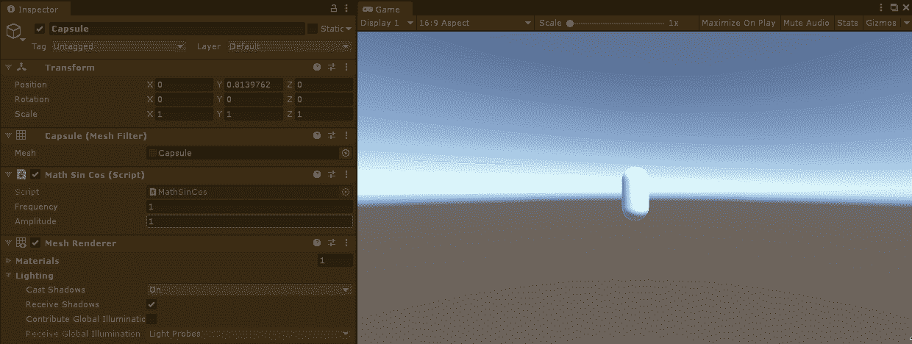
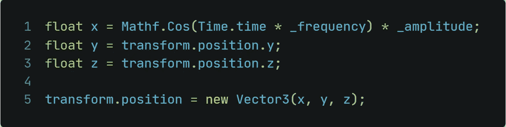
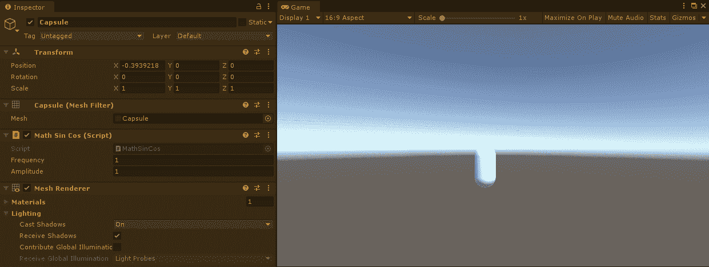
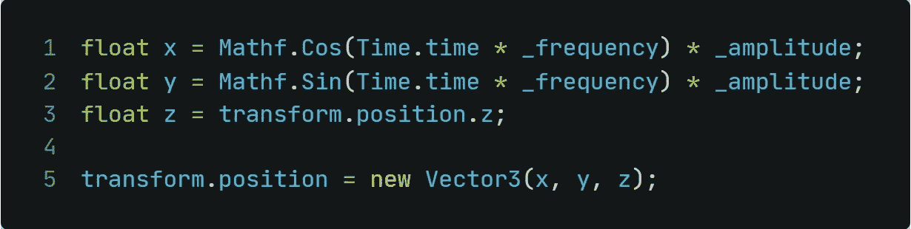
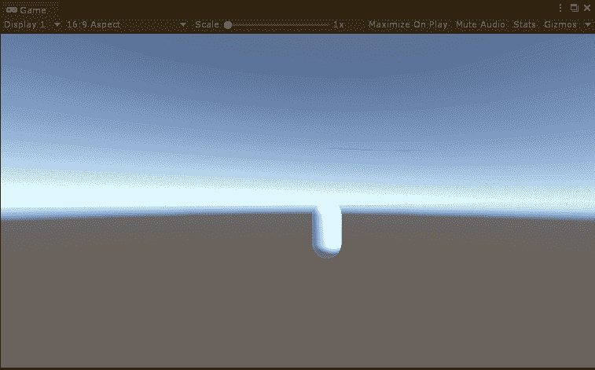

# 统一——用罪恶和代价创造循环运动

> 原文：<https://medium.com/nerd-for-tech/unity-creating-circular-movement-with-sin-and-cos-9a54c19c0d14?source=collection_archive---------4----------------------->

## 直线运动？-无聊！

马特·西摩在 [Unsplash](https://unsplash.com?utm_source=medium&utm_medium=referral) 上的照片

游戏中的动作令人兴奋。不，真的。我没开玩笑。这只是一个你如何让玩家(或敌人)移动的问题。假设你有一个敌人，他随机决定以圆形而不是直线的方式接近你。激动人心吧。

那么，我们怎样才能实现这样的目标呢？答案是用数学！学校里可能没人喜欢的一门课...但是不用担心，我们不需要任何复杂的东西，只需要*正弦和余弦图形和函数。*

我们开始吧！

# 理论

一、什么是罪恶之波？

一个 sin(x)波！

简而言之，正弦波在*时间*(*x 轴*)内在 1 和-1 之间往复变化(在 *y 轴*)。

# 实际用法

**二。用 sin** 操纵 y 轴移动如上所述和所示，典型的 sin(x)波在一个振幅内上下波动。我们就用它来做 y 轴运动吧！

为此，我们需要三个局部变量，它们将是运动向量 3。

x 和 z 似乎合乎逻辑。我们不想操纵他们，所以我们不去管他们的价值观。

让我们看看这段代码在 Unity 中做了什么:

玩家不断上下移动，就像在正弦波中一样！

让我们稍微调整一下代码！如果我们也增加一些频率和振幅的数据呢？

*   增加**振幅**将会改变 y 轴 *-该图形的值在 sin(x)图形上的*值之间往复变化。
*   增加**频率**将改变 sin(x)波的拉伸或压缩程度。

**三。用 cos
操纵 x 轴运动**让我们稍微修改一下上面显示的代码，用 cos 使其适应 x 轴运动:

这将创建以下运动方案:
*振幅和频率仍然可以改变；下面 GIF 里也有显示！*

**四。创造圆周运动** 把 sin 和 cos 两者结合起来，就会创造出一个圆周运动！

这就是今天的文章！