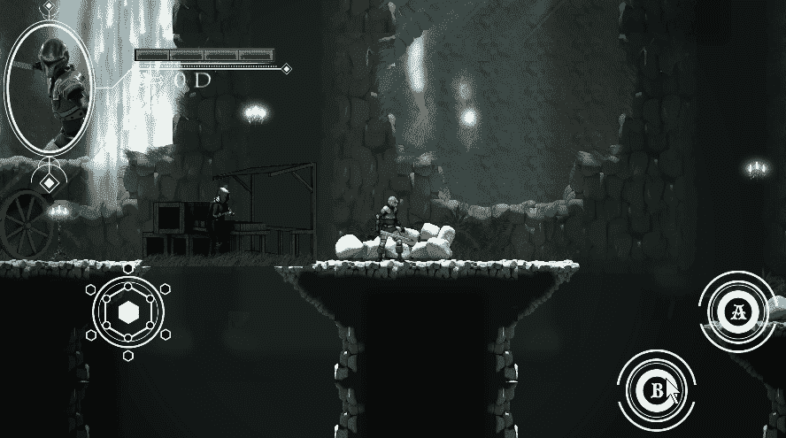
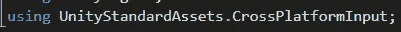
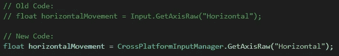
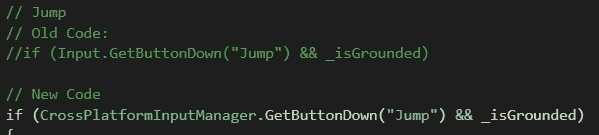
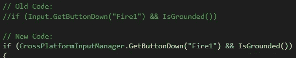
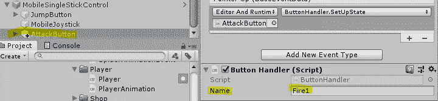

# Unity 跨平台输入

> 原文：<https://medium.com/nerd-for-tech/unity-cross-platform-input-dda00b0b93b?source=collection_archive---------15----------------------->

**目的:**使用 Unity 标准资产的跨平台输入系统。

到目前为止，我们一直在为 Windows 平台开发游戏。但这是一款手机游戏。我们可以使用标准资产的跨平台输入系统来设置移动控件！

首先，我们必须在我们的*播放器*脚本中包含 *CrossPlatformInput* 库。

现在我们将不得不改变我们的运动代码来使用输入系统。跨平台输入系统不会破坏我们之前的代码。

我们将为我们的跳转按钮做同样的事情…

…还有攻击按钮。

我们还必须确保按钮的*按钮处理程序*脚本指向正确的轴。在我们的例子中，跳转按钮应该指向*跳转*，而攻击按钮应该指向 *Fire1* 。现在，当我们将游戏导出到手机时，我们将拥有触摸控制！

