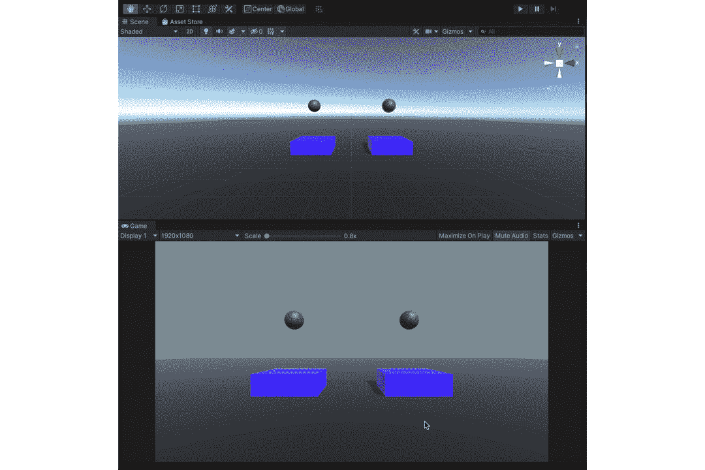
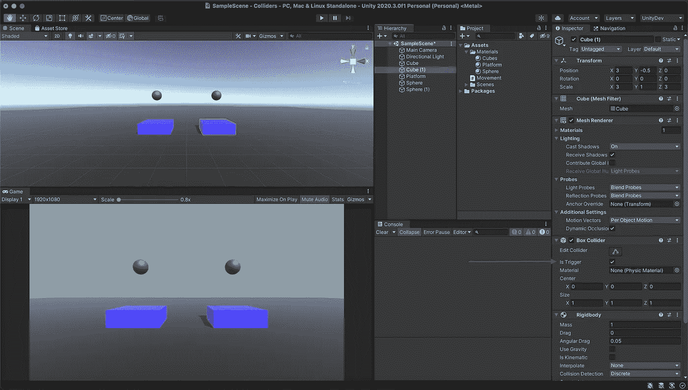
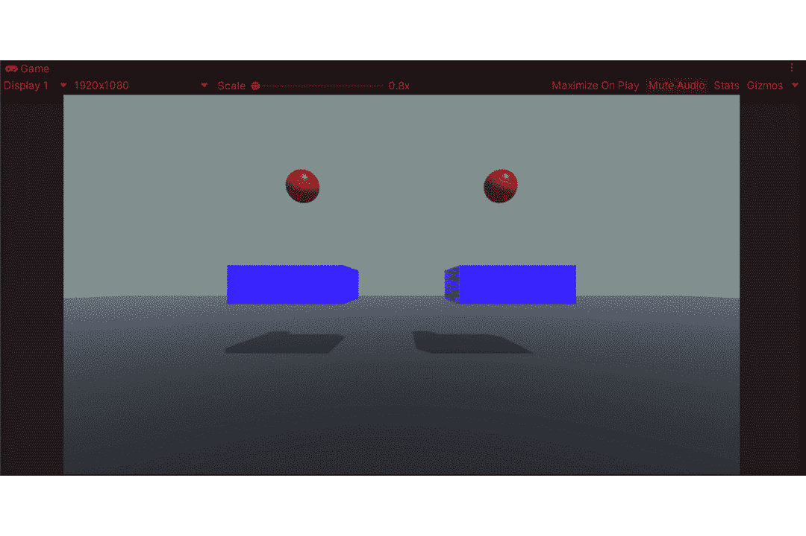
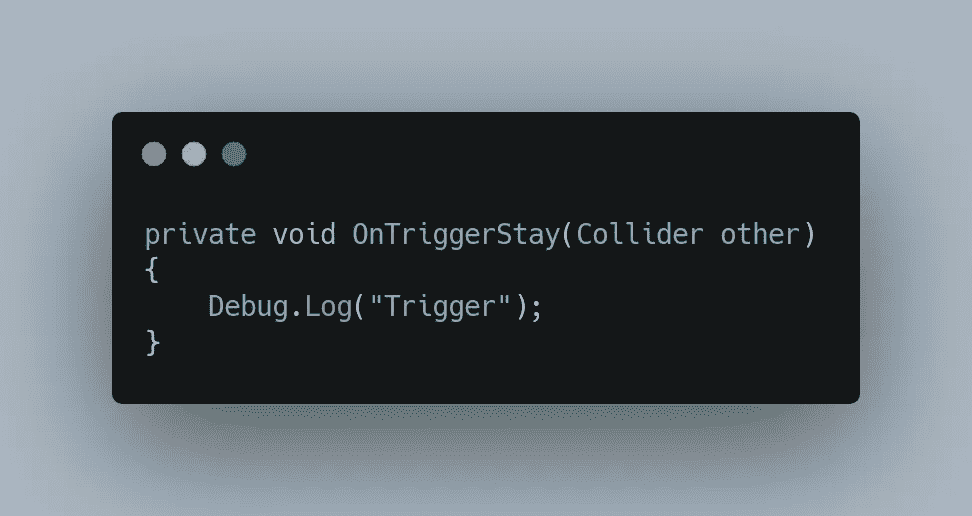
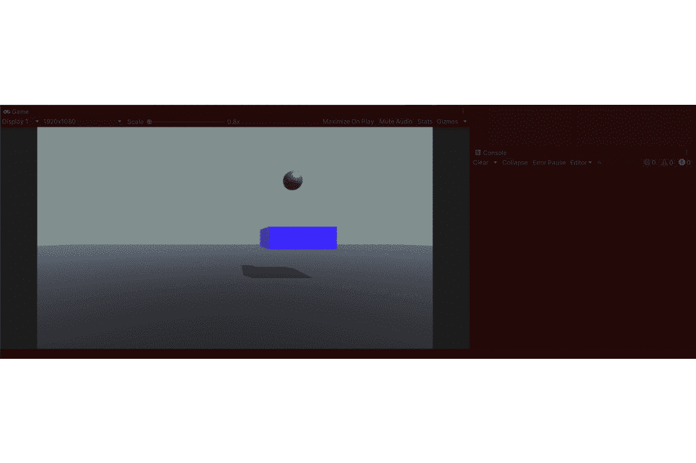
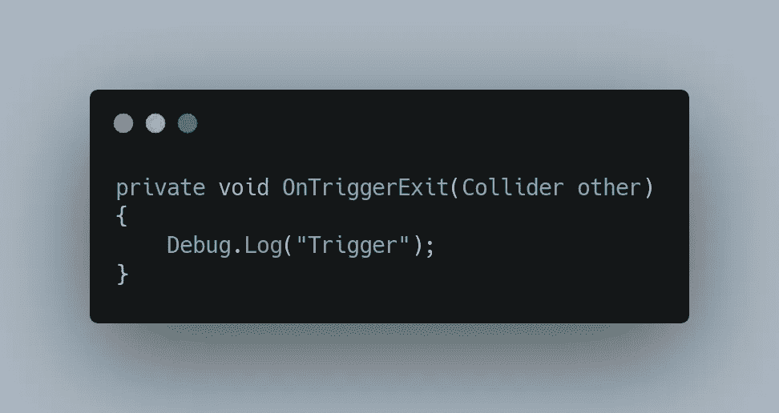
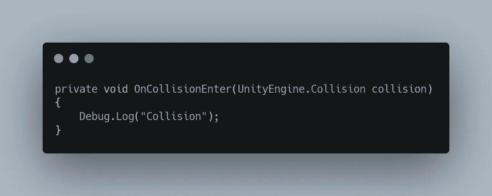
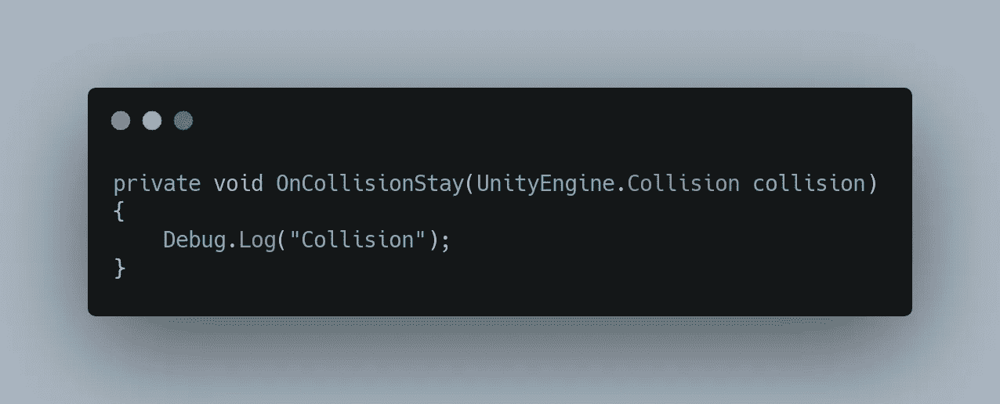
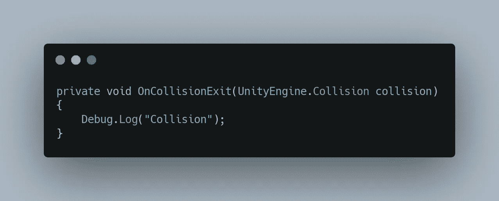
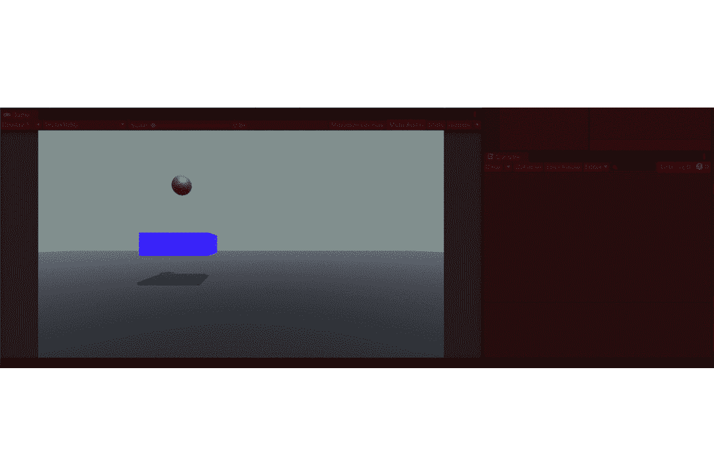

# 统一发展——冲突与触发

> 原文：<https://medium.com/nerd-for-tech/unity-development-collisions-vs-triggers-740d455757bf?source=collection_archive---------4----------------------->

在和 Unity 一起工作的时候，你会发现你需要一些互动来让你的游戏变得有趣。实现这些交互的一种方法是使用碰撞或触发器。

在上图中，我们将两个连接有刚体的球体(要了解更多关于刚体的[点击这里](https://sidthakur3519.medium.com/unity-development-introduction-to-physics-65ef7e08519c))放在两个立方体上，其中一个立方体的**属性被触发**。

这意味着碰撞器不会被物理引擎注册，只会被用来触发事件。

让我们再举一个例子，我们认为左边的球体是 **S1** ，右边的球体是 **S2** ，立方体也是如此分别是 **C1** 和 **C2** 。

首先让我们来看看 **S1** 和**C1**，其中 **C1** 是一个**非运动学刚体(** [在下面的文章](https://sidthakur3519.medium.com/unity-development-introduction-to-physics-65ef7e08519c) **)** 与**使用重力**关闭并且不是触发器，暗示他们受到 Unity 的物理引擎的影响，因此我们看到 **C1** 下落**然而，当我们看着 **S2** 和 **C2** 它们也是**非运动学刚体的**其中 **C2 的**碰撞器**是触发器**在**上拨动**暗示 Unity 的物理引擎对它没有影响，并且随着它成为触发器 **S1** 穿过它。**

碰撞和触发器都有 3 种方法来跟踪各自的碰撞和触发器。

***OnTriggerEnter()、OnTriggerStay()、OnTriggerExit() :***

这些以碰撞器类作为输入，基本上在碰撞时将碰撞器作为一个整体存储。

***OnTriggerEnter():***

当一个碰撞器与另一个碰撞器接触时，调用该方法，其中一个碰撞器启用了**触发器**，并且至少其中一个碰撞器有刚体。

当 S2 和 C2 接触时,“扳机”就印上了

***【OnTriggerStay():***

碰撞器和触发器之间有接触的每一帧都会调用这个方法。两者中至少有一个应该有刚体。

S2 和 C2 接触的每一帧都会印上“触发器”

***OnTriggerExit() :***

当碰撞器停止触发时，这个方法被调用一次。两者都需要一个碰撞器，至少其中一个需要一个刚体。

一旦 S2 和 C2 之间没有联系,“扳机”就会被印出来

***oncolissionenter()、OnCollisionStay()、oncolissionexit()**:***

这些以碰撞类作为输入，基本上存储了碰撞过程中的所有接触点。

***【oncolissionenter():***

当一个碰撞器与另一个碰撞器接触时，就调用这个方法。确保两个碰撞器中至少有一个有刚体组件。

给 S1 附加了一个对撞机脚本

我们注意到一接触“碰撞”就出现在控制台上。

***【oncolissionstay():***

对于每一帧，碰撞体之间都有一个接触点(其中一个需要有一个刚体)。

我们注意到，只要有接触，控制台就会显示冲突

***【oncolissionexit():***

当一个碰撞器离开与另一个碰撞器的联系时，调用这个方法。确保两个碰撞器中至少有一个有刚体组件。

我们注意到当 S1 和 C1 停止接触时,“碰撞”被印了出来。

更多关于碰撞的实际应用。