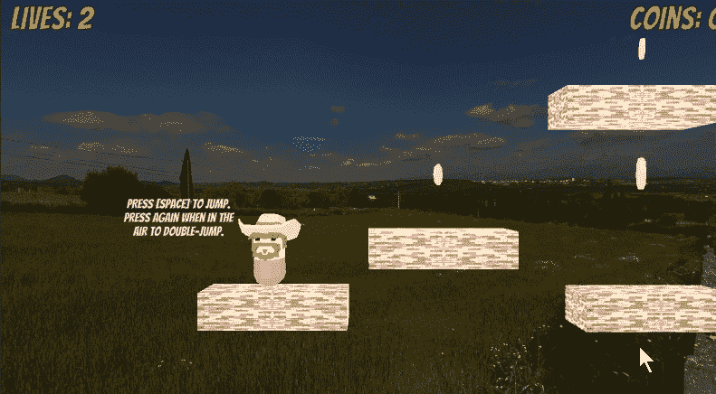
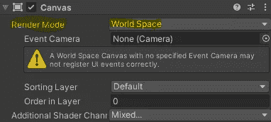
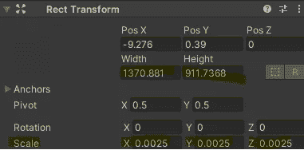
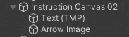
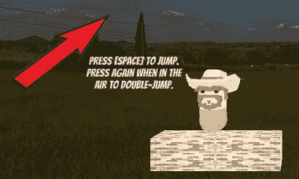

# 统一世界文本

> 原文：<https://medium.com/nerd-for-tech/unity-in-world-text-759367c0ecc5?source=collection_archive---------6----------------------->

**目的:**显示游戏世界中的用户界面项目。

这是一个在 3D 游戏世界中放置 2D 图像的有用技巧。首先我们将创建一个新的*画布*，并将其*渲染模式*设置为*世界空间*。

现在我们可以设置*矩形变换的* *宽度*和*高度*属性。我们的*比例*值应该从很小开始——我在每个 *x* 、 *y* 和 *z* 属性中使用了“0.0025”。我们可以在*场景*标签中调整 gizmo 控件，就像任何其他游戏对象一样。

不，我们可以将文本或图像等其他对象设置为世界画布的子对象，并根据需要放置它们！

