# Unity:通过代码播放声音

> 原文：<https://medium.com/nerd-for-tech/unity-playing-sound-through-code-98f385402b6?source=collection_archive---------9----------------------->

## 让东西爆炸！然后砰！只要你需要！

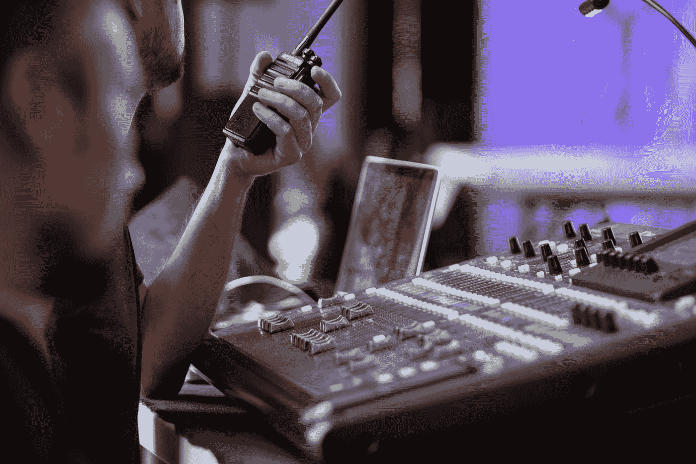

西蒙·因佩伊在 [Unsplash](https://unsplash.com?utm_source=medium&utm_medium=referral) 上的照片

我们现在已经讨论了如何在 Unity 中开始使用音乐，并且在不需要代码的情况下添加了一些不错的背景音乐！但是，在某些情况下，我们不想一直播放音频文件，并且希望控制*在*播放特定的声音。我们可以通过代码实现这一点！我们开始吧！

**设置玩家游戏对象** 当我们从玩家脚本中实例化激光时，最好也在这个脚本中设置与激光相关的所有音频。由于我们可以分配任何我们想要的剪辑(并因此操纵音频剪辑)，播放器本身也需要一个*音频源*组件。我们需要在源游戏对象中分配一个音频剪辑，这就是音频源的来源。还记得*音频剪辑*槽吗？

确保取消选中*唤醒时播放*复选框！否则，你会在游戏开始后就听到声音，甚至不用发射激光。

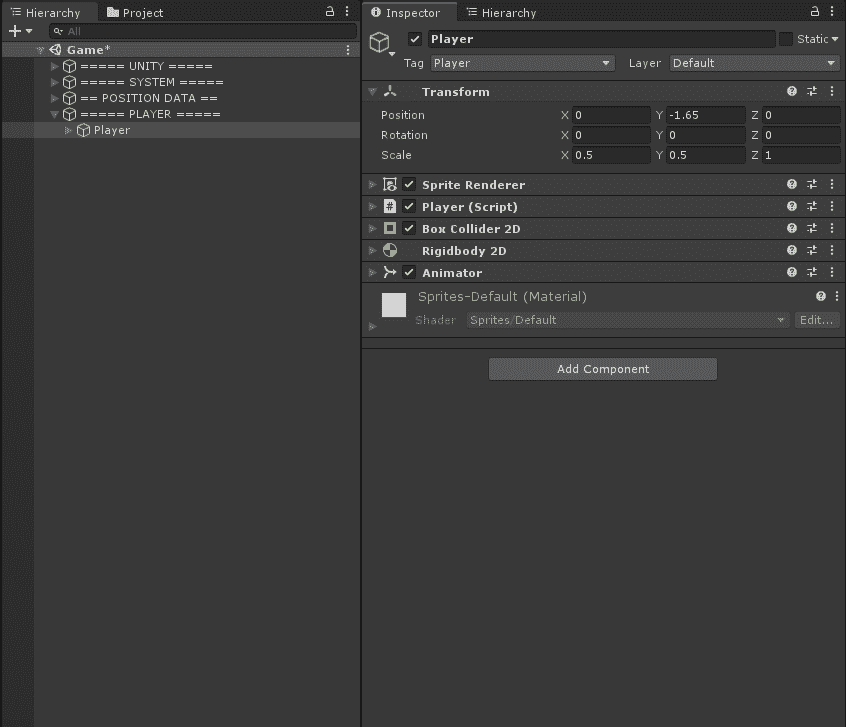

**设置 Player.cs 脚本** 接下来要做的是为我们想要播放的音频片段创建一个变量。当我们存储一个音频剪辑时，我们需要的变量类型是类型 *AudioClip。另外，我们还需要在播放器上添加一个*音源*组件。我们这样做是因为我们希望能够改变一些额外的设置，如所需剪辑的*音量*或*音高*。*

首先，在脚本中添加音频剪辑和音频源的变量:

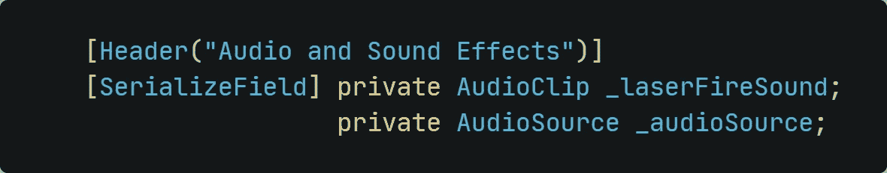

然后，返回编辑器，分配你在发射激光时喜欢听到的音频剪辑:

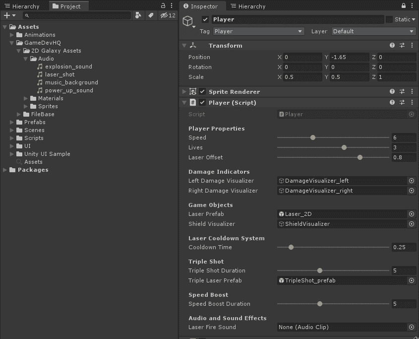

**通过代码** 播放声音为了播放声音，我们必须添加所需的代码。

首先，我们需要一个音源的参考。我们还想对它进行空检查。

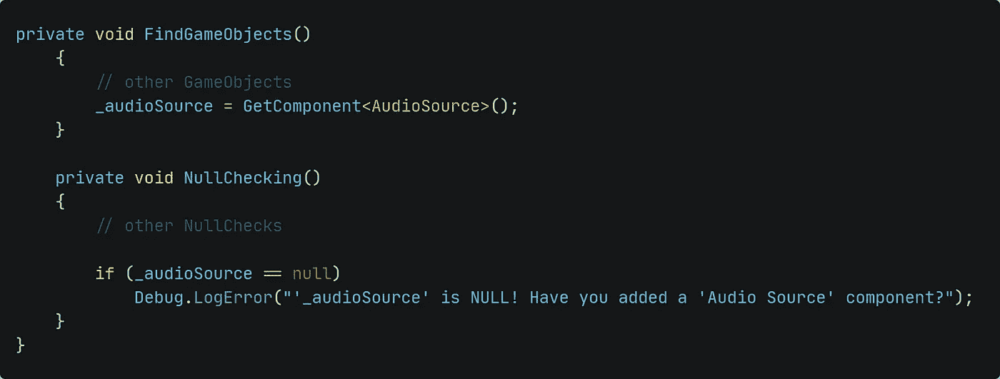

我们希望在我们发射激光的同时播放这个片段。因此，我们应该将代码添加到 *InstantiateLaser()* 方法内部。

为了以正确的方式做到这一点，让我们考虑一下我们在这里必须做什么:

*   我们需要分配音频源应该播放的剪辑
*   由于播放器脚本已经有了我们想要的剪辑的变量，我们可以只使用这个变量
*   音频源应该播放声音

这将导致以下代码:

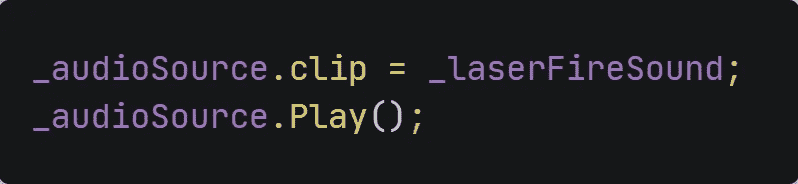

**敌人爆炸的声音** 我们刚刚学会了如何播放我们发射激光时的音效。至于敌人，只是我们打中了就消失了。我们破坏的时候加个爆炸声吧！

我们通过使用刚才使用的相同方法来实现这一点。

*   首先我们需要在敌人
    *上加一个*音源*组件提示:切记敌人是预制的！要么直接在上面添加组件，要么“应用”您后来所做的更改！*
*   取消选中*唤醒时播放*复选框
*   在敌人. cs 脚本中设置*音频剪辑*和*音频源*变量
*   创建句柄并对它们进行空值检查
*   在编辑器中分配所需的音频片段

由于我们想播放敌人被激光击中后的声音，我们应该在 *Enemy.cs* 脚本中添加逻辑。在我们讨论将代码放在哪里之前，让我们先看看当前的代码:

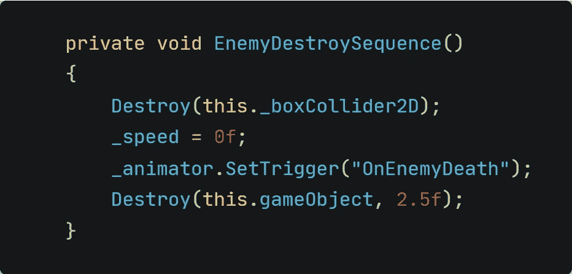

*   首先，我们摧毁 *BoxCollider2D* 以避免再次被击中
*   之后，我们将速度设置为 0，以避免敌人进一步移动
*   在那之后，我们给动画师触发播放爆炸动画
*   最后，我们在动画结束后消灭敌人

现在就来想想播放爆炸音效的最佳时刻吧。在动画播放之前播放爆炸声就没意义了吧？因此，我们首先应该给动画师开始播放动画的信号。在那之后，我们应该在敌人被摧毁之前播放声音。

现在我们已经确定了添加代码的最佳位置，让我们继续添加它。这和之前在播放器上的程序是一样的。

*   将音频剪辑指定给爆炸声音剪辑
*   告诉音频源播放声音

完整的代码将如下所示:

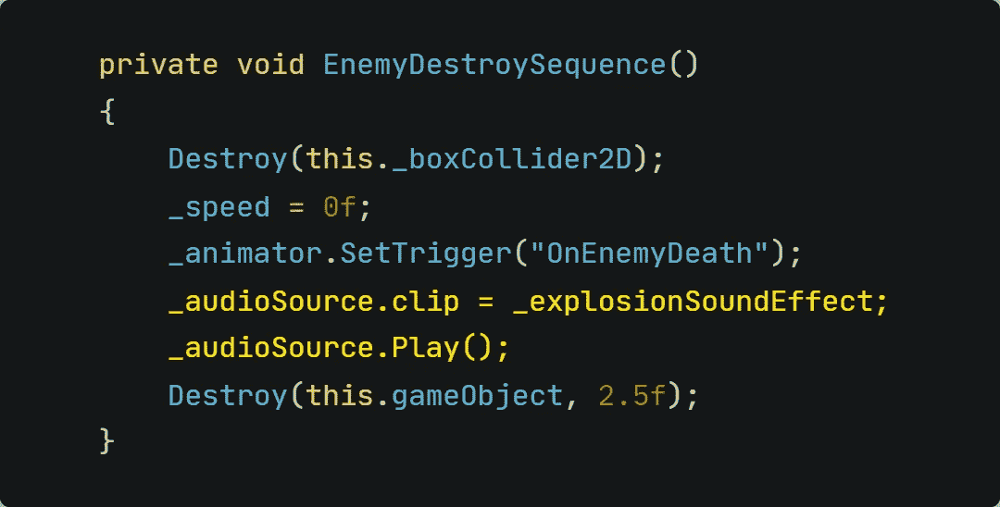

**添加开机音效** 如果我们想为开机画面添加音效，我们需要使用另一种方法。我们为玩家和敌人使用的实现在电源上不起作用。当玩家触摸它时，我们破坏了电源，因此也会破坏它上面的音源。

有很多方法可以解决这个问题。例如，您可以

*   在指定的时间后摧毁游戏对象，并在它被摧毁前播放声音
*   使用*播放剪辑点*，它基本上创建了一个一次性音源来播放声音
*   创建一个拥有*音频源*的游戏对象，并用它来播放声音

因为我们想完全控制声音播放的音量，所以我们选择第三个选项。

*   创建一个游戏对象" *PowerUp_AudioManager"*
*   添加一个*音源*组件
*   在*加电预置*和*音源*处分配*音频剪辑*

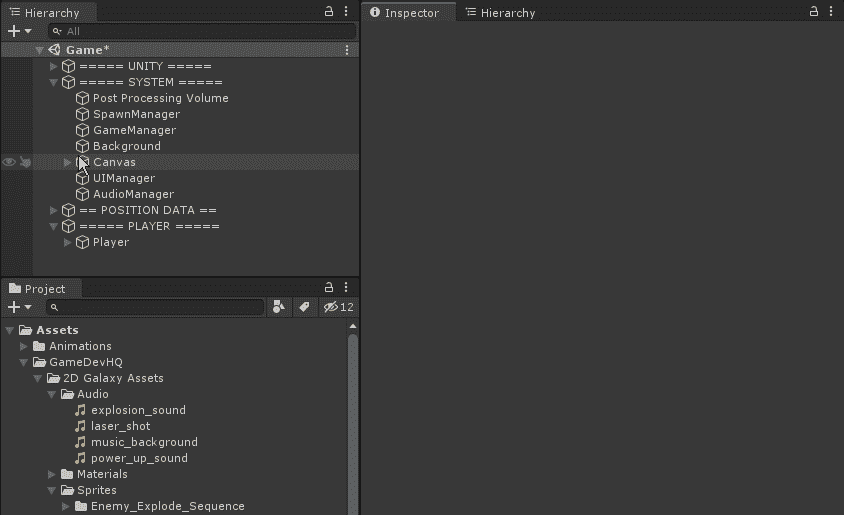

现在，开始准备 *PowerUp.cs* 脚本。和以前一样的程序。

*   创建对音频源的引用
*   创建对音频剪辑的引用
*   空检查引用

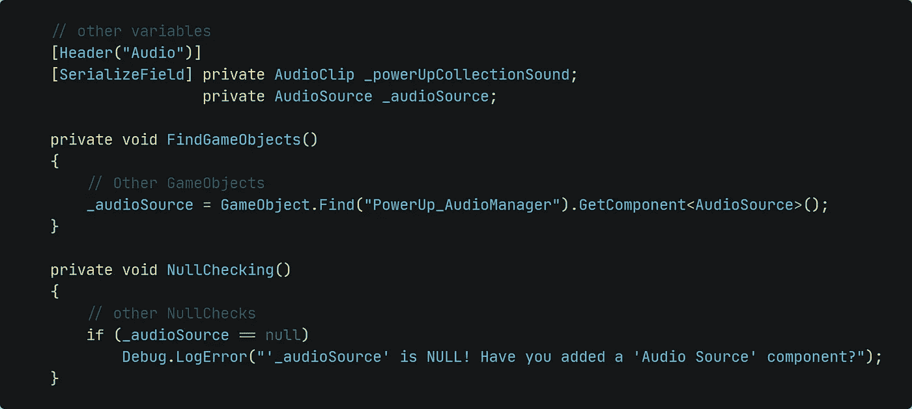

其余的也与先前的过程相同。我们想在加电和播放器碰撞后播放音效。由于冲突是在 *OnTriggerEnter2D()* 方法中检查的，我们在那里添加了代码:

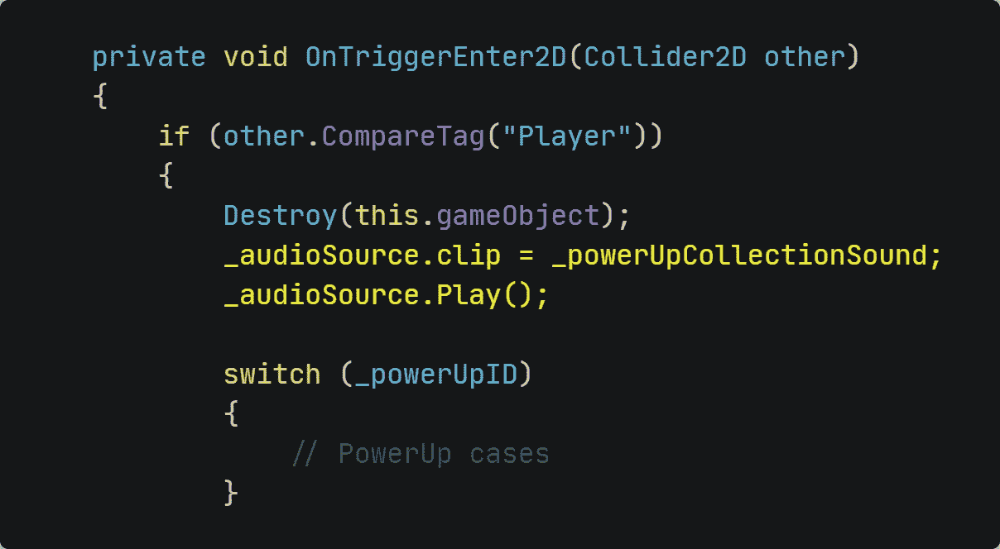

就是这样！太空射击游戏中的音效！那些只是一些简单的效果，但是对于游戏的手感非常有效！