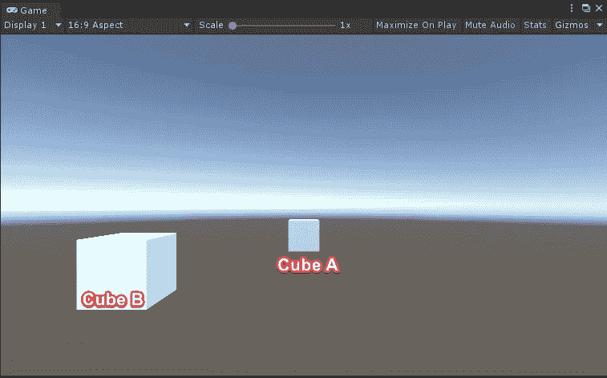
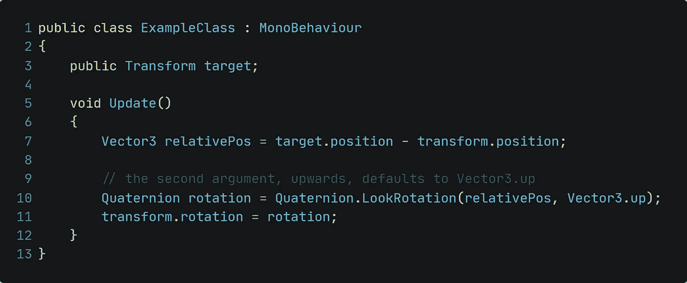

# 单位四元数旋转

> 原文：<https://medium.com/nerd-for-tech/unity-quaternion-rotation-df71e45cdc9d?source=collection_archive---------16----------------------->

## 用 LookRotation 关注游戏对象！

你以前可能玩过塔防游戏。你有没有注意到，不管你搬到哪里，至少有一个敌人一直在看着你？这正是 Unity 中 LookRotation 的概念。它跟踪另一个游戏对象，并旋转以始终聚焦它。让我们看看今天如何在 Unity 中实现这样的行为！

**起始环境** 我们有两个立方体，立方体 A 和立方体 b

目标是立方体 B 将跟踪和跟随立方体 a 的运动。

**我们需要的代码** 快速的谷歌搜索将带我们到[四元数的 Unity 脚本参考。LookRotation()](https://docs.unity3d.com/ScriptReference/Quaternion.LookRotation.html) 。在那里我们可以找到下面的示例代码:

让我们来分解一下代码:

*   我们指定了一个目标。在我们的例子中，这将是立方体 A
*   通过获取目标的位置并从中减去当前玩家的位置*(在我们的例子中是立方体 B)* ，可以计算出一个相对位置
*   接下来是实际旋转量的计算。我们使用 *LookRotation()* 方法并传递相对位置和向上方向的向量 3。
*   最后，我们将立方体 B 的当前旋转指定给计算出的旋转

如果我们现在在 Unity 中运行代码，我们将得到以下行为:

立方体 B 现在将总是看着立方体 A，不管它移动到哪里！

这就是今天的小文章！感谢您的宝贵时间！