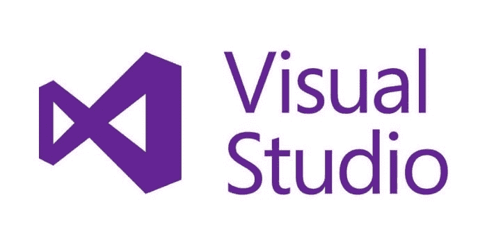
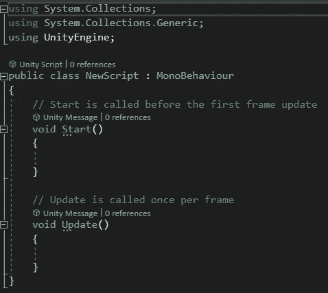
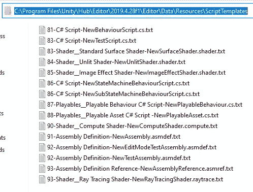
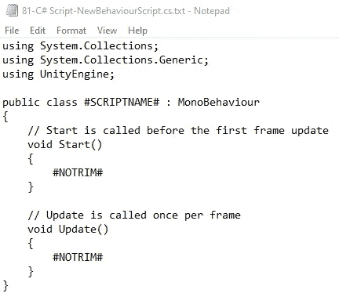
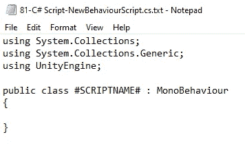
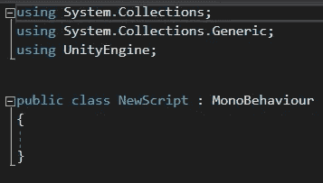
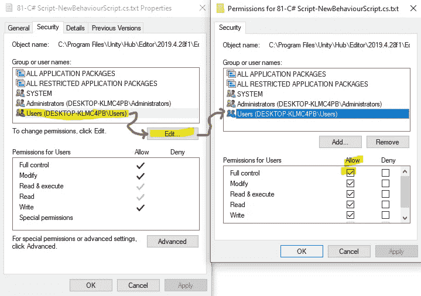

# Visual Studio 中的 Unity 脚本模板

> 原文：<https://medium.com/nerd-for-tech/unity-script-templates-in-visual-studio-de9c55009f5d?source=collection_archive---------5----------------------->

**目标:**更改 Visual Studio 的 Unity 脚本模板。

当我们在 Unity 中创建新的脚本时，Visual Studio 默认情况下会创建:

这对新程序员来说太好了。但是我们已经做了足够长的时间，以至于我们不需要提醒在开始时调用*开始方法*。我们将改变这种情况。

我们必须导航到系统中 Unity 保存模板的位置。这可能需要一些打探。对于我们打算使用的 Unity 版本，我们必须这样做——我们安装的每个版本都有自己的模板。我的位于(我的 Unity 版本在**黑体**):

> c:\ Program Files \ Unity \ Hub \ Editor \**2019 . 4 . 28 f1**\ Editor \ Data \ Resources \ script templates

现在打开名为*81-C # Script-new behaviourscript . cs . txt*的文件。它看起来会像这样:

我们可以根据自己的喜好进行编辑。我们可以去掉评论。或者也许我们总是发现自己删除了*开始*和*更新*，直到我们需要它们——继续删除它们吧！我们总是可以使用自动完成来逐个添加它们。想一直秀出*清醒*的方法？补充一下！

以下是我所做的更改:

而且成功了！

注意:我们可能需要修改*的权限。txt* 文件来保存它们。在 Windows 中，右击文件并选择*属性*。在*安全*选项卡上，选择*用户*，点击*编辑*，勾选*完全控制*框。为此，我们可能需要管理员权限！一旦我们完成了模板的编辑，为了将来的安全起见，我们可能希望将*用户*权限恢复为仅*读取&执行*和*读取*。

