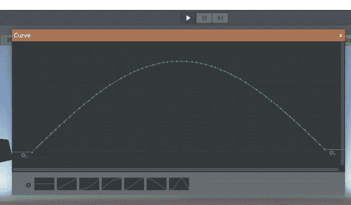
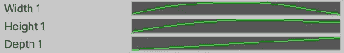
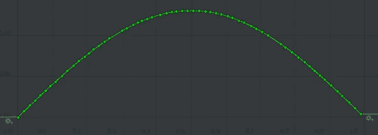
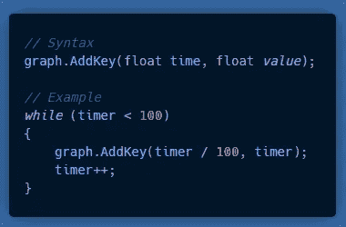
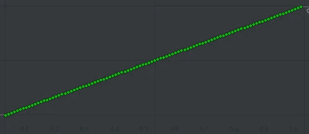

# Unity 提示:动画曲线图

> 原文：<https://medium.com/nerd-for-tech/unity-tip-animation-curve-graphs-34eeb3692aa7?source=collection_archive---------4----------------------->

## 最近，当您需要在编辑器中以类似图形的形式可视化 Unity 数据时，我发现了一个聪明而有用的选项。

# 动画曲线:

**动画曲线**是 Unity 的一项功能，通常用于通过 Unity 内置的动画系统可视化和创建动画。

然而，它们也可以用于动画之外的各种用途。例如，不久前我使用动画曲线为长度/宽度/高度制作了一个[动态花朵网格。](https://vintay.medium.com/a-custom-flower-generator-using-dynamic-meshes-in-unity-9f89c932b733)

# 作为图形的动画曲线:

**动画曲线**也可以作为一个可视图形，在运行时用你想要的任何**数字**数据值填充。

运行时填充的动画曲线图。

显示从 A 点到 b 点的一步中一只脚的高度的图表。

## 创建图表:

在任何 MonoBehaviour C#脚本中，创建一个新的**动画曲线**变量。**动画曲线**是 UnityEngine 名称空间的一部分。

实践中的上述例子

现在您可以看到，任何数字数据都可以添加到这个图表中，以方便制作点的图形。这是一个很好的简单的方法来获得你的游戏数据的可视化表示。