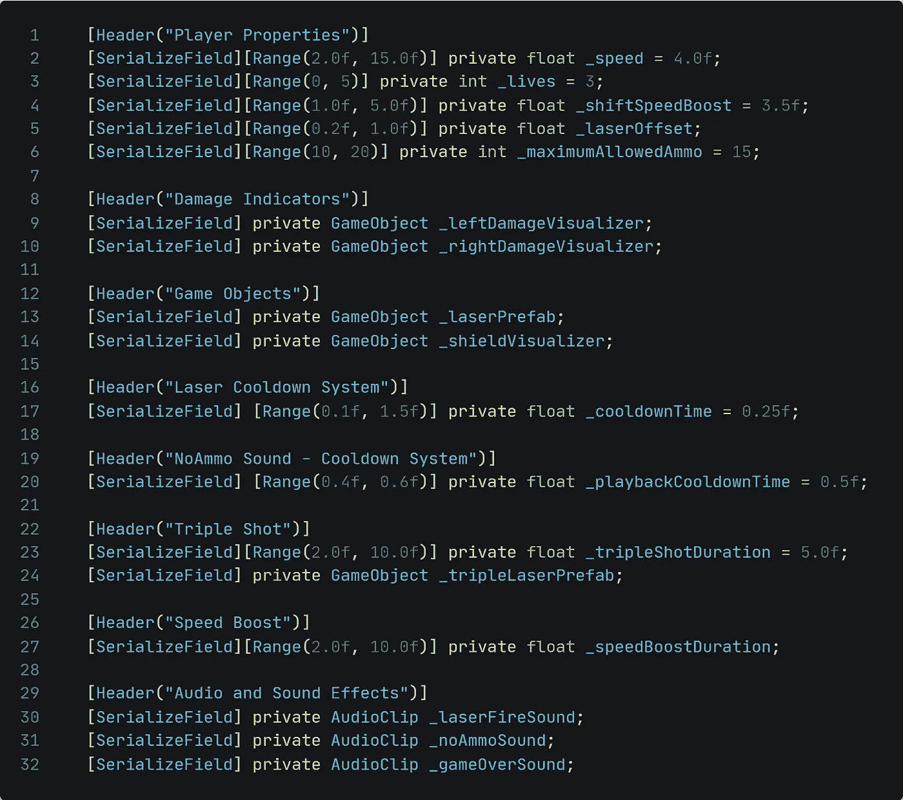
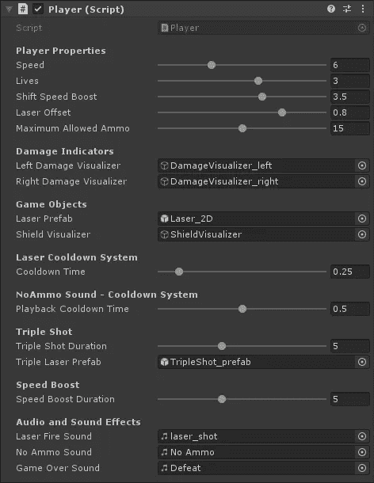
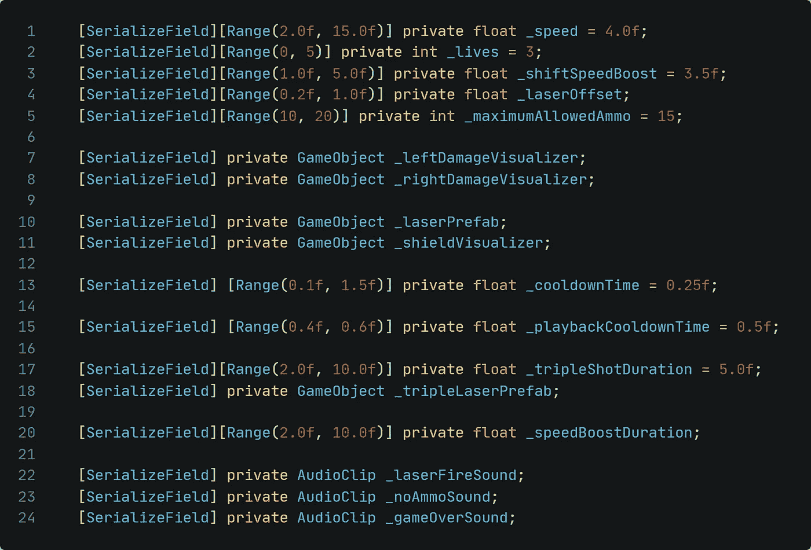
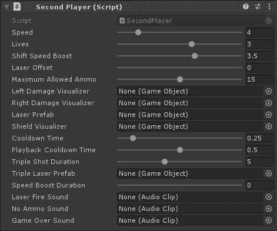

# Unity 提示-标题属性

> 原文：<https://medium.com/nerd-for-tech/unity-tip-the-header-attribute-8f1c5f34a717?source=collection_archive---------12----------------------->

## 保持检查员的整洁！

你可能已经注意到我在之前的一些文章中使用了[Header]属性(比如[这篇](/nerd-for-tech/space-shooter-limiting-the-ammo-of-the-player-5e55e574be57))。
在这篇短文中，我将向您展示这个属性实际上是做什么的，以及为什么您应该使用它。我们开始吧！

让我们以 *Player.cs* 脚本为例。为了简单起见，我将只使用前面带有*【serialize field】*的变量，因此我们只使用那些我们在检查器中实际看到的变量。我们目前有以下匹配这些过滤器的变量:

在检查器中，这些看起来像这样:

检查器中的脚本

**移除标题会导致什么？** 现在让我们删除 Header 属性。

该脚本现在将如下所示:

如你所见，使用的线条减少了。我们甚至可以通过删除充满空白的空行来进一步减少它们。然而，仅仅快速浏览一下脚本，可能更难看出哪一类变量存储在哪里。

在 Unity 内部，检查器现在看起来像这样(为了避免任何编译器错误，我刚刚为此创建了一个新脚本):

那看起来不太整洁或干净，是吗？

**结论——为什么要使用属性？** 实际上由于各种原因:

*   你保持脚本文件更加整洁。
    然而，你将需要更多的代码行。
*   检查员将保持整洁干净
*   设计者对变量的分类将会更加容易
*   您可以为要分配的变量和资产创建类别

这就是今天的提示！我希望现在您对在脚本中使用 Header 属性的好处有一点清楚了。