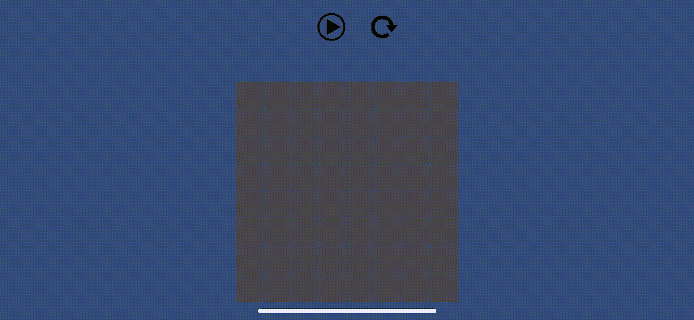
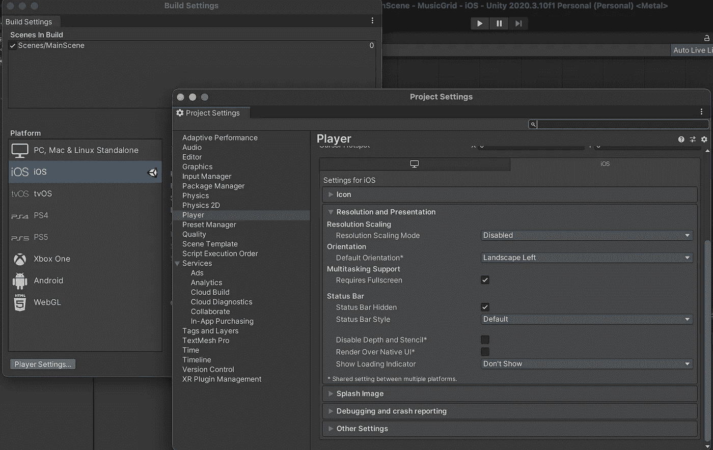
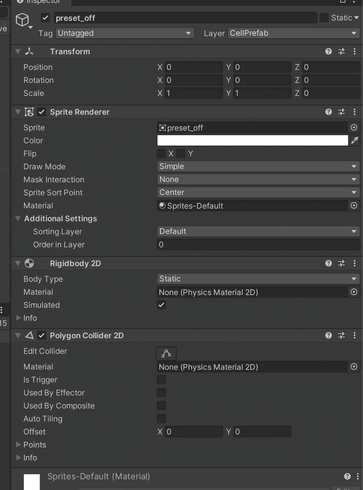
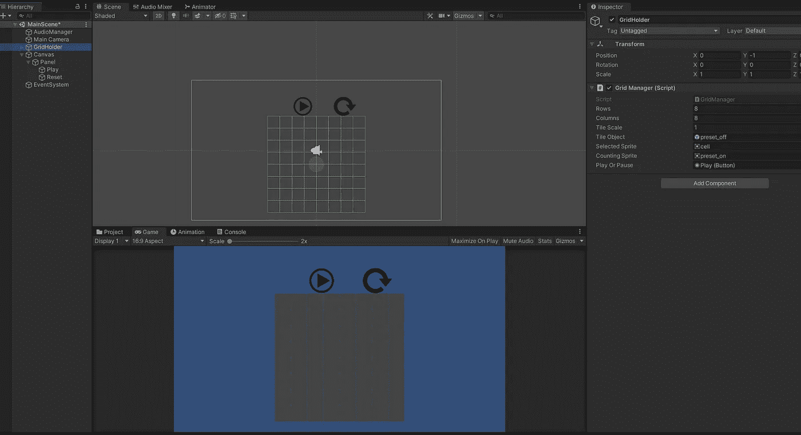
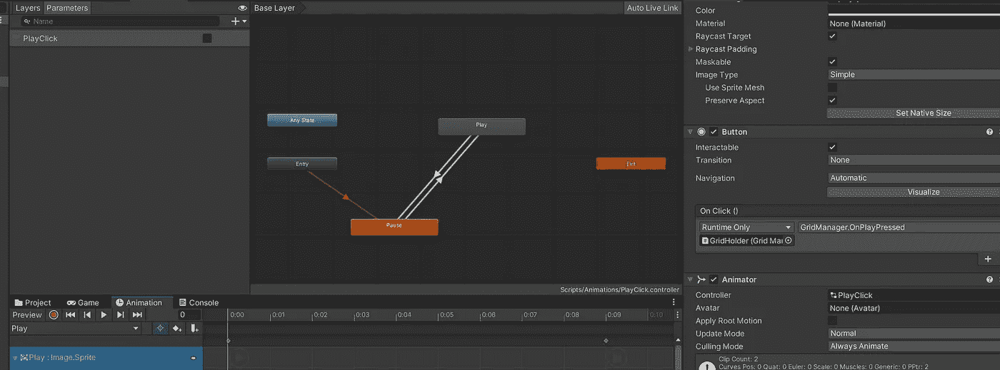
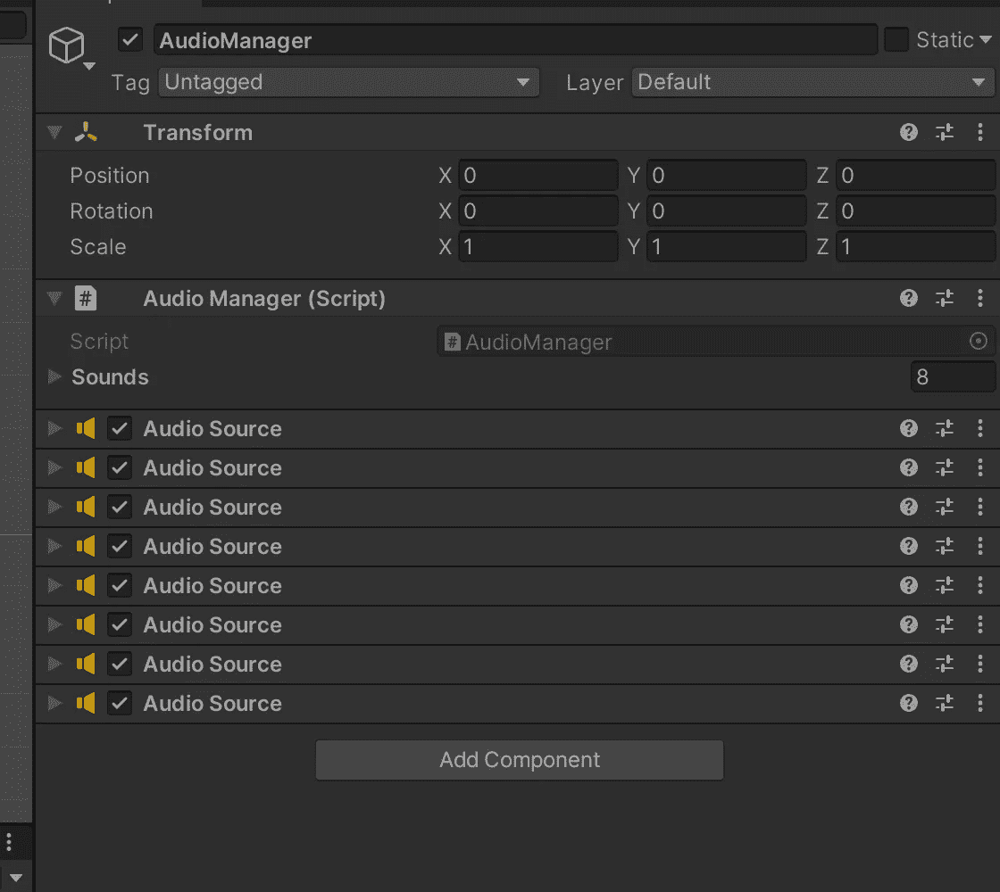

# Unity2d:带音乐的网格上的简单触摸处理

> 原文：<https://medium.com/nerd-for-tech/unity2d-simple-touch-handling-on-grid-with-music-7497ccdb901d?source=collection_archive---------20----------------------->

在这篇文章中，我决定回忆一下我在 Unity 上“被遗忘”的经历。更准确地说是 Unity2d。因此，该项目(引用，或者我会说测试任务)样的样本二维网格，在代码中构造，允许用户选择细胞，它播放声音。一种钢琴，或一些其他乐器…还有移动选择指示器，如果选择与触摸匹配，它将播放音乐。简单的动画用于改变播放/暂停按钮。

在 *iPhoneX (iOS 14)* 上的最终游戏是这样的:



细胞选择和主动细胞运动

图片(精灵)取自在线，一些按钮(顶行)的缩放比例不同。不完美，但对模型来说还可以。

在 iOS 设备上选择了风景模式:(*构建设置- >播放器设置*)



iOS 上的风景

**细胞:**

细胞是基于预设和精灵的使用(更好地使用材质和着色器的边界，我猜):



**PolygonCollider** 用于处理 2d 中的触摸。

**场景**:

场景包含 **GridManager** ，负责代码中网格创建的组件。**音频管理器**用于播放暂停声音。



场景视图

通过使用 **tileObject** 并创建其实例，从 **Awake** 方法完成网格生成。

```
private void GenerateGrid()
    {
        tileObject.transform.localScale = new Vector3(tileScale, tileScale);
        **var size = tileObject.GetComponent<SpriteRenderer>().bounds.size;**

        float xOrigin = (float)((Columns - 1) * size.x * -0.5);
        float yOrigin = (float)((Rows - 1) * size.y * -0.5); float xPos = xOrigin;
        float yPos = yOrigin; for (var i = 0; i < Rows; i++)
        {
            for (var j = 0; j < Columns; j++)
            {
                var newTile = Instantiate(tileObject);
                newTile.transform.parent = transform;
                newTile.name = (j + i * Columns).ToString();
                newTile.transform.localPosition = new Vector3(xPos,   yPos, 0);
                xPos += size.x;
            }
            xPos = xOrigin;
            yPos += size.y;
        }
    }
```

触摸在**更新**中处理:

```
// Update is called once per frame
    void Update()
    {
        if (Input.GetMouseButtonDown(0))
        {
            Debug.Log("Position " + Input.mousePosition);
            HandlePosition(Input.mousePosition);
        }
        else
            HandleTouchOnNeed();
    } 
```

**单元格选择:**

网格单元的选择是在 sprite 的操作级别上处理的:

```
 void SwapChildState(int index)
    {
        if (selectedTiles.Contains(index))
            selectedTiles.Remove(index);
        else
            selectedTiles.Add(index); var shouldPlay = selectedTiles.Contains(index);
        var rowIndex = index / Rows;
        if (shouldPlay)
            audioManager.Play(rowIndex, true);
        else
            audioManager.StopPlaying(rowIndex); ChangeChildState(index.ToString(), shouldPlay);
    } void ChangeChildState(string name, bool selected)
    {
        ChangeChildState(name, selected, selectedSprite,  tileObject.GetComponent<SpriteRenderer>().sprite);
    } void ChangeChildState(string name, bool selected, Sprite  selectedSprite, Sprite nonSelectedSprite)
    {
        ChangeChildState(name, selected ? selectedSprite : nonSelectedSprite);
    } void ChangeChildState(string name, Sprite sprite)
    {
        var childTranform = gameObject.transform.Find(name);
        var renderer = childTranform.GetComponent<SpriteRenderer>();
        renderer.sprite = sprite;
    }
```

**动画**:

按下暂停/播放按钮激活按钮的精灵动画。**播放点击**布尔标志触发播放动画和反转动画(由负播放速度控制)



播放/暂停动画

```
// Update is called once per frame
    void Update()
    {
        if (Input.GetMouseButtonDown(0))
        {
            Debug.Log("Position " + Input.mousePosition);
            HandlePosition(Input.mousePosition);
        }
        else
            HandleTouchOnNeed();
    } private void HandleTouchOnNeed()
    {
        foreach (var touch in Input.touches)
        {
            if (touch.phase == TouchPhase.Began)
            {
                HandlePosition(touch.position);
            }
        }
    } private void HandlePosition(Vector2 position)
    {
        if (isPaused)
            return; var wp = Camera.main.ScreenToWorldPoint(position);
        var touchPosition = new Vector2(wp.x, wp.y); **var collider = Physics2D.OverlapPoint(touchPosition);**
        if (!collider)
            return; if (int.TryParse(collider.gameObject.name, out int res))
        {
            var rowIndex = res / Columns;
            var colIndex = res - rowIndex * Columns;
            Debug.Assert(rowIndex <= Rows);
            Debug.Assert(colIndex <= Columns);
            Debug.Log("!!! Item " + res);
            SwapChildState(res);
        }
    }
```

通过交换先前的选择并使用模运算来更改网格的活动单元格。它在 2.5 秒内保持活动状态。从 **FixedUpdate** 中调用相应的方法。

```
 void FixedUpdate()
    {
        UpdateCount();
    } void UpdateCount()
    {
        if (!IsCounting || isPaused)
            return; var diff = (int)Mathf.Ceil((float)(Time.realtimeSinceStartup -   lastInterval));
        var diffCondition = diff >= 2.5;
        if (diffCondition || countRow == 0 && countColumn == 0)
        {
            if (diffCondition)
            {
                lastInterval = Time.realtimeSinceStartup;
                var oldIndex = countRow * Columns + countColumn;
                ChangeChildState(oldIndex.ToString(),   selectedTiles.Contains(oldIndex)); if (Rows - 1 == countRow)
                {
                    countRow = 0;
                    if (countColumn == Columns - 1)
                    {
                        countColumn = 0;
                    }
                    else
                        countColumn += 1;
                }
                else
                    countRow += 1;
            } var index = countRow * Columns + countColumn;
            if (selectedTiles.Contains(index)) {
                Debug.Assert(index >= 0 && index < Rows * Columns);
                audioManager.Play(countRow);
            } else {
                ChangeChildState(index.ToString(), countingSprite);
            }
        }
    }
```

**音频:**

**AudioManager** 包含网格中每行的一组声音，由相应的类描述(参见[括号](https://www.youtube.com/user/Brackeys)中的类似代码) :

```
[System.Serializable]
public class Sound
{
    public AudioClip clip;
    public string name; [Range(0.1f, 1f)]
    public float volume = 1.0f; [HideInInspector]
    public AudioSource source;
}
```



音频管理器

```
 //excerpt from AudioManager public Sound[] sounds;// Start is called before the first frame update
    void Awake()
    { var index = 0;
        foreach (var sound in sounds)
        {
            var source = gameObject.AddComponent<AudioSource>();
            source.volume = sound.volume;
            source.clip = sound.clip;
            sound.source = source; if (sound.name == null || sound.name.Length == 0)
                sound.name = string.Format("{0}", index); 
            index += 1;
        }
    } public void Play(string name, bool force = false)
    {
        var sound = sounds.FirstOrDefault(sound => sound.name == name);
        if (sound == null)
            return; if (!sound.source.isPlaying || force)
        {
            sound.source.Stop();
            sound.source.Play();
        }
    }
```

**播放/暂停**由代码中的标志(isPaused)处理。可以使用**time . scale**但是设置为 0 会冻结按钮的动画和状态转换。

请在 [GitHub](https://github.com/yakushevichsv/MusicBoardUnity) 上找到最终代码