# Unity 的新输入系统

> 原文：<https://medium.com/nerd-for-tech/unitys-new-input-system-5cb357e18cdb?source=collection_archive---------3----------------------->

Unity 的新输入系统更像是一个模块化的输入系统。这背后的想法是，我们定义动作，为这些动作的行为编码，然后由我们的输入设备触发。这意味着我们的代码不再需要单独编码来使用控制器、键盘和鼠标(您可以为不同的设备使用不同的键绑定来触发相同的操作)。新的输入系统使我们的游戏更容易增加多平台支持。

让我们首先使用包管理器将新的输入系统添加到我们的项目中(在搜索输入系统包时，确保您在 Unity 注册表中)。

***窗口→软件包管理器→ Unity 注册表→安装输入系统***

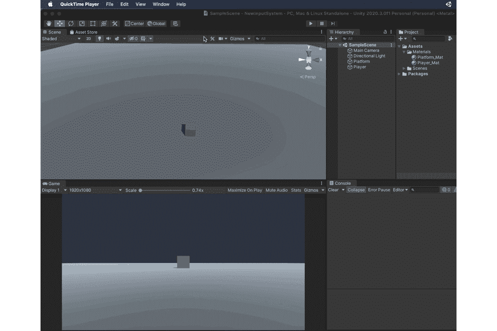

完成后，您将被要求重新启动项目，以启用新安装的输入系统。

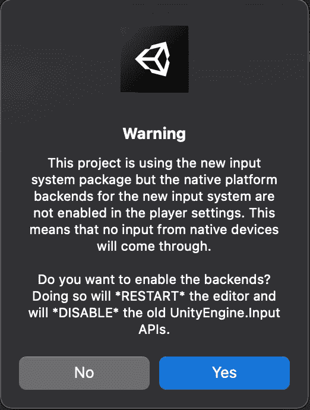

是啊！！！

*注意:有了这个，你就不能使用旧的输入系统了。当您切换代码库以匹配所需的系统时，要切换回或让新旧输入系统同时运行，您可以执行以下操作，*

***编辑→项目设置→播放器→其他设置→主动输入处理***

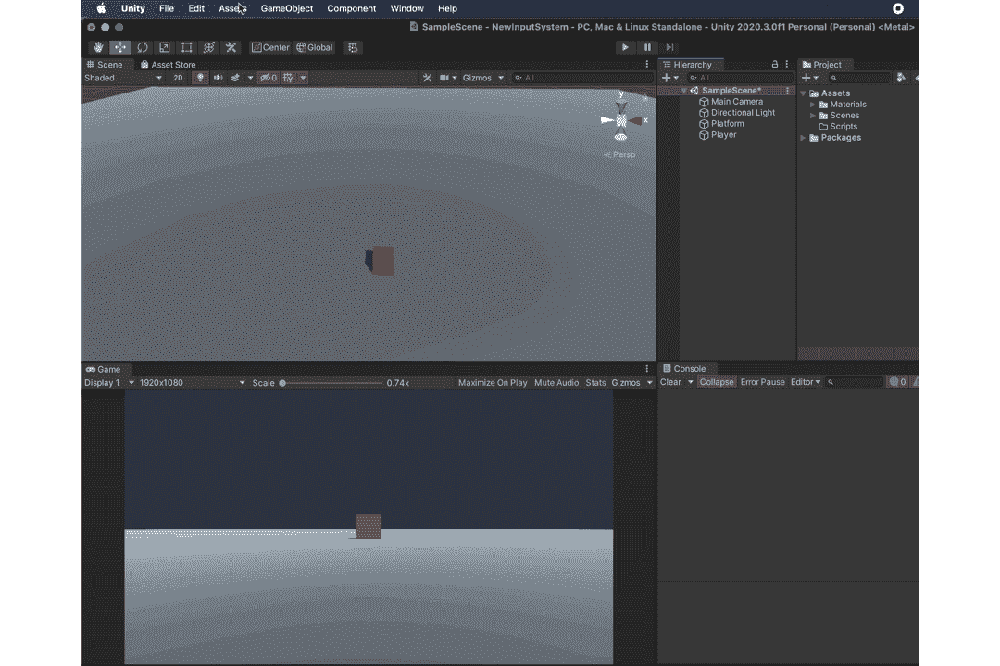

首先，让我们创建一个**输入动作**资产，它将存储我们期望的**动作**以及各种设备所需的按键绑定。

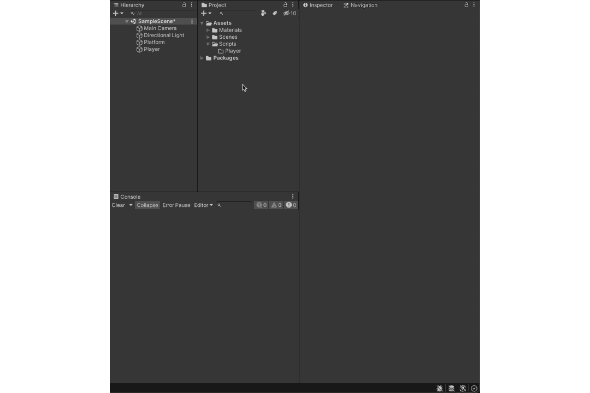

让我们好好看看**输入动作**面板，

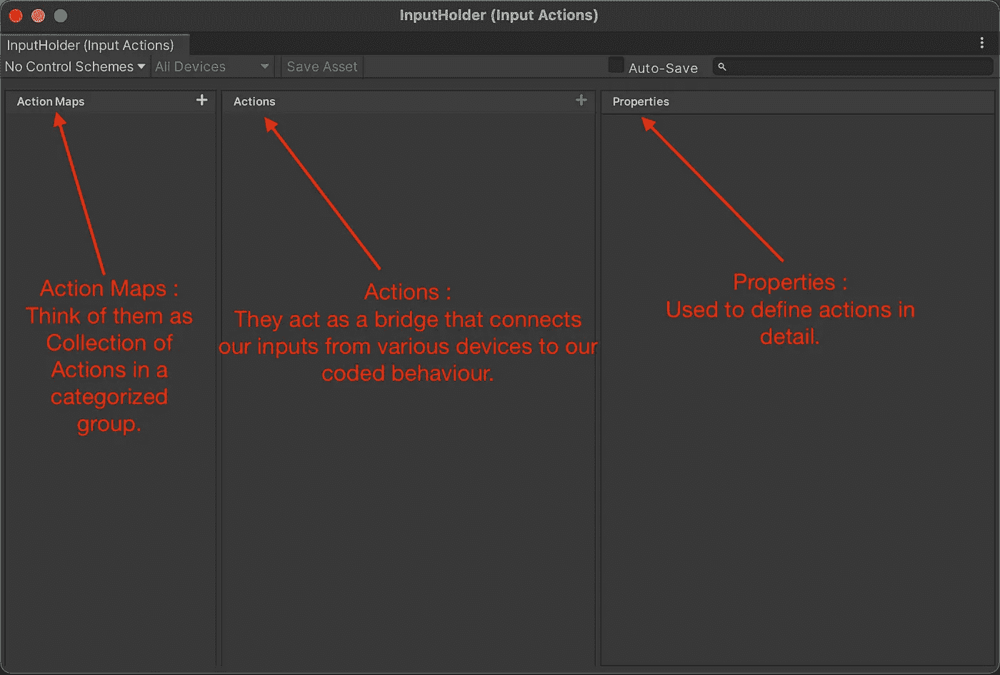

我们将做一个基本的角色移动(向上、向下、向左、向右和对角移动)来展示新的**输入系统**。

因此，我们可以有一个处理各种玩家控制的**动作图**，这意味着这里的**动作**将是**移动**并且**属性**将进一步定义移动。

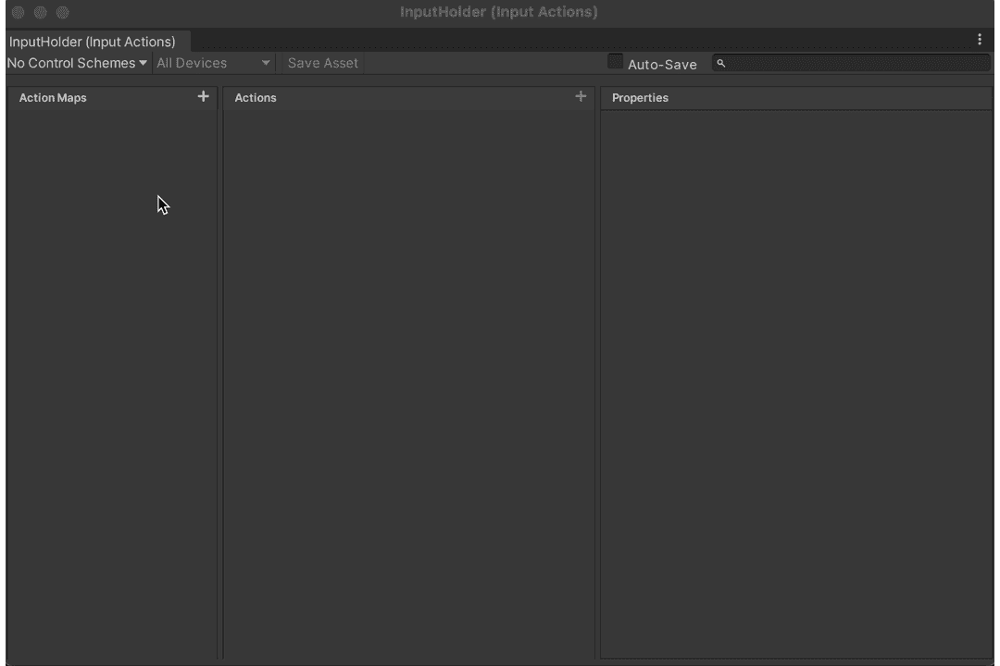

现在让我们将键盘和控制器绑定添加到我们的移动动作中。对于键盘，我想用 **W、A、S、D** 键分别将**向上移动**、**向左移动**、**向下移动**和**向右移动**。对于控制器，我想使用左边的模拟杆来控制运动。

由于我们希望移动连续发生，当我们按下所需的键/移动模拟操纵杆时，我们需要操作**动作类型**属性。

***动作类型:***

**值**:当需要跟踪连续的状态变化(如运动)时使用。如果同时使用两个设备，则返回对输出影响较大的设备。

**按钮**:这是默认设置。它用于跟踪按键或按钮的按压(例如，按 X 跳转)。

**通过**:这与**值**基本相同，唯一的区别是当两个或多个设备同时使用时。**通过**不检查哪个对输出影响更大。相反，将返回任何影响(最近的影响，不管它有多大的影响)。

对于这个测试用例，我们将使用**值** **动作类型。**

当使用**值**或**传递** **动作** **类型**时，我们发现自己拥有一个名为**控制** **类型的附加参数，**定义了我们期望从输入设备获得的输入类型。由于我们要处理垂直运动、水平运动以及它们的组合，我们将使用**控制** **类型**类型**矢量 2** 类型。

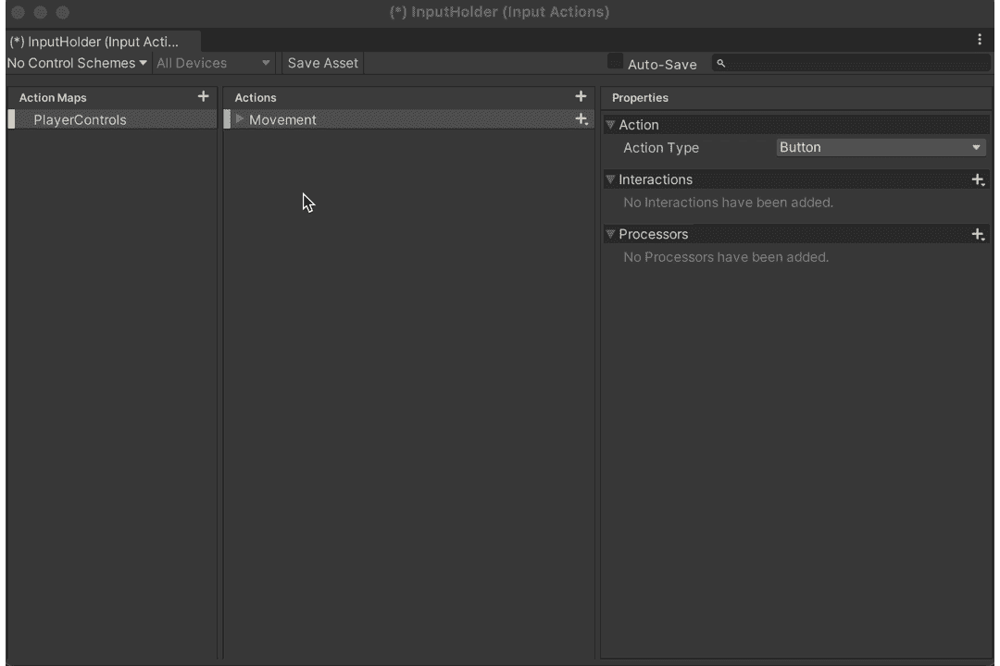

“属性”选项卡还包含一个交互和处理器选项。**交互**处理触发输入所需满足的条件(按住一个按钮，点击一个按钮，多次按下，等等)。**处理器**在收到输入值时修改输入值(归一化值、反转值、设置死区等)。

我们现在可以添加键盘和控制器**动作**，它们是按键绑定。

当我们创建一个动作(在这个例子中是运动)时，它带有一个绑定(尚未配置)。我将使用它来配置操纵杆，并为键盘绑定创建一个新的 2D 合成向量。

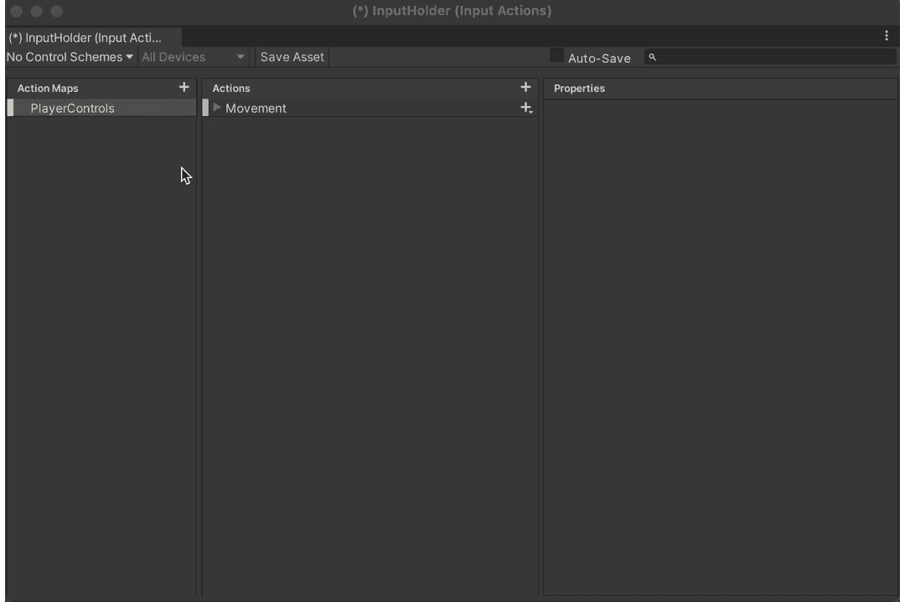

*注意:“听”会找到你刚才按下的输入。因此，如果我移动左操纵杆，我会看到两个选项，一个是左操纵杆[游戏手柄](我选择的那个，因为我希望任何控制器都可以移动我的角色)，另一个是[Playstation 4]，这是我正在使用的控制器。*

我还可以创建一个**控件** **方案**，它根据所使用的输入设备对我的控件进行分类。

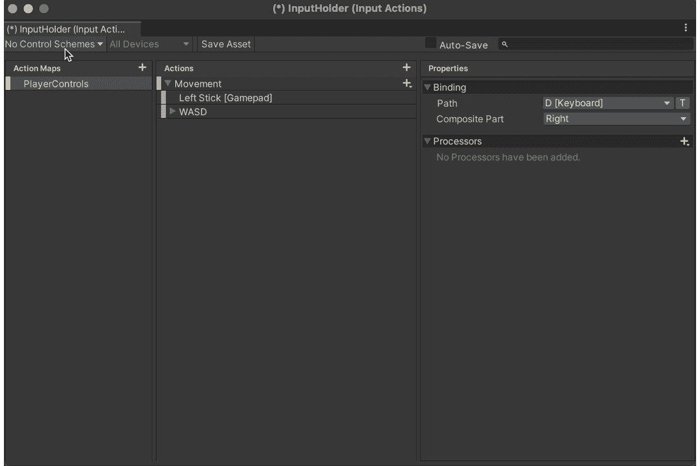

我创建了两个控制方案，一个用于键盘，另一个用于控制器。现在让我们根据我们的控制方案将我们的**动作**分组。

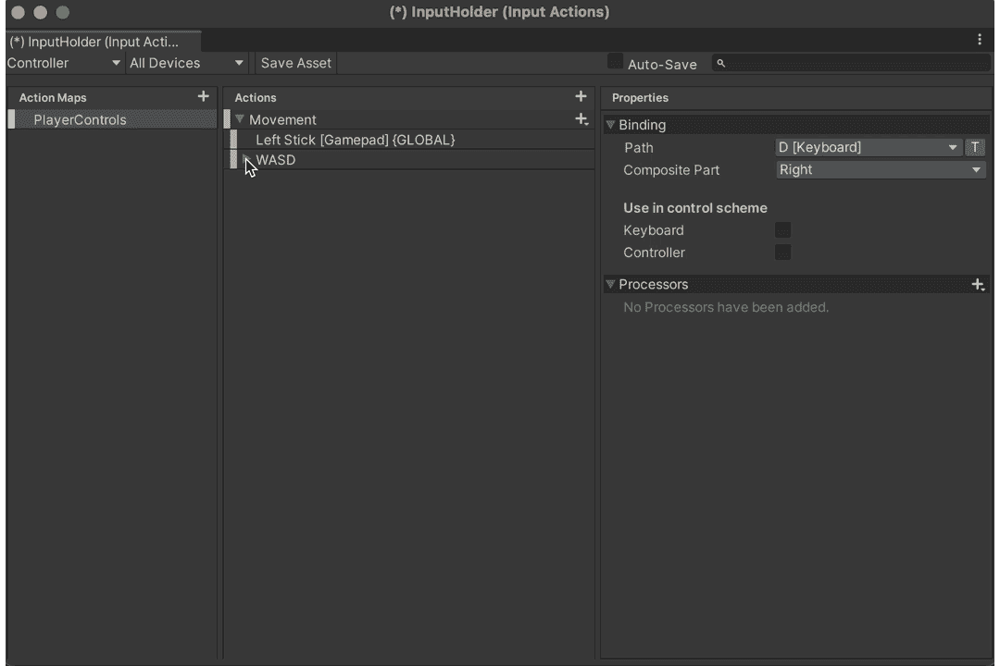

现在剩下的就是保存我们的资产(我建议打开自动保存)。

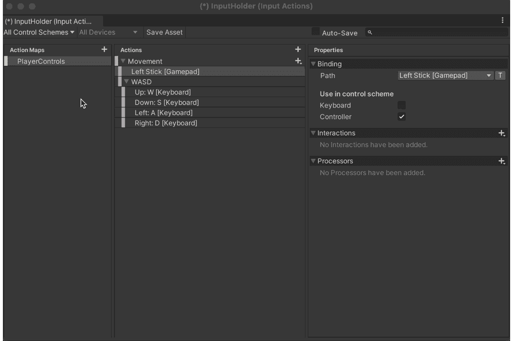

这样，我们就配置好了玩家输入。我们把这个加到**播放器里吧。**

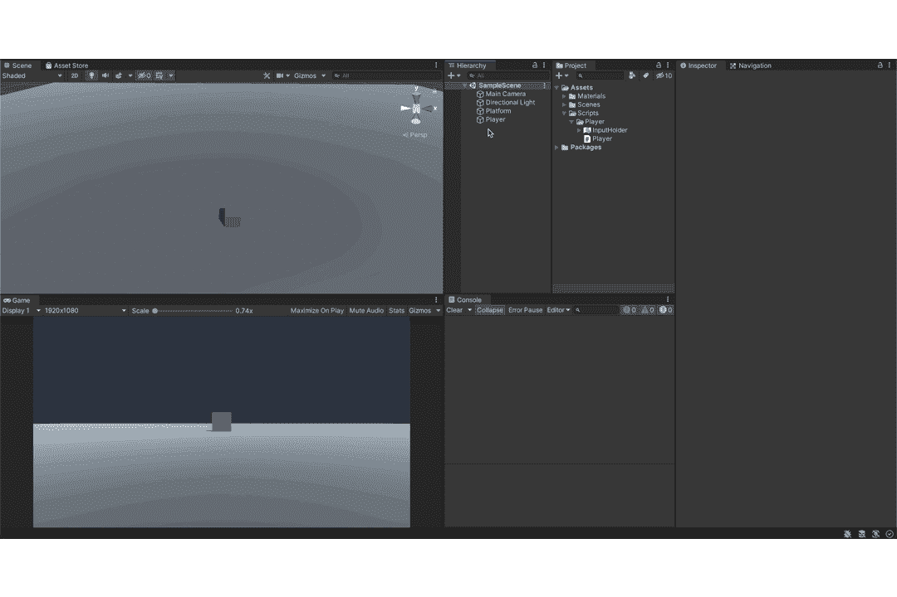

这里，我们向**玩家**游戏对象添加了**玩家输入**组件。这个组件需要一个**输入动作**资产(我们在上面创建的那个)。我们可以在这里设置默认控制方案，也可以在接收到来自各个设备的输入时在这些方案之间自动切换。最后，它还包含一个**行为**属性，该属性有以下选项:

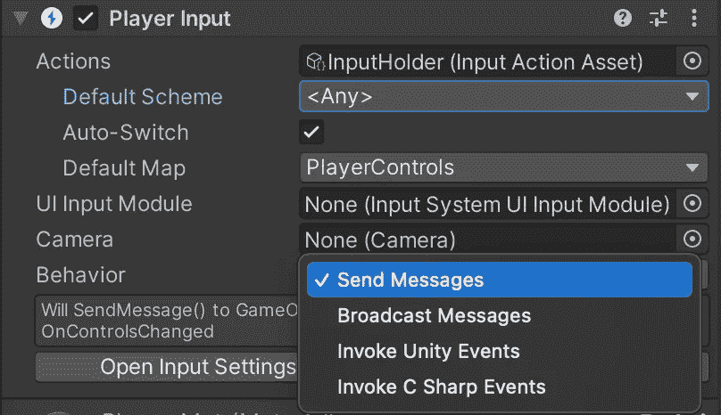

**行为**字段负责确定玩家输入通知是否有事情发生的方式。这里，我将使用**调用 Unity 事件**选项。允许我们在检查器中查看所有的**动作**，并直接将我们的方法回调附加到它们上。这也是 Unity 推荐的方法。但归根结底，这是偏好的问题。我将使用本文推荐的方法。

让我们继续为**玩家**的行为编码。

因为我们使用新的输入系统，我们需要导入输入系统包来使用它的功能。

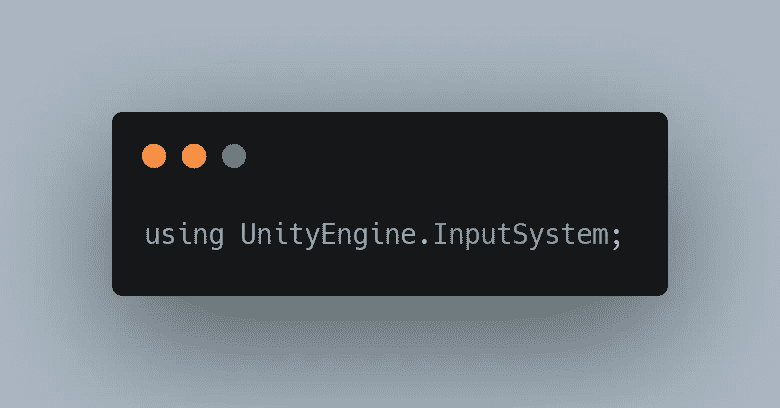

这样，我们现在可以使用该包中定义的所有方法。

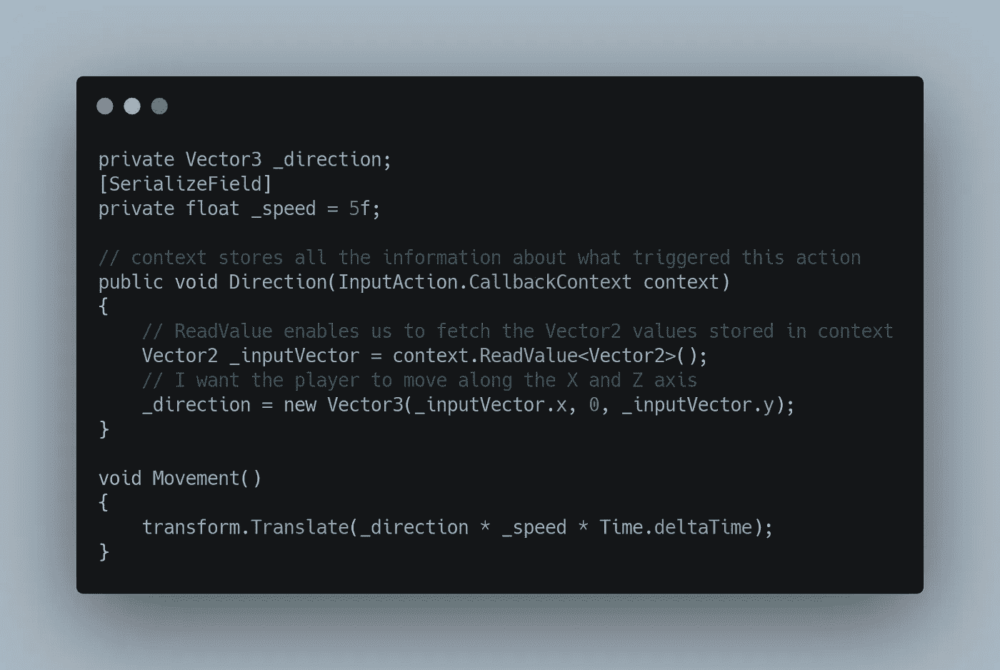

其中**运动()**在**更新()**中被调用，

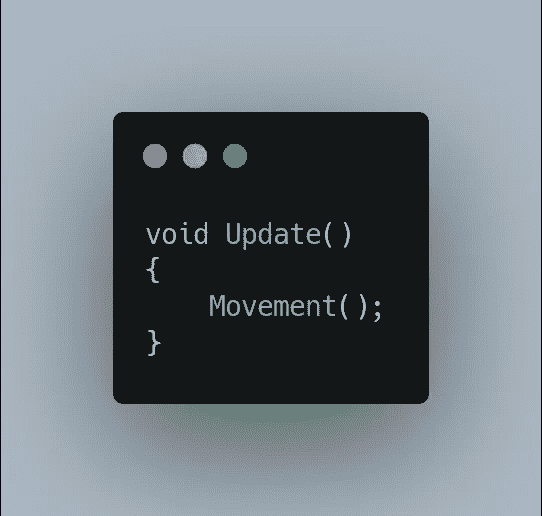

现在剩下的就是把这个行为附加到**玩家**游戏对象上。有了这个，我们就可以把它添加到我们一开始创建的**动作** **动作**中。我们现在可以参考**方向()。**由此，把一切联系在一起。也就是说，我们定义了一个动作(开始时创建的**移动** **动作**)，我们对其行为(行为脚本中的**方向()**)进行编码，该行为由输入触发(链接到开始时所示的动作中)。

有了这个，我们应该能够使用键盘或控制器来移动我们的角色。

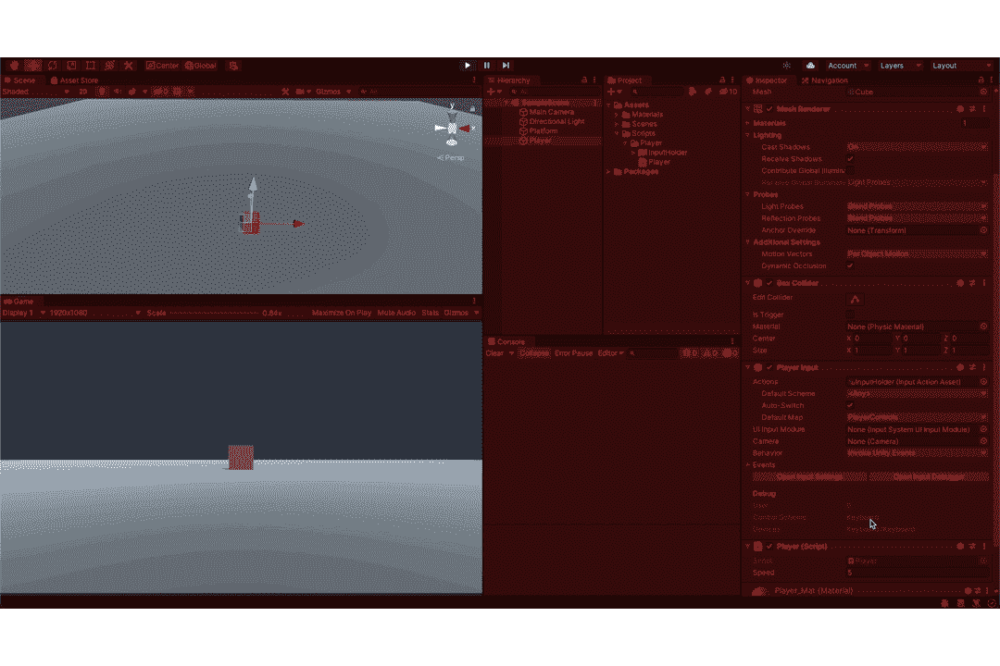

注意鼠标光标在哪里。您应该看到**控制方案**从键盘到控制器动态变化(它甚至显示所用控制器的类型)。

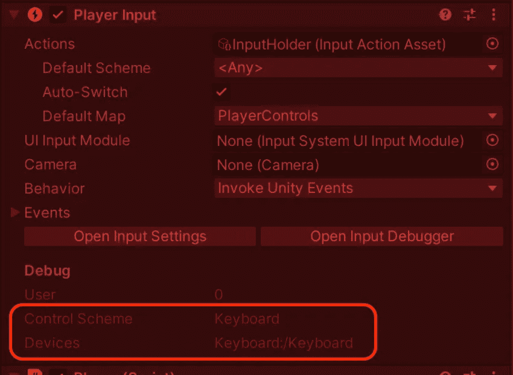

*注意:使用键盘控制方案的新输入系统的另一个好处是，默认输出值是标准化的。*

感谢您的阅读，更多内容敬请期待！！！