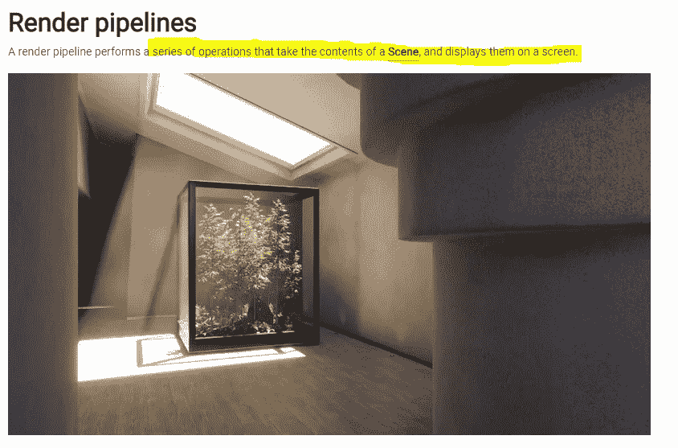
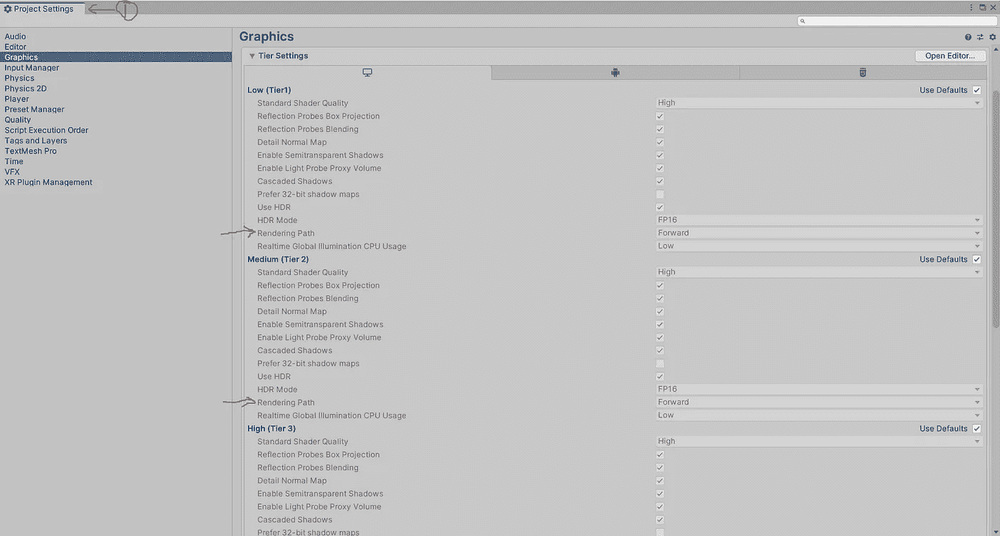
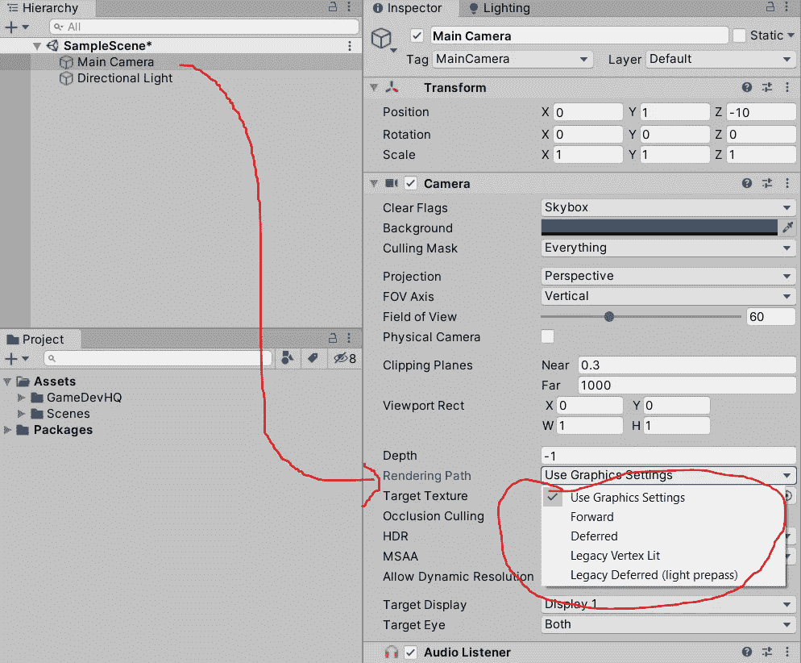
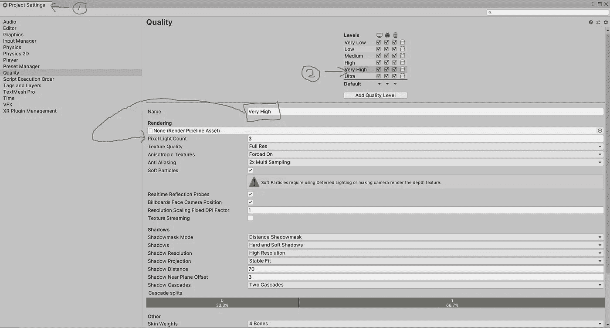
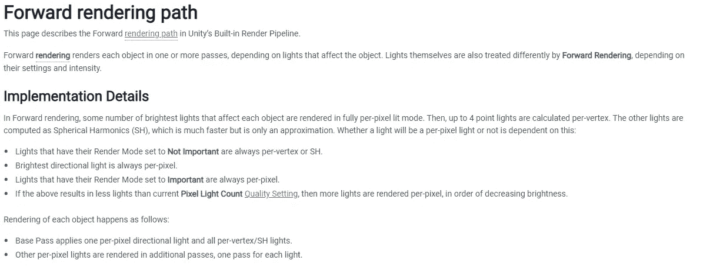
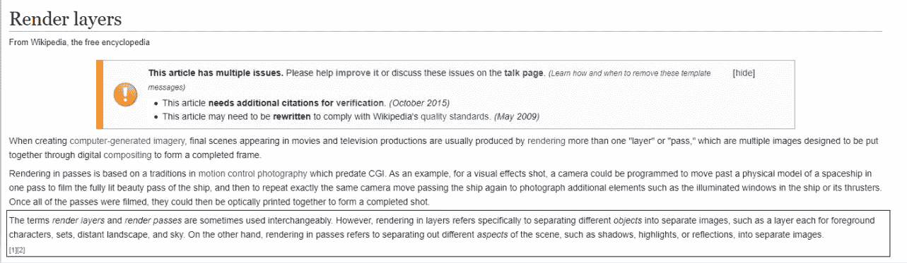
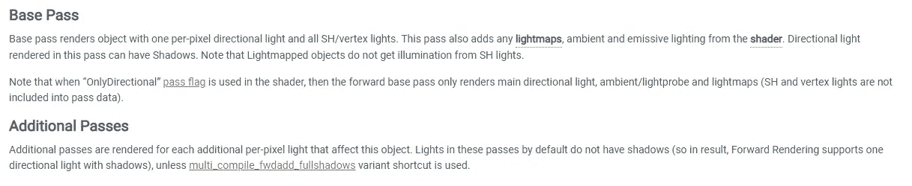
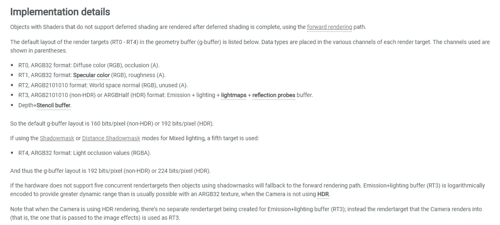

# Unity 的渲染基础及其对灯光的关键作用

> 原文：<https://medium.com/nerd-for-tech/unitys-rendering-basics-and-its-key-role-with-lights-2face4703712?source=collection_archive---------8----------------------->

从这篇文章开始，我将探索 Unity 中的照明。

Unity 文档中的图形部分从渲染管道开始。因此，在进入作为过程的一部分的照明之前，简单了解一下什么是渲染管道以及它在照明中扮演什么角色会有很大的帮助。

Unity 提供了 3 个预建的渲染管道，具有不同的功能和性能特征。

*   [内置渲染管道](https://docs.unity3d.com/Manual/built-in-render-pipeline.html)是 Unity 的默认渲染管道。这是一个**通用渲染管道**，具有**有限的定制选项。**
*   [通用渲染管道(URP)](https://docs.unity3d.com/Manual/universal-render-pipeline.html) 是一个可脚本化的渲染管道**快速且易于定制**，并让您**在各种平台上创建优化的图形**。
*   [高清渲染管道(HDRP)](https://docs.unity3d.com/Manual/high-definition-render-pipeline.html) 是一个可脚本化的渲染管道，让您**在高端平台上创建尖端的高保真图形**。
*   您可以使用 Unity 的脚本化渲染管道 API 创建自己的[自定义渲染管道](https://docs.unity3d.com/Manual/srp-custom.html)。

在最高级别，渲染管道处理三种操作。

*   选择
*   渲染对象
*   后处理

> 在开始工作之前，您必须决定哪种管道适合您的项目，这一点非常重要，因为中途转移到其他管道不是明智的选择，因为支持会发生变化。

> 在你开始项目的第一阶段分析之前，请把这个事实放在手边。
> 
> “没有放之四海而皆准的渠道”。根据游戏或应用程序的范围，必须选择一个管道或冒险编写一个自定义管道。

在继续之前，请点击这里的[链接](https://youtu.be/2wUPgl7upnU)。

做出定制管道的决定必须考虑以下实现领域。

一致

它们中的每一个都是独立的主题。

你看到那里的灯光和阴影了吗？这就是为什么我想带你通过一个小的背景覆盖，以便当时间到来时，你的照明设置应该完全按照你想要的那样运行，或者你可能会聪明地选择一个基于你的游戏或应用程序中未来照明设置的管道。

**最终，我们的目标是创造一种身临其境的体验，要做到这一点，你需要一张合适的桌子来摆放你的利器。**

现在，让我们把定制管道放到一边，把注意力放在我们开箱即用的东西上。

## **1。内置管道**

*   这是 Unity 的旧渲染管道。
*   它不基于可脚本化的渲染管道。
*   你可以**通过选择不同的渲染路径**来配置它，而**通过[命令缓冲区](https://docs.unity3d.com/Manual/built-in-render-pipeline.html#GraphicsCommandBuffers)和[回调](https://docs.unity3d.com/Manual/ExecutionOrder.html#Rendering)来扩展它的功能**。[命令缓冲区和回调需要单独的解释，本文不涉及它。]

此管道支持不同的呈现路径。

> **什么是渲染路径？与照明&明暗处理相关的一系列操作。**

不同的路径具有不同的功能和性能特征。为项目选择最合适的渲染路径取决于项目的类型和目标硬件。

*   转到项目设置>图形，并相应地选择。此外，每个摄像机的这些设置都可以被覆盖。

一致

一致

*   默认情况下，如果运行项目的设备的 GPU 不支持选择的渲染路径，Unity 会自动使用较低保真度的渲染路径。

# 正向渲染

前向渲染是内置渲染管道中的默认渲染路径**。**

> **在正向渲染中，实时灯光的渲染开销非常大。**如果减少每个像素的灯光数量，可以抵消这一成本。

Unity 以较低的保真度渲染场景**中**的其余灯光:逐顶点或逐对象。

一致

这是 Unity 官方文档的一瞥，解释了[正向渲染](https://docs.unity3d.com/Manual/RenderTech-ForwardRendering.html)中的灯光。

一致

在这里，我们还得到了 pass 的介绍。在最基本的层面上，你可以把一个通道想象成一个层。

渲染过程/层

以下细节非常重要，要时刻牢记在心，因为在处理任何需要**特定执行顺序**的视觉效果时，这将是最基本的机器。

一致

# 延迟着色

这是内置渲染管道**的渲染路径，具有最高的光照和阴影保真度。**

它需要具有多个渲染目标的图形卡、着色器模型 3.0(或更高版本)以及对深度渲染纹理的支持。因此，不支持其中任何一项的硬件平台将无法执行使用延迟着色渲染路径构建的应用程序。

此外，它还有一些限制。

*   它不支持半透明对象。(使用正向渲染)
*   它不支持正交投影。(使用正向渲染)
*   它不支持硬件抗锯齿。(使用后处理实现类似的结果)
*   它对剔除遮罩的支持非常有限。(最多只能使用 4 个剔除遮罩。也就是说，你的剔除**图层蒙版**必须至少包含所有图层减去四个任意图层，所以必须设置 32 个图层中的 28 个。否则你会得到**图形工件。**)
*   它将 Renderer.recieveShadows 网格渲染器的标志视为真。(总是)

如果项目有大量的实时灯光，并需要高水平的照明保真度，并且您的目标平台支持延迟着色，那么这种方法是更好的选择。

一致

**延迟渲染的主要优点是，你不会受到你希望在屏幕上渲染的灯光数量的限制，这对于某些类型的游戏来说是一个关键的胜利。**

它提供一致的性能，但需要强大的硬件。大多数情况下，低端智能手机将很难运行通过这种渲染路径制作的游戏。

# **遗留延期(轻预程)**

我坚持访问下面的链接，并得到一些关于这个渲染路径的想法。然而，Unity 建议使用延迟着色路径，因为这不支持 Unity 5.0 版之后的一些关键改进。

 [## 传统延迟呈现路径

### 本页详细介绍了 Unity 内置渲染管道中的遗留延迟(light prepass)。见这篇文章…

docs.unity3d.com](https://docs.unity3d.com/Manual/RenderTech-DeferredLighting.html) 

# 顶点照明渲染路径

顶点照明路径通常在一个过程中渲染每个对象，为每个顶点计算所有灯光的照明。

这是最快的**渲染**路径，拥有最广泛的硬件支持。

由于所有照明都是在顶点级别计算的，因此该渲染路径不支持大多数逐像素效果:不支持阴影、法线贴图、灯光 cookies 和高度详细的镜面高光。

## 2.通用渲染管道

*   这是一个**预建的可脚本化的管道**，它提供了**艺术家友好的**工作流程，让**在一系列平台上快速、轻松地创建优化的图形**。
*   有一个叫做轻量级的版本被这个管道取代了。

两个大猎物来了！

> -使用 URP 制作的项目与高清晰度渲染管道(HDRP)或内置渲染管道不兼容。在开始开发之前，您必须决定在项目中使用哪个渲染管道。
> 
> - URP 目前不支持**自定义后期处理**效果。如果您的项目使用自定后期处理效果，这些效果目前不能在 URP 重新创建。即将发布的 URP 将支持自定义后期处理效果。

这是解释 URP 特性的官方文档。

 [## URP 12 的新功能(Unity 2021.2)

### 本节包含有关 URP 12 中的新功能、改进和已修复问题的信息。有关…的完整列表

docs.unity3d.com](https://docs.unity3d.com/Packages/com.unity.render-pipelines.universal@12.0/manual/whats-new/urp-whats-new.html) 

[每个功能都需要单独解释。本文不涉及它。]

## 3.高清渲染管道

*   它是一个**预建的可脚本化管道**，让您**为高端平台**创建尖端的高保真图形。

应用领域:

*   AAA 头衔
*   汽车演示
*   建筑应用
*   任何需要高端显卡的产品

HDRP 利用基于物理的照明技术、线性照明、HDR 照明和可配置的混合瓦片/簇延迟/向前照明架构。

又来了一样的接球！

> -使用 HDRP 制作的项目与通用渲染管道(URP)不兼容。在开始开发之前，您必须决定项目使用哪个呈现管道；HDRP 功能不能在 HDRP 和 URP 之间交叉兼容。

这是解释 HDRP 新特征的官方文件。

 [## 高清渲染管道的新功能

### 本节包含有关高清晰度渲染管道(HDRP)更改的信息。每页包含一个…

docs.unity3d.com](https://docs.unity3d.com/Packages/com.unity.render-pipelines.high-definition@12.0/manual/whats-new.html) 

[每个功能都需要单独解释。本文不涉及它。]

这里的要点是在开始项目时保持渲染管道的选择高于一切，并选择最合适的，或者更确切地说是构建一个自定义的，符合项目图形要求的渲染管道。

请记住，Unity 是一个巨大的工具，随着功能增强的每一次迭代，选择的范围将会变得更大。拥有一个更广阔的视野将有助于决定一个特定冒险的正确途径。

至此，现在是开始学习 Unity 照明系列的好时机。

下一篇文章很快就会出来:)

非常感谢