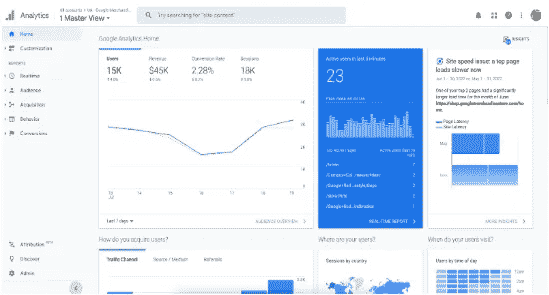
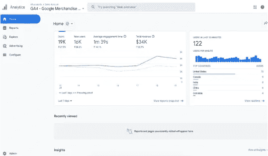
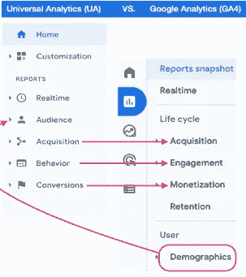
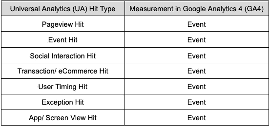

# 通用分析与谷歌分析 4(第一部分)

> 原文：<https://medium.com/nerd-for-tech/universal-analytics-vs-google-analytics-4-part-1-dc1134d89e82?source=collection_archive---------1----------------------->

## 谷歌分析 4 正在接管。由[王莹](https://www.linkedin.com/in/ying-wang-06a46070/)

由[雷扎·罗斯坦皮舍](https://unsplash.com/@rezarp)在 [Unsplash](https://unsplash.com/) 上拍摄的照片

自谷歌宣布通用分析将于 2023 年 7 月结束以来，已经过去了几个月。您准备好从 UA 迁移到 GA4 了吗？一定要看看由 [Sanu Maharjan](https://www.linkedin.com/in/sanu-maharjan/) 撰写的博客文章，它解释了 GA4 数据结构以及如何提取重要的指标([阅读](https://datadice.medium.com/raw-google-analytics-4-ga4-data-in-bigquery-bq-9cb776ce1f3d))。

我相信围绕 UA 和 GA4 之间的主要区别仍然有很多困惑。因此，我们将仔细看看这两个谷歌分析平台之间的根本差异，以及我们应该考虑的要点。

# UA 和 GA4 的主要区别

## 报告界面

UA 和 GA4 的报告观点存在一些差异。如您所知，您熟悉的一些报告和指标要么丢失，要么已被替换。​

报告接口— UA:

报告界面— GA4:

UA 和 GA4 中的导航选项在两个分析平台中都有所改变。

您可以在**报告**中找到默认报告。从那里你可以找到:

*   都是实时的。
*   (UA)采集-->(GA4)采集
*   (UA)行为-->(GA4)参与度
*   (UA)转换-->(GA4)货币化
*   (UA)受众-->(GA4)人口统计

当然，这些报告并不相同，但它们在每种情况下都显示了相同的数据。

## 衡量模型的最大区别

*   **通用分析(UA)** :测量模型基于会话和浏览量。会话是指在给定的时间范围内用户和网站之间的一组交互。可能包括多个页面视图、条目和电子商务交易。
*   **Google Analytics (GA4)** :度量模型基于事件和参数。网站/app 上的每一次互动都是一个事件。GA4 中的 UA 交互类型将被转换为事件。([阅读更多](https://support.google.com/analytics/answer/9964640?hl=en#zippy=%2Cin-this-article))

现在，您可能知道 UA 和 GA4 使用不同的数据模型。这两者之间的数据收集、处理和呈现可能有所不同。

## 连接 GA4 和 BigQuery (BQ)的自由限制

毫无疑问，免费的 GA4-BigQuery 链接是它最有前途的特性之一。这项服务完全免费。换句话说，将数据从 GA4 properties 导出到 BQ 是没有成本的。但是，如果导出超过 100 万个事件的每日限制，分析会立即暂停每日导出，并在第二天继续。

然而，UA 不会免费连接到 BQ，除非你使用 Google Analytics 360。

优势列表:

*   不需要数据采样
*   您可以导出所有自定义事件参数和维度
*   您将能够用第三方 API 连接 GA4 数据
*   允许将数据从 BQ 推送到各种数据可视化工具(例如 Google Looker Studio(以前称为 Google Data Studio)、Power BI、Tableau 等)。)
*   数据校正选项
*   自定义频道分组

# 结论

在转换之前，充分利用这些变化需要我们完全理解它们。至少，我们已经收到了一些关于 GA4 中将要修改的特性的主要细节。

为了帮助您从 UA 过渡到 GA4，我们将在接下来发布更多帖子，详细介绍 Google Analytics 平台内部的变化。

# 本月即将发布的 datadice 博客文章

*   [谷歌数据分析的最新更新(2022 年 9 月)](/geekculture/latest-updates-on-google-data-analytics-september-2022-bb24a6b0782e?source=your_stories_page-------------------------------------)
*   [拥有谷歌数据工作室和 Looker 的统一商务智能平台](/towardsdev/a-unified-bi-platform-with-google-data-studio-and-looker-96b07f3c8409?source=your_stories_page-------------------------------------)

# 更多链接

这篇文章是来自 [datadice](https://www.datadice.io/) 的环球分析与谷歌分析 4 系列的一部分。这些帖子将解释 UA 和 GA4 之间的差异，并重点介绍 GA4 的新功能。

查看我们的 [LinkedIn](https://www.linkedin.com/company/datadice) 账户，深入了解我们的日常工作生活，并获得关于 BigQuery、Looker Studio 和营销分析的重要更新

我们也从我们自己的 YouTube 频道开始。我们谈论重要的 DWH，BigQuery，Looker Studio 和更多的话题。点击查看频道[。](https://www.youtube.com/channel/UCpyCm0Pb2fqu5XnaiflrWDg)

如果你想了解更多关于使用 Google Looker Studio 并结合 BigQuery 更上一层楼的知识，请查看我们的 Udemy 课程[这里](https://www.udemy.com/course/bigquery-data-studio-grundlagen/)。

如果您正在寻求帮助，以建立一个现代化的、经济高效的数据仓库或分析仪表板，请发送电子邮件至 hello@datadice.io，我们将安排一次通话。

*原载于*[*https://www . data dice . io*](https://www.datadice.io/us-vs-ga4-part1)*。*