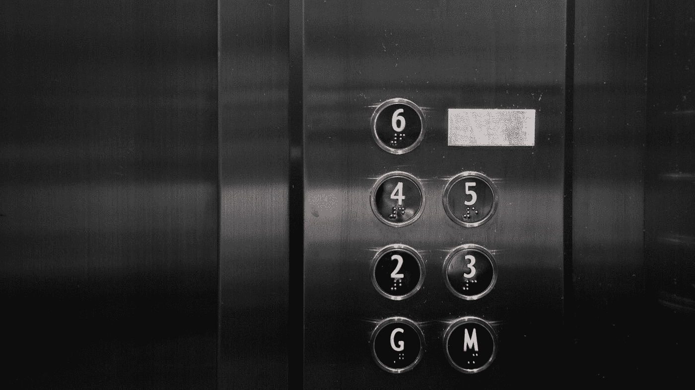

# 通用可用性和多模态

> 原文：<https://medium.com/nerd-for-tech/universal-usability-and-multi-modality-5b0e914c88d1?source=collection_archive---------27----------------------->

## 人机交互

## 21 世纪系统设计应包括的关键方面

大家好，

照片由[屋大维丹](https://unsplash.com/@octadan?utm_source=medium&utm_medium=referral)在 [Unsplash](https://unsplash.com?utm_source=medium&utm_medium=referral)

今天我们将讨论一些与用户界面相关的概念，叫做通用可用性和多模态。因为这两个概念都将用户引向系统，所以在设计系统时必须遵循它们。让我们立即开始讨论吧。

## 通用可用性

照片由[达珊·帕特尔](https://unsplash.com/@darshanp9?utm_source=medium&utm_medium=referral)在 [Unsplash](https://unsplash.com?utm_source=medium&utm_medium=referral) 上拍摄

当你决定制作自己的系统时，它可以是一个应用程序，也可以是一个简单的网站。有些人可能认为你有很棒的产品，但有些人可能不喜欢。不同的障碍，如国籍或使用界面，可能会造成麻烦。显然，您希望很多人能够使用您的系统，那么解决方案是什么呢？解决方案的关键是应用通用可用性的原则。

那么什么是通用可用性呢？让我解释一下人机交互领域的先驱 Shnedierman 将普遍可用性定义为使所有公民能够在他们的任务中成功使用通信和信息技术。请注意，他并没有说让所有公民都能使用，而是说让所有公民都能成功。这也可能会混淆。让我们看一个例子。

> 将电梯作为一个普遍适用的例子…
> 
> 对于不能行走的人，可以使用轮椅进入。
> 
> 看不见的人可以听到声音。我能感觉到按钮，因为上面刻着数字。
> 
> 听不见的人，可以看到数字显示。

照片由 [Arisa Chattasa](https://unsplash.com/@golfarisa?utm_source=medium&utm_medium=referral) 在 [Unsplash](https://unsplash.com?utm_source=medium&utm_medium=referral) 上拍摄

电梯的设计通常会覆盖系统的所有用户。

主要目的是承认用户群体和用户需求的多样性。通用可用性考虑了所有年龄段用户的经验水平和身体或感官限制。我们需要一种设计方法来适应我们用户群的多样性，这样所有的用户都能快速适应产品，因此灵活性是一个重要的方面。我们需要在它上面茁壮成长。但是在某些参数必须被锁定的物理环境中很难实现普遍的可用性，但是在像数字媒体这样的虚拟媒体中，系统可以被制造得更加灵活，以便一大群人根据他们的偏好和需要来使用产品。所以一般来说，产品必须让有困难的人可以很容易地改变布局反馈等。但是我们不会让系统对一般用户来说太烦人，对有困难的用户来说太难。

照片由[在进给](https://unsplash.com/@onfeed?utm_source=medium&utm_medium=referral)上拍摄[未飞溅](https://unsplash.com?utm_source=medium&utm_medium=referral)

一个常见的例子是 windows 10 中的语音旁白。“讲述人”的一个功能是屏幕阅读器，它可以大声描述屏幕上的内容，这样您就可以使用这些信息来导航您的设备启动或停止“讲述人”按下 Windows 徽标键并控制和输入探索下面的部分以开始退出“讲述人”,因此问题出现了，为什么要花费更多的时间和精力来制作一个可普遍使用的设计，而不是为更多用户明显增加易用性呢 为品牌提供正面的公众形象，扩大市场覆盖面，提高客户满意度和忠诚度。

通用可用性是一种技术，通过这种技术，您可以使系统适用于多种人口统计数据、种族和不同的环境。系统的设计必须密切研究可用性因素，如直观的设计，学习的容易程度，使用的效率，可记忆性，错误频率和严重性，并服从满意度。有时，在搜索和努力使系统普遍可访问的过程中，对于普通用户来说，它会使系统变得非常愚蠢和乏味，这杀死了大多数使我们的产品可访问的用户。我们需要很多资源和更多的研究，这可能会使产品变得昂贵，所以当你开发你的产品时，请确保进行深入的研究，并使其普遍可用。

## 通用设计原则

当设计者设计一个系统时，很少有通用可用性的设计原则可以遵循。在专家对系统进行通用可用性评估时，这些原则也必须在任何系统中重新检查。

*   公平使用
*   使用的灵活性
*   使用简单直观
*   可察觉的信息
*   误差容限
*   低体力劳动
*   接近和使用的尺寸和空间

照片由[丹清](https://unsplash.com/@danclear?utm_source=medium&utm_medium=referral)在[的 Unsplash](https://unsplash.com?utm_source=medium&utm_medium=referral)

然而，通用可用性对系统来说也有一些权衡。有时，通用设计可能会给系统带来一些功能限制。通用设计可能会将系统的成本增加到非常高的程度。通用设计可能会在实施阶段带来实施问题。无论如何，我们需要使用通用的可用性概念，在可能的情况下进行最小的权衡。

## 多模态

多模态系统意味着使用一种以上的交互感觉(或模式)给用户[到](https://www.youtube.com/watch?v=G8IHjgJBIvs)与系统进行交互。

*   视觉和听觉:文本处理器可以说出单词，也可以将它们回显到屏幕上。
*   警告信号:口头信息有时呈现给视觉和触觉技能已经完全被占用的飞行员。
*   非语音声音:砰砰声、砰砰声、吱吱声、咔哒声等。通常用于警告和报警。

多模态系统不同于多媒体系统。多媒体系统意味着使用许多不同的媒体来交流信息

*   例如基于计算机的教学系统:可以使用视频、动画、文本和静止图像:不同的媒体都使用交互的视觉模式；也可能使用声音，包括语音和非语音:另外两种媒体，现在使用不同的模型。

***但是，多模态接口也有缺点。***

*   在技术方面，收集数据、构建和测试系统的成本更高。
*   技术设置更加复杂和具有挑战性。
*   在互动系统中增加更多的模式也需要在模式的协调和组合方面做更多的工作。
*   在一个既不直观也不简单透明的界面中，让用户受到太多媒体的刺激，也有认知超载的危险。

然而，我们需要在不损害用户体验的情况下，在允许的范围内包含多模态。

我相信你已经理解了今天讨论的主题。如果您有任何问题或任何澄清，不要犹豫，通过回复部分与我联系。感谢您花费宝贵的时间阅读这篇文章。

> 谢谢你的支持和欢呼…😃

[马特·琼斯](https://unsplash.com/@mattjonesdp?utm_source=medium&utm_medium=referral)在 [Unsplash](https://unsplash.com?utm_source=medium&utm_medium=referral) 上的照片

## **参考**

1.  [http://www . ling . Helsinki . fi/~ kjokinen/Publ/200309 MnO rdic . pdf](http://www.ling.helsinki.fi/~kjokinen/Publ/200309MMNordic.pdf)
2.  https://www.youtube.com/watch?v=G8IHjgJBIvs