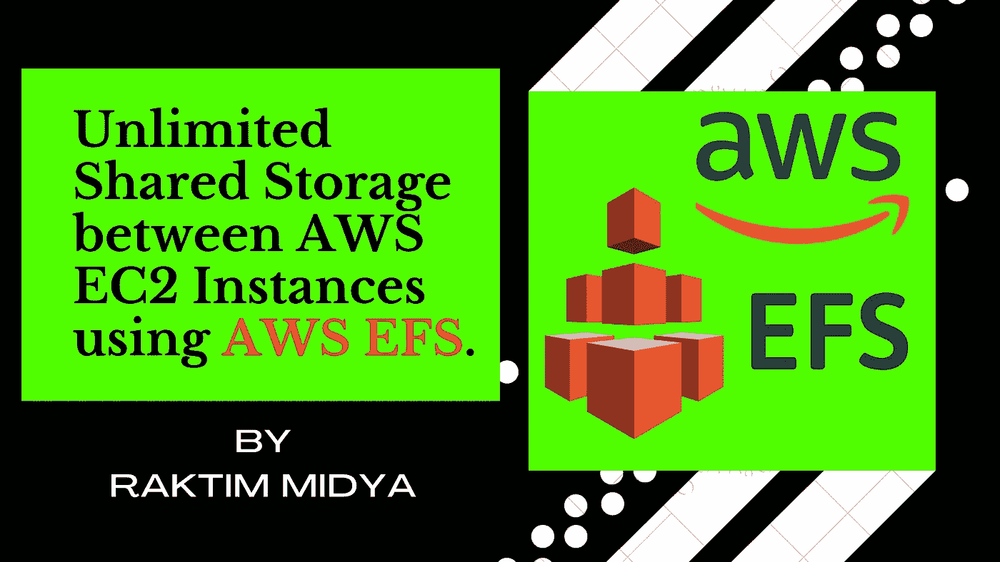
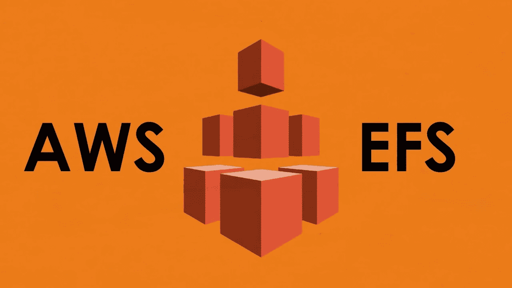
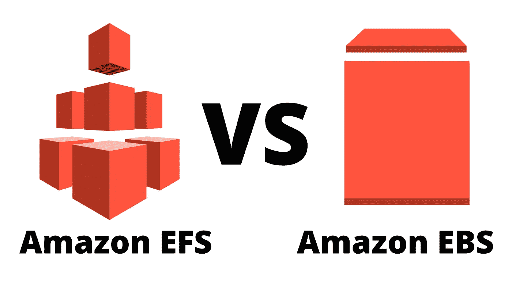
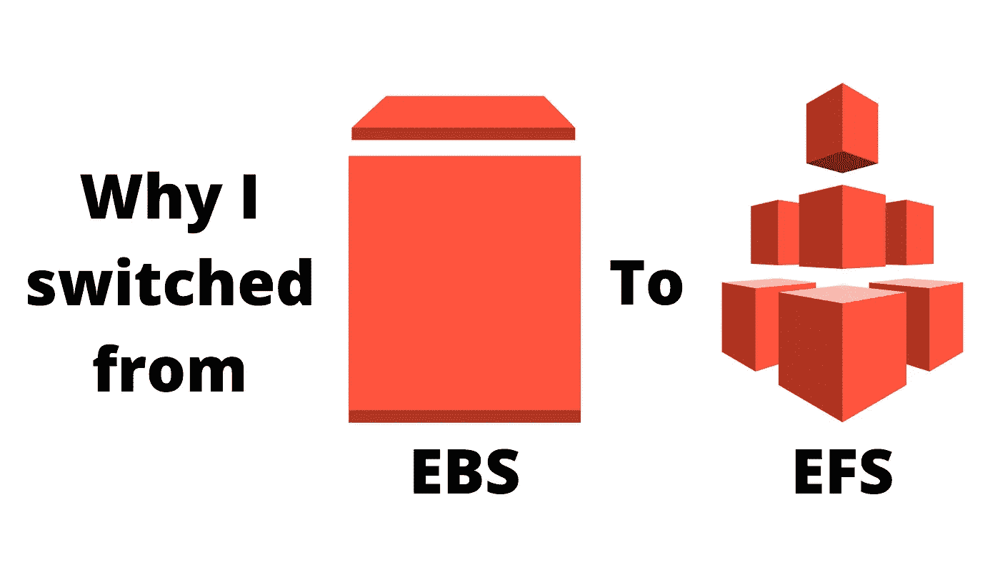
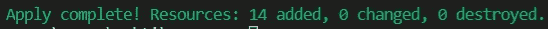
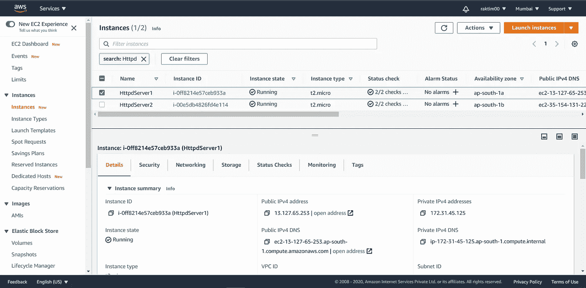
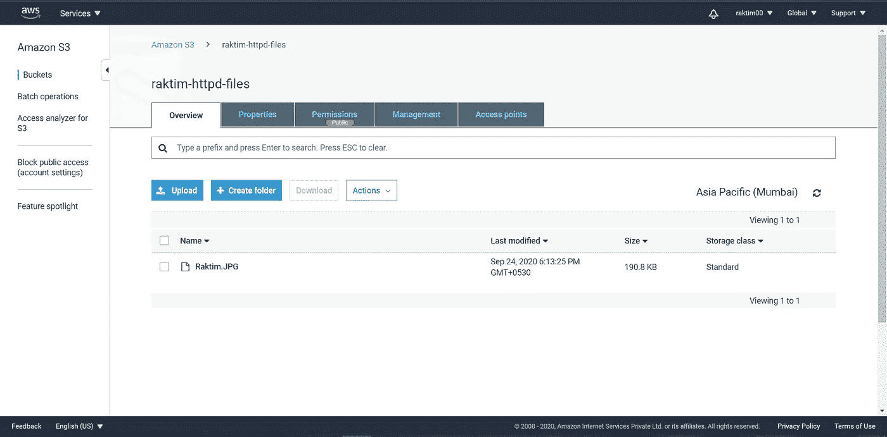
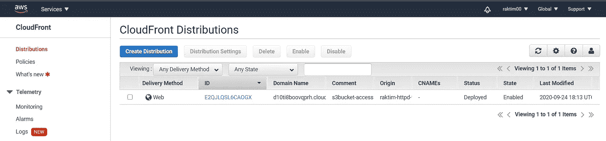
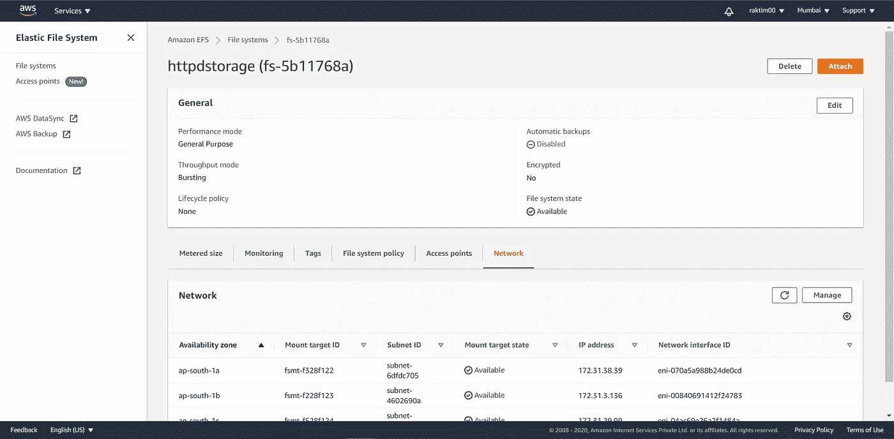
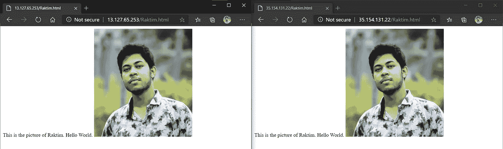

# 使用 AWS EFS 在 AWS EC2 实例之间无限共享存储。

> 原文：<https://medium.com/nerd-for-tech/unlimited-shared-storage-between-aws-ec2-instances-using-aws-efs-2cc659351cfe?source=collection_archive---------0----------------------->



由 Raktim 创建

你有没有想过，**可供公众使用的最大文件存储是什么？**你能相信**我们只用一个 CMD** 就能轻松使用这种无限存储吗？

你好奇想知道吗？我敢肯定，你肯定想知道。在这篇文章中**我将回答这些问题**和**我将展示这一实践的每一点**。如果你看懂了这篇博客，那么我百分之百肯定，你最终会感到惊讶。😎

# 让我们看看问题陈述:

1.创建密钥并创建允许端口 80 的安全组。
2。启动 EC2 实例。
3。在这个 Ec2 实例中，使用我们在步骤 1 中创建的现有密钥或提供的密钥和安全组。
4。使用 EFS 服务启动一个卷并将其附加到您的 vpc 中，然后将该卷挂载到“/var/www/html”文件夹中。
5。开发人员已经上传到 GitHub 回购代码，回购也有一些图像。
6。将 GitHub 回购代码复制到“/var/www/html”中。
7。创建 s3 存储桶，将 GitHub repo 中的映像复制/部署到 S3 存储桶中，并将权限更改为公共可读。
8。使用 s3 bucket(包含图像)创建一个 Cloudfront，并使用 Cloudfront URL 更新“/var/www/html”中的代码。

# 先决条件:

*   要执行此操作，您至少需要**一个 AWS 帐户**，并且在您的本地系统中还需要安装 **Terraform 软件**。还有，你需要**关于地形**的基础知识。
*   但是如果你不知道这些事情，不要担心，因为就在几个月前，我写了一篇关于这些事情的文章，我提供了下面的链接，如果你想，你可以看看…

[](/faun/getting-started-with-aws-terraform-293e9125dff) [## AWS & Terraform 入门。

### 如何入门使用 Terraform 在 AWS 中构建基础设施？

medium.com](/faun/getting-started-with-aws-terraform-293e9125dff) 

> **和我之前做的一样，但那次我用的是 AWS EBS。我面临的挑战很少，这就是我转投 AWS EFS 公司的原因。在这篇博客中，我也将告诉你我为什么转投 AWS EFS 公司。**
> 
> 所以，最后一个先决条件是我以前的博客，因为我将跳过我在那个博客上详细讨论过的几个部分。作为参考，链接在下面的描述中…

[](/faun/aws-ec2-instance-ebs-key-pair-sg-s3-cloud-front-snapshot-creation-using-one-single-cmd-8d45982f494d) [## AWS EC2 实例、EBS、密钥对、SG、S3、云前端、使用单个 CMD 创建快照！！

### 在本文中，您将了解到我们如何通过使用 terraform 创建一些 AWS 服务，只需一个 CMD…

medium.com](/faun/aws-ec2-instance-ebs-key-pair-sg-s3-cloud-front-snapshot-creation-using-one-single-cmd-8d45982f494d) 

# 好吧，让我们开始吧…

让我们首先试着理解什么是 AWS EFS。我们还需要了解**EBS 和 EFS** 的区别，以及我为什么从 EBS 转到 EFS。最后但同样重要的是**可供公众使用的最大文件存储是什么？**

## 亚马逊 EFS:



来源:谷歌

**亚马逊弹性文件系统(通常称为 AWS EFS)提供可扩展的文件存储，用于亚马逊 EC2 实例。**我们可以创建一个 EFS 文件系统，并配置我们的实例来挂载该文件系统。我们可以将 EFS 文件系统用作在多个实例上运行的工作负载和应用程序的公共数据源。

这是一个完全托管的弹性 NFS 文件系统，可用于 AWS 云服务和内部资源。**它可以按需扩展到 Pb 级，而不会中断应用程序，并且可以随着您添加和删除文件而自动扩展和缩减，从而消除了为适应增长而调配和管理容量的需求。**

*   ***了解更多亚马逊 EFS:***[***https://aws.amazon.com/efs/***](https://aws.amazon.com/efs/)

## EBS 和 EFS 的区别:



由 Raktim 创建

弹性块存储和弹性文件系统有很多不同之处。让我们来看看一些核心区别…

*   **EBS 卷仅限于单个实例，更重要的是，一次只能由一个实例访问。使用 EFS，您可以让成百上千个实例同时访问文件系统。**这使得 AWS EFS 非常适合任何需要性能良好的集中式共享存储的应用，如媒体处理或共享代码库。
*   您还可以使用 AWS EFS 来提供 web 内容，保存各种备份，并减少存储开支。**虽然 EFS 的成本确实高于 EBS(EFS 每 GB 0.30 美元，EBS 每 GB 0.10 美元)，但您只需为每个 EFS 文件系统支付一次费用。这意味着，如果您附加了十几个实例，您仍将支付相同的金额，就好像您只附加了一个实例一样。使用 EBS 卷，您需要为每卷付费。因此，为了节省存储成本，EFS 有时可以作为 EBS 的替代品。**

## 为什么我从 EBS 转到 EFS？



由 Raktim 创建

从 EBS 转到适合我要求的 EFS 有两个原因。让我想想…

1.  我们使用云是因为它的"**随用随付模式意味着只为您使用的资源量付费**。在我的情况下，如果我调配一个 EBS 卷，那么最初我的数据会减少，所以这纯粹是资源浪费，而且我也不知道将来我需要多少存储。**因为，我们不能动态扩展 EBS，所以在我看来，EFS 是最好的选择。**同样在 EFS，我只需要为我使用的存储空间付费。
2.  **接下来，我想启动多个将托管相同数据的实例，因为将来我想在它们上面使用负载平衡器**，现在如果我使用 EBS，那么我需要在每个实例中放置数据，但是使用 EFS，我只需要使用一个 EC2 实例来放置数据，所有其他实例都将能够使用该存储。

最后**的答案可供公众使用的最大文件存储是亚马逊弹性文件系统**，我观察到 **EFS 提供 8eb**存储，但根据亚马逊，你可以获得无限的存储。

# 现在是时候执行任务了…

在我以前的博客中，我讨论了如何使用 Terraform 代码创建 AWS EC2 实例、EC2 密钥对、安全组、S3 桶、云前端和一些额外的资源，所以我也跳过了这个任务中相同的几个部分。**在这篇博客中，我的全部重点是 EFS 以及如何利用共享存储的力量。**作为参考，我再次在下面给出那个博客链接…

[](/faun/aws-ec2-instance-ebs-key-pair-sg-s3-cloud-front-snapshot-creation-using-one-single-cmd-8d45982f494d) [## AWS EC2 实例、EBS、密钥对、SG、S3、云前端、使用单个 CMD 创建快照！！

### 在本文中，您将了解到我们如何通过使用 terraform 创建一些 AWS 服务，只需一个 CMD…

medium.com](/faun/aws-ec2-instance-ebs-key-pair-sg-s3-cloud-front-snapshot-creation-using-one-single-cmd-8d45982f494d) 

## EFS 安全小组:

在我之前的博客中，我创建了 Terraform 代码，它可以为 AWS EC2 实例创建一个安全组。该代码还创建了一个 tls 私钥，然后创建了一个 AWS 密钥对。**现在我们需要在前面的代码中再添加一个安全组，这个安全组是 EFS 的。**作为参考，代码如下…

> **注意:** **在我之前的博客中我没有添加任何名为“数据”的选项。通常我们使用这个选项来获取一些关于我们当前 AWS 资源的信息，比如这里我获取了默认的子网 id 和默认的 vpc id。这些是供将来参考的。**
> 
> **在“efs”安全组入站中，我还提到了 EC2 实例的安全组，因为它将帮助我的 EC2 实例在 EFS 集群中发送数据。**

## 启动 EFS 集群:

*   您已经注意到**我正在使用“efs 资源”在 AWS 上调配 efs 存储。**接下来，在配置完成后，我需要为他们分配该集群将工作的特定子网。这就是为什么我使用“efs 挂载目标”并提到，选择默认 vpc 下的所有子网。
*   我还提到了安全组，即我们之前为 efs 集群创建安全组。

## 启动 S3 和云锋:

这与我在之前的博客中使用的配置 S3 和云前端的代码完全相同。这段代码将一个映像从我的本地存储上传到 S3 存储桶，然后配置云前端并将其与 S3 连接。

> 虽然在问题中已经要求从 GitHub 上传代码，为此我们可以很容易地在 terraform 中运行一个空资源，并在本地系统中克隆图像，然后上传到 S3。但是为了简单起见，我从我的本地存储器上传。作为参考，代码如下…

## 启动第一个实例:

下面提到的代码将在 AWS 上启动第一个 EC2 实例。**在我之前的实践中，我启动了一个实例，因为我使用 EBS 存储来存储我的网页。但是这里我使用了 EFS，所以我可以使用多个实例来获取相同的数据。这是 EFS 最大的灵活性。**

现在让我们看看代码，然后我们将讨论我对以前的代码做了哪些新的东西和改变…

*   正如你可能注意到的那样，**这段代码依赖于所有以前的资源**，这是因为我希望我的 Web 服务器一启动，我的客户端就能看到网页，为此我的 EFS 和云前端应该准备好了。
*   接下来，我使用了 **Amazon Linux 2 ami** 和一些基本细节，如实例类型、密钥对、安全组、标签等。
*   接下来重要的是远程执行器。使用远程执行器，我首先安装了所需的软件，如 httpd，git，然后启动 httpd 服务。直到现在，它几乎和我以前的博客一样。
*   这里的新东西是安装**“Amazon-efs-utils”，因为需要这个软件来与 EFS 集群通信。**接下来，我使用 mount 命令在 EC2 实例的“/var/www/html”文件夹中挂载 EFS 集群。
*   最后，我复制了 GitHub html 文件并部署在 web 服务器上，我还在预先创建的 html 代码中添加了一行，以使用 Cloud Front 显示图像。

## 启动第二个实例:

*   与第一个实例类似，我用相同的配置启动了第二个实例，只是要注意这个实例依赖于第一个实例。但是如果你注意到远程执行器，你会看到这里我没有从 GitHub 复制任何代码。
*   在这里，我刚刚安装了 EFS 存储。现在，由于我的前一个实例已经把网页放在 EFS 集群中，所以从第二个实例我可以很容易地访问它们。

## 打开本地浏览器:

*   最后，正如我在以前的博客中提到的，为了检查两个实例是否都正常工作，我们可以使用空资源和本地执行器。作为参考，代码如下所述。

# 现在是时候建立基础设施了:

> 我想如果你读过我以前的博客，你就会知道我们主要使用两个主要命令来执行 terraform 上的工作。这些命令如下所述。
> 
> 请记住，只在包含完整代码文件夹中运行这两个命令。作为参考，我提供了 GitHub 链接，你可以从那里下载完整的代码…

[](https://github.com/raktim00/AWS-EFS) [## raktim00/AWS-EFS

### 通过在 GitHub 上创建帐户，为 raktim00/AWS-EFS 的发展做出贡献。

github.com](https://github.com/raktim00/AWS-EFS) 

**让我们运行这两个命令，观察输出…**

```
terraform initterraform apply --auto-approve
```

创建过程需要将近 5 分钟，然后你会发现你的桌面浏览器会自动启动 Chrome 并带你去那些 IP 地址。



## **为了快速参考，让我告诉你这些资源是否已经在 AWS 上创建。来看看 AWS WebUI 的部分截图……**



> **您可以注意到两个 AWS EC2 实例都成功运行。也只是为了将来参考收集这两个实例的公共 IP。**



> **在 S3，你会注意到图像已经成功上传，许可是公开的。**



> **在 Cloud Front 中，您会注意到它创建了一个分布，并与 S3 桶相关联。**



> **最后，如果您注意到 EFS，您会看到它已经成功创建。**



> **最后如果你注意到了，terraform 开通了两个链接。但最有趣的事实是，这两个 IP 都是我们提供的这两个实例的公共 IP，并且仍然显示相同的页面。虽然我们只克隆了一个 IP 内的页面。**

# 最后的话:

*   我们可以实现许多未来的可能性，让这个基础设施变得越来越大。例如，我们可以在这些实例上添加负载平衡器，如果我们愿意，还可以创建更多优秀的 html 代码来展示我们的产品。
*   我试着尽可能多的解释。希望你从这里学到了一些东西。请随意查看我的 LinkedIn 个人资料，当然也可以随意发表评论。

[](https://www.linkedin.com/in/raktim00/) [## 微软学习学生大使(Alpha) -微软学习学生大使 CEE |…

### ★我是一名技术爱好者，致力于更好地理解不同热门技术领域背后的核心概念…

www.linkedin.com](https://www.linkedin.com/in/raktim00/) 

*   我写 DevOps，云计算，机器学习等。博客，所以请随时关注我的媒体。最后但同样重要的是，如果你有任何疑问，请在 LinkedIn 上联系我。

**感谢大家的阅读。就这样…结束…😊**

