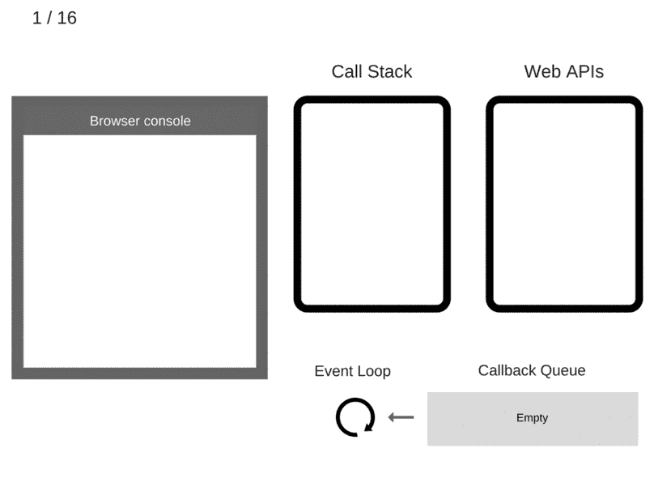

# 解开多任务单线程之谜

> 原文：<https://medium.com/nerd-for-tech/unraveling-the-mystery-of-the-multi-tasking-single-thread-21e0cd98103b?source=collection_archive---------21----------------------->

【JavaScript 如何模仿并发并做出承诺


这些功能都去哪里了？

在训练营中期，我们被介绍给了`[fetch()](https://developer.mozilla.org/en-US/docs/Web/API/WindowOrWorkerGlobalScope/fetch)`，我们的第一个异步方法。我知道它涉及到一个叫做`[Promise](https://developer.mozilla.org/en-US/docs/Web/JavaScript/Reference/Global_Objects/Promise)`的东西，一个处理承诺返回的`[then()](https://developer.mozilla.org/en-US/docs/Web/JavaScript/Reference/Global_Objects/Promise/then)`链，这都是为了在网络请求需要一段时间的情况下允许其他 JavaScript 代码运行。如果没有这个特性，堆栈可能会被“阻塞”,等待一个更长的过程完成，同时用户将无法与网站进行交互。当时，学习从 API 获取 JSON 数据的一般模式就足够了。当我接近 bootcamp 最后几周的尾声时，我尝试了一个基于用户交互的项目，到处都是异步代码，我发现自己需要理解 JavaScript 调用栈是如何越来越满的。那么像 JS 这样的单线程语言是如何设法模拟并发处理的呢？

## 一个堆栈，配有专职人员

JavaScript 实际上运行在一个单一的真理调用栈上，这使得它是单线程的。但是幕后的帮手多了很多！异步函数会将代码发送到其他地方，在调用堆栈之外单独处理，并最终放入单独的队列中。一个[事件循环](https://developer.mozilla.org/en-US/docs/Web/JavaScript/EventLoop)将等待调用栈清空，然后从队列中取出一个带有关联函数(即回调函数)的“消息”并将其放在调用栈中，然后运行。


照片由[梅穆](https://unsplash.com/@picoftasty?utm_source=medium&utm_medium=referral)在 [Unsplash](https://unsplash.com?utm_source=medium&utm_medium=referral) 上拍摄

让我描述一个完全可能的场景(无论如何是一个梦)。想象一下和你妈妈一起吃早餐时有一大盘煎饼。你喜欢煎饼，所以这很棒。她把一个放在你的盘子里，你的工作就是吃掉它。太好了！但是你的妈妈更了解你，当你吃完煎饼后，她会立即在你的盘子里放另一个煎饼，甚至可能会越积越多。在这一切当中，你看着路对面的华夫饼干烤模，说“嗯，我也想要一个华夫饼干”。噗，一个令人欣慰的童年形象出现了，也许是帕特里克·斯图尔特，他说“我会做到的”，然后开始做华夫饼。在那次令人困惑的事件之后，你的母亲继续内疚地让你吃剩下的煎饼。吃所有这些东西需要一些时间，即使是在梦里，华夫饼干已经做好了。然而，在薄煎饼之间夹华夫饼是不允许的，所以 P-Stew 把它交给莱瓦尔·伯顿，他一直拿着华夫饼干，直到你吃完你的大堆薄煎饼，这时他可以自由地把华夫饼干放到你的盘子里。

在这个场景中，吃掉所有的食物(主要是煎饼)是一个需要完成的大函数执行上下文，你的盘子是调用堆栈，做华夫饼是异步函数，你吃华夫饼是回调函数，帕特里克·斯图尔特是 API，莱瓦尔·伯顿是事件循环。

现在我把它弄得更混乱了，让我们来看看它的零件！

*调用栈*是 JS 解释器(比如你的浏览器)在编译阶段跟踪它必须运行的多个函数以及运行顺序的方式。JS 调用堆栈是后进先出(LIFO)的，这意味着您必须自上而下地工作。

(旁注:但是函数不是以先进先出的模式按照代码中的顺序调用的吗？不要将这个堆栈与按顺序编译代码行相混淆。堆栈包含函数被调用*时创建的函数*执行上下文*。如果您想到一个函数有许多其他嵌套的内部函数，您可以想象在您继续处理外部函数直到到达全局上下文之前，内部函数需要被解析。所以不用担心，栈没有倒！)*

Alexander Zlatkov 撰写的这篇[博客文章](https://blog.sessionstack.com/how-javascript-works-event-loop-and-the-rise-of-async-programming-5-ways-to-better-coding-with-2f077c4438b5)更好地说明了并发模型是如何工作的:



动画来自 [Alexander Zlatkov](/@zlatkov) 的“【JavaScript 如何工作:事件循环和异步编程的兴起+ 5 种更好的异步/等待编码方法

当调用堆栈中轮到一个异步函数时，它仍然被立即处理(并及时离开调用堆栈)，但它实际上是由另一个 API 处理的，该 API 将相应地返回一个回调以在队列中等待。就调用堆栈而言，它已经完成，并为下一个函数做好了准备。

## 注意你的承诺和队列

自从引入标准化承诺和 async/await 函数构造以来，这个单一队列不再是故事的全部。

像`setTimeout`或`setInterval`这样的普通老式异步函数将在浏览器或节点 API 中处理(它实际上不是 JS 函数！)发送一个回调函数到上面解释的通用 gist/mega breakfast 类比中解释的队列，在处理之前等待调用栈清空。即使您将延迟指定为零毫秒，也会发生这种情况。一旦它是异步的，其他一切都优先:

```
setTimeout(() => console.log("bye!"), 0) 
console.log("hi")
console.log("how are you?")
console.log("well, I gotta get going.")/* 
console output:hi
how are you?
well, I gotta get going.
bye! 
*/
```

如果您在浏览器控制台中运行上面的代码，您会看到即使延迟被设置为零，`setTimeout`中的回调函数也会在所有其他同步代码之后运行。

从 ES6 开始，JS 还利用了 promises 使用的单独的 ***作业队列*** 。一旦返回承诺的函数(比如`fetch`)被解析，它们就会被快速跟踪到同步代码中的下一个可用槽。因此，实际上有两个单独的队列在等待调用堆栈过山车，常规队列和快速传递作业队列。这些优先级队列成员也可以用`then()`方法来表示，比如我们熟悉的`fetch('someUrl').then(response => response.json()).then(data => handleData(data))`模式。`then()`返回一个`Promise`，接受两个参数:一个是承诺成功时的回调函数，一个是失败时的回调函数。`[Promise](https://developer.mozilla.org/en-US/docs/Web/JavaScript/Guide/Using_promises)`对象表示异步操作的最终结果(无论成功与否)。它有三种状态:待定、已完成或已拒绝。承诺的创建要么内置于函数中(如`fetch()`或`then()`)，要么你可以用[承诺构造器](https://developer.mozilla.org/en-US/docs/Web/JavaScript/Reference/Global_Objects/Promise/Promise)显式创建承诺。

使用 [async/await 语法](https://developer.mozilla.org/en-US/docs/Learn/JavaScript/Asynchronous/Async_await)也将创造承诺。这是创造的句法糖。一般来说，将`async`放在函数声明之前会使其异步并返回一个`Promise`。就是这样！在 async 函数中，你也可以使用`await`作为`then()`，因为它创建了另一个暂停点来等待右边的代码解析，然后再移动到下一个。

```
async function interruption(){
   const message = await "INTERRUPTING".concat(" STARFISH")
   console.log(message)
}setTimeout(() => console.log("bye!"), 0)
interruption()
console.log("hi")
console.log("how are you?")
console.log("well, I gotta get going.")/* 
console output:hi
how are you?
well, I gotta get going.
INTERRUPTING STARFISH
bye!
*/
```

在上面的代码片段示例中，您可以看到，尽管第一个异步函数`setTimeout`在第二个`interruption`函数之前被调用，但是由于`interruption`使用了利用承诺，所以它被放在作业队列中并发出“bye！”从`setTimeout`开始。

感谢阅读这篇关于异步函数和 JS 如何设法看起来像多线程的快速文章！让我知道如果任何术语是关闭或你有其他意见。

我试着在每个帖子里都放一只猫，所以:


金枪鱼的承诺，现状:未实现

如果您仍然有问题(您应该有)，以下是一些很好的参考资料:

说真的，这个视频对我帮助很大。这很有趣。

[](/dailyjs/asynchronous-adventures-in-javascript-promises-1e0da27a3b4) [## JavaScript 中的异步冒险:承诺

### 为什么承诺？

medium.com](/dailyjs/asynchronous-adventures-in-javascript-promises-1e0da27a3b4) [](https://codeburst.io/javascript-engines-how-do-they-even-work-from-call-stack-to-promise-dcfce39f0c38) [## JavaScript 引擎:它们是如何工作的？从调用堆栈到承诺

### JavaScript 引擎的旋风之旅，从调用堆栈、全局内存、事件循环、回调队列到承诺和…

codeburst.io](https://codeburst.io/javascript-engines-how-do-they-even-work-from-call-stack-to-promise-dcfce39f0c38)