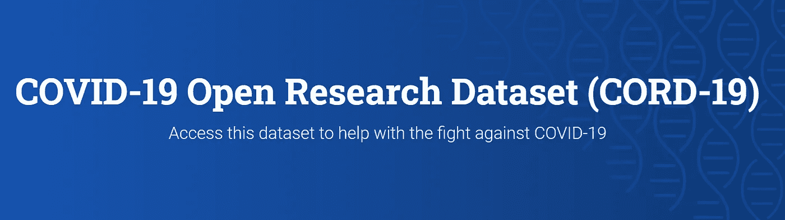
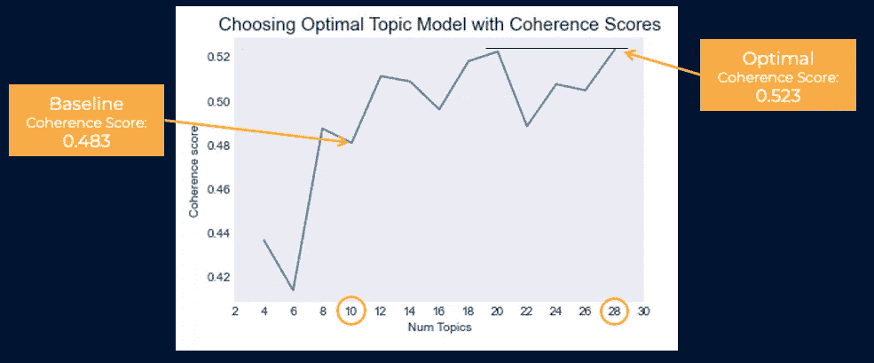
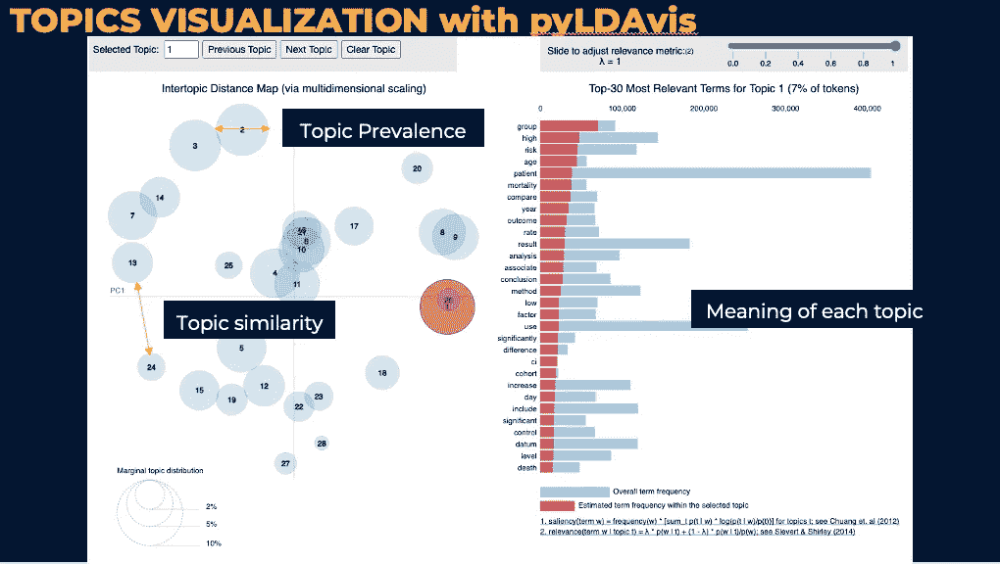
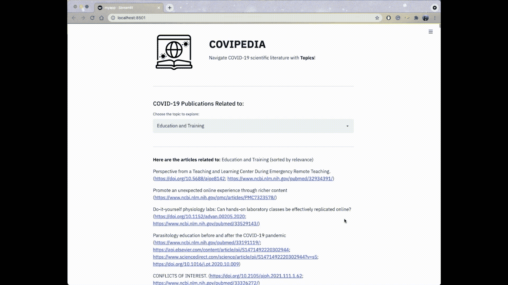
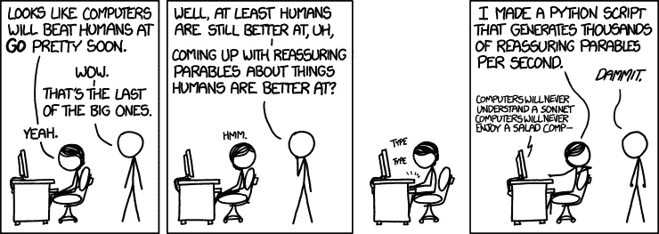

# 使用自然语言处理(NLP)的无监督主题建模

> 原文：<https://medium.com/nerd-for-tech/unsupervised-topic-modeling-using-natural-language-processing-nlp-19a4d7124392?source=collection_archive---------7----------------------->

在 [Unsplash](https://unsplash.com?utm_source=medium&utm_medium=referral) 上由 [Jaredd Craig](https://unsplash.com/@jaredd_craig?utm_source=medium&utm_medium=referral) 拍照

对于在 [Metis 数据科学训练营](https://www.thisismetis.com/bootcamps/online-data-science-bootcamp)的第 5 个模块的项目，我们的任务是使用主要包含文本信息的数据，在任何感兴趣的领域建立无监督学习模型，以解决有用的结构发现、主题建模和/或推荐系统。

在我的项目中，我采用了潜在狄利克雷分配(LDA)的方法对大量文本数据进行主题建模。我对它的强大感到惊讶。

在进入这个项目之前，我想在这里分享一些有用的文章，而不是重新发明轮子:

**自然语言处理** —

*   [NLP 备忘单:迄今为止我的 NLP 学习历程总结](https://towardsdatascience.com/cheat-sheet-for-nlp-a-summary-of-my-nlp-learning-journey-thus-far-6ee753943890)
*   [NLP 备忘单:主 NLP](https://www.kaggle.com/rftexas/nlp-cheatsheet-master-nlp)
*   [您的自然语言处理(NLP)指南](https://towardsdatascience.com/your-guide-to-natural-language-processing-nlp-48ea2511f6e1)
*   [自然语言处理的文本清理方法](https://towardsdatascience.com/text-cleaning-methods-for-natural-language-processing-f2fc1796e8c7)
*   [自然语言处理文本预处理:实用指南和模板](https://towardsdatascience.com/nlp-text-preprocessing-a-practical-guide-and-template-d80874676e79)

**主题建模—**

*   [主题建模可视化——如何呈现 LDA 模型的结果？](https://www.machinelearningplus.com/nlp/topic-modeling-visualization-how-to-present-results-lda-models/)
*   [pyLDAvis:每个 NLP 数据科学家都应该知道的主题建模探索工具](https://neptune.ai/blog/pyldavis-topic-modelling-exploration-tool-that-every-nlp-data-scientist-should-know)
*   [使用 Gensim (Python)进行主题建模](https://www.machinelearningplus.com/nlp/topic-modeling-gensim-python/#16buildingldamalletmodel)
*   [LDA 主题建模和 pyLDAvis 可视化](/@sherryqixuan/topic-modeling-and-pyldavis-visualization-86a543e21f58)
*   [评估主题模型:潜在狄利克雷分配(LDA)](https://towardsdatascience.com/evaluate-topic-model-in-python-latent-dirichlet-allocation-lda-7d57484bb5d0)

***免责声明* :** *我是机器学习和博客的新手。因此，如果有任何错误，请让我知道。感谢所有反馈。*

# 背景故事和项目目标

由于 COVID19 前后科学文献的快速增长，很难跟上最新的出版物。科学家和研究人员被大量的文章淹没，努力寻找与他们的工作相关的文章。此外，科学会议的局限性使得合作和及时更新变得更加困难。然而，对于科学家来说，了解正在进行的研究以找到相关的出版物是至关重要的。

因此，这个项目的目标是建立一个无监督的 NLP 模型(主题建模和/或推荐系统)，帮助研究人员浏览当前关于新冠肺炎的论文，找到与他们的工作相关的内容，并揭示隐藏的语义关系。

# 数据

CORD-19[https://www.semanticscholar.org/cord19/download](https://www.semanticscholar.org/cord19/download)

该项目中使用的数据来自[新冠肺炎开放研究数据集](https://www.semanticscholar.org/cord19)，该数据集收集了超过 50 万篇关于新型冠状病毒的学术文章，供全球研究社区使用。

我取了 2020 年 1 月到 2021 年 5 月的文章子集，大概是 26 万篇，在这个项目中使用文章的摘要作为文本。

# 使用的工具和方法

*   蟒蛇(熊猫，numpy)
*   langdetect
*   正则表达式，字符串
*   spaCy，scispaCy("用于生物医学、科学和临床词汇的 en_core_sci_lg "模型)
*   NLTK
*   Scikitlearn
*   Gensim — LDA
*   WordCloud
*   皮尔戴维斯
*   细流
*   赫罗库

# 方法学

**文本预处理**

1.  过滤掉带有 *langdetect* 的非英语文章
2.  使用 *regex* 和*管柱*进行简单清洗
3.  使用 *ScispaCy* 的(一个 *spaCy* 包)“en_core_sci_lg”模型对生物医学、科学和临床词汇进行词性标注
4.  使用 *gensim* 进行短语检测
5.  删除了带有 *NLTK* 的停用词，使用了词条化，保留了名词、形容词、动词、副词和标记化

**数据转换**

1.  字典—与*gensim . corporate*
2.  文集

**主题建模**

我使用来自 *gensim* 的 *LDA* 建立了我的主题模型，因为我想在语料库中发现潜在的关系。

我首先为我的基本模型尝试了 10 个主题。但是题目不是太笼统就是重叠。虽然主观检查对于评估主题模型是有用的，但是对于这个大型数据集来说，这是具有挑战性且耗时的。所以我用连贯分数来帮助找到最佳的题目数量，也就是 28 个(连贯分数:0.523 vs 基线连贯分数:0.483)。

# 调查结果和见解

**模型解释和可视化**

为了解释，我使用 pyLDAvis 来查看主题在语料库中的相似性和相对频率。

pyLDAvis 的快速解释——pyl Davis 图有三个重要特征。第一，每个圈都是一个话题。每圈的*区域*为**话题流行度**。所以它越大，关于这个话题的文章就越多。二、两个圆之间的*距离*为**话题相似度**。所以离得越远，差异就越大。最后，在右侧，列出了与*相关的术语*，表示每个主题的**含义。要了解更多关于 pyLDAvis 的细节，这里有一个很好的[资源](https://neptune.ai/blog/pyldavis-topic-modelling-exploration-tool-that-every-nlp-data-scientist-should-know)。**

乍一看 pyLDAvis，我的模型中似乎有一些重叠的主题。所以我对那些重叠的群体做了一些调查。而且我发现即使有一些重叠，话题还是有区别的，有意义的。所以总体来说，我对最终的模型表现还是比较满意的。

# 应用程序使用

使用 LDA 模型，我为每篇文章分配了一个主导主题以及它们与主题的相关性，并根据主题为推荐系统对文章进行分组。因此，研究人员可以根据与他们工作相关的主题来查找文章。

我使用 [Streamlit](https://streamlit.io/) 来开发应用程序，并在 Heroku 上部署了具有较小数据集的[应用程序](https://covipedia.herokuapp.com/)(由于 GitHub 上的大小限制)。

如果你想看的话，这里有个应用程序！

# 未来潜力

尽管该模型远非完美，但它展示了如何使用主题建模来推荐相同主题空间中的文章。

我认为通过调整更多的超参数，可以在 NLP 预处理方面做更多的工作。我还想看看研究趋势是否会随着时间的推移而变化。

总是有可能扩展推荐器——基于关键字，添加其他过滤器，如按作者或时间段等。此外，为推荐者尝试不同的模型，例如更高维的 SVD 风格的模型，该模型可能能够在不同的文章之间进行精确的比较并匹配它们。

# **参考文献**

1.  布雷纳德，J. 2020。“科学家淹没在新冠肺炎的论文中。新工具能让它们保持漂浮吗？”*理科*。[https://www . science mag . org/news/2020/05/scientists-are-dropping-新冠肺炎-papers-can-new-tools-keep-them-float #](https://www.sciencemag.org/news/2020/05/scientists-are-drowning-covid-19-papers-can-new-tools-keep-them-afloat)
2.  李，J. 2020。" NLP 的基准语言检测."*走向数据科学，中等。*[https://towards data science . com/benchmarking-language-detection-for-NLP-8250 ea 8 b 67 c](https://towardsdatascience.com/benchmarking-language-detection-for-nlp-8250ea8b67c)
3.  卡帕迪亚，S. 2019。“评估主题模型:潜在狄利克雷分配(LDA)”*面向数据科学，中级*。[https://towards data science . com/evaluate-topic-model-in-python-latent-Dirichlet-allocation-LDA-7d 57484 bb5d 0](https://towardsdatascience.com/evaluate-topic-model-in-python-latent-dirichlet-allocation-lda-7d57484bb5d0)
4.  堪萨斯城，2021 年。" pyLDAvis:每个 NLP 数据科学家都应该知道的主题建模探索工具."*海王博客*。[https://Neptune . ai/blog/pyl Davis-topic-modeling-exploration-tool-that-every-NLP-data-scientist-should-know](https://neptune.ai/blog/pyldavis-topic-modelling-exploration-tool-that-every-nlp-data-scientist-should-know)
5.  王，李，等。" CORD-19:新冠肺炎开放研究数据集."计算语言学协会。[https://www.aclweb.org/anthology/2020.nlpcovid19-acl.1](https://www.aclweb.org/anthology/2020.nlpcovid19-acl.1)

# 外卖食品

总的来说，我对 NLP 和无监督学习的力量印象深刻。无监督学习是一个非常开放的主题。它打开了许多可能性，然而，评估和解释起来却很有挑战性。Coherence score 和 pyLDAvis 在这种情况下很有帮助。然而，探索各种可视化和评估模型的方法总是好的。

图片资源:[https://www . portnet . com/blog/copy writing/content-strategy/essay-natural-language-processing-impact-writers-content-digital-marketing . htm](https://www.portent.com/blog/copywriting/content-strategy/essay-natural-language-processing-impact-writers-content-digital-marketing.htm)

感谢阅读:)希望这是有趣的和有见地的给你。

你可以在我的 GitHub [repo](https://github.com/crystal-ctrl/nlp_project) 上找到我的项目工作。