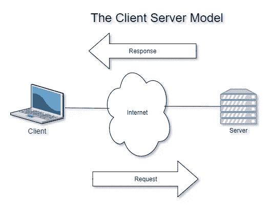
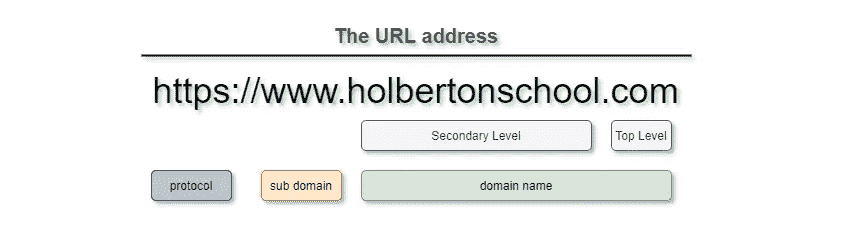
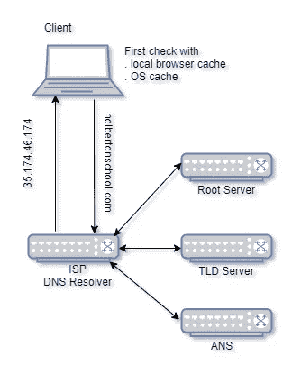
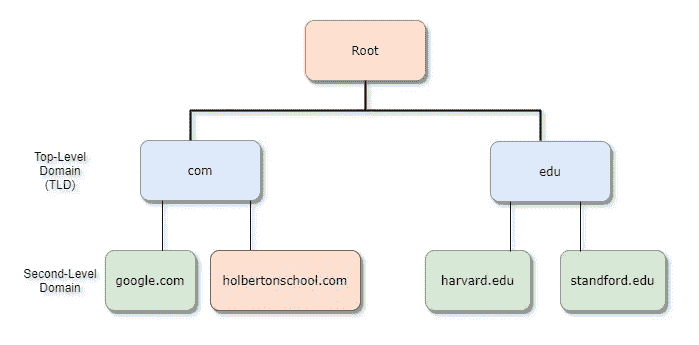
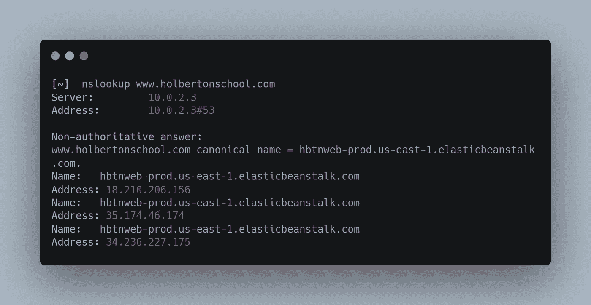
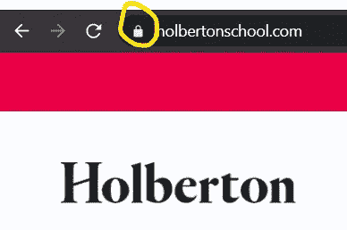
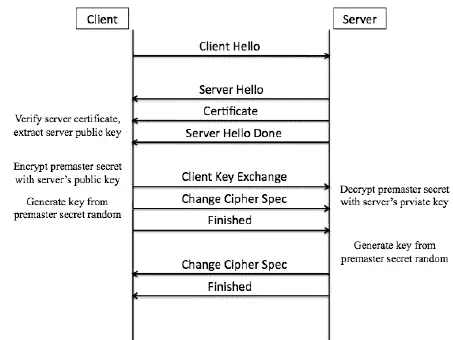
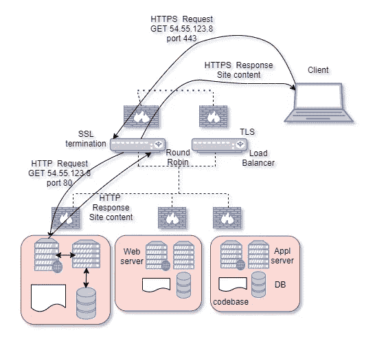
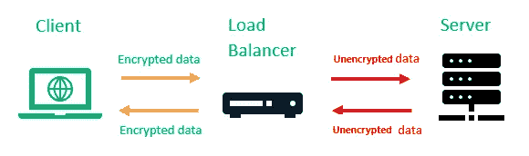
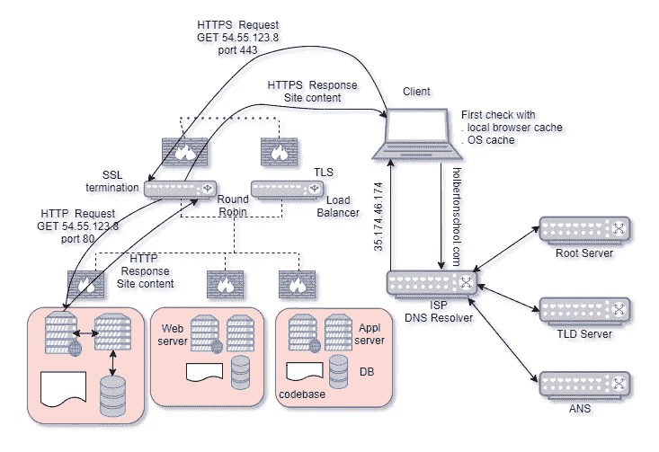

# 发现网络浏览背后的魔力

> 原文：<https://medium.com/nerd-for-tech/unveil-the-magic-behind-web-surfing-f716b27713b5?source=collection_archive---------9----------------------->

达米安·扎莱斯基在 [Unsplash](https://unsplash.com/s/photos/computer-typing?utm_source=unsplash&utm_medium=referral&utm_content=creditCopyText) 上的照片

当你在浏览器中输入[一个网站]并按下 Enter 时会发生什么:这是一个在工作面试中反复出现的问题，它总结了软件工程师知识的很大一部分。

每个人都浏览互联网，但很少有人花时间去思考幕后发生的事情。

在我们开始我们的 web 基础设施之旅之前，我想向您介绍一下客户机-服务器模型，因为这是互联网通信的方式。

模型是如何工作的？

*   **客户端**任何使用服务提供商(服务器)服务的连接设备(笔记本电脑、智能手机……)。
*   **服务器**任何提供信息或访问某些服务的连接设备。服务器可以是硬件也可以是软件。通常，**网络服务器**托管所请求的网站。
*   **协议**在两个设备之间传输数据的一组规则或方法的总称。传输控制协议/互联网协议(TCP/IP)是互联网上事实上的标准协议。

客户端通过局域网(LAN)或广域网(WAN )(如互联网)连接到服务器。一旦服务器满足了客户端的请求，连接就会终止。

比方说你谷歌`holbertonschool.com`。你在网络浏览器中输入统一资源定位器(URL)[https://www.holbertonschool.com](https://www.holbertonschool.com/)。

URL 格式

眨眼之间，你就进入了你所要求的页面。是不是很神奇？正如您将看到的，理解一些基本概念比到达您想要的页面需要更多的时间！

让我们一步步揭开魔法的面纱。

# 1.向 **DNS** 问好。

互联网上的计算机和其他设备使用一组称为 IP 地址的唯一数字相互通信。每台连接到互联网的设备都有自己的 IP 地址，包括您的电话和电脑。

如果你碰巧知道你想访问的网站的 IP 地址，你可以直接在你的浏览器中输入。但是我们，作为人类，使用语言。打个比方，你记得你联系人列表里的每个电话号码吗？因此，需要一个从 URL 到 IP 地址的转换过程。

如果您已经访问了所请求的站点，其 IP 地址会存储在您的浏览器或操作系统(OS)的缓存中。

> “在[计算](https://en.wikipedia.org/wiki/Computing)中，**缓存**是存储数据的硬件或软件组件，以便将来对该数据的请求可以得到更快的服务”——维基百科

如果浏览器缓存返回空响应，则检查操作系统缓存:Linux 和 MacOS 机器上的`/etc/hosts`和 Windows 上的`C:\Windows\System32\Drivers\etc\hosts`。

如果浏览器和操作系统都没有缓存域名的 IP 地址怎么办？这意味着您从未访问过该网站，或者您的缓存已被清空。输入域名系统。

> “**域名系统** ( **DNS** )是一个[分级](https://en.wikipedia.org/wiki/Hierarchy)和[分散](https://en.wikipedia.org/wiki/Decentralised_system)命名系统，用于连接到[互联网](https://en.wikipedia.org/wiki/Internet)或专用网络的计算机、服务或其他资源……最突出的是，它将更容易记忆的域名翻译成数字 [IP 地址](https://en.wikipedia.org/wiki/IP_address)，这是定位和识别具有底层[网络协议](https://en.wikipedia.org/wiki/Communication_protocol)的计算机服务和设备所需要的—维基百科

DNS 就像是网站的通讯录。以下是 DNS 查找的工作原理:

DNS 查找

a)操作系统要求称为解析器的递归 DNS 服务器(专用于解析域名的服务器)查找 IP 地址。解析程序通常由您的互联网服务提供商(ISP)运行。解析器检查其缓存，如果找到，解析过程结束。如果没有，它会查询下一个 DNS 服务器…

b) …称为根 DNS 服务器。根 DNS 服务器知道关于顶级域(TLD)服务器的信息。`.com`是 TLD 的一个例子。其他还有`.org`、`.edu`、`.com`、`.net`等等。根服务器位于 DNS 层次结构的顶端。

DNS 层次结构

根 DNS 服务器分布在全球各地(*分散化*)，由独立组织运营。在我们的例子中，根服务器会将我们指向…

c)…TLD 服务器。购买域名后，域名注册服务商将保留该域名，并向 TLD 注册管理机构传达权威域名服务器(ANS)的信息。在域名注册商的帮助下，`.com` TLD 找到了域名`holbertonschool.com`的 ANS。

ANS 实际上拥有一份地址簿的副本，将 IP 地址与域名相匹配。它将检查`holbertonschool.com`对 **www** 子域的 DNS 记录。

地址查找到此结束:ANS 返回分配给所请求域名的 A 记录(实际 IP 地址)。

e)如果 ANS 返回规范名称(CNAME)记录而不是 A 记录，则 DNS 解析器使用规范名称而不是原始名称重新发出查询。

CName 记录

例如，对“holbertonschool.com”的请求将返回“HBT nweb-prod . us-east-1 . elastic beanstalk . com”的 CNAME 记录。DNS 解析器将发送一个带有这个 CNAME 记录的查询，并将得到三个 A 记录(18.210.206.156、35.174.46.174 和 34.236.227.175 的 IP 地址)。

> “规范名称或 CNAME 记录是一种将别名映射到真实或*规范*域名的 DNS 记录……这在从单个 IP 地址运行多个服务(如 [FTP 服务器](https://en.wikipedia.org/wiki/File_Transfer_Protocol) *和*web 服务器，每个服务器运行在不同的端口上)时非常方便。例如，可以将*ftp.example.com*和[*www.example.com*](http://www.example.com)指向*example.com*的 DNS 条目，该条目又有一个 [A 记录](https://en.wikipedia.org/wiki/A_record)指向 IP 地址。然后，如果 IP 地址发生了变化，人们只需在网络内的一个地方记录这种变化:在 DNS 中记录下 example.com 的地址—维基百科

收到答案后，递归 DNS 解析器将该信息发送回请求它的计算机(和浏览器)。

客户端如何与服务器通信？

还记得协议这个术语吗？需要一种可由客户机和服务器实现的标准化协议，以在它们之间建立连接。

开放系统互连(OSI)就是这样一种标准化模型。

> **开放系统互连模型** ( **OSI 模型**)是一个[概念模型](https://en.wikipedia.org/wiki/Conceptual_model)，它描述并标准化了[电信](https://en.wikipedia.org/wiki/Telecommunication)或计算系统的通信功能，而不考虑其底层内部结构和技术。它的目标是不同通信系统与标准[通信协议](https://en.wikipedia.org/wiki/Communication_protocols)的互操作性。—维基百科

就 web 基础设施而言，TCP/IP 是客户机和服务器之间通信的标准，尽管不是强制性的。

# **2。TCP / IP 协议**

IP 指定了数据包的技术格式和计算机通过网络通信的寻址方案。大多数网络将 IP 和 TCP 结合起来，TCP 是一种更高级的协议，它在目的地和源之间建立虚拟连接，以便它们可以在一段时间内来回发送消息。

TCP(传输层协议)是由其可靠性定义的，TCP 中的数据包(即请求/响应数据)的传递是有保证的，即使这需要更多的时间。另一种传输层协议是用户数据报包(UDP ),它速度更快，但不太可靠——数据包传输没有双重检查。

UDP 是流媒体服务的典型，即时内容是优先考虑的；TCP 在其他地方使用最多。

OSI 与 TCP/IP

当您在浏览器中请求一个网页时，您的计算机向 web 服务器的 IP 地址发送 TCP 数据包，要求它将网页发送回来。web 服务器通过发送一个 TCP 数据包流做出响应，您的 web 浏览器将这些数据包组装到网页中。

首先，TCP 通过对数据包进行编号来对其进行排序。第二，它通过让接收者向发送者发送一个响应，说它已经收到消息，来检查错误。如果发送方没有得到正确的响应，它可以重新发送数据包，以确保接收方正确接收它们。

**总结，第 1 轮**

到目前为止，您输入一个 URL，`holbertonschool.com`，有一个完整的 DNS 查找过程来获取相应的 IP 地址，有了这个地址，客户端就能够通过 TCP/IP 协议连接到服务器。

到目前为止还不错，但是安全问题呢？两台主机能否通过连接交换敏感信息(如密码、信用卡号等)？

你在地址栏看到挂锁图标了吗？这表明使用 SSL(安全套接字层)证书的 HTTPS 连接有效。您可以点击挂锁查看证书的详细信息，包括颁发机构和网站所有者的公司名称。

HTTPS 视觉指示

使用 HTTPS，TCP/IP 连接是加密的，因此连接期间的所有交换数据都受到保护。

它是如何工作的？

# **3。超文本传输协议安全/安全套接字层(HTTPS / SSL)**

我们先来定义一下**超文本传输协议** (HTTP)。

HTTP 是 TCP/IP 应用层协议，用于在万维网(WWW)上传送数据(HTML 文件、图像文件、查询结果等)。

HTTP 消息有两种类型:**请求**和**响应**。HTTP 规定了客户机的请求(如 GET、POST、DELETE、PUT)将如何被构造并发送到服务器，服务器如何响应这些请求，以及如何解释消息。

HTTP 以没有加密或保护的明文传输数据，因此它不能防止中间人类型的入侵。

这就是 HTTPS 的用武之地(带“S”表示安全)。它将 SSL /传输层安全(TLS)协议添加到 HTTP 中。该协议使用非对称加密密钥加密数据，使得第三方无法读取交换的信息，并保护连接。它还证明了相应 SSL / TLS 证书持有人的身份。

HTTPS 协议的激活导致地址栏中的 URL 旁边出现一个挂锁，这是互联网用户现在已经习惯的。当网站受 SSL 证书或 TLS 证书保护时，它会出现。

要在 HTTPS 显示网站，公司必须首先获得 SSL 证书。SSL 是一种保护浏览器和服务器之间数据交换的技术。获得 SSL 证书会导致 SSL 协议的激活，授权站点在 HTTPS 打开连接。

TLS 证书是 SSL 证书的继承者。TLS 是 SSL 的一个更安全的版本，其工作原理相同。按照惯例，仍然使用 SSL 证书而不是 TLS 证书，即使协议确实是 TLS。

**TLS 握手**

来源[https://media.giphy.com/media/mGo8dkPOF6GLm/source.gif](https://media.giphy.com/media/mGo8dkPOF6GLm/source.gif)

每当客户端在 TCP 连接之后通过 HTTPS 查询网站时，就会发生 TLS 握手。

TLS 握手中的步骤将根据所使用的密钥交换算法的种类和双方支持的密码套件而有所不同。RSA 密钥交换算法是最常用的。内容如下:

TLS 密钥传输

a)“客户端你好”消息:客户端通过向服务器发送“你好”消息来发起握手。该消息包括客户端支持的 TLS 版本、支持的密码套件和称为“客户端随机”的随机字节串

b)“服务器 hello”消息:作为对客户端“hello 消息”的回复，服务器发送一条消息，其中包含服务器的 SSL 证书、服务器选择的密码套件和“服务器随机”，这是服务器生成的另一个随机字节字符串。

c)身份验证:客户端向颁发证书的证书颁发机构验证服务器的 SSL 证书。这证实了服务器是它所声称的那个人，并且客户机正在与域的实际所有者进行交互。

d)前置密码:客户端发送一个随机的字节串，即“前置密码”预主密钥用公钥加密，只能由服务器用私钥解密。(客户端从服务器的 SSL 证书获取公钥。)

e)使用的私钥:服务器解密预主密钥。

f)创建的会话密钥:客户端和服务器都从客户端随机密钥、服务器随机密钥和主密钥中生成会话密钥。它们应该得到相同的结果。

g)客户端准备好:客户端发送用会话密钥加密的“完成”消息。

h)服务器准备就绪:服务器发送用会话密钥加密的“完成”消息。

I)实现了安全的对称加密:握手完成，并且使用会话密钥继续通信。

每当您通过 HTTPS 连接到网站时，浏览器中显示的挂锁就是由这整个安全过程造成的。

*太好了！安全方面就这些吗？我们交流安全吗？*

嗯，还没有。

TLS 实现了三个安全目的:隐私、完整性和身份验证，但它假定数据来自可信的来源。事实上，TLS 会加密发送到两端的任何请求。它不能保护主机免受恶意脚本/负载的执行。

我们需要防火墙！

# **4。防火墙**

> 防火墙是私有网络(T1)和外部网络(通常是 T2 互联网(T3))之间的一部分，负责管理两个网络之间的流量。它通过[硬件](https://www.webopedia.com/definitions/hardware/)或[软件](https://www.webopedia.com/definitions/software/)来实现。防火墙根据硬件或软件中预先配置的规则允许、限制和阻止网络流量，分析请求进入网络的数据包。—网络百科

防火墙就像一个检查点，在接受或拒绝外部网络传入或传出的数据之前，会对其进行检查。防火墙程序使用几种类型的安全功能。例如:

a) **包过滤**:查看进入或离开网络的每个数据包，并根据用户定义的规则接受或拒绝它。包过滤相当有效，对用户透明，但很难配置。此外，它容易受到 IP 欺骗。

b) **电路级**:当新的 TCP/IP 或 UDP 连接链接到系统时，激活安全扫描。一旦建立了连接，数据包就可以在主机之间流动，无需进一步检查。

c) **代理服务器**:作为特定应用从一个网络到另一个网络的网关。代理服务器可以通过阻止来自网络外部的直接连接来提供附加功能。

服务器管理员可以配置防火墙，只接受或拒绝来自特定 IP 地址或特定端口的传入流量*。*

就这些了，从安全角度来说。

# **5。负载平衡器**

让我们换个角度，考虑一下服务器负载。

根据经验，为了避免单点故障 (SPOF)，网站有不止一台服务器。它需要一个负载平衡器来在多个服务器之间分配大量的传入请求。

负载平衡器将工作负载分配给多个服务器，以分担负载量，从而提高网站的可靠性、效率和可用性。

> “负载平衡器，或称服务器负载平衡器(SLB)，是一种基于硬件或软件的设备，可在多台服务器上有效分配[网络](https://www.webopedia.com/definitions/network/)或[应用](https://www.webopedia.com/definitions/application/)流量。有了负载均衡器，如果服务器的性能受到过量流量的影响，或者如果它停止响应请求，[负载均衡](https://www.webopedia.com/definitions/load-balancing/)功能会自动将请求切换到不同的服务器。”—网络百科

负载平衡器集群

软件负载平衡器可以配置在托管 web 内容的同一台服务器上，也可以配置在一台单独的服务器上。

有各种类型的负载平衡算法，每种算法都有自己的优点和缺点:

a) **循环调度**:根据队列将请求平均分配给服务器。

b) **最少连接数**:向当前连接数最少的服务器发送新连接。

c) **Random** :随机分配请求给一个服务器。

d)更多负载平衡算法[此处](https://devcentral.f5.com/articles/intro-to-load-balancing-for-developers-ndash-the-algorithms)。

理想情况下，一个网站将配置多个负载平衡器，以避免 SPOF。

**从 HTTP 重定向到 HTTPS**

当你在浏览器的地址栏中输入 google.com 或 youtube.com 时，你会在前面加前缀 https 吗？如果你和大多数人一样，答案是否定的。结果是你被发送到不安全的 HTTP 版本的网站。

一些负载平衡器，如 HAProxy，可以设置为自动将用户从 HTTP(端口 80)重新路由到 HTTPS(端口 443)。

**SSL 卸载**

还记得用私有和公共密钥进行的 TLS 握手吗？使用 RSA 算法，这些密钥的长度为 2048 位，会话密钥最多支持 256 位加密。这为用户和服务提供商提供了可靠的保护。

缺点是它的加密和解密速度相对较慢，并且在很大程度上占用了服务器的资源。因此，服务器变得更慢。

SSL 卸载的概念是当所有的加密和解密都在负载平衡器处终止时，HTTP 消息被明文传递给服务器。有两种类型的 SSL 卸载:SSL 终端和 SSL 桥接。

**SSL 终止**

SSL 终止是一个有助于加速解密过程的过程。它通过安全、加密的 HTTPS 连接将客户端连接到负载平衡器。但是，负载平衡器和服务器之间的传入和传出数据传输将保持不加密。

来源[https://sectigo store . com/blog/what-is-SSL-offloading-features-benefits-of-SSL-offloading](https://sectigostore.com/blog/what-is-ssl-offloading-features-benefits-of-ssl-offloading)

网站所有者的优势是:

*   证书保存在更少的地方，
*   服务器没有为了证书更新的目的而暴露给因特网，
*   服务器摆脱了处理加密消息的任务，释放了 CPU 时间。

SSL 终止减少了工作量并节省了计算开销。

对于不处理用户敏感信息的网站:博客、资讯网站(如维基百科)、媒体分享网站(如 YouTube)，SSL 终止是一种有效的方法。

缺点是:

*   它欺骗客户说，他们的数据在整个通信过程中是安全的，尽管加密在中途丢失，而他们不知道这一点。
*   由于负载均衡器处理所有数据，因此不容易相信所有信息仍然是安全的。

**总结，第 2 轮**

*   浏览器接收到 URL `holbertonschool.com`
*   有一个 DNS 查找过程来获取 URL 的 IP 地址。
*   浏览器通过 TCP/IP 完成与负载平衡器的 TLS 握手。
*   浏览器通过加密的连接方法向负载均衡器发送 HTTPS GET 请求。
*   HTTPS GET 请求通过负载平衡器上的防火墙传递。
*   负载平衡器终止加密解密过程。
*   负载平衡器将 HTTP GET 请求分发到下一个可用的主机服务器。
*   HTTP GET 请求通过主机服务器上的防火墙传递。

# **6。网络服务器**

web 服务器是一种软件，它使用 HTTP 和其他协议来响应客户端请求并提供网页。web 服务器的主要工作是满足客户端对来自网站的静态内容(HTML 页面、图像、纯文本文件等)的请求。

因此，Web 服务器已经收到了客户机 GET 请求。它处理请求并发回一个 HTTP 响应。响应通常包括状态代码。一些常见的状态代码有:

*   一切都很顺利。
*   **301** 永久移动:存在到另一个网站的重定向。
*   **404** 找不到:服务器在请求的位置没有找到任何东西。

静态内容是指在发送到客户端之前不需要处理的任何内容，在客户端没有发生任何交互。

在我们的例子中，我们已经到达了目的地，这是请求的页面。

动态内容可以更新和更改。这是由…处理的

# 7 .**。…应用服务器**

应用服务器让网站变得更加活跃和动态。用户可以通过登录、在论坛上发帖等方式与它互动...

在典型的部署中，提供静态和动态内容的网站运行静态内容的 web 服务器和动态生成内容的应用服务器。

web 服务器将信息传递给应用服务器，然后应用服务器在数据库中查询所需的信息，对其进行转换并将其发送回 web 服务器。

应用服务器运行在 web 服务器的后面，SQL 数据库的前面。

# **8。数据库**

是经过组织的信息集合，以便于访问、管理和更新。计算机数据库通常包含数据记录或文件的集合，包含关于销售交易或与特定客户的交互的信息。

在关系数据库中，关于特定客户的数字信息被组织成行、列和表，它们被编入索引，以便通过 SQL 或 NoSQL 查询更容易找到相关信息。

这张图展示了从客户端到服务器的流程。

所有人现在在一起！

# **结论**

一眨眼的功夫，一天几百万次，这是怎样的一段旅程啊！！谢谢那些至今陪伴我的人。

# **参考文献**

 [## HTTPS 是如何运作的

### 🙀一只猫解释 HTTPS 是如何工作的...在漫画里！😻

howhttps.works](https://howhttps.works/why-do-we-need-https/)  [## DNS 如何工作

### 解释当你浏览一个网站时会发生什么的漫画。

豪登斯工厂](https://howdns.works/)  [## 发展中心

### 编辑描述

devcentral.f5.com](https://devcentral.f5.com/s/articles/intro-to-load-balancing-for-developers-ndash-the-algorithms)  [## 塞蒂戈

### 编辑描述

www.instantssl.com](https://www.instantssl.com/http-vs-https)  [## 什么是 web 服务器？

### 术语 web 服务器可以指硬件或软件，或者两者一起工作。

developer.mozilla.org](https://developer.mozilla.org/en-US/docs/Learn/Common_questions/What_is_a_web_server)  [## 软件和硬件负载均衡器是如何工作的？(负载平衡器算法解释如下…

### 当您的企业应用程序或网站获得大量点击时，您的服务器可能会负载过重。在…

www.thegeekstuff.com](https://www.thegeekstuff.com/2016/01/load-balancer-intro/)  [## 什么是防火墙？防火墙的定义和含义

### 防火墙是私有网络和外部网络(通常是)之间的一个分支，它管理在私有网络和外部网络之间传递的流量

www.webopedia.com](https://www.webopedia.com/definitions/firewall/)  [## 什么是数据库？-WhatIs.com 的定义

### 数据库是信息的集合，这些信息被组织起来以便于访问、管理和更新…

searchsqlserver.techtarget.com](https://searchsqlserver.techtarget.com/definition/database)  [## 什么是 SSL 卸载？SSL 卸载的特性和优势

### 如果你是一个经常上网的人，你一定已经注意到，当许多用户访问同一个网站时，有些网站会变慢

www.clickssl.net](https://www.clickssl.net/blog/what-is-ssl-offloading-features-benefits-of-ssl-offloading) 

[https://www . cloud flare . com/learning/SSL/what-happens-in-a-TLS-handshake](https://www.cloudflare.com/learning/ssl/what-happens-in-a-tls-handshake/)/