# 即将到来的敌人浪潮-游戏开发系列 42

> 原文：<https://medium.com/nerd-for-tech/upcoming-enemy-wave-game-dev-series-42-469b33fad8aa?source=collection_archive---------34----------------------->

目标:用有限的产卵数量创造一波又一波的敌人。

与有无限敌人的街机射击游戏相比，一波又一波的敌人会给玩家制造一个区域目标，也给我们的游戏一个适当的结局。

为了制造攻击波，我们需要调整 2 个脚本。

## 产卵管理器

在 **SpawnManager** 中，我们将使用 wave 协程代替敌方产卵协程。为此，我们需要一些变量。

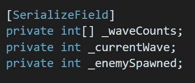

我们可以通过**_ waves counts**在检查器中设置波数。例如，如果你设置 5，那么你应该有 5 个波。

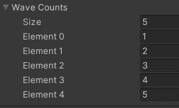

**_currentWave** 就是我们用来计数电流波的。当一波结束时，它会增加，我们将在后面的代码中添加它。

**_ enemy spawn**用于统计已经繁殖了多少敌人。

为了防止引起任何不可预测的错误，我们可以在 **Start()** 中将 **_currentWave** 的值设置为 0。

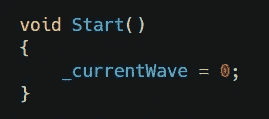

有了这三个变量，我们就能创造出我们的敌人波。

创建一个新的协程，并在其中设置一个 while 循环。在这个循环中，我们将增加当前波的数量，将产生的敌人设置为 0。

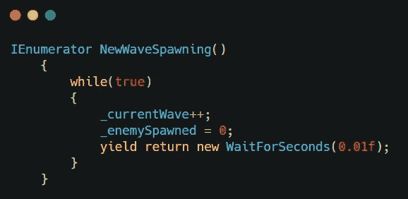

不要忘记最后一行，否则你们的团结会崩溃。

为了开始产卵，我们还需要打开一个 bool。然后使用这个 bool as 条件开始生成另一个 while 循环。

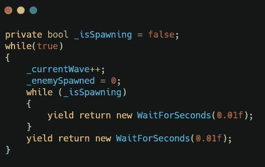

同样，总是在一个循环中获得收益回报。

在这个**_ is spanning**循环中，我们将使用 3 个部分作为 wave spawning 例程。

*   如果繁殖的敌人数量少于波浪繁殖极限，保持每次繁殖。
*   如果这波产卵结束，检查是否有任何敌人预置留在容器中。如果没有，波结束，将当前波计数增加 1，然后将**_ enemy spowned**设置为 0。
*   再次产卵循环。

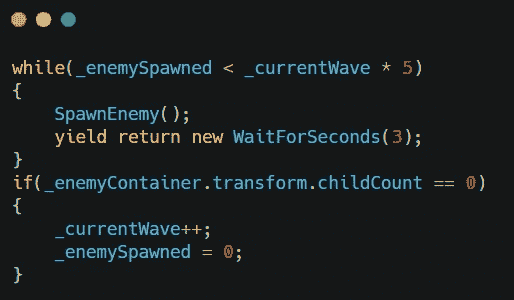

那么我们就可以使用原来的敌人产卵代码作为新方法 **SpawnEnemy()** 。这也是我们增加敌人数量的地方。

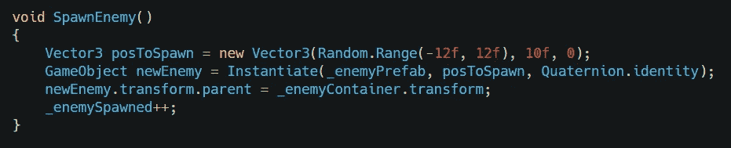

我们的波浪产卵几乎准备好了。
最后一步是让布尔在**start spanning()**中开始产卵。

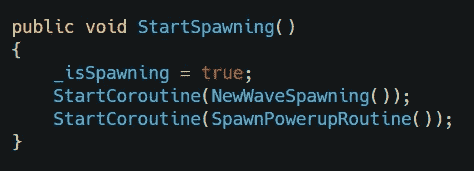

## UIManager

接下来是我们的 UI。我们将使用户界面在每一波开始时闪烁当前的波数。

首先，让我们在**画布**中创建一个 wave 文本。并调整大小和位置。

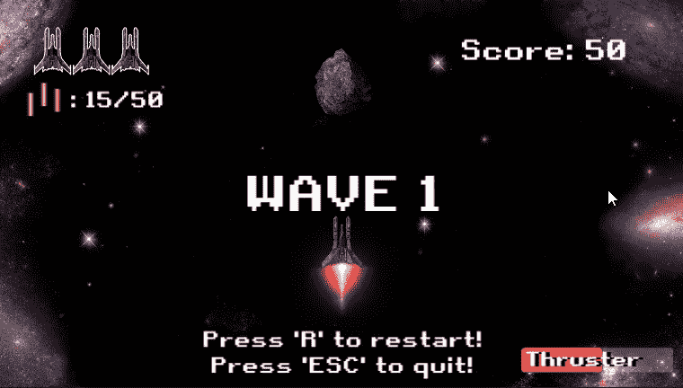

并使用 Canvas 创建一个动画来制作波形文本的动画。

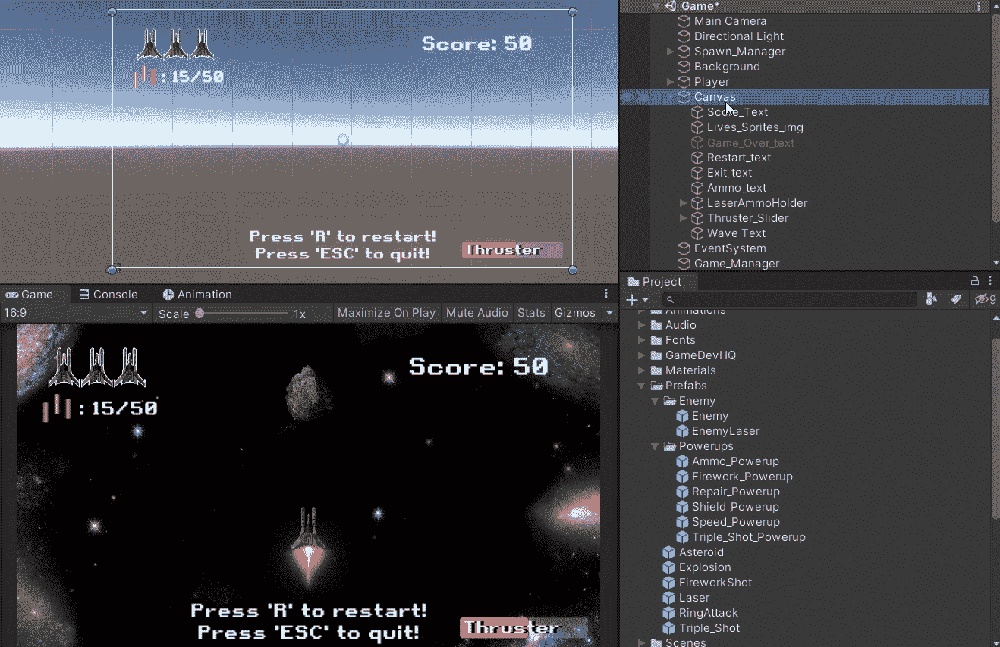

在 Animator 编辑器中，创建一个空状态作为默认状态，并将触发过渡设置为波形文本。因为我们的动画会停留 5 秒钟，所以将转换设置回默认状态。

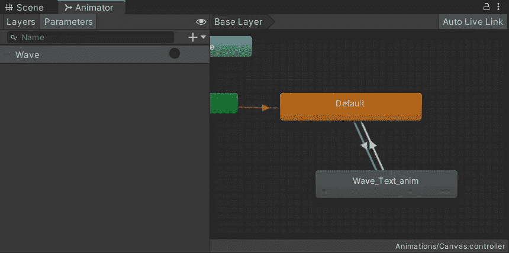

带有动画触发器。

然后在 **UIManager** 中，为创建 2 个变量，并创建一个公共方法来控制它。

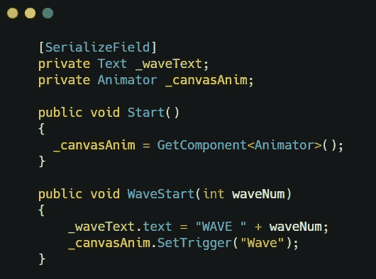

有了这个公共方法，我们可以回过头来 **SpawnManager()** 来调用它。

在调用方法之前，我们还需要创建一个变量并调试它。

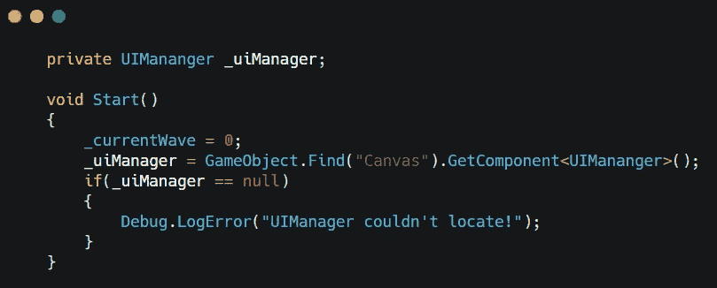

有两个位置我们需要调用 wave text。1 是我们第一次增加当前的波数。
2 是在我们一波消灭所有敌人之后的 while 循环。

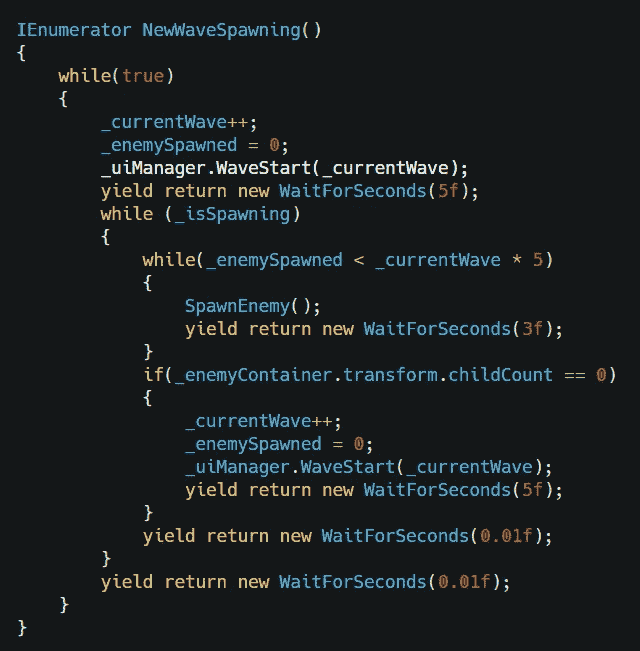

全部完成！是时候面对一波又一波的敌人了。

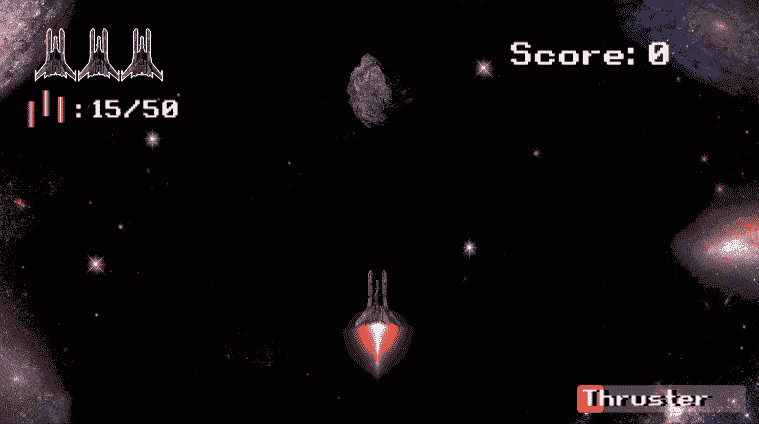

接下来:[空间毒气来袭！](https://sj-jason-liu.medium.com/space-poison-incoming-game-dev-series-43-eb4ec025270d)