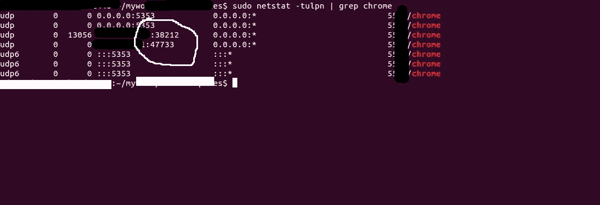

# 基于 WebRTC 的应用程序 UPD 节流。

> 原文：<https://medium.com/nerd-for-tech/upd-throttling-for-apps-based-on-webrtc-36dd18b36097?source=collection_archive---------0----------------------->


自从 webRTC 技术的兴起，许多应用程序已经提供了视频通话，这是非常惊人的。全世界的开发人员都在构建 POC 进行测试。没有太多关于事物如何在引擎盖下工作的深入知识，导致应用程序的不确定行为。

我们首先需要了解的是，WebRTC 技术使用 UDP 而不是 TCP 来开始通信。快速理解 TCP 和 UDP 的区别就是“TCP 包向发送方发送确认，UDP 不发送”。这使得 UDP 成为视频通话的最佳选择。

我们中的许多人习惯于 chrome 的“网络节流配置文件”，这有助于模拟慢速网络连接，但这仅限于 TCP 连接。这意味着你不能用它来限制 UDP 连接，换句话说，你不能在视频通话中制造延迟。

## 康卡斯特前来救援

康卡斯特帮助我们模拟较慢的网络连接。如果你在 mac 上，你可以直接使用`ipfw`和`pfctl`来注入失败。在 Linux 上，我们使用`iptables`和`tc`。康卡斯特只是这些控件的一层薄薄的包装。通过`wipfw`或者甚至是本地网络栈，Windows 支持是可能的，但是这还没有在 Comcast 中实现，可能会在以后实现。

安装:

第一步:安装`go`并设置`GOPATH`变量。
安装 ubuntu

```
sudo apt-get install gccgo-go
```

在`~/.bashrc`中添加以下代码，不要忘记运行`bashrc`文件。

```
export GOPATH=’<folder in you home>’
export PATH=$PATH:$GOPATH
```

第二步:安装康卡斯特。

```
go get github.com/tylertreat/comcast
```

Comcast 安装在你在`bashrc`中`GOPATH`提到的文件夹里。

接下来我们需要降低 UDP 包的上传速度。
要测试它，现在打开你的应用程序，开始播放视频。获取发送 UDP 的端口号。(假设你运行的是 chrome)

```
sudo netstat -tulpn | grep chrome
```



注意两个端口号`38212 & 47733`

打开另一个浏览器，观看发布者的视频，如果你的互联网连接很好，应该可以看到，没有任何问题。

让我们最后运行减慢 UDP 流的命令:

```
./comcast --device=wlan2 --latency=1000 --target-bw=50 --default-bw=50 --packet-loss=80% --target-addr=8.8.8.8,10.0.0.0 --target-proto=udp --target-port=38212,47733
```

请务必将`--device`选项更改为您的网络设备，我正在使用 wifi，因此它是`wlan2`。此外，请注意我们之前提到的端口号在`--target-port`参数中有提及。


我希望你的用户不会感觉像约翰·特拉沃尔塔。

调试愉快。