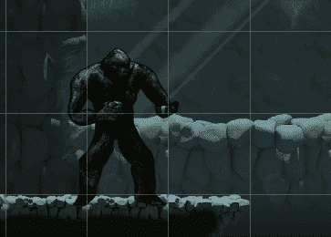
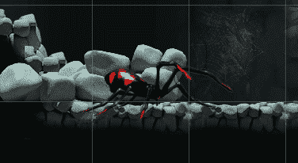
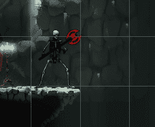
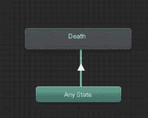
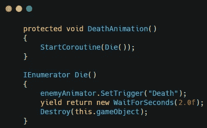
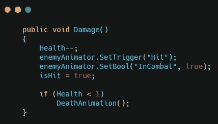
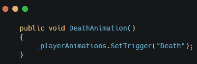
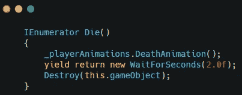
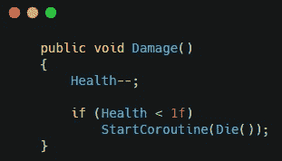
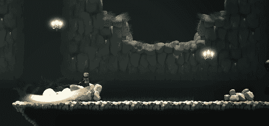

# 更新:死亡动画

> 原文：<https://medium.com/nerd-for-tech/update-death-animations-7306b300fa0a?source=collection_archive---------17----------------------->

我已经给敌人和玩家添加了死亡动画。

这是通过检查每个敌人和玩家并记录死亡动画来完成的。

使用触发参数从任何状态触发死亡动画。

对于敌人，在敌人类中创建一个协程，并在受保护的方法中调用它。

然后调用方法在每个敌人上启动协程。

对于玩家来说也是类似的。在播放器动画脚本中设置触发器。

在播放器脚本中创建一个协程。

然后在玩家生命耗尽时启动协程。

现在基本战斗系统完成了。

