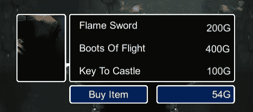
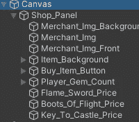
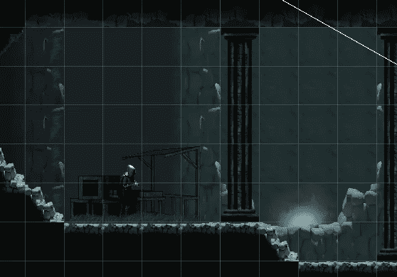
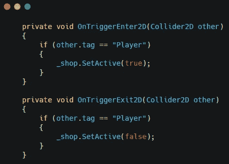
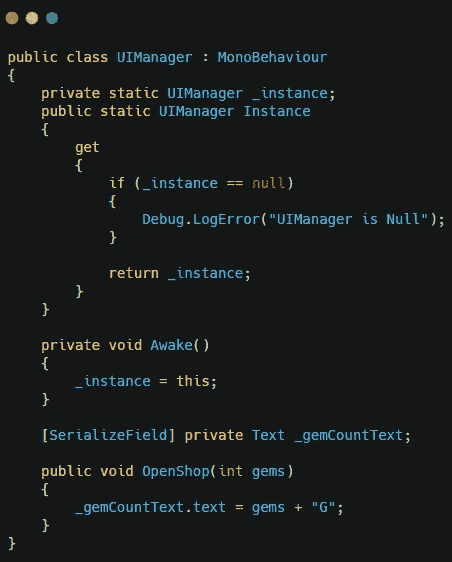
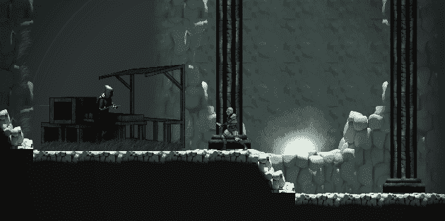

# 更新:Unity 中的商店界面设置

> 原文：<https://medium.com/nerd-for-tech/update-shop-ui-setup-in-unity-82644276a2c0?source=collection_archive---------13----------------------->

我已经开始为我的游戏开商店了。我在添加画布、图像和文本组件的过程中。

我还将商人添加到了场景中。

我添加了商店脚本，允许玩家在到达商家时打开商店界面。

商店会显示玩家拥有宝石的正确数量。这是使用 UIManager 和 singleton 从玩家那里获取宝石计数并在文本元素中显示出来。

