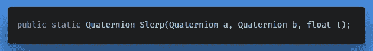
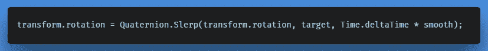
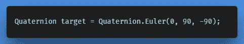
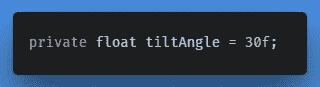
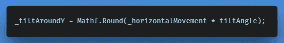
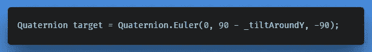
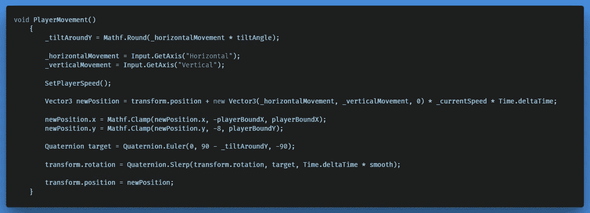

# 更新玩家动作

> 原文：<https://medium.com/nerd-for-tech/updating-the-player-movement-90f42fb0e6be?source=collection_archive---------28----------------------->

我创建了一个原始的太空战斗机模型，我将用它作为玩家原型，并用粒子系统给它一个简单的引擎效果。此外，我开始调整玩家的移动方法，当满足给定的输入条件时，允许玩家向一个方向倾斜。

**目标:**

在移动过程中，根据用户输入，平滑地从一侧向另一侧倾斜变换。

**解决方案:**

你也可以通过使用动画来获得想要的效果，但是在这种情况下，我决定通过使用四元数改变运动行为来将其添加到我们的玩家脚本中。

**逻辑:**

让我们快速看一下**四元数的声明。Slerp** 以及我们如何使用它从点 **a** 到 **b** 进行平滑插值。

一个球插值在四元数 a 和 b 之间的四元数。

在我们的例子中，我们希望在检测到水平移动输入时更新播放器的变换旋转。在球员移动方法中，我们这样应用它；

当前旋转，朝向旋转，平滑时间

所以我们必须定义一个我们想要旋转的目标旋转。假设播放器处于其默认位置；

添加负责转换最大倾斜角的私有成员变量。

然后添加一个局部变量，允许我们通过从 Y 轴减去它来修改我们的目标旋转。

Mathf。Round 返回舍入到最接近的整数的浮点数 f。

现在，我们基于用户输入平滑地插值到新的旋转。

以下是当前玩家移动方式的概述。

← [上一个](https://gert-coppens.medium.com/from-prototype-to-work-of-art-ff35e6c8100f) | [下一个](https://gert-coppens.medium.com/updating-the-shooting-logic-32130df5f76a) →