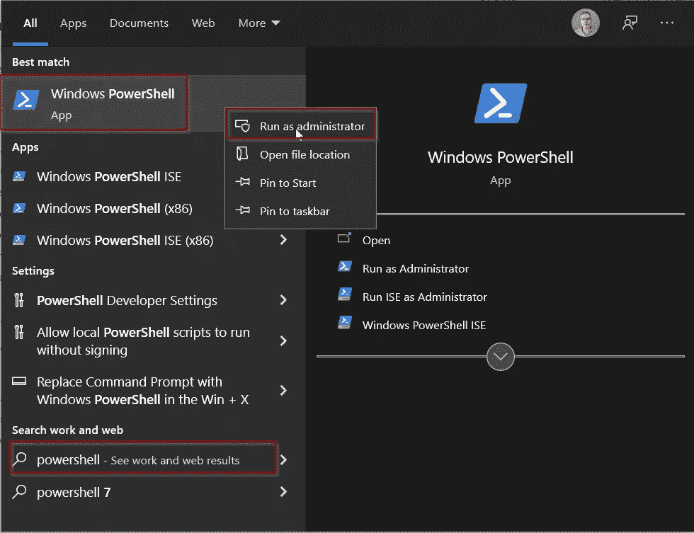
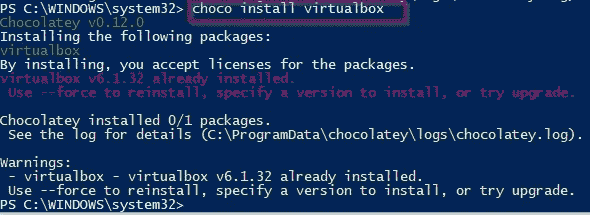
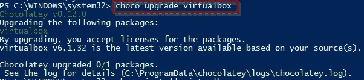
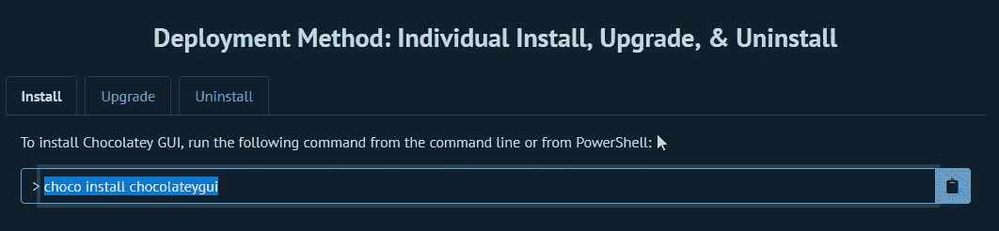
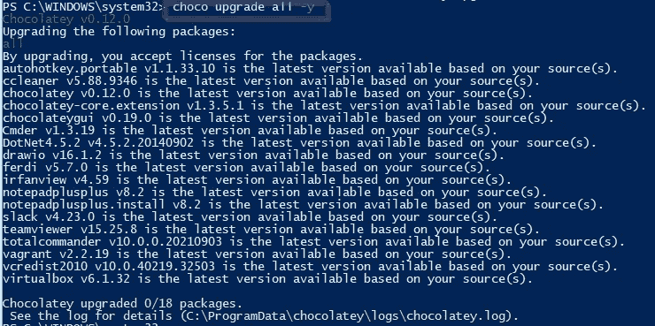
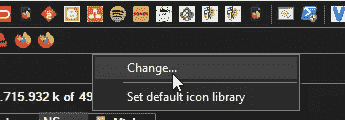
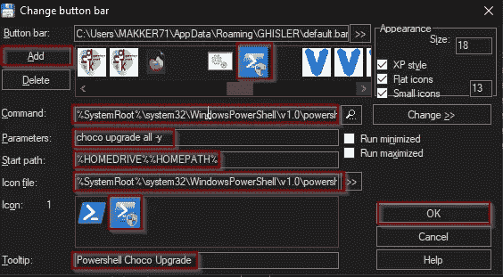
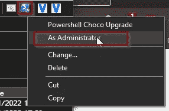
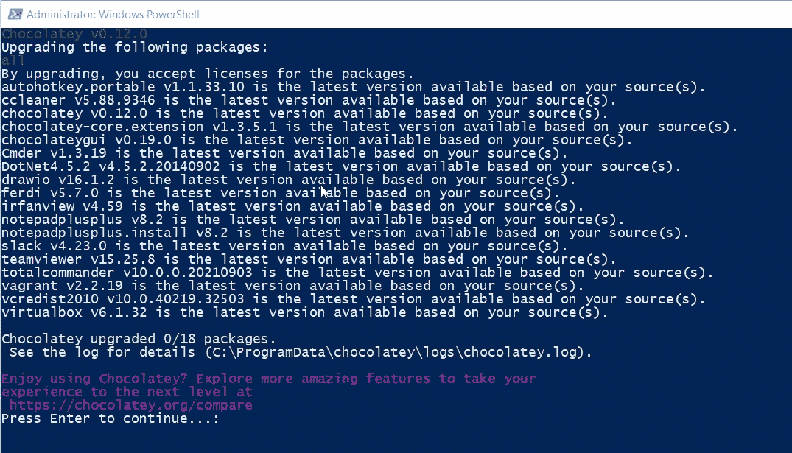
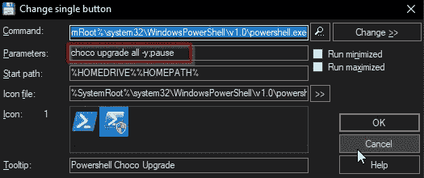

# 升级所有软件与虫火谷和总指挥官一键

> 原文：<https://medium.com/nerd-for-tech/upgrade-all-software-with-one-click-with-choco-and-total-commander-7752876f3f0d?source=collection_archive---------0----------------------->

我喜欢在不同的 Linux 发行版中使用包管理器的想法。遗憾的是，Windows 没有这种内置功能。嗯，可能是 Windows 商店，但实际上不是“它”。

几年前，我发现了巧克力。它的功能与那些 Linux 包管理器完全相同。

# 安装虫火谷

只需在提升的 powershell 中执行一行程序就可以完成安装。即“以管理员身份”启动 powershell 窗口:

然后运行在[https://chocolatey.org/install](https://chocolatey.org/install)给出的命令(见第 2 点)。

# 用 choco 安装升级软件

从那时起，你可以安装新的和升级现有的软件包只需一个命令，如 *choco install virtualbox:*

要升级，使用 *choco 升级 virtualbox:*

如果您已经安装了 Virtualbox，但没有安装 Chocolatey，那么在升级过程中，Chocolatey 会注意到并将其添加到管理软件列表中。

还有一个 Chocolatey [ChocolateyGUI](https://community.chocolatey.org/packages/ChocolateyGUI) 的 GUI。其中当然可以用 *choco install chocolateygui 安装。*

这为您提供了一种可视化的软件管理方式:

托管软件上的巧克力图形用户界面

今天我对如何一键升级我所有的软件很感兴趣。在这个 Stackoverflow 问题[之后，我知道了命令 *choco upgrade all -y* 将升级我所有的包:](https://stackoverflow.com/questions/24579193/how-do-i-automatically-keep-all-locally-installed-chocolatey-packages-up-to-date)

升级所有软件包

# 一键提示

现在，如何把它变成一个一键按钮呢？如你所知，我是 95 年 Windows 的总指挥官。在那里，您可以轻松地创建一个按钮。右键单击按钮栏，然后选择“更改”:

右键单击按钮栏

单击添加，并填写以下属性:

虫火谷升级的添加按钮

*   命令:*% SystemRoot % \ system32 \ windows powershell \ v 1.0 \ powershell . exe*
*   参数: *choco 升级全 y*
*   开始路径: *%HOMEDRIVE%%HOMEPATH%*
*   图标文件:*% SystemRoot % \ system32 \ windows powershell \ v 1.0 \ powershell . exe*
*   工具提示: *Powershell 虫火谷升级*

作为图标，选择一个合适的图标。因为这里有两个图标，所以我使用了非默认图标。因为我有另一个 power shell 按钮来打开 PowerShell。不同的图标有助于我识别正确的图标。适当的工具提示也有助于这一点。

您可以将图标向左或向右拖动到按钮栏中的适当位置。您可以将呈现为垂直分隔符的空按钮添加到按钮组中。

当然，桌面上的快捷方式也是如此。

现在，您可以右键单击该按钮并以管理员身份运行它:

以管理员身份运行

您可以将暂停命令添加到参数字段，以便在运行后暂停:

*   参数: *choco 升级 all-y；暂停*

执行后暂停

这有助于验证升级的结果。所以，由我来指挥。

# 结论

哈，现在，你不仅知道如何一键升级你的软件。你也知道:

*   为什么你应该使用巧克力
*   如何安装 Chocolatey
*   如何使用 choco 安装和升级软件包
*   如何在总指挥官中创建一个按钮(这也是我多年来一直使用它的原因之一)
*   作为额外的奖励:如何在随机的 PowerShell 一行程序上创建一个按钮。