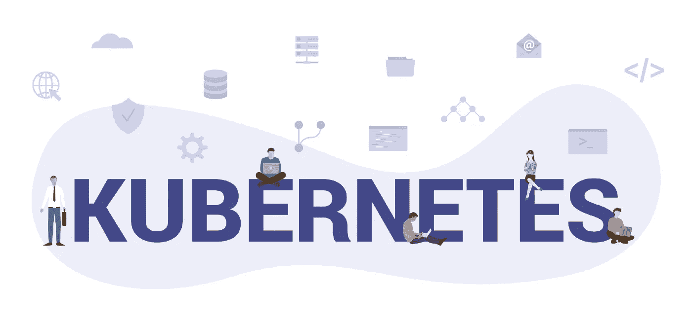

# 将 Kubernetes v1.19.0 升级到 v1.20.0？|先看这个！

> 原文：<https://medium.com/nerd-for-tech/upgrading-kubernetes-v1-19-0-to-v1-20-0-read-this-first-820656edabb7?source=collection_archive---------20----------------------->

HiFX 的 Kubernetes 咨询公司

Kubernetes 是一个开源的可扩展平台，用于管理容器化的工作负载和服务，以其服务发现、负载平衡、存储系统的自动安装、自动推出以及 bin 打包、自我修复和敏感配置管理而闻名。

在使用容器引擎创建新的 Kubernetes 集群时，将在控制平面节点和工作者节点上运行的 Kubernetes 的版本是已知的。Kubernetes 版本通常表示为 x.y.z，其中 x 表示主版本，y 表示次版本，z 表示补丁版本。Kubernetes 最新的次要版本是 v1.20，这是 2020 年的第三个也是最后一个版本，提供大约一年的补丁支持；并且可以从[kubernetes.tar.gz](https://dl.k8s.io/v1.20.0/kubernetes.tar.gz)、[kubernetes-src.tar.gz](https://dl.k8s.io/v1.20.0/kubernetes.tar.gz)和 [GitHub](https://github.com/kubernetes/kubernetes) 下载。*此外，该版本整合了 44 项增强功能，其中 11 项已经稳定，15 项正在进入 beta 版，16 项正在进入 alpha 版。*

# 升级到 1.20 版时的主要主题和变化

自 1.19 版以来，1.20 版的主要变化如下:

**Docker shim 的弃用或过时**:Docker 的容器运行时接口(CRI)Docker shim 已经弃用。但是，docker 生成的映像将在您的集群中继续工作，保持 CRI 兼容运行时。此外，应该确保工作节点使用受支持的容器运行时，因为对 Docker 的支持将在未来的版本中停止。服务提供商的协助将确保正确的升级规划和测试。

**执行探测超时**的处理:影响现有 pod 定义的调试可以通过将特征门*execprobetime*设置为 *false* 来处理。

**client-go 的外部认证**:当前集群通过 *KUBERNETES_EXEC_INFO* 环境变量启用 client-go 凭证插件。

**cron job 控制器 v2 通过特征门**的可用性: *CronJob* 控制器，使用通知器代替轮询，在 1.20 的 alpha 版本中可用

**过程 ID (PID)限制**的简单设置:PID 限制在 *SupportNodePidsLimit* 和 *SupportPodPidsLimit* 上的一般可用性(GA)的分级。

**默认启用 API 优先级和公平性(APF)** :支持 *kube* - *apiserver* 按照优先级对传入的请求进行分类。

**重新实施 IPv4/Ipv6 双栈**:根据用户和社区的反馈，支持双栈服务以及将 IPv4 和 Ipv6 服务集群 IP 地址分配给单一来源。此外，支持将服务从单 IP 栈转移到双 IP 栈，反之亦然。

**优雅节点关机**介绍: *GracefulNodeShutdown* 的 *Alpha 版本模式*在任何节点系统开始关机时唤醒 *kubelet* ，允许 pod 在关机期间优雅地终止。

在 1.20 版中观察到的主要特性是卷容器存储接口(CSI)快照操作的分级，这启动了为 Kubernetes 开发应用程序的步骤，以实现全面可用性(GA)。这确保了在每个 Kubernetes 环境以及相关存储提供商上轻松触发和整合稳定的操作。

v1.20 的另一个值得注意的特性是首次推出了两个测试版特性，使使用 Kubernetes 的用户和管理员能够充分控制与 pod 中挂载的卷相关的权限。此外，这个版本还包括了从 *kubectl* 到 beta 的升级，它直接提供了对调试工作流的支持。

**新版本包含了对以下调试进行故障排除的好处:**

**启动时崩溃的工作负载**:可以创建一个使用不同命令或映像的 pod 副本来解决相同的问题。

**分发容器**:这可以通过在 pod 的新副本上添加一个带有调试工具的新容器来解决。尽管如此，也可以使用临时容器来执行。

**受影响的节点**:可以通过创建具有主机名称空间的容器以及访问主机的文件系统来执行节点上的故障排除。

此外， *kubectl* 组件比 *kubectl* 插件“debug”持有更高的值。因此，用户需要替换调试插件的名称。

***1.20 版本的其他改进包括:***

Golang1.15.5 的集成

非递归卷所有权和权限的测试版

FSGroup 的 CSI 驱动程序策略的测试版

CSI 驱动程序中用于安全性改进的 alpha 功能

Pod 资源指标

RuntimeClass 和 API 类型的分级默认为稳定

token request/TokenRequestProjection 升级到 GA

云控制器管理器由其各自的云提供商独家提供

# 从 1.19 版升级到 1.20 版的系统顺序

以下先决条件以***kube*-*API server***，***kube*-*controller**manager***，***kube*-*scheduler*，*****cloud*-*controller**manager***，

**Kube-apiserver**

在单集群实例中，*kube*-*API server*实例的当前版本应该是 v1.19。

高可用性(HA)集群中的*kube*-*API server*组件可以是 v1.19 或 v1.20，以保证任何一个次要版本(即 HA 集群内)的最大偏差，而支持的最新 *kube-apiserver* 是 v1.20，最旧的版本必须是 v1.19。

与 API 服务器通信的 *kube* - *控制器* - *管理器*、 *kube* - *调度器*和*云* - *控制器*管理器组件必须是 v1.19，以确定它们比现有的 API 服务器版本旧。

kubelet 组件必须保持在 v1.18 或 v1.19，从而确保它们比现有的 API 服务器版本旧。

注册的准入网页挂钩，如*ValidatingWebhookConfiguration*和*MutatingWebhookConfiguration*应该能够在 v1.20 中整合任何新的信息或 REST 资源版本。

在确保上述所有内容后，kube*-*API server*的 1.19 版可以升级到 1.20 版。API 变更指南和 API 弃用项目政策要求 kube-apiserver 不得考虑省略任何次要版本，无论是在单集群组件中。*

**Kube-控制器管理器、Kube-调度器、云控制器管理器**

在感知到 *kube* - *控制器* *管理器*、 *kube* - *调度器*和*云* - *控制器* *管理器*升级之前，必须确定*kube*-*API server*升级到 v1.20

**库伯莱**

与上述先决条件类似，在将 *kubelet* 组件升级到 1.20 版之前，必须将*kube*-*API server*组件升级到 1.20 版。

此外，在执行 *kubelet* 组件的升级时，不应该忘记从节点吸取 pod。

*注意*:不建议拥有比 *kube* - *apiserver* 少两个版本的 *kubelet* 版本。

**Kube-proxy**

在考虑升级 *kube* - *proxy* 时，需要考虑三个前提条件。

*kube* - *proxy* 的版本必须与 *kubelet* 在一个节点上的版本相似。

*kube* - *代理*的版本不得高于*kube*-*API server*组件。

此外， *kube* - *代理*的最低允许版本必须比*kube*-*API server*的版本低两个版本。

*注意*:在*kube*-*API server*组件中存在版本倾斜，限制了 *kubelet* 、 *kube* - *控制器管理器*、 *kube 调度器*、*云* - *控制器管理器*和 *kubectl* 组件的使用。

值得注意的是， *kubectl* 版本受比当前版本高一个版本或低一个版本的*kube*-*API server*版本支持，即如果*kube*-*API server*的版本是 v1.20， *kubectl* 受 v1.21、v1.20 和 v1 支持

# 1.20 版的普遍缺点

*kubelet* 内的汇总 API 中缺少加速器指标(AcceleratorStats)。

虽然这些变化看起来有点令人困惑，但从长远来看，与 Kubernetes 的扩展交互将确保轻松。

# **总结**

Dockershim 的贬值是一个需要考虑的因素，从长远来看，由于对 Docker 的支持将会停止，因此最好开始规划升级。

[***关于 HiFX***](https://www.hifx.in)

*我们成立于 2001 年，是一群充满激情的技术专家，专注于追求卓越，致力于为客户提供高质量、高性价比的解决方案。*

*在 HiFX，我们理解拥有大量不同数据而没有任何可操作的见解的痛苦。*

*通过各种来源以结构化和非结构化形式积累的大量复杂数据蕴含着重要的业务洞察力，这些洞察力与各种规模的组织的成功发展息息相关。借助 HiFX 战略顾问团队，将这些 Pb 级数据转化为实时见解，以增强您的业务策略并提高您组织的收入。我们提供的解决方案将把您的组织转变为数据驱动的发电站。*